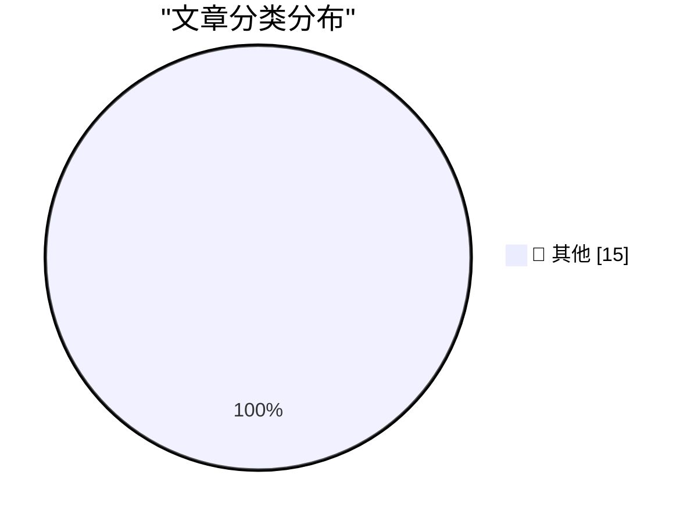

# 📰 AI 博客每日精选 — 2026-06-02

> 来自 Karpathy 推荐的 92 个顶级技术博客，AI 精选 Top 15

## 🏆 今日必读

🥇 **May 2026 newsletter**

[May 2026 newsletter](https://simonwillison.net/2026/Jun/1/may-newsletter/#atom-everything) — simonwillison.net · 16 小时前 · 📝 其他

> May 2026 newsletter

🥈 **datasette 1.0a32**

[datasette 1.0a32](https://simonwillison.net/2026/May/31/datasette/#atom-everything) — simonwillison.net · 21 小时前 · 📝 其他

> datasette 1.0a32

🥉 **Weird projects I shipped with AI**

[Weird projects I shipped with AI](https://seangoedecke.com/weird-projects-i-shipped-with-ai/) — seangoedecke.com · 21 小时前 · 📝 其他

> Weird projects I shipped with AI

---

## 📊 数据概览

| 扫描源 | 抓取文章 | 时间范围 | 精选 |
|:---:|:---:|:---:|:---:|
| 82/92 | 2466 篇 → 22 篇 | 24h | **15 篇** |

### 分类分布

---

## 📝 其他

### 1. May 2026 newsletter

[May 2026 newsletter](https://simonwillison.net/2026/Jun/1/may-newsletter/#atom-everything) — **simonwillison.net** · 16 小时前 · ⭐ 15/30

> May 2026 newsletter

---

### 2. datasette 1.0a32

[datasette 1.0a32](https://simonwillison.net/2026/May/31/datasette/#atom-everything) — **simonwillison.net** · 21 小时前 · ⭐ 15/30

> datasette 1.0a32

---

### 3. Weird projects I shipped with AI

[Weird projects I shipped with AI](https://seangoedecke.com/weird-projects-i-shipped-with-ai/) — **seangoedecke.com** · 21 小时前 · ⭐ 15/30

> Weird projects I shipped with AI

---

### 4. Hackers Used Meta’s AI Support Bot to Seize Instagram Accounts

[Hackers Used Meta’s AI Support Bot to Seize Instagram Accounts](https://krebsonsecurity.com/2026/06/hackers-used-metas-ai-support-bot-to-seize-instagram-accounts/) — **krebsonsecurity.com** · 3 小时前 · ⭐ 15/30

> Hackers Used Meta’s AI Support Bot to Seize Instagram Accounts

---

### 5. ‘We Are Living in Pinocchio’s World’

[‘We Are Living in Pinocchio’s World’](https://om.co/2026/05/25/we-are-living-in-pinocchios-world/) — **daringfireball.net** · 1 小时前 · ⭐ 15/30

> ‘We Are Living in Pinocchio’s World’

---

### 6. Amazon Made AI Podcasts for Products

[Amazon Made AI Podcasts for Products](https://www.businessinsider.com/amazon-ai-generated-podcasts-products-2026-4) — **daringfireball.net** · 4 小时前 · ⭐ 15/30

> Amazon Made AI Podcasts for Products

---

### 7. The Talk Show Live From WWDC 2026: Tuesday June 9

[The Talk Show Live From WWDC 2026: Tuesday June 9](https://ti.to/daringfireball/the-talk-show-live-from-wwdc-2026) — **daringfireball.net** · 19 小时前 · ⭐ 15/30

> The Talk Show Live From WWDC 2026: Tuesday June 9

---

### 8. exe.dev

[exe.dev](https://exe.dev/?df) — **daringfireball.net** · 19 小时前 · ⭐ 15/30

> exe.dev

---

### 9. Take Two

[Take Two](https://x.com/markgurman/status/2061236259843182813) — **daringfireball.net** · 20 小时前 · ⭐ 15/30

> Take Two

---

### 10. The web is changing, and we are not going back

[The web is changing, and we are not going back](https://idiallo.com/blog/web-is-changing-we-are-not-going-back?src=feed) — **idiallo.com** · 1 小时前 · ⭐ 15/30

> The web is changing, and we are not going back

---

### 11. Pluralistic: Molly Crabapple's 'Here Where We Live Is Our Country' (01 Jun 2026)

[Pluralistic: Molly Crabapple's 'Here Where We Live Is Our Country' (01 Jun 2026)](https://pluralistic.net/2026/06/01/doikayt/) — **pluralistic.net** · 11 小时前 · ⭐ 15/30

> Pluralistic: Molly Crabapple's 'Here Where We Live Is Our Country' (01 Jun 2026)

---

### 12. "No way to prevent this" say users of only package manager where this regularly happens

["No way to prevent this" say users of only package manager where this regularly happens](https://xeiaso.net/shitposts/no-way-to-prevent-this/supply-chain/2026-redhat-javascript-clients/) — **xeiaso.net** · 21 小时前 · ⭐ 15/30

> "No way to prevent this" say users of only package manager where this regularly happens

---

### 13. It’s not just Taylor series

[It’s not just Taylor series](https://www.johndcook.com/blog/2026/06/01/not-just-taylor-series/) — **johndcook.com** · 8 小时前 · ⭐ 15/30

> It’s not just Taylor series

---

### 14. Subscribe by email

[Subscribe by email](https://www.johndcook.com/blog/2026/06/01/subscribe-by-email/) — **johndcook.com** · 10 小时前 · ⭐ 15/30

> Subscribe by email

---

### 15. Be thou not pilled

[Be thou not pilled](https://www.joanwestenberg.com/be-thou-not-pilled/) — **joanwestenberg.com** · 21 小时前 · ⭐ 15/30

> Be thou not pilled

---

*生成于 2026-06-02 05:06 (Asia/Shanghai) | 扫描 82 源 → 获取 2466 篇 → 精选 15 篇*
*基于 [Hacker News Popularity Contest 2025](https://refactoringenglish.com/tools/hn-popularity/) RSS 源列表，由 [Andrej Karpathy](https://x.com/karpathy) 推荐*
*由「懂点儿AI」制作，欢迎关注同名微信公众号获取更多 AI 实用技巧 💡*
