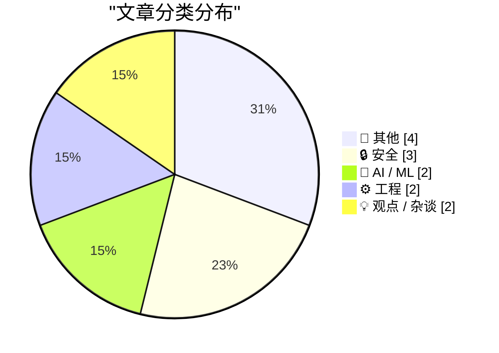
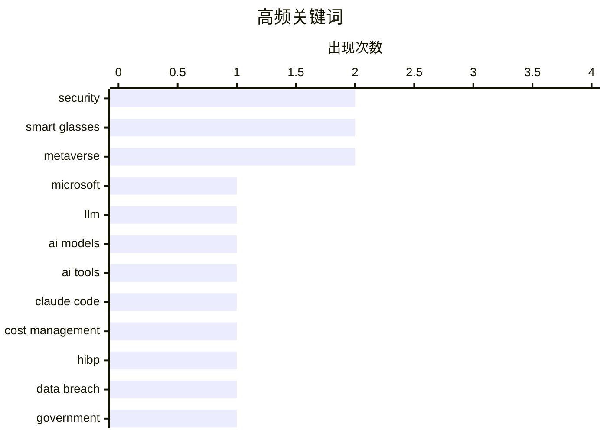

# 📰 AI 博客每日精选 — 2026-06-04

> 来自 Karpathy 推荐的 92 个顶级技术博客，AI 精选 Top 13

## 📝 今日看点

今日科技圈呈现出AI技术演进与成本博弈的冰火两重天：微软持续加码大模型研发，而Uber等巨头却因预算耗尽被迫限制内部AI编程工具的使用。在智能硬件领域，曾经喧嚣的“元宇宙”概念正被业界抛弃，苹果与Meta转向对智能眼镜等实体设备的务实布局，但随之而来的硬件改装黑市也为隐私安全敲响了警钟。与此同时，从编译器底层优化到算法精度计算，开发者们依然在基础工程架构的深水区进行着扎实的探索。

---

## 🏆 今日必读

🥇 **微软发布全新的 MAI 模型**

[Microsoft's new MAI models](https://simonwillison.net/2026/Jun/2/microsofts-new-models/#atom-everything) — simonwillison.net · 22 小时前 · 🤖 AI / ML

> 微软最新发布了两款文本大语言模型 MAI-Thinking-1 和 MAI-Code-1-Flash。MAI-Thinking-1 专注于推理任务，拥有 1T 总参数量和 35B 激活参数，目前仅向特定早期合作伙伴开放。MAI-Code-1-Flash 则专为 GitHub Copilot 等编程场景构建，总参数量为 137B，激活参数为 5B。这两款模型的发布标志着微软在自研大模型架构上的进一步探索与发力。

💡 **为什么值得读**: 可以快速了解微软最新自研大模型的具体参数规模和主打应用场景。

🏷️ Microsoft, LLM, AI models

🥈 **Uber 限制 Claude Code 等 AI 工具的使用以控制成本**

[Uber Caps Usage of AI Tools Like Claude Code to Manage Costs](https://simonwillison.net/2026/Jun/3/uber-caps-usage/#atom-everything) — simonwillison.net · 8 小时前 · 🤖 AI / ML

> Uber 已经开始限制 Claude Code 等 AI 编程工具的使用，以应对不断攀升的运营开支。该公司在 2026 年仅过了四个月就耗尽了全年的 AI 预算，超支主要源于此类工具的广泛使用。由于这笔预算是在 2025 年制定的，当时未能准确预测 AI 工具的消耗速度和实际成本。这一举措反映了企业在广泛采用生成式 AI 时所面临的巨大成本压力。

💡 **为什么值得读**: 揭示了企业在实际落地 AI 编程工具时遭遇的预算超支与成本控制难题。

🏷️ AI tools, Claude Code, cost management

🥉 **欢迎菲律宾政府加入 Have I Been Pwned**

[Welcoming the Philippine Government to Have I Been Pwned](https://www.troyhunt.com/welcoming-the-philippine-government-to-have-i-been-pwned/) — troyhunt.com · 17 小时前 · 🔒 安全

> Have I Been Pwned (HIBP) 的免费政府服务正式迎来了第 46 个成员国：菲律宾。菲律宾的国家 CERT 与信息和通信技术部展开合作，将能够监控官方政府域名在 HIBP 数据库中的泄露情况。这项服务使他们的网络安全团队能够及时发现并应对针对政府账户的数据泄露事件。这也标志着 HIBP 在提升全球国家级网络安全防御能力方面又迈出了一步。

💡 **为什么值得读**: 了解全球知名数据泄露查询平台 HIBP 是如何与国家级 CERT 机构建立联防联控机制的。

🏷️ HIBP, data breach, government, security

---

## 📊 数据概览

| 扫描源 | 抓取文章 | 时间范围 | 精选 |
|:---:|:---:|:---:|:---:|
| 83/92 | 2483 篇 → 13 篇 | 24h | **13 篇** |

### 分类分布



### 高频关键词



<details>
<summary>📈 纯文本关键词图（终端友好）</summary>

```
security        │ ████████████████████ 2
smart glasses   │ ████████████████████ 2
metaverse       │ ████████████████████ 2
microsoft       │ ██████████░░░░░░░░░░ 1
llm             │ ██████████░░░░░░░░░░ 1
ai models       │ ██████████░░░░░░░░░░ 1
ai tools        │ ██████████░░░░░░░░░░ 1
claude code     │ ██████████░░░░░░░░░░ 1
cost management │ ██████████░░░░░░░░░░ 1
hibp            │ ██████████░░░░░░░░░░ 1
```

</details>

### 🏷️ 话题标签

**security**(2) · **smart glasses**(2) · **metaverse**(2) · microsoft(1) · llm(1) · ai models(1) · ai tools(1) · claude code(1) · cost management(1) · hibp(1) · data breach(1) · government(1) · privacy(1) · hardware hacking(1) · compiler(1) · inlining(1) · jit(1) · heuristics(1) · math(1) · programming(1)

---

## 📝 其他

### 1. 据报道 Meta 今年计划推出一系列新款智能眼镜

[Meta Reportedly Has a Slew of New Smart Glasses Planned for This Year](https://gizmodo.com/meta-has-a-ridiculous-amount-of-smart-glasses-planned-for-this-year-2000765741) — **daringfireball.net** · 22 小时前 · ⭐ 17/30

> Meta 正在密集布局其智能眼镜产品线，计划在今年推出多款新型号。除了秋季的发布计划外，Meta 还准备在 12 月推出代号为“Mojito VIP”的智能眼镜。同时，今年秋季还将测试两款原型机：代号为“Artemis”的眼镜和代号为“SSG”（即超感知眼镜）的设备。这表明 Meta 正试图通过丰富的硬件矩阵巩固其在智能穿戴市场的领导地位。

🏷️ Meta, smart glasses, hardware

---

### 2. 伦敦数据存储库重新上线

[London Data Store Relaunch](https://shkspr.mobi/blog/2026/06/london-data-store-relaunch/) — **shkspr.mobi** · 9 小时前 · ⭐ 17/30

> 伦敦市官方开放数据平台 data.london.gov.uk 在上线 16 年后迎来了全面的改版重构。作为全球最早发布开放数据的主要城市平台之一，它现已从单一的数据存储库演变为展示开放数据价值的窗口。此次更新不仅涵盖了后端架构的全面升级，还重新设计了前端用户界面。改版后的平台致力于更好地展示开放数据如何切实改善伦敦市民的生活质量。

🏷️ open data, London, data platform

---

### 3. CBS News 解雇《60分钟》主持人 Scott Pelley

[CBS News Fires Scott Pelley of ‘60 Minutes’](https://www.nytimes.com/2026/06/02/business/media/scott-pelley-cbs-bari-weiss.html) — **daringfireball.net** · 59 分钟前 · ⭐ 13/30

> CBS 以「有正当理由立即解雇」的方式终止了《60分钟》资深记者 Scott Pelley 的职务，起因是 Pelley 在周一的内部员工会议上公开发言批评管理层。解雇信由 Nick Bilton 签发，但信中并未对 Pelley 在会议上的任何具体陈述提出事实反驳。Gruber 指出，CBS 不反驳内容却直接开除发声者，反而坐实了 Pelley 对管理层打压新闻独立性的指控。这一事件被视为企业以「因故解雇」手段噤声资深新闻人的标志性案例。

🏷️ media, journalism, CBS

---

### 4. GE Widescreen 1000：面向大预算的大时代电视

[GE Widescreen 1000: Big time TV for big budgets](https://dfarq.homeip.net/ge-widescreen-1000/?utm_source=rss&#038;utm_medium=rss&#038;utm_campaign=ge-widescreen-1000) — **dfarq.homeip.net** · 9 小时前 · ⭐ 9/30

> 1978 年 6 月推出的 GE Widescreen 1000 是那个奢华年代的标志性消费品，主打标语为「This is GE Performance Television」。这台电视的售价约为一辆家用轿车的四分之三，定位顶级消费市场。文章回顾了该产品的设计理念、技术规格以及在当时的市场定位，展现了 1970 年代末美国消费电子产业的浮夸风格。作为早期宽屏电视的代表，它折射出那个时代对「大」和「豪华」的极致追求。

🏷️ TV, retro, history

---

## 🔒 安全

### 5. 欢迎菲律宾政府加入 Have I Been Pwned

[Welcoming the Philippine Government to Have I Been Pwned](https://www.troyhunt.com/welcoming-the-philippine-government-to-have-i-been-pwned/) — **troyhunt.com** · 17 小时前 · ⭐ 22/30

> Have I Been Pwned (HIBP) 的免费政府服务正式迎来了第 46 个成员国：菲律宾。菲律宾的国家 CERT 与信息和通信技术部展开合作，将能够监控官方政府域名在 HIBP 数据库中的泄露情况。这项服务使他们的网络安全团队能够及时发现并应对针对政府账户的数据泄露事件。这也标志着 HIBP 在提升全球国家级网络安全防御能力方面又迈出了一步。

🏷️ HIBP, data breach, government, security

---

### 6. 禁用 Meta 眼镜录像指示灯的黑市交易

[The Underworld Market to Remove the Recording Indicator Light on Meta Glasses](https://www.youtube.com/watch?v=EaJSPeJmqis) — **daringfireball.net** · 1 小时前 · ⭐ 20/30

> Facebook Marketplace 等平台上正出现一项专门针对 Ray-Ban Meta 智能眼镜的地下改装服务。只需支付 100 美元，改装者就会禁用眼镜上的录像指示灯，将其变成隐蔽的偷拍设备，这种模式被称为“隐形模式”。调查记者深入追踪了这一黑市的运作模式、合法性争议以及相关防范措施。随着智能眼镜的普及，硬件隐私安全问题正面临严峻的挑战。

🏷️ smart glasses, privacy, hardware hacking

---

### 7. 技能注册表威胁模型

[Skills Registry Threat Models](https://nesbitt.io/2026/06/03/skills-registry-threat-models.html) — **nesbitt.io** · 5 小时前 · ⭐ 16/30

> 随着 AI Agent 生态中「技能注册表」（Skills Registry）的兴起，以 Markdown 等轻量格式分发的技能定义文件正在成为新的攻击面。作者围绕技能注册表构建了系统的威胁模型，涵盖恶意技能注入、供应链篡改、描述文件伪装等风险场景，并尖锐地提出「距离第一个针对 Markdown 文件的 CVE 还有多远」的警示。文章呼吁社区在技能分发机制成熟之前，尽早将安全建模纳入标准流程，而非事后补救。

🏷️ security, threat model, vulnerability

---

## 🤖 AI / ML

### 8. 微软发布全新的 MAI 模型

[Microsoft's new MAI models](https://simonwillison.net/2026/Jun/2/microsofts-new-models/#atom-everything) — **simonwillison.net** · 22 小时前 · ⭐ 24/30

> 微软最新发布了两款文本大语言模型 MAI-Thinking-1 和 MAI-Code-1-Flash。MAI-Thinking-1 专注于推理任务，拥有 1T 总参数量和 35B 激活参数，目前仅向特定早期合作伙伴开放。MAI-Code-1-Flash 则专为 GitHub Copilot 等编程场景构建，总参数量为 137B，激活参数为 5B。这两款模型的发布标志着微软在自研大模型架构上的进一步探索与发力。

🏷️ Microsoft, LLM, AI models

---

### 9. Uber 限制 Claude Code 等 AI 工具的使用以控制成本

[Uber Caps Usage of AI Tools Like Claude Code to Manage Costs](https://simonwillison.net/2026/Jun/3/uber-caps-usage/#atom-everything) — **simonwillison.net** · 8 小时前 · ⭐ 23/30

> Uber 已经开始限制 Claude Code 等 AI 编程工具的使用，以应对不断攀升的运营开支。该公司在 2026 年仅过了四个月就耗尽了全年的 AI 预算，超支主要源于此类工具的广泛使用。由于这笔预算是在 2025 年制定的，当时未能准确预测 AI 工具的消耗速度和实际成本。这一举措反映了企业在广泛采用生成式 AI 时所面临的巨大成本压力。

🏷️ AI tools, Claude Code, cost management

---

## ⚙️ 工程

### 10. 内联启发式算法概述

[A survey of inlining heuristics](https://bernsteinbear.com/blog/inlining-heuristics/?utm_source=rss) — **bernsteinbear.com** · 20 小时前 · ⭐ 20/30

> 编译器（尤其是方法级的即时编译器 JIT）通常以单个函数作为操作单元，因为方法通常体积较小。在 Ruby 等大量依赖方法分派的动态语言中，内联的决策对于性能优化至关重要。文章详细调查了编译器在处理代码内联时所采用的各种启发式算法。合理的内联启发式规则能够显著影响动态语言运行时的整体执行效率。

🏷️ compiler, inlining, JIT, heuristics

---

### 11. 交错级数的朴素求和陷阱

[Naively summing an alternating series](https://www.johndcook.com/blog/2026/06/03/naive-sum/) — **johndcook.com** · 5 小时前 · ⭐ 18/30

> 在实现指数函数的幂级数求和时，开发者通常会设定一个容差（如 10^-12）并在下一项低于该值时停止计算。然而，这种对交错级数进行朴素求和的方法往往会带来意想不到的精度问题。简单的容差截断法无法准确处理由于交替加减而导致的舍入误差积累。在实际的数值计算中，必须采用更严谨的算法来保证结果的准确性。

🏷️ math, programming, numerical analysis

---

## 💡 观点 / 杂谈

### 12. 苹果：一家反“元宇宙”的 VR 公司

[Apple, the Anti-‘Metaverse’ VR Company](https://daringfireball.net/2025/12/meta_says_fuck_that_metaverse_shit) — **daringfireball.net** · 1 天前 · ⭐ 17/30

> 在整个科技界疯狂炒作“元宇宙”概念的时期，苹果始终刻意与这一术语保持距离。即使在 Vision Pro 发布前后，苹果高管也从未在任何公开场合暗示或支持过“元宇宙”这种虚拟世界概念。这种务实的产品定位使得苹果在 XR 领域建立起了独特的品牌认知，有别于其他竞争对手的营销炒作。苹果坚持将空间计算视为未来的发展方向，而非逃避现实的元宇宙。

🏷️ Apple, metaverse, VR

---

### 13. “元宇宙”不过是孤立时代的骗局

[The Metaverse Was Snake Oil for Isolation](https://daringfireball.net/linked/2026/06/01/the-metaverse-fever-dream) — **daringfireball.net** · 1 天前 · ⭐ 17/30

> “元宇宙”概念的炒作周期与新冠疫情封锁及人们普遍的社交隔离期在时间线上高度重合。在长达一年多的隔离期间，人们极度依赖计算机平台进行社交，这为虚拟世界炒作提供了虚假的繁荣土壤。如今到了 2026 年，随着社会生活回归常态，这种基于隔离孤独感的炒作泡沫已经彻底破灭。元宇宙本质上只是特殊时期为隔离状态量身定制的一场科技幻梦。

🏷️ metaverse, tech history, isolation

---

*生成于 2026-06-04 04:48 (Asia/Shanghai) | 扫描 83 源 → 获取 2483 篇 → 精选 13 篇*
*基于 [Hacker News Popularity Contest 2025](https://refactoringenglish.com/tools/hn-popularity/) RSS 源列表，由 [Andrej Karpathy](https://x.com/karpathy) 推荐*
*由「懂点儿AI」制作，欢迎关注同名微信公众号获取更多 AI 实用技巧 💡*
