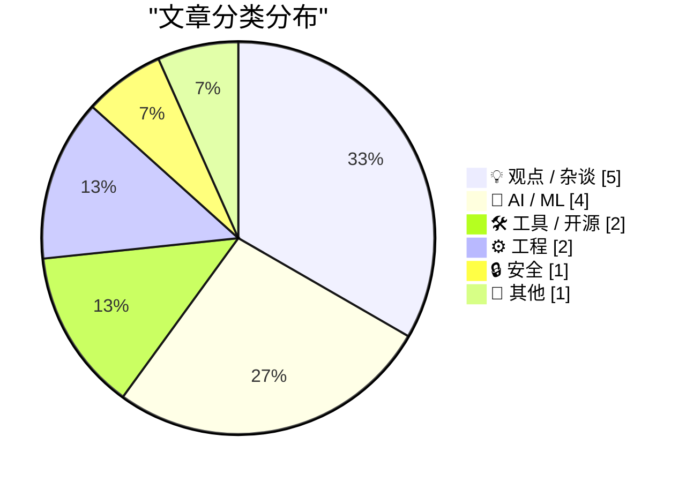
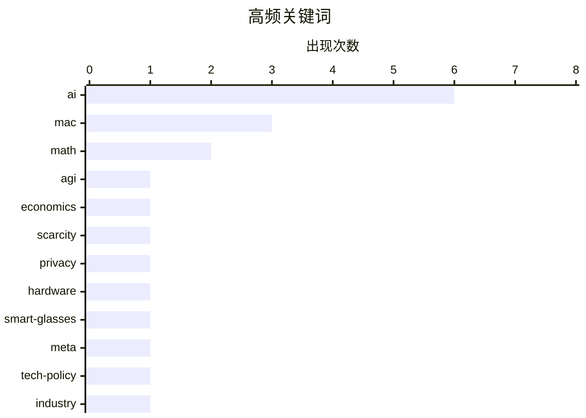

# 📰 AI 博客每日精选 — 2026-06-05

> 来自 Karpathy 推荐的 92 个顶级技术博客，AI 精选 Top 15

## 📝 今日看点

今日科技圈的核心焦点集中在人工智能的深层影响与数字安全信任危机上。随着AI工具的普及，原生桌面应用开发正迎来久违的复兴，但科技巨头在AI公关上的操纵以及泛滥的AI生成内容，也引发了社区对创作者信任与人类核心价值的强烈反思。与此同时，硬件隐私与软件供应链安全警报再次拉响，从智能穿戴设备的隐蔽篡改黑产到代码签名机制的升级，凸显了在技术狂飙时代下筑牢安全底线的迫切性。

---

## 🏆 今日必读

🥇 **Alex Imas与Phil Trammell：AGI之后，还有什么会保持稀缺？**

[Alex Imas and Phil Trammell – What remains scarce after AGI?](https://www.dwarkesh.com/p/alex-imas-phil-trammell) — dwarkesh.com · 3 小时前 · 🤖 AI / ML

> 探讨在通用人工智能（AGI）实现后，哪些资源或能力将保持稀缺性。虽然机器人可以自我复制并大规模增加劳动力，但某些人类特有的属性（如艺术表演、独特的人类体验等）并不会随之增加。作者通过经济学和技术的双重视角分析了稀缺性的转移。结论是，在AGI时代，真正稀缺的不再是计算或劳动力，而是那些无法被算法和机器替代的真实人类特质。

💡 **为什么值得读**: 帮助读者跳出“AI将替代一切”的焦虑，从经济学视角审视AGI时代人类独特价值的真正所在。

🏷️ AGI, economics, scarcity

🥈 **关闭Meta智能眼镜录制指示灯的地下黑市**

[The Underworld Market to Remove the Recording Indicator Light on Meta Glasses](https://www.youtube.com/watch?v=EaJSPeJmqis) — daringfireball.net · 1 天前 · 🔒 安全

> 调查了Ray-Ban Meta智能眼镜指示灯被篡改的地下黑产。只需支付100美元，就有人通过Facebook Marketplace提供关闭录制指示灯的“隐蔽模式”服务，使其变成隐蔽摄像头。该调查深入追踪了提供此服务的群体、相关法律风险以及各方阻止这种行为的努力。这种将消费级硬件轻易武器化的现象，暴露了智能穿戴设备在隐私保护方面的严重漏洞。

💡 **为什么值得读**: 揭示了智能眼镜普及背后令人担忧的隐私安全隐患，以及硬件防护被低成本绕过的黑色产业链。

🏷️ privacy, hardware, smart-glasses, Meta

🥉 **Pluralistic：即服务式妄想（2026年6月4日）**

[Pluralistic: Delusion as a service (04 Jun 2026)](https://pluralistic.net/2026/06/03/mission-space/) — pluralistic.net · 13 小时前 · 💡 观点 / 杂谈

> Cory Doctorow的日常链接合集，核心主题是“即服务式妄想”与破坏性诊断。文章涵盖了广泛的话题，包括迪士尼世界的同性恋日、3D打印参数化钥匙、亚马逊与大规模仲裁的对抗、司机拥有的Uber替代品，以及审查软件对自身批评的审查。作者通过这些看似分散的事件，抨击了科技垄断和版权滥用对社会造成的破坏。

💡 **为什么值得读**: Cory Doctorow的犀利点评合集，适合快速了解当前科技、版权和反垄断领域的最新动态与荒谬现象。

🏷️ tech-policy, AI, industry

---

## 📊 数据概览

| 扫描源 | 抓取文章 | 时间范围 | 精选 |
|:---:|:---:|:---:|:---:|
| 82/92 | 2464 篇 → 22 篇 | 24h | **15 篇** |

### 分类分布



### 高频关键词



<details>
<summary>📈 纯文本关键词图（终端友好）</summary>

```
ai            │ ████████████████████ 6
mac           │ ██████████░░░░░░░░░░ 3
math          │ ███████░░░░░░░░░░░░░ 2
agi           │ ███░░░░░░░░░░░░░░░░░ 1
economics     │ ███░░░░░░░░░░░░░░░░░ 1
scarcity      │ ███░░░░░░░░░░░░░░░░░ 1
privacy       │ ███░░░░░░░░░░░░░░░░░ 1
hardware      │ ███░░░░░░░░░░░░░░░░░ 1
smart-glasses │ ███░░░░░░░░░░░░░░░░░ 1
meta          │ ███░░░░░░░░░░░░░░░░░ 1
```

</details>

### 🏷️ 话题标签

**ai**(6) · **mac**(3) · **math**(2) · agi(1) · economics(1) · scarcity(1) · privacy(1) · hardware(1) · smart-glasses(1) · meta(1) · tech-policy(1) · industry(1) · gemini(1) · app(1) · development(1) · google(1) · internal(1) · nostalgia(1) · programming(1) · content(1)

---

## 💡 观点 / 杂谈

### 1. Pluralistic：即服务式妄想（2026年6月4日）

[Pluralistic: Delusion as a service (04 Jun 2026)](https://pluralistic.net/2026/06/03/mission-space/) — **pluralistic.net** · 13 小时前 · ⭐ 23/30

> Cory Doctorow的日常链接合集，核心主题是“即服务式妄想”与破坏性诊断。文章涵盖了广泛的话题，包括迪士尼世界的同性恋日、3D打印参数化钥匙、亚马逊与大规模仲裁的对抗、司机拥有的Uber替代品，以及审查软件对自身批评的审查。作者通过这些看似分散的事件，抨击了科技垄断和版权滥用对社会造成的破坏。

🏷️ tech-policy, AI, industry

---

### 2. 反AI怀旧情结与对过去的盲目崇拜

[Anti-AI nostalgia and the cult of the past](https://seangoedecke.com/anti-ai-nostalgia/) — **seangoedecke.com** · 20 小时前 · ⭐ 21/30

> 批判了当前程序员群体中蔓延的反AI怀旧情绪。许多人怀念过去那些“真正的程序员”，认为他们精通技艺，而现在的LLM只是批量生产劣质软件的退化象征。作者指出，这种对过去的浪漫化实际上是一种认知偏差，掩盖了早期软件工程同样存在的混乱与低效。盲目拒绝AI工具并不会让编程回归纯粹，反而会阻碍开发者适应现代软件工程的演进。

🏷️ AI, nostalgia, programming

---

### 3. 既然你的Newsletter是AI生成的，那我取消订阅了

[Now that your newsletter is AI-generated, I've Unsubscribed](https://idiallo.com/blog/unsubscribed-from-ai-generated-newsletters?src=feed) — **idiallo.com** · 22 小时前 · ⭐ 21/30

> 讲述了作者取消订阅那些偷偷换成AI生成的Newsletter的经历。有些作者保持了读者长达20多年的关注，却在不作任何声明的情况下将内容生成交给AI。这种做法的本质是创作者将自己从信任方程中剔除，用千篇一律的蓝色高科技缩略图和空洞内容取代了真实的人际连接。结论是，如果创作者认为改进内容的最佳方式是让自己出局，那么读者也会毫不犹豫地选择出局。

🏷️ AI, content, newsletter

---

### 4. 数据中心主权真的那么重要吗？

[Is datacentre sovereignty really that important?](https://martinalderson.com/posts/is-datacentre-sovereignty-really-that-important/?utm_source=rss&amp;utm_medium=rss&amp;utm_campaign=feed) — **martinalderson.com** · 20 小时前 · ⭐ 21/30

> 质疑了当前英国对本土建设AI数据中心的过度执念。尽管主张数据中心主权的理由通常集中在延迟、税收和控制权上，但这些论点在现实中大多站不住脚。作者逐一拆解了这些关于数据主权的常见迷思，指出盲目追求本土化数据中心并不能真正解决技术与经济的痛点。结论是，政策制定者应更理性地看待数据中心主权，而非陷入盲目的技术民族主义。

🏷️ datacentre, sovereignty, AI

---

### 5. How To Read More

[How To Read More](https://borretti.me/article/how-to-read-more) — **borretti.me** · 20 小时前 · ⭐ 17/30

> How To Read More

🏷️ reading, productivity, habits

---

## 🤖 AI / ML

### 6. Alex Imas与Phil Trammell：AGI之后，还有什么会保持稀缺？

[Alex Imas and Phil Trammell – What remains scarce after AGI?](https://www.dwarkesh.com/p/alex-imas-phil-trammell) — **dwarkesh.com** · 3 小时前 · ⭐ 25/30

> 探讨在通用人工智能（AGI）实现后，哪些资源或能力将保持稀缺性。虽然机器人可以自我复制并大规模增加劳动力，但某些人类特有的属性（如艺术表演、独特的人类体验等）并不会随之增加。作者通过经济学和技术的双重视角分析了稀缺性的转移。结论是，在AGI时代，真正稀缺的不再是计算或劳动力，而是那些无法被算法和机器替代的真实人类特质。

🏷️ AGI, economics, scarcity

---

### 7. Google的Gemini Mac应用是原生的，具有鲜明的Google特色，但自以为是得令人讨厌

[Google’s Gemini Mac App Is Native, in a Distinctly Google Way, But Annoyingly Presumptuous](https://gemini.google/mac/) — **daringfireball.net** · 2 小时前 · ⭐ 22/30

> 评价了Google在两个月前推出的Gemini原生Mac应用。作者认为该应用虽然优于Claude基于Electron的客户端，但依然不够出色，目前ChatGPT仍是最好的LLM Mac客户端。Gemini应用最大的槽点在于Google的傲慢自大，比如安装时过于自作主张的行为。这反映了大型科技公司在开发桌面原生应用时，依然难以摆脱糟糕的用户体验设计。

🏷️ Gemini, Mac, app

---

### 8. AI驱动下原生Mac应用开发的复兴

[The AI-Driven Resurgence of Native Mac App Development](https://sixcolors.com/post/2026/06/road-to-wwdc-2026-whats-a-developer/) — **daringfireball.net** · 6 小时前 · ⭐ 22/30

> 指出在AI的推动下，原生Mac应用开发正在经历一场显著的复兴。过去五到十年间，苹果平台的应用开发几乎完全聚焦于iOS，但最近涌现了大量新的独立Mac应用。更值得注意的是，这些应用大多使用原生Mac框架构建，而非大公司常用的跨平台开发方案。这种由AI赋能的独立开发者生态的复苏，正在改变苹果平台的软件格局。

🏷️ AI, Mac, development

---

### 9. 引用Emanuel Maiberg（404 Media）的报道

[Quoting Emanuel Maiberg, 404 Media](https://simonwillison.net/2026/Jun/4/a-slightly-different-version/#atom-everything) — **simonwillison.net** · 3 小时前 · ⭐ 21/30

> 暴露了Google在公关声明上试图篡改媒体报道的行径。在404 Media报道了Google员工内部吐槽自家AI表现糟糕的文章后，Google发言人要求该媒体发布一个“稍微不同版本”的声明。新声明悄悄删除了“保持人类在环路中至关重要”这一关键表述。这种公关手段不仅显示了Google对其AI安全承诺的心虚，也暴露了科技巨头操控媒体叙事的惯用伎俩。

🏷️ Google, AI, internal

---

## 🛠 工具 / 开源

### 10. gittuf：用于Git引用的签名日志

[gittuf - a signed log for git refs](https://nesbitt.io/2026/06/04/gittuf-a-signed-log-for-git-refs.html) — **nesbitt.io** · 10 小时前 · ⭐ 19/30

> 介绍了名为gittuf的安全框架，旨在为Git引用提供经过密码学签名的日志记录。传统的分支保护规则仅仅依赖于“别人数据库里的一行记录”，这在安全性上存在单点故障风险。gittuf通过引入类似TUF（The Update Framework）的安全机制，为Git仓库的引用变更建立不可篡改的信任链。这为供应链安全提供了更坚实的底层基础设施，特别适合对代码完整性要求极高的企业级项目。

🏷️ git, security, supply-chain

---

### 11. Lingon and Lingon Pro 10

[Lingon and Lingon Pro 10](https://www.peterborgapps.com/lingon/) — **daringfireball.net** · 1 小时前 · ⭐ 16/30

> Lingon and Lingon Pro 10

🏷️ Mac, scheduling, automation

---

## ⚙️ 工程

### 12. Integrating smooth periodic functions

[Integrating smooth periodic functions](https://www.johndcook.com/blog/2026/06/04/integrating-smooth-periodic-functions/) — **johndcook.com** · 2 小时前 · ⭐ 17/30

> Integrating smooth periodic functions

🏷️ math, calculus, periodic-functions

---

### 13. Partitions over permutations

[Partitions over permutations](https://www.johndcook.com/blog/2026/06/04/partitions-over-permutations/) — **johndcook.com** · 6 小时前 · ⭐ 17/30

> Partitions over permutations

🏷️ math, approximation, Gaussian

---

## 🔒 安全

### 14. 关闭Meta智能眼镜录制指示灯的地下黑市

[The Underworld Market to Remove the Recording Indicator Light on Meta Glasses](https://www.youtube.com/watch?v=EaJSPeJmqis) — **daringfireball.net** · 1 天前 · ⭐ 24/30

> 调查了Ray-Ban Meta智能眼镜指示灯被篡改的地下黑产。只需支付100美元，就有人通过Facebook Marketplace提供关闭录制指示灯的“隐蔽模式”服务，使其变成隐蔽摄像头。该调查深入追踪了提供此服务的群体、相关法律风险以及各方阻止这种行为的努力。这种将消费级硬件轻易武器化的现象，暴露了智能穿戴设备在隐私保护方面的严重漏洞。

🏷️ privacy, hardware, smart-glasses, Meta

---

## 📝 其他

### 15. How Long Does It Take to Plan a Bridge?

[How Long Does It Take to Plan a Bridge?](https://www.construction-physics.com/p/how-long-does-it-take-to-plan-a-bridge) — **construction-physics.com** · 4 小时前 · ⭐ 17/30

> How Long Does It Take to Plan a Bridge?

🏷️ infrastructure, construction, planning

---

*生成于 2026-06-05 04:09 (Asia/Shanghai) | 扫描 82 源 → 获取 2464 篇 → 精选 15 篇*
*基于 [Hacker News Popularity Contest 2025](https://refactoringenglish.com/tools/hn-popularity/) RSS 源列表，由 [Andrej Karpathy](https://x.com/karpathy) 推荐*
*由「懂点儿AI」制作，欢迎关注同名微信公众号获取更多 AI 实用技巧 💡*
