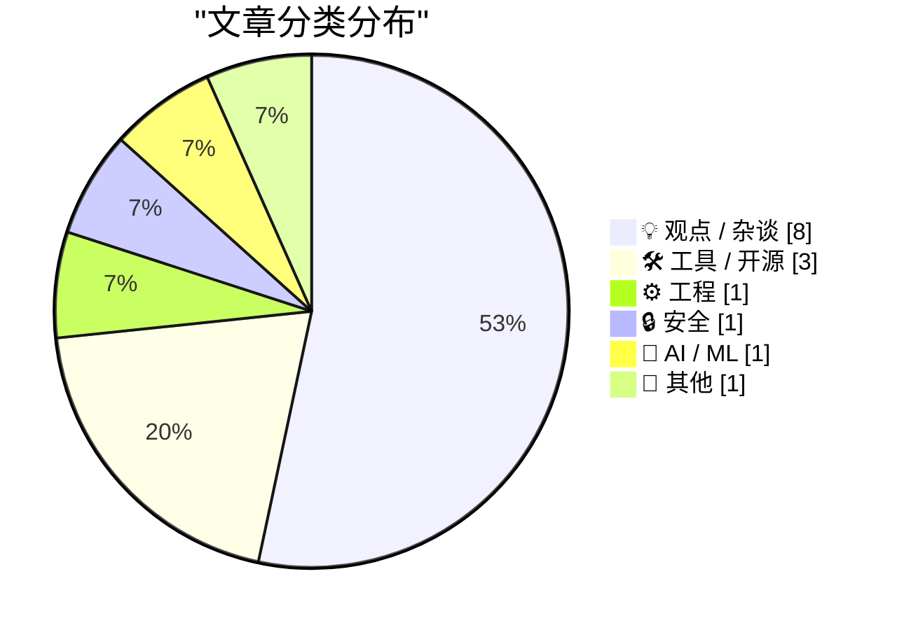
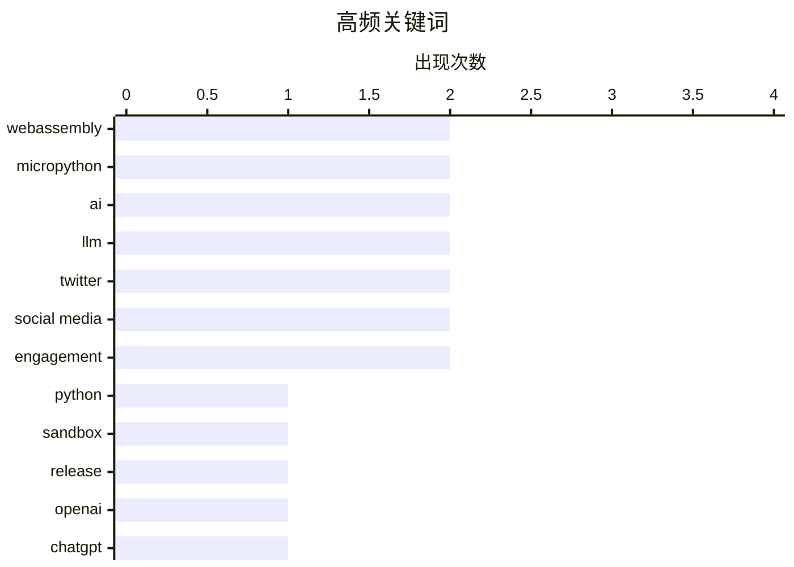

# 📰 AI 博客每日精选 — 2026-06-07

> 来自 Karpathy 推荐的 92 个顶级技术博客，AI 精选 Top 15

## 📝 今日看点

今日技术圈的核心焦点集中在人工智能的生态博弈与反思，以及底层开发工具的持续演进。随着大模型基础设施与安全机制（如JAX框架探讨和OpenAI锁定模式）的不断完善，业界对AI滥用的抵制情绪也日益高涨，不仅严厉批评了“万能机器”的虚假繁荣，更直指AI生成的垃圾PR正在严重污染开源社区。与此同时，MicroPython与WebAssembly的深度融合为浏览器端安全运行代码提供了轻量级新解法，配合各类云原生专属SDK与包管理生态的密集更新，共同展现了现代软件工程向精细化、安全化发展的明确趋势。

---

## 🏆 今日必读

🥇 **使用 MicroPython 和 WASM 在沙箱中运行 Python 代码**

[Running Python code in a sandbox with MicroPython and WASM](https://simonwillison.net/2026/Jun/6/micropython-in-a-sandbox/#atom-everything) — simonwillison.net · 15 小时前 · ⚙️ 工程

> 在沙箱环境中安全地执行 Python 代码一直是开发者面临的挑战，而结合 MicroPython 与 WebAssembly (WASM) 提供了一种极具潜力的轻量级解决思路。作者发布了名为 `micropython-wasm` 的 alpha 版本包，成功实现了在浏览器或安全沙箱中隔离运行 Python 代码的方案。该方案不仅满足了隔离执行的安全需求，还被直接应用于 `Datasette Agent` 的代码执行沙箱插件中。通过将 Python 编译为 WASM，开发者可以以更低的性能开销实现安全的代码运行环境。

💡 **为什么值得读**: 如果你正在寻找一种轻量且安全的浏览器端或服务端 Python 沙箱实现方案，这篇展示了 MicroPython 与 WASM 结合实际应用效果的文章不容错过。

🏷️ Python, WebAssembly, sandbox, MicroPython

🥈 **micropython-wasm 0.1a2 版本发布**

[micropython-wasm 0.1a2](https://simonwillison.net/2026/Jun/6/micropython-wasm/#atom-everything) — simonwillison.net · 14 小时前 · 🛠 工具 / 开源

> `micropython-wasm` 发布了全新的 0.1a2 版本，为该工具正式引入了命令行界面（CLI）支持。这一功能的增加源于作者在撰写相关博客文章时的灵感，发现 CLI 是展示工具能力的绝佳方式。CLI 的加入让开发者能够更方便地在本地终端直接测试和运行基于 MicroPython 和 WASM 的沙箱环境。该版本进一步降低了上手门槛，提升了工具的易用性和交互体验。

💡 **为什么值得读**: 了解 `micropython-wasm` 最新版本如何通过新增的 CLI 功能简化沙箱环境的本地测试与交互。

🏷️ MicroPython, WebAssembly, release

🥉 **OpenAI 帮助文档：锁定模式 (Lockdown Mode)**

[OpenAI Help: Lockdown Mode](https://simonwillison.net/2026/Jun/5/openai-help-lockdown-mode/#atom-everything) — simonwillison.net · 19 小时前 · 🔒 安全

> OpenAI 宣布其“锁定模式”（Lockdown Mode）现已正式上线，并开始向符合条件的个人账户（包括 Free、Go、Plus 和 Pro）以及自助服务的 ChatGPT Business 账户推出。该功能的主要设计初衷是帮助用户有效防止数据泄露的最后阶段。此前该功能在 2 月份首次预告，如今已进入实质性的全面部署阶段。这标志着 OpenAI 在提升企业级和个人数据安全防护方面迈出了重要一步。

💡 **为什么值得读**: 了解 OpenAI 最新推出的“锁定模式”如何在不同等级的账户中防范数据泄露风险。

🏷️ OpenAI, ChatGPT, security

---

## 📊 数据概览

| 扫描源 | 抓取文章 | 时间范围 | 精选 |
|:---:|:---:|:---:|:---:|
| 83/92 | 2478 篇 → 15 篇 | 24h | **15 篇** |

### 分类分布



### 高频关键词



<details>
<summary>📈 纯文本关键词图（终端友好）</summary>

```
webassembly  │ ████████████████████ 2
micropython  │ ████████████████████ 2
ai           │ ████████████████████ 2
llm          │ ████████████████████ 2
twitter      │ ████████████████████ 2
social media │ ████████████████████ 2
engagement   │ ████████████████████ 2
python       │ ██████████░░░░░░░░░░ 1
sandbox      │ ██████████░░░░░░░░░░ 1
release      │ ██████████░░░░░░░░░░ 1
```

</details>

### 🏷️ 话题标签

**webassembly**(2) · **micropython**(2) · **ai**(2) · llm(2) · twitter(2) · social media(2) · engagement(2) · python(1) · sandbox(1) · release(1) · openai(1) · chatgpt(1) · security(1) · tech criticism(1) · society(1) · technology(1) · philosophy(1) · criticism(1) · go(1) · tigris(1)

---

## 💡 观点 / 杂谈

### 1. Pluralistic：批评“万能机器”（2026 年 6 月 6 日）

[Pluralistic: Criticizing the everything machine (06 Jun 2026)](https://pluralistic.net/2026/06/06/applied-counterescatology/) — **pluralistic.net** · 1 小时前 · ⭐ 22/30

> 作者针对当前被过度吹捧的“万能机器”（即通用人工智能技术）提出了深刻的批评，指出其往往只是在制造虚假的繁荣。文章汇总了多个关键议题，包括英国议会针对数字版权管理（DRM）的博弈，以及对资本主义体系下规则漏洞的探讨。此外，文中还涉及了奢侈品造假、焦耳小偷电路和“精益媒体”等跨领域的最新动态。作者通过多维度的观察，揭示了当前技术发展与社会经济之间的复杂矛盾。

🏷️ AI, tech criticism, society

---

### 2. Pluralistic：提炼人性（2026 年 6 月 5 日）

[Pluralistic: Refining humanity (05 Jun 2026)](https://pluralistic.net/2026/06/05/defining-humanity/) — **pluralistic.net** · 22 小时前 · ⭐ 22/30

> 技术的本质在某种程度上成为了映射人类自身缺陷的镜子，揭示了“我们不是什么”。文章探讨了技术发展如何反衬出人性的弱点与边界，并引发了关于“定义人性”的深刻哲学思考。同时，作者还分享了关于 GNU Radio、法国对社交媒体规定的争议，以及 Aaron Swartz 获得声援等近期事件。通过这些技术与社会交织的案例，文章进一步剖析了资本主义体系下的规则漏洞与人文主义的挣扎。

🏷️ technology, philosophy, criticism

---

### 3. 为什么会有这么多 PR（拉取请求）？

[Why all the PRs?](https://idiallo.com/blog/why-all-the-prs) — **idiallo.com** · 20 小时前 · ⭐ 20/30

> 开源社区近期泛滥的 AI 生成 PR 现象，本质上是求职者为了在简历中展示“工作成果”而产生的一种信号传递行为。过去，开发者通常通过建立和维护个人网站来积累经验并展示技能。如今，GitHub 上的 PR 记录成为了新的能力证明，导致许多人利用 AI 批量生成贡献以迎合招聘者的期望。这种趋势揭示了当前技术招聘体系中对“开源贡献”指标的过度依赖及其带来的负面效应。

🏷️ AI, pull requests, open source

---

### 4. “不”的社区

[Communities of Not](https://lucumr.pocoo.org/2026/6/6/communities-of-not/) — **lucumr.pocoo.org** · 19 小时前 · ⭐ 20/30

> 那些基于“拒绝某事物”而建立的社区（如无孩群体、反汽车群体或对 LLM 持怀疑态度的开发者群体）往往会陷入一种“通过反对来构建身份认同”的奇怪现象。虽然这些社区在最好的情况下能够探讨自主权、街道安全和代码质量等积极议题，但随着时间推移，被拒绝的对象往往会成为社区身份的核心主题。这种现象导致社区的关注点逐渐偏离了建设性的目标，转而围绕他们所反对的事物本身。文章深刻揭示了这种基于“否定”的群体心理及其对技术社区的影响。

🏷️ community, identity, LLM

---

### 5. 尼曼新闻实验室：Twitter/X 惩罚发布链接的账号

[Nieman Journalism Lab: Twitter/X Punishes Accounts That Post Links](https://www.niemanlab.org/2026/04/do-links-hurt-news-publishers-on-twitter-our-analysis-suggests-yes/) — **daringfireball.net** · 22 小时前 · ⭐ 18/30

> Twitter/X 的算法正在显著惩罚在推文中附带外部链接的新闻发布者。Nieman Journalism Lab 使用 Claude 抓取了 18 家大型媒体（包括纽约时报、彭博社等）的 200 条最新推文进行参与度分析。结果显示，包含链接的推文在点赞、评论和转发等互动数据上遭受了明显的算法打压。这一机制迫使新闻机构在平台流量与读者引流之间面临更艰难的抉择。

🏷️ Twitter, algorithm, social media, engagement

---

### 6. 追寻“合意困难”

[In pursuit of desirable difficulties](https://www.joanwestenberg.com/in-pursuit-of-desirable-difficulties/) — **joanwestenberg.com** · 17 小时前 · ⭐ 18/30

> 心理学家 Robert Bjork 提出的“合意困难”理论指出，增加学习过程中的阻力反而能提升长期记忆效果。相比于被动且轻松地获取答案，那些需要费力去检索信息的学习者能够将知识记忆得更久、更清晰。这意味着在设计教育工具或个人学习计划时，盲目追求“无摩擦”的体验可能反而会削弱最终的学习成效。适度引入认知挑战才是掌握复杂技能的关键。

🏷️ learning, psychology, productivity

---

### 7. 千兆宽带依然毫无意义

[There's still no point in gigabit broadband](https://shkspr.mobi/blog/2026/06/theres-still-no-point-in-gigabit-broadband/) — **shkspr.mobi** · 7 小时前 · ⭐ 17/30

> 尽管六年前关于千兆宽带无用论的预测看似会过时，但作者在以每月 30 英镑升级到 Virgin Media 的 Gig1 套餐后发现，事实并非如此。即使具备 1Gbps 的物理带宽，绝大多数日常家庭网络应用根本无法消耗如此巨大的吞吐量。在通货膨胀导致网络资费上涨的背景下，高昂的千兆套餐并没有为普通用户提供实质性的体验飞跃。运营商主推的千兆网络目前更多停留在营销噱头的层面。

🏷️ broadband, networking, ISP

---

### 8. 埃隆·马斯克的 X 是一个怪胎秀

[Elon Musk’s X Is a Freak Show](https://www.natesilver.net/p/social-media-has-become-a-freak-show) — **daringfireball.net** · 22 小时前 · ⭐ 16/30

> Nate Silver 指出，如今的社交媒体（尤其是 X 平台）已经堕落为充斥着极端内容的“怪胎秀”。通过分析 2026 年 2 月平台上获得最高互动量的账号气泡图，可以发现头部流量几乎被低质量和高度党派化的内容所垄断。许多拥有高互动量的账号不仅内容质量堪忧，甚至连资深媒体人都未曾耳闻。这反映了 X 平台的算法机制正在系统性地激励争议性和极端言论。

🏷️ Twitter, social media, engagement

---

## 🛠 工具 / 开源

### 9. micropython-wasm 0.1a2 版本发布

[micropython-wasm 0.1a2](https://simonwillison.net/2026/Jun/6/micropython-wasm/#atom-everything) — **simonwillison.net** · 14 小时前 · ⭐ 23/30

> `micropython-wasm` 发布了全新的 0.1a2 版本，为该工具正式引入了命令行界面（CLI）支持。这一功能的增加源于作者在撰写相关博客文章时的灵感，发现 CLI 是展示工具能力的绝佳方式。CLI 的加入让开发者能够更方便地在本地终端直接测试和运行基于 MicroPython 和 WASM 的沙箱环境。该版本进一步降低了上手门槛，提升了工具的易用性和交互体验。

🏷️ MicroPython, WebAssembly, release

---

### 10. 赋予你的 Go 应用 Tigris 超能力

[Giving your Go apps Tigris superpowers](https://www.tigrisdata.com/blog/storage-sdk-go/) — **xeiaso.net** · -3172 分钟前 · ⭐ 22/30

> 尽管 Tigris 存储服务兼容 S3 协议，但使用 AWS SDK 无法直接调用其独有的高级特性（如 bucket 分支、快照和对象重命名）。为了解决这个问题，官方专门开发了一个全新的 Go SDK，以原生方式支持 Tigris 的专属功能。该 SDK 提供了两种不同的包：`storage` 包作为标准 S3 客户端的直接替代品，包含了一流的 Tigris 特定操作方法；而 `simplestorage` 则是一个更高级别的抽象层。这种设计让 Go 开发者能够在保持 S3 兼容性的同时，充分利用 Tigris 的高级特性。

🏷️ Go, Tigris, S3, SDK

---

### 11. 本周包管理动态：2026 年 6 月 6 日

[This Week in Package Management: 6 June 2026](https://nesbitt.io/2026/06/06/this-week-in-package-management.html) — **nesbitt.io** · 9 小时前 · ⭐ 20/30

> 这是一份涵盖全球包管理生态系统的每周汇总报告，收集了最新的版本发布、安全公告以及相关技术文章。它为开发者和系统管理员提供了包管理领域最新动态的一站式追踪服务。通过整合不同生态系统的更新信息，读者可以快速了解影响项目依赖和系统稳定性的关键变更。该周报是保持技术栈更新和防范供应链安全风险的重要参考资料。

🏷️ package management, releases

---

## ⚙️ 工程

### 12. 使用 MicroPython 和 WASM 在沙箱中运行 Python 代码

[Running Python code in a sandbox with MicroPython and WASM](https://simonwillison.net/2026/Jun/6/micropython-in-a-sandbox/#atom-everything) — **simonwillison.net** · 15 小时前 · ⭐ 25/30

> 在沙箱环境中安全地执行 Python 代码一直是开发者面临的挑战，而结合 MicroPython 与 WebAssembly (WASM) 提供了一种极具潜力的轻量级解决思路。作者发布了名为 `micropython-wasm` 的 alpha 版本包，成功实现了在浏览器或安全沙箱中隔离运行 Python 代码的方案。该方案不仅满足了隔离执行的安全需求，还被直接应用于 `Datasette Agent` 的代码执行沙箱插件中。通过将 Python 编译为 WASM，开发者可以以更低的性能开销实现安全的代码运行环境。

🏷️ Python, WebAssembly, sandbox, MicroPython

---

## 🔒 安全

### 13. OpenAI 帮助文档：锁定模式 (Lockdown Mode)

[OpenAI Help: Lockdown Mode](https://simonwillison.net/2026/Jun/5/openai-help-lockdown-mode/#atom-everything) — **simonwillison.net** · 19 小时前 · ⭐ 23/30

> OpenAI 宣布其“锁定模式”（Lockdown Mode）现已正式上线，并开始向符合条件的个人账户（包括 Free、Go、Plus 和 Pro）以及自助服务的 ChatGPT Business 账户推出。该功能的主要设计初衷是帮助用户有效防止数据泄露的最后阶段。此前该功能在 2 月份首次预告，如今已进入实质性的全面部署阶段。这标志着 OpenAI 在提升企业级和个人数据安全防护方面迈出了重要一步。

🏷️ OpenAI, ChatGPT, security

---

## 🤖 AI / ML

### 14. JAX 后端与设备

[JAX backends and devices](https://www.gilesthomas.com/2026/06/jax-backends-and-devices) — **gilesthomas.com** · 23 小时前 · ⭐ 19/30

> 作者在将基于 PyTorch 的大语言模型（LLM）代码移植到 JAX 框架的过程中，详细探讨了 JAX 在处理后端和设备分配时的机制。文章以加载一个包含 10,248,871,837 个 16 位无符号整数、体积超过 19GiB 的庞大训练数据集（`gpjt/fineweb-gpt2-tokens`）为例，展示了 JAX 处理大规模数据的实际表现。通过亲自编写和调试代码，作者澄清了 JAX 框架内部组件之间的协作方式。这为想要从 PyTorch 转向 JAX 的深度学习开发者提供了极具价值的实战经验。

🏷️ JAX, PyTorch, LLM

---

## 📝 其他

### 15. 阅读清单 06/06/26

[Reading List 06/06/26](https://www.construction-physics.com/p/reading-list-060626) — **construction-physics.com** · 7 小时前 · ⭐ 18/30

> Construction Physics 发布了最新的阅读推荐清单，涵盖了多个前沿科技与工程领域的交叉话题。本期内容重点探讨了 AI 聊天机器人对传统房地产经纪人角色的替代效应，以及中国合成钻石产业的发展现状。此外，清单还涉及了澳大利亚的电池储能技术和 Meta 采用帐篷形式建设的数据中心等硬件基础设施动态。这些文章共同勾勒出了当前全球技术变革与产业调整的微观缩影。

🏷️ reading list, industry, data center

---

*生成于 2026-06-07 03:08 (Asia/Shanghai) | 扫描 83 源 → 获取 2478 篇 → 精选 15 篇*
*基于 [Hacker News Popularity Contest 2025](https://refactoringenglish.com/tools/hn-popularity/) RSS 源列表，由 [Andrej Karpathy](https://x.com/karpathy) 推荐*
*由「懂点儿AI」制作，欢迎关注同名微信公众号获取更多 AI 实用技巧 💡*
