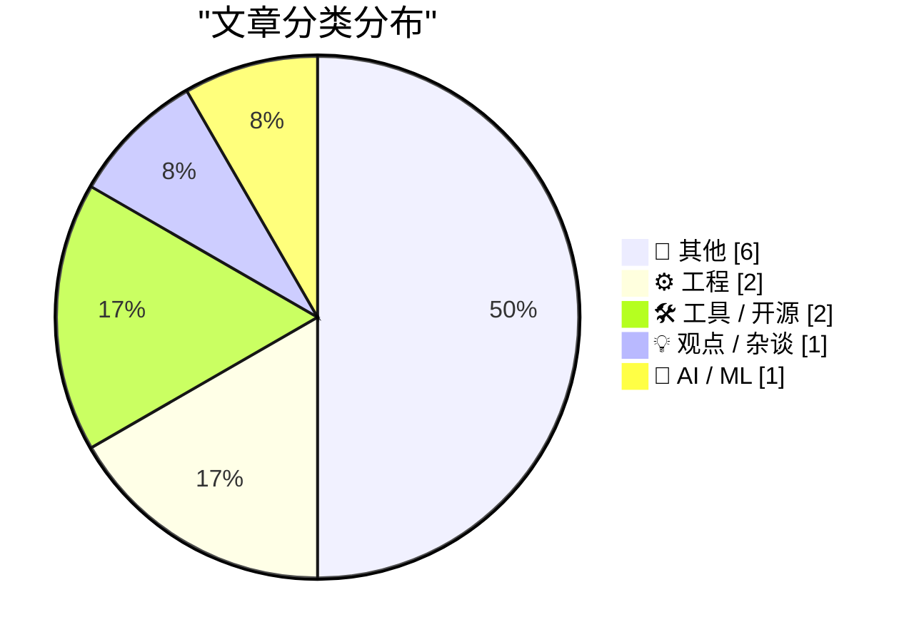
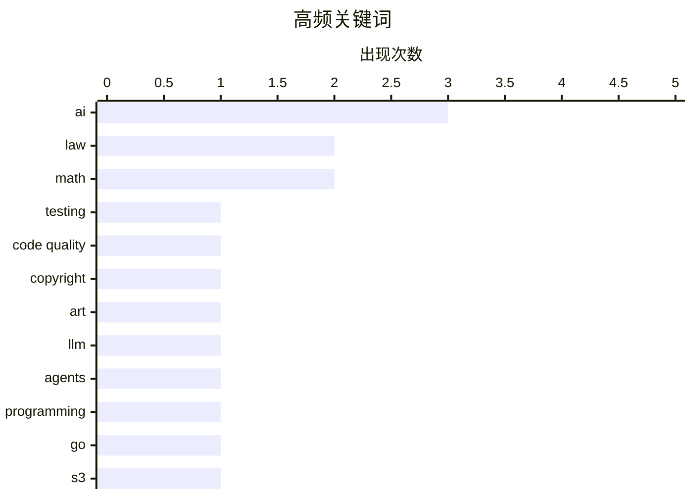

# 📰 AI 博客每日精选 — 2026-06-08

> 来自 Karpathy 推荐的 92 个顶级技术博客，AI 精选 Top 12

## 📝 今日看点

今日技术圈的核心焦点无疑是人工智能的深度渗透与边界探讨。一方面，大语言模型正全面重塑软件开发流程，从自动编程的质量评估到利用智能体从零启动项目，AI已成为提升研发效率的利器；另一方面，AI生成艺术的爆发也正式引发了关于艺术风格版权保护的法律与伦理碰撞。与此同时，开发者基础设施也在持续进化，无论是更强大的专属云存储SDK还是集成AI工作流的视频处理平台，都在为现代应用赋能。此外，从启动上世纪的IBM电子计算器到探讨硬核的物理与数学公式，技术社区依然保持着对计算历史与基础科学的深厚热情。

---

## 🏆 今日必读

🥇 **软件测试的新时代**

[A new era for software testing](http://antirez.com/news/168) — antirez.com · 8 小时前 · ⚙️ 工程

> 自动编程在特定场景下显著提升了软件开发速度，但其产出的结构质量与复杂度控制仍不及顶尖手写代码。然而，大多数常规手写代码质量平平，合理管理的自动编程通常能超越这些代码的水平。作者认为在代码质量和开发时间之间存在明确的权衡。这种权衡表明，自动编程正在开启软件测试的新时代，改变开发者的工作模式。

💡 **为什么值得读**: 由 Redis 作者 antirez 撰写，客观评估了 AI 自动编程在代码质量与开发效率之间的真实权衡。

🏷️ AI, testing, code quality

🥈 **剽窃我的风格：艺术风格能受法律保护吗？**

[Copping My Style](https://feed.tedium.co/link/15204/17355475/adobe-creator-act-style-protection-commentary) — tedium.co · 15 小时前 · 💡 观点 / 杂谈

> 艺术风格目前无法获得法律保护，但一项由 Adobe 支持的法案正试图改变这一现状。该法案是对当前 AI 生成艺术浪潮的直接回应，旨在为创作者的风格提供某种形式的法律保护。然而，艺术风格之间的界限本身就非常模糊。界定抄袭与灵感借鉴在法律和实操上都面临巨大挑战。

💡 **为什么值得读**: 探讨了 Adobe 推动的艺术风格保护法案，为理解 AI 时代的版权与创意边界提供了独到视角。

🏷️ AI, copyright, art, law

🥉 **使用 LLM 智能体启动新项目的思考**

[Thoughts on starting new projects with LLM agents](https://eli.thegreenplace.net/2026/thoughts-on-starting-new-projects-with-llm-agents/) — eli.thegreenplace.net · 17 小时前 · 🤖 AI / ML

> 作者此前利用 LLM 智能体成功重构了一个 Python 项目，且后续维护毫无问题。基于这一成功经验，文章进一步探讨了如何使用 LLM 智能体从零开始启动全新的软件项目。LLM 在生成样板代码和加速初期搭建方面表现出色，但在处理复杂的系统架构和深层逻辑时仍需开发者谨慎把控。合理利用 LLM 可以大幅提升新项目的启动效率。

💡 **为什么值得读**: 结合真实的 Python 项目重构与新建经验，分享了 LLM 智能体在软件工程中落地的实用反思。

🏷️ LLM, agents, programming

---

## 📊 数据概览

| 扫描源 | 抓取文章 | 时间范围 | 精选 |
|:---:|:---:|:---:|:---:|
| 80/92 | 2433 篇 → 12 篇 | 24h | **12 篇** |

### 分类分布



### 高频关键词



<details>
<summary>📈 纯文本关键词图（终端友好）</summary>

```
ai           │ ████████████████████ 3
law          │ █████████████░░░░░░░ 2
math         │ █████████████░░░░░░░ 2
testing      │ ███████░░░░░░░░░░░░░ 1
code quality │ ███████░░░░░░░░░░░░░ 1
copyright    │ ███████░░░░░░░░░░░░░ 1
art          │ ███████░░░░░░░░░░░░░ 1
llm          │ ███████░░░░░░░░░░░░░ 1
agents       │ ███████░░░░░░░░░░░░░ 1
programming  │ ███████░░░░░░░░░░░░░ 1
```

</details>

### 🏷️ 话题标签

**ai**(3) · **law**(2) · **math**(2) · testing(1) · code quality(1) · copyright(1) · art(1) · llm(1) · agents(1) · programming(1) · go(1) · s3(1) · tigris(1) · sdk(1) · hardware(1) · retro-computing(1) · ibm(1) · video(1) · mux(1) · photography(1)

---

## 📝 其他

### 1. Halide Mark III：从胶片摄影中汲取灵感

[Halide Mark III](https://www.lux.camera/halide-mark-iii/) — **daringfireball.net** · 17 小时前 · ⭐ 15/30

> 著名 iOS 相机应用 Halide 的开发者分享了从数字摄影回归胶片摄影的体验，并从中获得了新版本设计的灵感。相比于数字时代成千上万的繁杂预设，胶片时代工程师花费数年打造的少数几种通用胶卷反而让人感到更加自由。这种“少即是多”的理念深刻影响了 Halide Mark III 的开发方向。团队致力于通过减少不必要的选项来提升用户的拍摄体验。

🏷️ photography, app, analog

---

### 2. 特朗普律师声称特朗普有权拆除自由女神像

[Trump Lawyer Argues Trump Can Tear Down Statue of Liberty](https://talkingpointsmemo.com/edblog/trump-can-tear-down-statue-of-liberty-says-trump-lawyer) — **daringfireball.net** · 22 小时前 · ⭐ 13/30

> 在一场关于白宫东翼拆除和扩建计划的法庭听证会上，法官提出了一个极端假设：总统是否可以合法拆除自由女神像。代表司法部的律师明确表示，总统确实有权做出这样的决定，且不受任何法律挑战的约束。这一言论揭示了当前行政权力扩张所带来的严峻法律与宪政争议。上诉法院法官的质询成功将政府律师的论点推向了荒谬的极端。

🏷️ politics, law

---

### 3. 一个关于 π 的怪异公式

[A crank formula for π](https://www.johndcook.com/blog/2026/06/07/a-crank-formula-for-%cf%80/) — **johndcook.com** · 1 小时前 · ⭐ 13/30

> 作者发现了一个基于物理常数来计算圆周率 π 的怪异公式，并对其进行了深入分析。该公式涉及到一个在微波区域选择的波长 λ，作者最初以为可以通过调整这个波长值来使方程成立。但正如评论所指出的那样，方括号内的部分在数学推导上存在缺陷。最终证明，这个公式仅仅是一种牵强的数字巧合，缺乏真正的物理和数学意义。

🏷️ math, physics

---

### 4. 从开普勒到贝塞尔

[From Kepler to Bessel](https://www.johndcook.com/blog/2026/06/06/from-kepler-to-bessel/) — **johndcook.com** · 23 小时前 · ⭐ 13/30

> 贝塞尔函数的积分表示法最初是由求解开普勒方程的需求所激发的，这篇文章详细阐述了两者之间的数学联系。开普勒方程用于描述行星在椭圆轨道上围绕恒星运行的位置，其求解过程涉及多种具有历史渊源的复杂描述方法。文章通过详细的数学推导，揭示了天体力学如何推动了经典数学理论的发展。这种从实际物理问题中孕育出纯粹数学工具的过程，展示了科学发展的独特魅力。

🏷️ math, astronomy

---

### 5. 《60分钟》记者 Lesley Stahl、Bill Whitaker 和另一位同事将留在节目

[60 Minutes Correspondents Lesley Stahl, Bill Whitaker, and the Other Guy Will Stay at Show](https://www.nytimes.com/2026/06/05/business/media/60-minutes-cbs-stahl-whitaker-wertheim.html?unlocked_article_code=1.oFA.xooG.Pz8cQv8odz7Z) — **daringfireball.net** · 22 小时前 · ⭐ 12/30

> CBS《60分钟》节目的三位记者 Lesley Stahl、Bill Whitaker 和 Jon Wertheim 在致员工的内部备忘录中确认将继续留任。三人公开表示对同事 Tanya 和 Draggan 被解雇深感不安，认为这两人是因为捍卫节目的独立性、正直品格和核心价值而遭到驱逐。备忘录指出，管理层从未对解雇决定给出任何解释，这引发了对新闻编辑室独立性的严重担忧。尽管内部矛盾尖锐，三位记者最终选择留下继续工作。

🏷️ media, journalism

---

### 6. 不使用 Experia Box 实现 KPN 交互电视

[KPN Interactieve TV zonder Experia Box](https://berthub.eu/articles/posts/kpn-interactieve-tv-zelf-doen/) — **berthub.eu** · 7 小时前 · ⭐ 10/30

> 荷兰运营商 KPN 的用户可以在不使用官方 Experia Box 路由器的情况下，通过自行配置网络来使用 KPN 交互电视机顶盒（型号 5202）。核心方案涉及对 igmpproxy.conf 配置文件进行修改，以正确转发 IGMP 组播流量，使电视信号能够通过第三方路由器正常传输。作者在 2026 年 6 月更新了教程，确认时隔 5 年后这些配置方法依然有效，并补充了将机顶盒恢复出厂设置的技巧。该方案适合希望摆脱运营商锁定设备、使用自有网络设备的高级用户。

🏷️ IPTV, networking, router

---

## ⚙️ 工程

### 7. 软件测试的新时代

[A new era for software testing](http://antirez.com/news/168) — **antirez.com** · 8 小时前 · ⭐ 24/30

> 自动编程在特定场景下显著提升了软件开发速度，但其产出的结构质量与复杂度控制仍不及顶尖手写代码。然而，大多数常规手写代码质量平平，合理管理的自动编程通常能超越这些代码的水平。作者认为在代码质量和开发时间之间存在明确的权衡。这种权衡表明，自动编程正在开启软件测试的新时代，改变开发者的工作模式。

🏷️ AI, testing, code quality

---

### 8. 启动 1948 年的 IBM 604 电子计算器模块

[Powering up a module from the IBM 604: an electronic calculator from 1948](http://www.righto.com/feeds/3379514160039863191/comments/default) — **righto.com** · 1 小时前 · ⭐ 18/30

> 1948 年是计算技术从机电式向电子管转变的关键时期，当时的企业仍在广泛使用打孔卡片设备。IBM 604 便是这一过渡期的产物，它结合了传统的打孔卡片机械结构与创新的电子管计算电路。文章详细记录了启动和测试这款具有历史意义的计算器内部模块的过程。这揭示了早期计算机硬件在面对高电压和复杂电路设计时的精妙与局限。

🏷️ hardware, retro-computing, IBM

---

## 🛠 工具 / 开源

### 9. 赋予你的 Go 应用 Tigris 超能力

[Giving your Go apps Tigris superpowers](https://www.tigrisdata.com/blog/storage-sdk-go/) — **xeiaso.net** · -1769 分钟前 · ⭐ 20/30

> Tigris 是一个兼容 S3 的存储服务，直接使用 AWS SDK 无法调用其特有的高级功能。为了解决这个问题，官方专门开发了一个全新的 Go SDK。该 SDK 提供了两个版本的包：一个是可直接替代标准 S3 客户端的 storage 包，另一个是提供更高级抽象的 simplestorage 包。开发者可以借此无缝支持存储桶分叉、快照和对象重命名等独家操作。

🏷️ Go, S3, Tigris, SDK

---

### 10. Mux：面向开发者的视频基础设施

[Mux — Video for Developers](https://www.mux.com/?utm_campaign=fireball&amp;utm_source=DF) — **daringfireball.net** · 55 分钟前 · ⭐ 16/30

> Mux 是一款专为开发者设计的视频基础设施，旨在帮助用户解锁视频文件中隐藏的数据和上下文。其核心功能 Mux Robots 是一套 AI 工作流，能够自动处理新上传的视频。开发者只需配置一次，工作流即可自动执行摘要生成、字幕翻译和内容审核等任务。该服务已被 Patreon、Substack 和 Synthesia 等知名企业采用。

🏷️ video, AI, Mux

---

## 💡 观点 / 杂谈

### 11. 剽窃我的风格：艺术风格能受法律保护吗？

[Copping My Style](https://feed.tedium.co/link/15204/17355475/adobe-creator-act-style-protection-commentary) — **tedium.co** · 15 小时前 · ⭐ 23/30

> 艺术风格目前无法获得法律保护，但一项由 Adobe 支持的法案正试图改变这一现状。该法案是对当前 AI 生成艺术浪潮的直接回应，旨在为创作者的风格提供某种形式的法律保护。然而，艺术风格之间的界限本身就非常模糊。界定抄袭与灵感借鉴在法律和实操上都面临巨大挑战。

🏷️ AI, copyright, art, law

---

## 🤖 AI / ML

### 12. 使用 LLM 智能体启动新项目的思考

[Thoughts on starting new projects with LLM agents](https://eli.thegreenplace.net/2026/thoughts-on-starting-new-projects-with-llm-agents/) — **eli.thegreenplace.net** · 17 小时前 · ⭐ 23/30

> 作者此前利用 LLM 智能体成功重构了一个 Python 项目，且后续维护毫无问题。基于这一成功经验，文章进一步探讨了如何使用 LLM 智能体从零开始启动全新的软件项目。LLM 在生成样板代码和加速初期搭建方面表现出色，但在处理复杂的系统架构和深层逻辑时仍需开发者谨慎把控。合理利用 LLM 可以大幅提升新项目的启动效率。

🏷️ LLM, agents, programming

---

*生成于 2026-06-08 02:31 (Asia/Shanghai) | 扫描 80 源 → 获取 2433 篇 → 精选 12 篇*
*基于 [Hacker News Popularity Contest 2025](https://refactoringenglish.com/tools/hn-popularity/) RSS 源列表，由 [Andrej Karpathy](https://x.com/karpathy) 推荐*
*由「懂点儿AI」制作，欢迎关注同名微信公众号获取更多 AI 实用技巧 💡*
