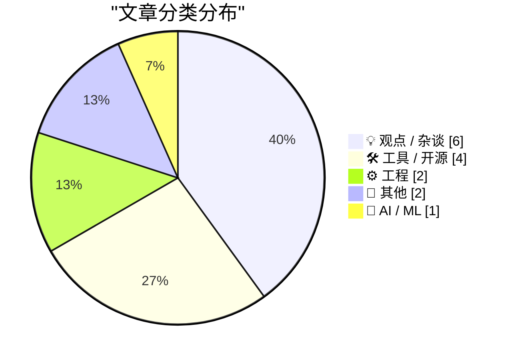
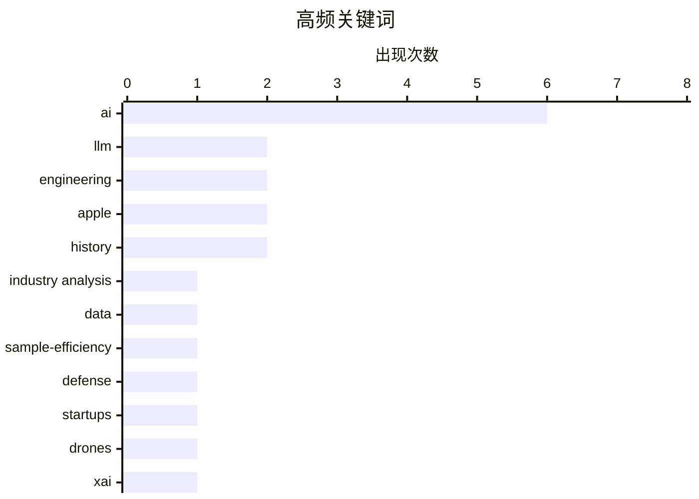

# 📰 AI 博客每日精选 — 2026-06-09

> 来自 Karpathy 推荐的 92 个顶级技术博客，AI 精选 Top 15

## 📝 今日看点

今日技术圈正对生成式AI的狂热进行冷静反思，业界不仅关注到大模型发展放缓与数据效率低下的严峻瓶颈，也发现科技巨头们的重心正向算力基建与金融博弈转移。在开发者生态方面，关于工程师效能管理与职场文化的讨论重回视野，行业开始提倡为工作负荷刻意留白，并寻求打破研发与产品之间的协作壁垒。此外，随着各类底层存储和AI代理编辑工具的持续演进，开发者们正以更务实的态度探索新技术在实际业务流中的落地应用。

---

## 🏆 今日必读

🥇 **AI 正在放缓**

[AI Is Slowing Down](https://www.wheresyoured.at/ai-is-slowing-down/) — wheresyoured.at · 4 小时前 · 💡 观点 / 杂谈

> 生成式 AI 的发展速度正出现明显的放缓迹象，而非继续呈指数级增长。模型训练成本居高不下，而新一代模型在推理和减少幻觉等核心能力上的突破已不如前几代显著。随着边际收益递减，科技巨头投入的数百亿美元资本支出面临越来越大的回报压力。当前的 AI 泡沫可能即将破裂，行业需要重新审视对通用人工智能（AGI）的短期预期。

💡 **为什么值得读**: 帮助读者跳出盲目乐观的炒作情绪，客观审视当前 AI 技术发展的真实瓶颈与投资风险。

🏷️ AI, LLM, industry analysis

🥈 **样本效率黑洞**

[The sample efficiency black hole](https://www.dwarkesh.com/p/the-sample-efficiency-black-hole) — dwarkesh.com · 2 小时前 · 🤖 AI / ML

> 当前 AI 模型展现出惊人能力的背后，隐藏着一个极度依赖海量数据的“样本效率黑洞”。与人类能够举一反三的高效学习机制不同，大语言模型必须吞噬几乎整个互联网的文本才能达到现有的智能水平。这种对庞大数据量的依赖导致了算力和能源消耗的指数级增长，成为限制模型进一步扩展的物理瓶颈。如果不解决样本效率问题，单纯依靠增加数据规模的 Scaling Law 终将面临物理与经济的双重极限。

💡 **为什么值得读**: 以生动的比喻揭示了 AI 扩展定律背后的根本性缺陷，对理解大模型未来的技术瓶颈极具启发性。

🏷️ AI, data, sample-efficiency, LLM

🥉 **斯坦福 2026 黑客保卫战：经验教训展示**

[Hacking for Defense @ Stanford 2026 – Lessons Learned Presentations](https://steveblank.com/2026/06/08/g-for-defense-stanford-2026-lessons-learned-presentations/) — steveblank.com · 7 小时前 · 💡 观点 / 杂谈

> 斯坦福大学“黑客保卫战（Hacking for Defense）”课程迎来了第 11 个年头，展示了如何利用初创企业思维解决国家安全问题。当前课程的重点已转向不对称战争、商用现成技术（COTS）、无人机以及 AI 和商业航天等颠覆性技术。美国国防部（DoD）更为友好的采购系统也为初创公司参与国防科技研发提供了前所未有的便利。这标志着国防科技领域的创新正在从传统军工巨头向敏捷的初创企业转移。

💡 **为什么值得读**: 深入了解前沿科技（如 AI 和无人机）如何重塑现代国防以及初创企业切入军工体系的绝佳案例。

🏷️ defense, startups, drones, AI

---

## 📊 数据概览

| 扫描源 | 抓取文章 | 时间范围 | 精选 |
|:---:|:---:|:---:|:---:|
| 81/92 | 2452 篇 → 16 篇 | 24h | **15 篇** |

### 分类分布



### 高频关键词



<details>
<summary>📈 纯文本关键词图（终端友好）</summary>

```
ai                │ ████████████████████ 6
llm               │ ███████░░░░░░░░░░░░░ 2
engineering       │ ███████░░░░░░░░░░░░░ 2
apple             │ ███████░░░░░░░░░░░░░ 2
history           │ ███████░░░░░░░░░░░░░ 2
industry analysis │ ███░░░░░░░░░░░░░░░░░ 1
data              │ ███░░░░░░░░░░░░░░░░░ 1
sample-efficiency │ ███░░░░░░░░░░░░░░░░░ 1
defense           │ ███░░░░░░░░░░░░░░░░░ 1
startups          │ ███░░░░░░░░░░░░░░░░░ 1
```

</details>

### 🏷️ 话题标签

**ai**(6) · **llm**(2) · **engineering**(2) · apple(2) · history(2) · industry analysis(1) · data(1) · sample-efficiency(1) · defense(1) · startups(1) · drones(1) · xai(1) · datacenter(1) · gpu(1) · compute(1) · productivity(1) · work-life(1) · product-manager(1) · collaboration(1) · swiftui(1)

---

## 💡 观点 / 杂谈

### 1. AI 正在放缓

[AI Is Slowing Down](https://www.wheresyoured.at/ai-is-slowing-down/) — **wheresyoured.at** · 4 小时前 · ⭐ 24/30

> 生成式 AI 的发展速度正出现明显的放缓迹象，而非继续呈指数级增长。模型训练成本居高不下，而新一代模型在推理和减少幻觉等核心能力上的突破已不如前几代显著。随着边际收益递减，科技巨头投入的数百亿美元资本支出面临越来越大的回报压力。当前的 AI 泡沫可能即将破裂，行业需要重新审视对通用人工智能（AGI）的短期预期。

🏷️ AI, LLM, industry analysis

---

### 2. 斯坦福 2026 黑客保卫战：经验教训展示

[Hacking for Defense @ Stanford 2026 – Lessons Learned Presentations](https://steveblank.com/2026/06/08/g-for-defense-stanford-2026-lessons-learned-presentations/) — **steveblank.com** · 7 小时前 · ⭐ 23/30

> 斯坦福大学“黑客保卫战（Hacking for Defense）”课程迎来了第 11 个年头，展示了如何利用初创企业思维解决国家安全问题。当前课程的重点已转向不对称战争、商用现成技术（COTS）、无人机以及 AI 和商业航天等颠覆性技术。美国国防部（DoD）更为友好的采购系统也为初创公司参与国防科技研发提供了前所未有的便利。这标志着国防科技领域的创新正在从传统军工巨头向敏捷的初创企业转移。

🏷️ defense, startups, drones, AI

---

### 3. xAI 看起来更像是一家数据中心 REIT 而非前沿实验室

[xAI is looking more like a datacentre REIT than a frontier lab](https://martinalderson.com/posts/xais-new-rental-business/?utm_source=rss&amp;utm_medium=rss&amp;utm_campaign=feed) — **martinalderson.com** · 20 小时前 · ⭐ 23/30

> xAI 正在向 Anthropic 和 Google 等竞争对手出租海量的 GPU 算力，引发了对其业务重心的质疑。这一举措背后可能是 SpaceX IPO 前的金融工程手段，也可能是市场上真实存在的算力短缺，或者是其在数据中心建设上的独特优势。将昂贵的算力资源货币化，表明 xAI 正在寻找除了开发前沿模型之外的多元化收入来源。这种策略让 xAI 的商业模式越来越像是一家房地产信托投资基金（REIT），而非纯粹的 AI 前沿实验室。

🏷️ xAI, datacenter, GPU, compute

---

### 4. 在工作中“无所事事”

[Doing nothing at work](https://seangoedecke.com/doing-nothing-at-work/) — **seangoedecke.com** · 20 小时前 · ⭐ 21/30

> 科技公司工程师的绩效往往由少数极端高影响力的突发事件决定，因此保持高利用率反而会损害生产力。作者建议工程师默认将工作负荷维持在 80% 的水平，每天保留 20% 的时间远离电脑。刻意放慢节奏和减少工作时长，能为识别和抓住那些真正具有突破性的高价值机会留出必要的心理空间。在非高压项目中主动“无所事事”，实际上是提升长期工程效率和创新能力的战略性选择。

🏷️ productivity, work-life, engineering

---

### 5. 与产品经理合作

[Working with product managers](https://seangoedecke.com/working-with-product-managers/) — **seangoedecke.com** · 20 小时前 · ⭐ 21/30

> 工程师与产品经理（PM）之间的关系往往是科技公司中最容易产生摩擦的环节。双方缺乏像工程师之间那样的共同技术语言和文化，且“谁听谁的”这种职权边界也经常模糊不清。由于工程师需要与产品经理进行极其频繁的日常沟通，这种职能交叉极易导致双方在需求优先级和执行细节上的冲突。建立清晰的职责划分和沟通机制，是打破这种协作障碍、提高产品交付效率的关键。

🏷️ product-manager, collaboration, engineering

---

### 6. 阿尔贝托·罗梅罗谈苹果的 AI 支出

[Alberto Romero on Apple’s AI Spending](https://www.thealgorithmicbridge.com/p/what-apple-knows-about-ai-that-silicon) — **daringfireball.net** · 19 小时前 · ⭐ 20/30

> 对待 AI 就像对待宗教，要么坚信它能改变一切，要么完全不信，不存在中间立场。如果通用人工智能（AGI）真的到来，唯一理性的反应是像信徒一样将整个生活围绕它重新组织；如果只是偶尔用用，那不过是个恐惧的无神论者。然而，科技巨头们正花费数千亿美元的资本支出，仅仅是为了给产品添加一些华而不实的 AI 功能。这种巨额投入与实际产品价值之间的巨大鸿沟，揭示了当前 AI 行业浓厚的信仰驱动色彩。

🏷️ Apple, AI, AGI

---

## 🛠 工具 / 开源

### 7. 赋予你的 Go 应用 Tigris 超能力

[Giving your Go apps Tigris superpowers](https://www.tigrisdata.com/blog/storage-sdk-go/) — **xeiaso.net** · -225 分钟前 · ⭐ 20/30

> Tigris 提供与 S3 兼容的存储服务，但使用 AWS SDK 无法直接调用其特有的高级功能。为了解决这一问题，Tigris 推出了专用的 Go SDK，支持存储桶分叉、快照和对象重命名等独占操作。该 SDK 提供了两种使用模式：storage 包作为标准 S3 客户端的直接替代品，而 simplestorage 则是一个更高层的抽象接口。这为 Go 开发者在应用中无缝集成高级云存储功能提供了更加优雅的原生解决方案。

🏷️ Go, Tigris, S3, SDK

---

### 8. datasette-agent-edit 0.1a0

[datasette-agent-edit 0.1a0](https://simonwillison.net/2026/Jun/7/datasette-agent-edit/#atom-everything) — **simonwillison.net** · 20 小时前 · ⭐ 18/30

> datasette-agent-edit 是一个新发布的 Datasette Agent 插件，旨在让 AI 智能体能够直接编辑现有的文本内容。该插件主要针对协作式 Markdown 编辑、更新大型 SQL 查询以及编辑 SVG 文件等复杂场景设计。由于让 AI 智能体精准地修改文本而不破坏原有结构极具挑战性，该工具采用了一套经过精心设计的交互模式来确保编辑的准确性。这为构建基于 AI 驱动的数据管理和内容编辑工作流提供了关键的底层支持。

🏷️ datasette, AI, plugin

---

### 9. 包管理器专利

[Package Manager Patents](https://nesbitt.io/2026/06/08/package-manager-patents.html) — **nesbitt.io** · 10 小时前 · ⭐ 16/30

> 包管理器的设计和实现涉及众多专利技术，常常被开发者忽视。该文章整理了一份与包管理器设计密切相关的专利和专利申请参考清单。作者还对相关的现有技术（prior art）进行了详细批注，帮助开发者规避潜在的专利壁垒并了解技术演进历史。对于需要深入理解包管理底层机制或开发新包管理工具的工程师来说，这是一份极具价值的避坑指南。

🏷️ package-manager, patents, open-source

---

### 10. Mux：面向开发者的视频基础设施

[Mux — Video for Developers](https://www.mux.com/?utm_campaign=fireball&amp;utm_source=DF) — **daringfireball.net** · 18 小时前 · ⭐ 14/30

> Mux 是一套专为开发者设计的视频处理基础设施，已被 Patreon、Substack 和 Synthesia 等知名平台采用。其核心功能 Mux Robots 允许开发者配置一次 AI 工作流，即可在每次上传新视频时自动运行处理。这些 AI 工作流能够精准解锁视频内部的数据，实现视频摘要、字幕翻译和内容审核等高级功能。开发者目前可以使用 FIRE 优惠码免费接入并开始构建测试。

🏷️ video, AI, API

---

## ⚙️ 工程

### 11. SwiftUI 只会让开发糟糕的应用变得更容易

[★ SwiftUI Only Makes It Easy to Develop Bad Apps](https://daringfireball.net/2026/06/swiftui_only_makes_it_easy_to_develop_bad_apps) — **daringfireball.net** · 18 小时前 · ⭐ 21/30

> 苹果曾向开发者承诺，其平台不仅容易开发应用，而且容易开发出优秀的原生应用。然而，虽然这一承诺在 AppKit 和 UIKit 上依然成立，但在已经诞生七年的 SwiftUI 上却从未真正实现。SwiftUI 虽然降低了构建基础 UI 的门槛，但在处理复杂应用状态和定制化需求时暴露出严重的局限性。这使得开发者很容易用 SwiftUI 拼凑出应用，却很难用它打造出真正符合平台高标准的高质量原生体验。

🏷️ SwiftUI, Apple, app-development

---

### 12. 艾特肯之前的艾特肯加速法

[Aitken acceleration before Aitken](https://www.johndcook.com/blog/2026/06/07/aitkin-acceleration-kepler/) — **johndcook.com** · 1 天前 · ⭐ 15/30

> 开普勒方程 M = E − e sin(E) 的求解实质上是一个寻找不动点的迭代过程。开普勒曾提出通过将猜测值反复代入方程右侧进行迭代，并认为少量迭代即可达到收敛效果。文章探讨了在这种不动点迭代中，如何在实际应用中通过加速技术大幅提高收敛效率。这种加速方法比艾特肯正式提出的时间更早，展现了早期数学家在数值计算领域的深刻洞察。

🏷️ algorithm, math, numerical-analysis

---

## 📝 其他

### 13. 《异域镇魂曲》第二部分：……走向桌面

[Planescape: Torment, Part 2: …to the Desktop](https://www.filfre.net/2026/06/planescape-torment-part-2-to-the-desktop/) — **filfre.net** · 4 小时前 · ⭐ 15/30

> 经典电子游戏《异域镇魂曲》的开发历程与《龙与地下城》（D&D）在计算机平台上的演变密不可分。文章回顾了早期桌游向电脑 RPG 游戏转化的历史过程，涵盖了 Interplay 在 1988 年对小说《神经漫游者》的游戏改编等背景故事。核心开发者 Chris Avellone 分享了游戏对话设计的核心理念，指出通常最长的对话选项往往对应着最佳的游戏体验。这为理解经典 CRPG 的叙事设计提供了珍贵的一手视角。

🏷️ gaming, history, CRPG

---

### 14. Eagle Computer：早期 PC 兼容机的崛起与陨落

[Eagle Computer: The rise and fall of an early PC clone](https://dfarq.homeip.net/eagle-computer-the-rise-and-fall-of-an-early-pc-clone/?utm_source=rss&#038;utm_medium=rss&#038;utm_campaign=eagle-computer-the-rise-and-fall-of-an-early-pc-clone) — **dfarq.homeip.net** · 9 小时前 · ⭐ 12/30

> 在 20 世纪 80 年代的早期 PC 市场中，Eagle Computer 曾是一颗耀眼的新星，创造了令人瞩目的销售奇迹。1983 年期间，该公司凭借出色的领导力实现了每个季度销量翻倍的壮举，月销量一度高达 12,000 台。然而，这家明星企业最终未能经受住市场的残酷考验，迅速走向了衰败。文章详细复盘了这家早期 PC 兼容机制造商从巅峰跌落至倒闭的完整商业历程。

🏷️ PC clone, history, hardware

---

## 🤖 AI / ML

### 15. 样本效率黑洞

[The sample efficiency black hole](https://www.dwarkesh.com/p/the-sample-efficiency-black-hole) — **dwarkesh.com** · 2 小时前 · ⭐ 23/30

> 当前 AI 模型展现出惊人能力的背后，隐藏着一个极度依赖海量数据的“样本效率黑洞”。与人类能够举一反三的高效学习机制不同，大语言模型必须吞噬几乎整个互联网的文本才能达到现有的智能水平。这种对庞大数据量的依赖导致了算力和能源消耗的指数级增长，成为限制模型进一步扩展的物理瓶颈。如果不解决样本效率问题，单纯依靠增加数据规模的 Scaling Law 终将面临物理与经济的双重极限。

🏷️ AI, data, sample-efficiency, LLM

---

*生成于 2026-06-09 04:15 (Asia/Shanghai) | 扫描 81 源 → 获取 2452 篇 → 精选 15 篇*
*基于 [Hacker News Popularity Contest 2025](https://refactoringenglish.com/tools/hn-popularity/) RSS 源列表，由 [Andrej Karpathy](https://x.com/karpathy) 推荐*
*由「懂点儿AI」制作，欢迎关注同名微信公众号获取更多 AI 实用技巧 💡*
