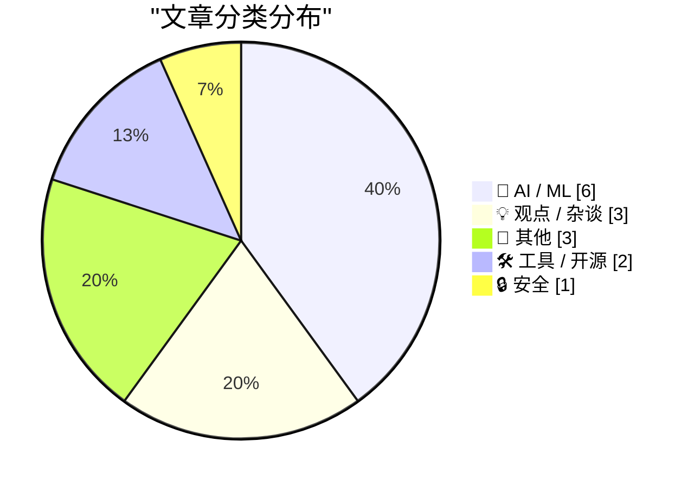
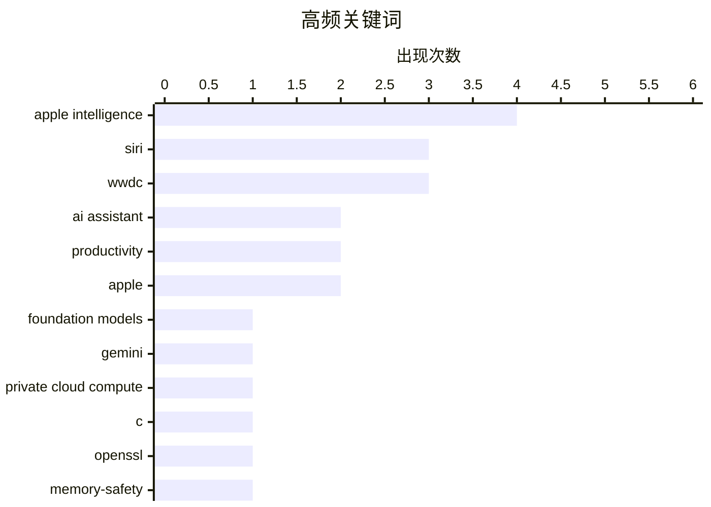

# 📰 AI 博客每日精选 — 2026-06-10

> 来自 Karpathy 推荐的 92 个顶级技术博客，AI 精选 Top 15

## 📝 今日看点

今日科技圈的绝对焦点是苹果在WWDC上全面发力AI，其推出的全新Apple Intelligence与重构后的Siri展现了深度集成且更务实的系统级能力。与此同时，AI的工程化应用正步入深水区，不仅出现了专为AI代理设计的开放鉴权协议，业界也开始理性审视大模型生成代码可能带来的额外复杂性与技术债。此外，基础软件的安全隐患再次敲响警钟，OpenSSL爆出的高危漏洞迫使大量运维人员紧急响应，也重新引发了关于C语言内存安全的行业讨论。

---

## 🏆 今日必读

🥇 **Apple WWDC 发布全新 Apple Intelligence 系统**

[Apple’s WWDC Announcement of the New Apple Intelligence System](https://www.apple.com/newsroom/2026/06/apple-intelligence-brings-powerful-ai-capabilities-into-everyday-experiences/) — daringfireball.net · 2 小时前 · 🤖 AI / ML

> 苹果在 WWDC 上发布了全新的 Apple Intelligence 系统，核心能力由新一代苹果基础模型提供支持。该模型是苹果与谷歌合作、基于 Gemini 模型深度定制的产物，旨在提供深度集成的 AI 体验。这些模型在设备和基于 Private Cloud Compute 的服务器上运行。整个架构从底层操作系统到模型集成都坚持隐私优先原则。

💡 **为什么值得读**: 了解苹果与谷歌在基础模型上的合作细节以及最新的 Apple Intelligence 隐私架构。

🏷️ Apple Intelligence, Foundation Models, Gemini, Private Cloud Compute

🥈 **“没办法阻止这种事发生”——唯一经常发生这种情况的语言的用户如是说**

["No way to prevent this" say users of only language where this regularly happens](https://xeiaso.net/shitposts/no-way-to-prevent-this/memory-safety/CVE-2026-45447/) — xeiaso.net · 19 小时前 · 🔒 安全

> OpenSSL 发布了 CVE-2026-45447 漏洞补丁，该漏洞源于 C 语言编写的 PKCS7_verify() 函数中存在的堆释放后使用问题。这一安全事件导致系统管理员和 SRE 不得不紧急重建和修补系统。文章以讽刺的口吻指出，C 语言是唯一一种频繁出现此类内存安全漏洞的编程语言，而业界却常常对此表现出无可奈何的态度。

💡 **为什么值得读**: 以黑色幽默的方式揭示 C 语言内存安全问题的长期痛点，引发对系统底层语言选型的思考。

🏷️ C, OpenSSL, memory-safety, CVE

🥉 **WWDC 2026 上的 Siri AI**

[Siri AI at WWDC 2026](https://simonwillison.net/2026/Jun/8/wwdc/#atom-everything) — simonwillison.net · 19 小时前 · 🤖 AI / ML

> 鉴于 2024 年 WWDC 上 Apple Intelligence 的过度承诺，作者对 2026 年发布的新功能持严格谨慎的态度。不过，此次发布的新 Siri AI 功能看起来利用现有技术是完全可行的。这表明苹果在 AI 助手的承诺上变得更加务实，新功能可能不再是空中楼阁。

💡 **为什么值得读**: 了解业界知名开发者对苹果 WWDC 2026 AI 新功能的真实且务实的评价。

🏷️ Siri, Apple Intelligence, WWDC

---

## 📊 数据概览

| 扫描源 | 抓取文章 | 时间范围 | 精选 |
|:---:|:---:|:---:|:---:|
| 82/92 | 2471 篇 → 19 篇 | 24h | **15 篇** |

### 分类分布



### 高频关键词



<details>
<summary>📈 纯文本关键词图（终端友好）</summary>

```
apple intelligence    │ ████████████████████ 4
siri                  │ ███████████████░░░░░ 3
wwdc                  │ ███████████████░░░░░ 3
ai assistant          │ ██████████░░░░░░░░░░ 2
productivity          │ ██████████░░░░░░░░░░ 2
apple                 │ ██████████░░░░░░░░░░ 2
foundation models     │ █████░░░░░░░░░░░░░░░ 1
gemini                │ █████░░░░░░░░░░░░░░░ 1
private cloud compute │ █████░░░░░░░░░░░░░░░ 1
c                     │ █████░░░░░░░░░░░░░░░ 1
```

</details>

### 🏷️ 话题标签

**apple intelligence**(4) · **siri**(3) · **wwdc**(3) · ai assistant(2) · productivity(2) · apple(2) · foundation models(1) · gemini(1) · private cloud compute(1) · c(1) · openssl(1) · memory-safety(1) · cve(1) · ai demo(1) · real-time(1) · ai agents(1) · authentication(1) · protocol(1) · oauth(1) · llm(1)

---

## 🤖 AI / ML

### 1. Apple WWDC 发布全新 Apple Intelligence 系统

[Apple’s WWDC Announcement of the New Apple Intelligence System](https://www.apple.com/newsroom/2026/06/apple-intelligence-brings-powerful-ai-capabilities-into-everyday-experiences/) — **daringfireball.net** · 2 小时前 · ⭐ 26/30

> 苹果在 WWDC 上发布了全新的 Apple Intelligence 系统，核心能力由新一代苹果基础模型提供支持。该模型是苹果与谷歌合作、基于 Gemini 模型深度定制的产物，旨在提供深度集成的 AI 体验。这些模型在设备和基于 Private Cloud Compute 的服务器上运行。整个架构从底层操作系统到模型集成都坚持隐私优先原则。

🏷️ Apple Intelligence, Foundation Models, Gemini, Private Cloud Compute

---

### 2. WWDC 2026 上的 Siri AI

[Siri AI at WWDC 2026](https://simonwillison.net/2026/Jun/8/wwdc/#atom-everything) — **simonwillison.net** · 19 小时前 · ⭐ 24/30

> 鉴于 2024 年 WWDC 上 Apple Intelligence 的过度承诺，作者对 2026 年发布的新功能持严格谨慎的态度。不过，此次发布的新 Siri AI 功能看起来利用现有技术是完全可行的。这表明苹果在 AI 助手的承诺上变得更加务实，新功能可能不再是空中楼阁。

🏷️ Siri, Apple Intelligence, WWDC

---

### 3. 苹果 WWDC AI 演示是真实的且实时运行的

[Apple’s WWDC AI Demos Were Real and in Real Time](https://techcrunch.com/2026/06/08/apples-wwdc-ai-demos-looked-more-real-after-250m-false-ad-settlement/) — **daringfireball.net** · 2 小时前 · ⭐ 24/30

> 苹果在最新 WWDC 上的 AI 演示方式与 2024 年大不相同，许多展示都采用了预录制的真实时间操作画面。演示中展示了用户手持手机实时按下按钮或使用语音命令，以及手机的同步响应过程。这种展示方式有力地证明了新功能的可用性，也是在经历 2.5 亿美元虚假广告诉讼和解后，苹果试图重建信任的明显举措。

🏷️ Apple Intelligence, AI demo, real-time

---

### 4. 苹果推出 Siri AI

[Apple Introduces Siri AI](https://www.apple.com/newsroom/2026/06/apple-introduces-siri-ai-a-profoundly-more-capable-and-personal-assistant/) — **daringfireball.net** · 2 小时前 · ⭐ 24/30

> 苹果推出了基于 Apple Intelligence 构建的全新 Siri AI，使其成为具备强大个人上下文理解能力的助手。Siri 能够跨应用（如信息、邮件、照片等）提取信息，帮助用户查找朋友推荐的餐厅、邮件中的酒店确认号或旅行照片。此外，这种个人上下文理解能力还将扩展到第三方应用程序中。

🏷️ Siri, Apple Intelligence, AI assistant

---

### 5. 大语言模型与“差不多好”的代码

[LLMs and almost good code](https://entropicthoughts.com/llms-and-almost-good-code) — **entropicthoughts.com** · 21 小时前 · ⭐ 24/30

> 顶尖大语言模型在处理简单任务时生成的代码，通常会比实际需要的复杂大约 10%。由于这些代码能够立竿见影地解决眼前的问题，开发者往往容易接受这种额外的复杂性。然而，这种为了短期便利而妥协的代码质量，可能会给系统的长期维护带来严重的负面后果。

🏷️ LLM, code-quality, complexity

---

### 6. 知情人士透露：苹果拟在 iOS 27 中向 ChatGPT 之外的第三方 AI 助手开放 Siri

[From the Annals of People Having Knowledge of the Matter, Siri AI Extensions Edition](https://www.bloomberg.com/news/articles/2026-03-26/apple-plans-to-open-up-siri-to-rival-ai-assistants-beyond-chatgpt-in-ios-27) — **daringfireball.net** · 18 小时前 · ⭐ 21/30

> 苹果计划在 iOS 27 的 Siri 大改版中，将 Siri 对外部 AI 服务的支持从当前的 ChatGPT 扩展到更多竞争对手的 AI 助手。目前 Siri 已通过 OpenAI 合作接入 ChatGPT，但苹果将进一步开放接口，允许更多第三方 AI 服务接入。此举旨在强化 iPhone 作为 AI 平台的竞争力，标志着苹果从封闭生态向更开放的 AI 策略转变。

🏷️ Siri, AI assistant, iOS

---

## 💡 观点 / 杂谈

### 7. 引用 Andrej Karpathy 的话

[Quoting Andrej Karpathy](https://simonwillison.net/2026/Jun/9/andrej-karpathy/#atom-everything) — **simonwillison.net** · 40 分钟前 · ⭐ 23/30

> Andrej Karpathy 指出，随着软件能够像打开水龙头一样被快速生成，杰文斯悖论开始显现，即对软件的需求正在大幅增长。开发者现在可以随时要求 AI 生成解释器、可视化图表、仪表板、一次性专用应用或十倍规模的测试套件。这种近乎零成本的软件生产能力正在彻底改变人们构建和使用软件的方式。

🏷️ AI, software engineering, productivity

---

### 8. ppclp.ai 宣布实现 100 倍生产力提升

[ppclp.ai announces 100x Productivity Gains](https://idiallo.com/blog/100x-productivity-gain) — **idiallo.com** · 23 小时前 · ⭐ 22/30

> 北美第三大 AI 原生高级线型办公紧固件制造商 ppclp.ai（原名回形针公司）宣布其专有的组织生产力指数实现了 100 倍的里程碑式提升。这一突破源于一项为期 18 个月的全员强制性效率提升计划。文章通过极其荒诞的行话和夸张的数据，讽刺了当前科技圈对 AI 生产力盲目炒作的现象。

🏷️ AI hype, satire, productivity

---

### 9. 开源的治理形式

[Forms of Open Source Government](https://nesbitt.io/2026/06/09/forms-of-open-source-government.html) — **nesbitt.io** · 9 小时前 · ⭐ 18/30

> 开源社区的治理模式种类比全球国家数量还多。文章探讨了开源项目中存在的多种治理形式，揭示了开源世界在组织管理上的多样性与复杂性。

🏷️ open-source, governance, community

---

## 📝 其他

### 10. Apple WWDC 2026 主题演讲

[Apple WWDC 2026 Keynote](https://www.youtube.com/watch?v=hF8swzNR1-o) — **daringfireball.net** · 2 小时前 · ⭐ 19/30

> Apple WWDC 2026 主题演讲总时长仅 76 分钟，还包含了一段片尾彩蛋音乐视频。相比过去几年动辄近两小时的时长，今年节奏明显更快、更紧凑。

🏷️ Apple, WWDC, keynote

---

### 11. The Talk Show WWDC 现场直播：今晚线下与线上同步进行

[The Talk Show Live From WWDC: Tonight, In-Person and Streaming](https://ti.to/daringfireball/the-talk-show-live-from-wwdc-2026) — **daringfireball.net** · 49 分钟前 · ⭐ 17/30

> Gruber 的 The Talk Show WWDC 现场版在加州剧院举办，门票仍有余量。除线下参与外，观众可通过 Vision Pro 上的 Theater 应用（Sandwich Vision 出品，售价 $12.99）以立体沉浸方式观看直播和永久回放，还包含惊喜附加内容。

🏷️ WWDC, live streaming, Vision Pro

---

### 12. Apple II：1977 年 6 月 10 日发布

[Apple II: Launched June 10, 1977](https://dfarq.homeip.net/apple-ii-launched-june-10-1977/?utm_source=rss&#038;utm_medium=rss&#038;utm_campaign=apple-ii-launched-june-10-1977) — **dfarq.homeip.net** · 8 小时前 · ⭐ 17/30

> Apple II 于 1977 年 6 月 10 日正式发布，是首批预装台式电脑之一。在其长达 17 年的产品生命周期中，Apple II 共售出约 600 万台，成为当时寿命最长、销量最高的个人电脑之一。

🏷️ Apple, retrocomputing, history

---

## 🛠 工具 / 开源

### 13. WorkOS 推出 auth.md——一种用于 AI 代理注册的开放协议

[[Sponsor] WorkOS Launches auth.md — an Open Protocol for Agent Registration](https://youtu.be/Dqp_b8GHLXU?t=1074) — **daringfireball.net** · 15 小时前 · ⭐ 24/30

> 传统的注册表单是为人类在浏览器中操作设计的，这给 AI 代理以编程方式注册服务带来了障碍。WorkOS 推出的 auth.md 开放协议通过在服务根目录暴露一个机器可读的 Markdown 文件来解决这一问题。AI 代理可以动态发现 OAuth 资源元数据、解析所需权限范围并无缝进行身份验证，且该协议已在 WorkOS AuthKit 中获得原生支持。

🏷️ AI agents, authentication, protocol, OAuth

---

### 14. 赋予你的 Go 应用 Tigris 超能力

[Giving your Go apps Tigris superpowers](https://www.tigrisdata.com/blog/storage-sdk-go/) — **xeiaso.net** · 19 小时前 · ⭐ 22/30

> 尽管 Tigris 存储服务兼容 S3 协议，但使用 AWS SDK 调用其独有功能（如存储桶分叉、快照、对象重命名）时需要繁琐的变通方案。为此，官方推出了全新的 Tigris Go SDK 来解决这一痛点。该 SDK 提供了两个版本：一个是可无缝替换标准 S3 客户端并内置 Tigris 特有方法的 storage 包，另一个是更高级别的 simplestorage 包。

🏷️ Go, Tigris, S3, SDK

---

## 🔒 安全

### 15. “没办法阻止这种事发生”——唯一经常发生这种情况的语言的用户如是说

["No way to prevent this" say users of only language where this regularly happens](https://xeiaso.net/shitposts/no-way-to-prevent-this/memory-safety/CVE-2026-45447/) — **xeiaso.net** · 19 小时前 · ⭐ 25/30

> OpenSSL 发布了 CVE-2026-45447 漏洞补丁，该漏洞源于 C 语言编写的 PKCS7_verify() 函数中存在的堆释放后使用问题。这一安全事件导致系统管理员和 SRE 不得不紧急重建和修补系统。文章以讽刺的口吻指出，C 语言是唯一一种频繁出现此类内存安全漏洞的编程语言，而业界却常常对此表现出无可奈何的态度。

🏷️ C, OpenSSL, memory-safety, CVE

---

*生成于 2026-06-10 03:43 (Asia/Shanghai) | 扫描 82 源 → 获取 2471 篇 → 精选 15 篇*
*基于 [Hacker News Popularity Contest 2025](https://refactoringenglish.com/tools/hn-popularity/) RSS 源列表，由 [Andrej Karpathy](https://x.com/karpathy) 推荐*
*由「懂点儿AI」制作，欢迎关注同名微信公众号获取更多 AI 实用技巧 💡*
