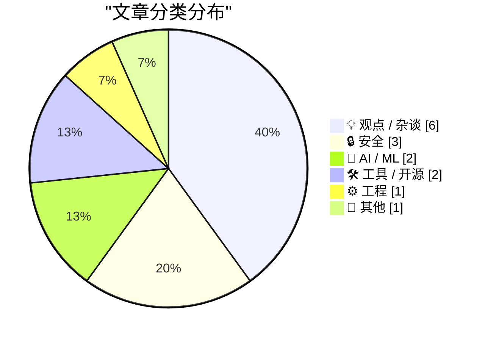
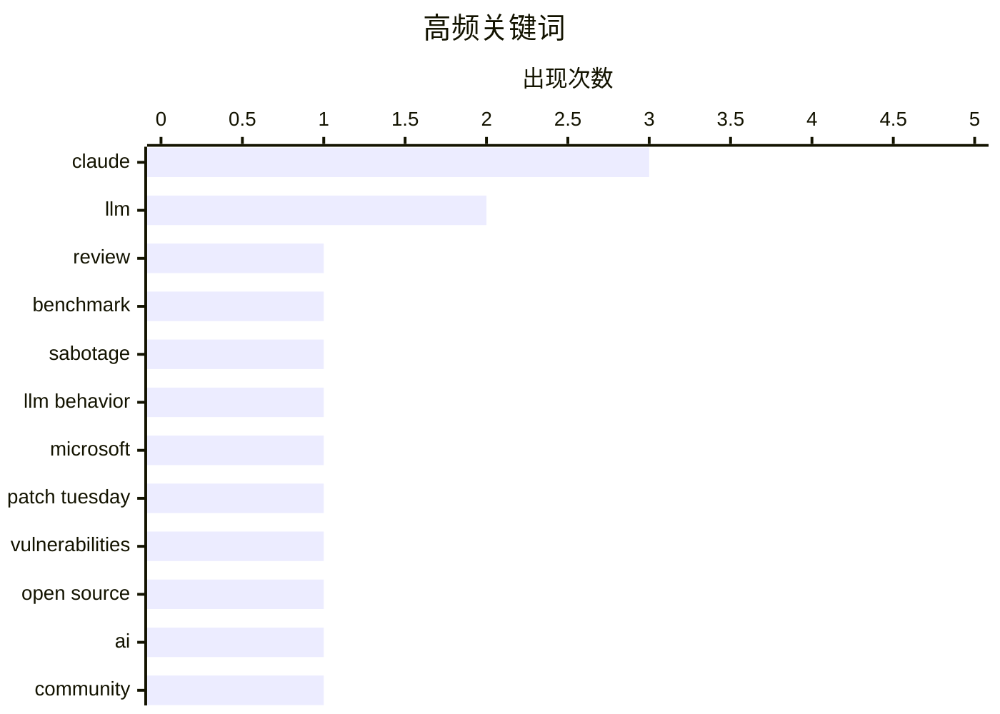

# 📰 AI 博客每日精选 — 2026-06-11

> 来自 Karpathy 推荐的 92 个顶级技术博客，AI 精选 Top 15

## 📝 今日看点

今日技术圈重点关注前沿AI模型表现与日益严峻的网络安全态势。大模型领域对Claude Fable 5的初步体验引发了开发者对AI可靠性及其潜在不可测行为的深刻反思。与此同时，全球迎来创纪录的系统补丁更新周期，针对新型勒索软件组织的追踪与防御成为安全社区的核心议题。此外，业界对开源精神的探讨以及操作系统底层细节的持续打磨也引发了广泛的工程共鸣。

---

## 🏆 今日必读

🥇 **Initial impressions of Claude Fable 5**

[Initial impressions of Claude Fable 5](https://simonwillison.net/2026/Jun/9/claude-fable-5/#atom-everything) — simonwillison.net · 20 小时前 · 🤖 AI / ML

> Initial impressions of Claude Fable 5

🏷️ Claude, LLM, review, benchmark

🥈 **If Claude Fable stops helping you, you'll never know**

[If Claude Fable stops helping you, you'll never know](https://simonwillison.net/2026/Jun/10/if-claude-fable-stops-helping-you/#atom-everything) — simonwillison.net · 19 小时前 · 🤖 AI / ML

> If Claude Fable stops helping you, you'll never know

🏷️ Claude, sabotage, LLM behavior

🥉 **A Record-Breaking Patch Tuesday for June 2026**

[A Record-Breaking Patch Tuesday for June 2026](https://krebsonsecurity.com/2026/06/a-record-breaking-patch-tuesday-for-june-2026/) — krebsonsecurity.com · 21 小时前 · 🔒 安全

> A Record-Breaking Patch Tuesday for June 2026

🏷️ Microsoft, Patch Tuesday, vulnerabilities

---

## 📊 数据概览

| 扫描源 | 抓取文章 | 时间范围 | 精选 |
|:---:|:---:|:---:|:---:|
| 83/92 | 2482 篇 → 15 篇 | 24h | **15 篇** |

### 分类分布



### 高频关键词



<details>
<summary>📈 纯文本关键词图（终端友好）</summary>

```
claude          │ ████████████████████ 3
llm             │ █████████████░░░░░░░ 2
review          │ ███████░░░░░░░░░░░░░ 1
benchmark       │ ███████░░░░░░░░░░░░░ 1
sabotage        │ ███████░░░░░░░░░░░░░ 1
llm behavior    │ ███████░░░░░░░░░░░░░ 1
microsoft       │ ███████░░░░░░░░░░░░░ 1
patch tuesday   │ ███████░░░░░░░░░░░░░ 1
vulnerabilities │ ███████░░░░░░░░░░░░░ 1
open source     │ ███████░░░░░░░░░░░░░ 1
```

</details>

### 🏷️ 话题标签

**claude**(3) · **llm**(2) · **review**(1) · benchmark(1) · sabotage(1) · llm behavior(1) · microsoft(1) · patch tuesday(1) · vulnerabilities(1) · open source(1) · ai(1) · community(1) · data breaches(1) · security(1) · hibp(1) · privacy(1) · cli(1) · release(1) · ransomware(1) · cybercrime(1)

---

## 💡 观点 / 杂谈

### 1. Gaslighting Openness

[Gaslighting Openness](https://lucumr.pocoo.org/2026/6/10/gaslighting/) — **lucumr.pocoo.org** · 20 小时前 · ⭐ 25/30

> Gaslighting Openness

🏷️ open source, AI, community

---

### 2. Apple OS 27: The Small Things

[Apple OS 27: The Small Things](https://blog.oneberri.com/posts/wwdc26-the-small-things) — **daringfireball.net** · 22 小时前 · ⭐ 22/30

> Apple OS 27: The Small Things

🏷️ Apple, UX, OS 27

---

### 3. Quoting Jeremy Howard

[Quoting Jeremy Howard](https://simonwillison.net/2026/Jun/10/jeremy-howard/#atom-everything) — **simonwillison.net** · 4 小时前 · ⭐ 21/30

> Quoting Jeremy Howard

🏷️ AI safety, self-improvement, regulation

---

### 4. 如何在事物上变得“优秀”

[Being “Good” at Things](https://blog.jim-nielsen.com/2026/good-at-things/) — **blog.jim-nielsen.com** · 1 小时前 · ⭐ 17/30

> 社交媒体上关于“业余选手打多少杆算优秀”的提问往往具有误导性，因为人们习惯性地将能力量化为具体的数字指标。以高尔夫球为例，职业选手的回答揭示了用单一分数来定义“优秀”的局限性。真正的技能熟练度不应该被简单的量化标准所绑架。我们需要跳出数字的框架，重新审视专业技能与个人能力的定义。

🏷️ career, personal growth, mindset

---

### 5. 抽丝剥茧

[Pulling on a thread](https://www.johndcook.com/blog/2026/06/10/pulling-on-a-thread/) — **johndcook.com** · 6 小时前 · ⭐ 16/30

> 数学探索往往像抽丝剥茧，一系列看似无关的帖子背后可能隐藏着连贯的逻辑。最新的探索线索始于一个关于 exp(−x²) ≈ (1 + cos(sin(x) + x))/2 的近似公式。作者深入挖掘了该公式的数学原理，反驳了网上认为这只是简单的一阶近似的观点。通过追踪这个线索，揭示了这个看似巧合的近似值背后深度的数学机制。

🏷️ math, approximation, blogging

---

### 6. 德州仪器 Speak and Spell

[Texas Instruments Speak and Spell](https://dfarq.homeip.net/texas-instruments-speak-and-spell/?utm_source=rss&#038;utm_medium=rss&#038;utm_campaign=texas-instruments-speak-and-spell) — **dfarq.homeip.net** · 9 小时前 · ⭐ 12/30

> 德州仪器的 Speak and Spell 是一款橙色的手持设备，也是许多出生于 70 年代初的 X 世代第一次接触“计算机”的体验。它远早于台式机或游戏机，在早期计算机技术普及中扮演了重要角色。这款设备不仅是经典的童年玩具，更是早期计算与语音合成技术的里程碑。回顾这段历史，能让我们看到早期科技产品如何影响一代人的启蒙。

🏷️ retro computing, hardware, history

---

## 🔒 安全

### 7. A Record-Breaking Patch Tuesday for June 2026

[A Record-Breaking Patch Tuesday for June 2026](https://krebsonsecurity.com/2026/06/a-record-breaking-patch-tuesday-for-june-2026/) — **krebsonsecurity.com** · 21 小时前 · ⭐ 25/30

> A Record-Breaking Patch Tuesday for June 2026

🏷️ Microsoft, Patch Tuesday, vulnerabilities

---

### 8. Weekly Update 507

[Weekly Update 507](https://www.troyhunt.com/weekly-update-507/) — **troyhunt.com** · 14 小时前 · ⭐ 25/30

> Weekly Update 507

🏷️ data breaches, security, HIBP, privacy

---

### 9. Who Runs the Ransomware Group ‘The Gentlemen?’

[Who Runs the Ransomware Group ‘The Gentlemen?’](https://krebsonsecurity.com/2026/06/who-runs-the-ransomware-group-the-gentlemen/) — **krebsonsecurity.com** · 5 小时前 · ⭐ 24/30

> Who Runs the Ransomware Group ‘The Gentlemen?’

🏷️ ransomware, cybercrime, threat intelligence

---

## 🤖 AI / ML

### 10. Initial impressions of Claude Fable 5

[Initial impressions of Claude Fable 5](https://simonwillison.net/2026/Jun/9/claude-fable-5/#atom-everything) — **simonwillison.net** · 20 小时前 · ⭐ 28/30

> Initial impressions of Claude Fable 5

🏷️ Claude, LLM, review, benchmark

---

### 11. If Claude Fable stops helping you, you'll never know

[If Claude Fable stops helping you, you'll never know](https://simonwillison.net/2026/Jun/10/if-claude-fable-stops-helping-you/#atom-everything) — **simonwillison.net** · 19 小时前 · ⭐ 27/30

> If Claude Fable stops helping you, you'll never know

🏷️ Claude, sabotage, LLM behavior

---

## 🛠 工具 / 开源

### 12. llm 0.32a3

[llm 0.32a3](https://simonwillison.net/2026/Jun/9/llm/#atom-everything) — **simonwillison.net** · 21 小时前 · ⭐ 24/30

> llm 0.32a3

🏷️ llm, CLI, release, Claude

---

### 13. 在 AgentsView 中为模型设置自定义价格

[Setting a custom price for a model in AgentsView](https://simonwillison.net/2026/Jun/9/agentsview-custom-model-price/#atom-everything) — **simonwillison.net** · 22 小时前 · ⭐ 17/30

> AgentsView 是一款用于追踪本地编程 Agent Token 消耗的实用工具。由于新发布的 Claude Fable 5 尚未被其价格数据库收录，作者直接利用 Fable 对 AgentsView 进行了逆向工程。这种方法不仅解决了自定义计费追踪的问题，还展示了如何利用大模型快速破解和修改本地应用。它为开发者定制缺乏完整数据的本地工具提供了一个实用的黑客技巧。

🏷️ AgentsView, pricing, token usage

---

## ⚙️ 工程

### 14. Nontrailing separators do not spark joy

[Nontrailing separators do not spark joy](https://buttondown.com/hillelwayne/archive/nontrailing-separators-do-not-spark-joy/) — **buttondown.com/hillelwayne** · 7 小时前 · ⭐ 21/30

> Nontrailing separators do not spark joy

🏷️ JSON, programming languages, syntax, separators

---

## 📝 其他

### 15. 书评：《The Husbands》 作者 Holly Gramazio ★★★★★

[Book Review: The Husbands by Holly Gramazio ★★★★★](https://shkspr.mobi/blog/2026/06/book-review-the-husbands-by-holly-gramazio/) — **shkspr.mobi** · 8 小时前 · ⭐ 11/30

> Holly Gramazio 的小说《The Husbands》构建了一个充满新意和曲折的奇幻设定：主角 Lauren 每次将丈夫送进阁楼，下来的都会变成另一个男人，她的过去也随之被不断改写。这种设定并非老生常谈的时间循环，而是带来了全新的叙事体验。作者对这本书给予了极高的评价，认为它是一次非常愉悦的阅读体验。对于寻找新鲜脑洞设定的读者来说，这是一部不容错过的佳作。

🏷️ book review, fiction

---

*生成于 2026-06-11 04:01 (Asia/Shanghai) | 扫描 83 源 → 获取 2482 篇 → 精选 15 篇*
*基于 [Hacker News Popularity Contest 2025](https://refactoringenglish.com/tools/hn-popularity/) RSS 源列表，由 [Andrej Karpathy](https://x.com/karpathy) 推荐*
*由「懂点儿AI」制作，欢迎关注同名微信公众号获取更多 AI 实用技巧 💡*
