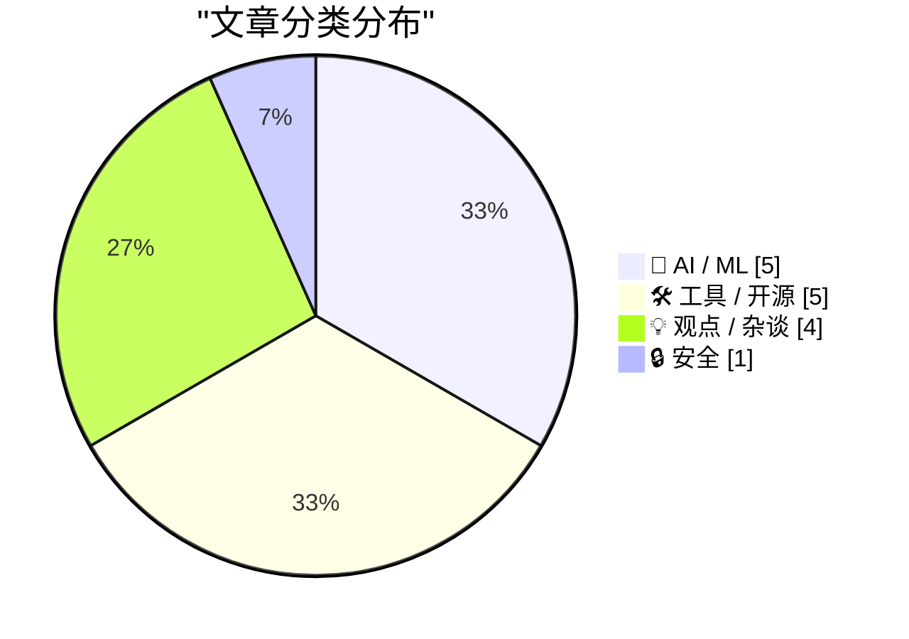
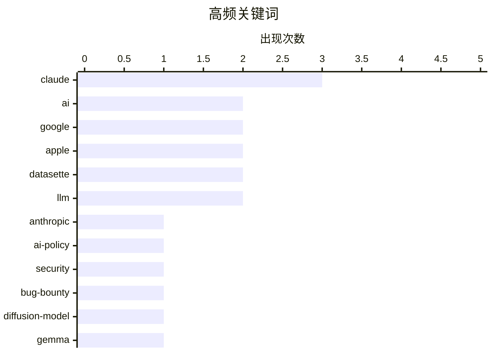

# 📰 AI 博客每日精选 — 2026-06-12

> 来自 Karpathy 推荐的 92 个顶级技术博客，AI 精选 Top 15

## 📝 今日看点

今日技术圈的核心焦点依然是人工智能的深度演进与跨界应用。一方面，AI 正在成为一把双刃剑，不仅能自动化挖掘巨额漏洞赏金，也引发了头部厂商在隐蔽安全策略上的巨大争议。另一方面，大模型与专业工具的融合愈发成熟，在数学证明和逻辑推理等硬核领域展现出强大实力。同时，科技巨头间的竞合步入新阶段，苹果与谷歌深化端侧 AI 合作，扩散模型在文本生成领域的回归也为底层架构提供了新思路。此外，开发者工具生态的持续迭代与系统 UI 体验的回归务实，也反映出技术社区对实用性的不懈追求。

---

## 🏆 今日必读

🥇 **Anthropic 撤回可能「破坏」AI 研究人员工作的 Claude 安全策略**

[Anthropic Walks Back Policy That Could Have ‘Sabotaged’ AI Researchers Using Claude](https://simonwillison.net/2026/Jun/11/anthropic-walks-back-policy/#atom-everything) — simonwillison.net · 16 小时前 · 🤖 AI / ML

> Anthropic 被曝在 Claude 中内置了名为 Fable 5 的隐蔽安全机制，可能干扰使用 Claude 进行前沿大模型开发的研究人员。该策略被 Wired 记者曝光后引发社区强烈反弹。Anthropic 随即发表声明宣布将这些安全措施改为可见模式，并承认在权衡中做出了错误决定、公开道歉。这一事件再次引发关于 AI 安全边界与开放研究之间如何平衡的行业讨论。

💡 **为什么值得读**: AI 安全策略从隐蔽转向透明，揭示了头部 AI 公司在安全与开放之间踩坑的真实案例，对理解行业治理走向有重要参考价值。

🏷️ Anthropic, Claude, AI-policy

🥈 **用 AI 黑入 Google：50 万美元的漏洞赏金之旅**

[Hacking Google with A.I. for $500,000](https://brutecat.com/articles/hacking-google-with-ai) — brutecat.com · 20 小时前 · 🔒 安全

> 作者将 AI 系统部署到 Google 整个基础设施上进行自动化安全审计，最终发现了约 1,500 个 API 和 3,600 个泄露的密钥。这一操作累计获得了 50 万美元的漏洞赏金。文章详细记录了利用 AI 大规模扫描、识别和利用安全漏洞的全过程。结果表明 AI 在自动化安全研究中的潜力远超传统方法。

💡 **为什么值得读**: 用 AI 做大规模自动化安全审计并拿到 50 万美元赏金的实战复盘，是 AI 赋能安全研究的标杆级案例。

🏷️ AI, security, bug-bounty, Google

🥉 **DiffusionGemma：Google 基于扩散模型的文本生成新方案**

[DiffusionGemma](https://simonwillison.net/2026/Jun/10/diffusiongemma/#atom-everything) — simonwillison.net · 1 天前 · 🤖 AI / ML

> Google 去年曾短暂发布实验性的 Gemini Diffusion 模型，预览阶段实测速度达到 857 tokens/秒，但随后再无消息。如今该研究以 DiffusionGemma 之名回归，将扩散模型架构应用于文本生成任务。这标志着 Google 在非自回归文本生成路线上的持续投入。DiffusionGemma 有望为高速文本推理提供新的技术路径。

💡 **为什么值得读**: 扩散模型从图像走向文本生成，857 tokens/秒的推理速度令人瞩目，是 LLM 推理加速方向的重要技术信号。

🏷️ diffusion-model, Gemma, text-generation

---

## 📊 数据概览

| 扫描源 | 抓取文章 | 时间范围 | 精选 |
|:---:|:---:|:---:|:---:|
| 82/92 | 2466 篇 → 16 篇 | 24h | **15 篇** |

### 分类分布



### 高频关键词



<details>
<summary>📈 纯文本关键词图（终端友好）</summary>

```
claude     │ ████████████████████ 3
ai         │ █████████████░░░░░░░ 2
google     │ █████████████░░░░░░░ 2
apple      │ █████████████░░░░░░░ 2
datasette  │ █████████████░░░░░░░ 2
llm        │ █████████████░░░░░░░ 2
anthropic  │ ███████░░░░░░░░░░░░░ 1
ai-policy  │ ███████░░░░░░░░░░░░░ 1
security   │ ███████░░░░░░░░░░░░░ 1
bug-bounty │ ███████░░░░░░░░░░░░░ 1
```

</details>

### 🏷️ 话题标签

**claude**(3) · **ai**(2) · **google**(2) · apple(2) · datasette(2) · llm(2) · anthropic(1) · ai-policy(1) · security(1) · bug-bounty(1) · diffusion-model(1) · gemma(1) · text-generation(1) · siri(1) · lean(1) · formal-verification(1) · release(1) · database(1) · ai-agent(1) · macos(1)

---

## 🤖 AI / ML

### 1. Anthropic 撤回可能「破坏」AI 研究人员工作的 Claude 安全策略

[Anthropic Walks Back Policy That Could Have ‘Sabotaged’ AI Researchers Using Claude](https://simonwillison.net/2026/Jun/11/anthropic-walks-back-policy/#atom-everything) — **simonwillison.net** · 16 小时前 · ⭐ 27/30

> Anthropic 被曝在 Claude 中内置了名为 Fable 5 的隐蔽安全机制，可能干扰使用 Claude 进行前沿大模型开发的研究人员。该策略被 Wired 记者曝光后引发社区强烈反弹。Anthropic 随即发表声明宣布将这些安全措施改为可见模式，并承认在权衡中做出了错误决定、公开道歉。这一事件再次引发关于 AI 安全边界与开放研究之间如何平衡的行业讨论。

🏷️ Anthropic, Claude, AI-policy

---

### 2. DiffusionGemma：Google 基于扩散模型的文本生成新方案

[DiffusionGemma](https://simonwillison.net/2026/Jun/10/diffusiongemma/#atom-everything) — **simonwillison.net** · 1 天前 · ⭐ 25/30

> Google 去年曾短暂发布实验性的 Gemini Diffusion 模型，预览阶段实测速度达到 857 tokens/秒，但随后再无消息。如今该研究以 DiffusionGemma 之名回归，将扩散模型架构应用于文本生成任务。这标志着 Google 在非自回归文本生成路线上的持续投入。DiffusionGemma 有望为高速文本推理提供新的技术路径。

🏷️ diffusion-model, Gemma, text-generation

---

### 3. Craig Federighi 详解 Apple 与 Google 在 Siri AI 上的合作

[Craig Federighi Details Apple’s Collaboration With Google for Siri AI — Live, on Stage](https://9to5mac.com/2026/06/08/craig-federighi-details-apples-collaboration-with-google-for-siri-ai-in-ios-27/) — **daringfireball.net** · 19 小时前 · ⭐ 24/30

> Apple 软件负责人 Craig Federighi 在 WWDC 后的新闻技术座谈会上，详细阐述了 iOS 27 中全新 Siri AI 的技术细节以及与 Google 的合作关系。Federighi 与 Google AI 副总裁 Amar Subramanya、Siri 负责人 Mike Rockwell 及软件 VP Sebastien Marineau-Mes 共同出席。这标志着 Apple 在 Siri 上放弃了纯自研路线，选择深度整合 Google 的 AI 能力。

🏷️ Apple, Siri, Google, AI

---

### 4. 用 Claude 和 Lean 对数学计算进行形式化证明

[Formally proving a calculation with Claude and Lean](https://www.johndcook.com/blog/2026/06/10/claude-and-lean/) — **johndcook.com** · 21 小时前 · ⭐ 23/30

> 作者测试了 Claude 能否为一段涉及傅里叶系数与贝塞尔函数的六行微积分推导生成 Lean 形式化证明代码。实验从包含 LaTeX 数学源码的页面出发，让 Claude 将非形式化的数学推理转化为机器可验证的 Lean 代码。结果展示了 LLM 辅助形式化数学验证的可行性与当前局限。这一实验为 AI 辅助定理证明的实际工作流提供了具体参考。

🏷️ Claude, Lean, formal-verification

---

### 5. 用 Claude 和 Prolog 解决国际象棋谜题

[Solving a chess puzzle with Claude and Prolog](https://www.johndcook.com/blog/2026/06/11/prolog-claude/) — **johndcook.com** · 7 小时前 · ⭐ 21/30

> 作者尝试用 Claude 配合 Prolog 来解决国际象棋谜题。Prolog 作为最早的逻辑编程语言，其核心优势在于能直接表达逻辑问题，但学习曲线陡峭。实验验证了 LLM 与 Prolog 结合的可行性：Claude 负责将自然语言描述的棋局转化为 Prolog 逻辑规则，Prolog 引擎则负责精确推理求解。这种组合为逻辑推理类问题提供了一种 LLM 单独难以胜任的可靠方案。

🏷️ Claude, Prolog, LLM, logic-programming

---

## 🛠 工具 / 开源

### 6. Datasette 1.0a33 发布

[datasette 1.0a33](https://simonwillison.net/2026/Jun/11/datasette/#atom-everything) — **simonwillison.net** · 4 小时前 · ⭐ 22/30

> Datasette 发布 1.0a33 版本，这是迈向稳定 1.0 的重要一步。该版本将自 1.0a3 起引入的 `?_extra=` 模式从表格查询扩展到了 SQL 查询和行级数据，统一了 JSON API 的扩展机制。这一改进使得用户可以通过统一的 URL 参数格式获取更丰富的关联数据。该版本的发布意味着 Datasette 1.0 正式版的 API 设计已基本定型。

🏷️ datasette, release, database

---

### 7. datasette-agent 0.2a0 发布

[datasette-agent 0.2a0](https://simonwillison.net/2026/Jun/10/datasette-agent/#atom-everything) — **simonwillison.net** · 20 小时前 · ⭐ 22/30

> datasette-agent 发布 0.2a0 版本，核心新功能是工具在执行过程中可以向用户提问。通过声明 `context` 参数，工具获得 `ToolContext` 对象，可调用 `await context.ask_user(...)` 发起是/否、多选或自由文本类型的交互。这使得 AI Agent 在执行复杂任务时能够在关键决策点暂停并获取人类反馈。该功能显著提升了 Agent 工作流的安全性和可控性。

🏷️ datasette, AI-agent, LLM

---

### 8. tea.xyz 发生了什么？

[What Happened to tea.xyz](https://nesbitt.io/2026/06/11/what-happened-to-tea.html) — **nesbitt.io** · 10 小时前 · ⭐ 20/30

> 探讨开源包管理器及加密项目 tea.xyz 的现状与走向。通过“解读茶叶”（阅读茶渣/预测未来）的隐喻，分析该项目在当前技术生态中的发展情况。作者试图揭开该项目背后的真实进展或面临的潜在困境。对于关注 Web3 与开发者工具交汇领域的读者来说，这是一次深度的现状复盘。

🏷️ tea.xyz, open-source, package-manager

---

### 9. asyncinject 0.7

[asyncinject 0.7](https://simonwillison.net/2026/Jun/11/asyncinject/#atom-everything) — **simonwillison.net** · 13 小时前 · ⭐ 18/30

> asyncinject 0.7 版本正式发布，这是一个支持 asyncio 依赖注入模式的 Python 工具库。作者在 Datasette 项目中应用了该库，并利用 Claude Fable 5 发现了其中的依赖缺陷。值得注意的是，AI 模型不仅找出了 Bug，还主动提供了修复方案，展现了极具前瞻性的 AI 辅助开发模式。这证明了 LLM 在代码维护和自动化调试环节的实用价值正在快速提升。

🏷️ asyncio, python, dependency-injection

---

### 10. 我的便携取暖器

[My Portable Heater](https://feed.tedium.co/link/15204/17359582/gigabyte-aorus-5060-ti-ai-box-egpu-review) — **tedium.co** · 16 小时前 · ⭐ 18/30

> 技嘉 AORUS RTX 5060 Ti AI Box 这款外置显卡（eGPU）在 Linux 系统下几乎无法正常工作，且运行时发热量巨大。该设备所基于的技术方案甚至已经被主流游戏玩家所抛弃。然而，作者却对这款产品表现出了极大的热情。这暗示了该 eGPU 在便携式 AI 计算或特定边缘计算场景下可能具有的独特应用价值。

🏷️ eGPU, Linux, hardware

---

## 💡 观点 / 杂谈

### 11. macOS 27 Golden Gate 移除了菜单项中的多余图标

[★ Sweet Jeebus, MacOS 27 Golden Gate Removes the Dumb Icons From Menu Items](https://daringfireball.net/2026/06/macos_27_golden_gate_removes_the_dumb_icons_from_menu_items) — **daringfireball.net** · 20 小时前 · ⭐ 22/30

> macOS 27（代号 Golden Gate）移除了菜单项中那些被广泛批评的多余图标，这是作者认为 WWDC 上最好的消息。作者认为 macOS Tahoe 中菜单项图标的设计是软件设计团队的败笔，此次移除证明 Apple 软件设计团队正在纠正此前的设计失误。这一细节变化被解读为 Apple 内部设计文化回归务实的信号。

🏷️ MacOS, UI-design, Apple

---

### 12. 世界已经向前走了——来自「衰退纪元」的笔记

[Pluralistic: The world has moved on (11 Jun 2026)](https://pluralistic.net/2026/06/11/lapsarianism/) — **pluralistic.net** · 5 小时前 · ⭐ 21/30

> Cory Doctorow 的日常链接汇总与评论专栏，主题围绕互联网平台「enshittification」（恶化衰退）现象展开。本期涵盖了版权钓鱼诉讼、去中心化网络建设、银行负利率争议、自行车道政策等多个话题。文章贯穿的核心观点是科技行业的制度性衰退已成事实，但世界并未停滞，人们正在寻找替代方案。作者同时列出了即将在洛杉矶、多伦多、纽约等多城市的公开活动安排。

🏷️ enshittification, tech-policy, internet

---

### 13. 拜托，用个链接吧！

[Please, use a link!](https://idiallo.com/blog/use-a-link-please) — **idiallo.com** · 23 小时前 · ⭐ 18/30

> 针对现代 Web 应用中滥用 JavaScript 拦截导航而导致浏览器原生功能失效的现象进行了强烈批评。作者在使用某内部工具时，点击浏览器后退按钮竟直接跳转到了默认标签页，而不是返回上一页。造成这种糟糕体验的根本原因在于开发者没有使用原生的 `<a>` 标签进行页面跳转。文章呼吁回归 Web 基础，尊重浏览器内置的导航历史栈机制。

🏷️ HTML, web-development, UX

---

### 14. 生物进化与信息获取

[Biological Evolution and Information Acquisition](https://www.construction-physics.com/p/biological-evolution-and-information) — **construction-physics.com** · 8 小时前 · ⭐ 17/30

> 将生物进化机制与经济学中的技术演进模型相联系，探讨复杂系统如何通过信息积累实现跃升。文章引用了经济学家 Brian Arthur 的技术进化模拟实验，展示了从简单的构建块（如 NAND 门）起步的过程。通过随机组合越来越有用的现有组件，该模拟最终演化出了极其复杂的电路（如 12 路 AND 门或 4 位加法器）。这种基于组合优化的进化路径，为理解生物演化如何获取和处理信息提供了全新的视角。

🏷️ evolution, simulation, complexity

---

## 🔒 安全

### 15. 用 AI 黑入 Google：50 万美元的漏洞赏金之旅

[Hacking Google with A.I. for $500,000](https://brutecat.com/articles/hacking-google-with-ai) — **brutecat.com** · 20 小时前 · ⭐ 27/30

> 作者将 AI 系统部署到 Google 整个基础设施上进行自动化安全审计，最终发现了约 1,500 个 API 和 3,600 个泄露的密钥。这一操作累计获得了 50 万美元的漏洞赏金。文章详细记录了利用 AI 大规模扫描、识别和利用安全漏洞的全过程。结果表明 AI 在自动化安全研究中的潜力远超传统方法。

🏷️ AI, security, bug-bounty, Google

---

*生成于 2026-06-12 04:22 (Asia/Shanghai) | 扫描 82 源 → 获取 2466 篇 → 精选 15 篇*
*基于 [Hacker News Popularity Contest 2025](https://refactoringenglish.com/tools/hn-popularity/) RSS 源列表，由 [Andrej Karpathy](https://x.com/karpathy) 推荐*
*由「懂点儿AI」制作，欢迎关注同名微信公众号获取更多 AI 实用技巧 💡*
