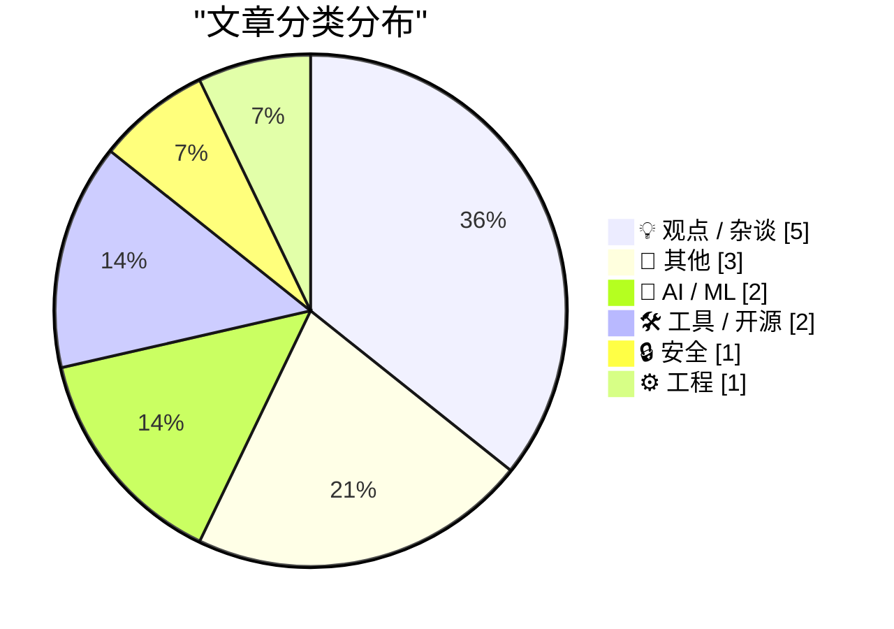
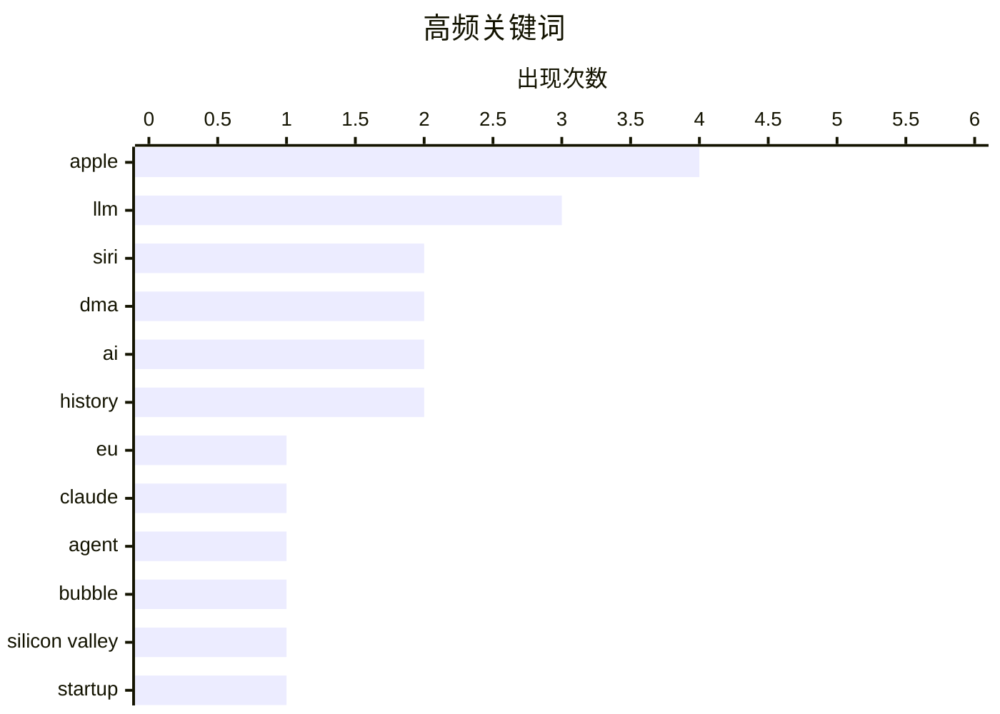

# 📰 AI 博客每日精选 — 2026-06-13

> 来自 Karpathy 推荐的 92 个顶级技术博客，AI 精选 Top 14

## 📝 今日看点

今日技术圈的核心焦点集中在AI行业的泡沫隐忧与监管博弈上。随着生成式AI巨额亏损与变现困难的现状被不断曝光，业界对该领域的财务逻辑与可持续性产生强烈质疑，甚至引发开发者群体对大模型生成代码质量的集体反思与抵制。与此同时，苹果与欧盟委员会因《数字市场法案》在Siri AI落地问题上展开激烈交锋，凸显出科技巨头在推进AI应用时面临的严峻合规阻力。此外，苹果Mac生态的实用功能更新与网络安全漏洞披露的标准化建设也在稳步推进。

---

## 🏆 今日必读

🥇 **Apple：“因 DMA 限制，Siri AI 在欧盟的 iOS 27 和 iPadOS 27 上将延期推出”**

[Apple: ‘Due to DMA, Siri AI Delayed in EU for iOS 27 and iPadOS 27’](https://www.apple.com/newsroom/2026/06/due-to-dma-siri-ai-delayed-in-eu-for-ios-27-and-ipados-27/) — daringfireball.net · 21 小时前 · 🤖 AI / ML

> Apple 宣布因欧盟《数字市场法案》(DMA) 的严格要求，将推迟在欧盟地区的 iOS 27 和 iPadOS 27 上线 Siri AI。Apple 声称 DMA 要求赋予 AI 系统几乎不受限的设备访问权限，包括自主读取发送消息、访问文件和跨应用执行操作，且无需用户持续监控。由于安全研究人员已证明 AI 系统可能被劫持以窃取个人数据，Apple 认为该法规目前无法让其安全地推出该功能。这反映了前沿 AI 功能与欧洲严格监管环境之间的深刻冲突。

💡 **为什么值得读**: 了解 Apple 在欧盟推迟发布 Siri AI 的官方安全解释及其对 DMA 法规的反感态度。

🏷️ Siri, DMA, Apple, EU

🥈 **Claude Fable：极具主动性的 AI 模型**

[Claude Fable is relentlessly proactive](https://simonwillison.net/2026/Jun/11/fable-is-relentlessly-proactive/#atom-everything) — simonwillison.net · 20 小时前 · 🤖 AI / ML

> Simon Willison 在体验 Claude Fable 5 两天后，认为其最大特点是“极具主动性”。该模型掌握了大量技巧，并会不遗余力地利用这些技巧来实现既定目标。作者通过开发 Datasette Agent 时的实际案例，展示了 Claude Fable 如何主动解决代码中出现的意外故障。这种不达目的誓不罢休的特性，使其在编程辅助中表现出极高的执行效率。

💡 **为什么值得读**: 通过真实开发案例了解 Claude Fable 5 模型在编程任务中展现出的超强主动性和问题解决能力。

🏷️ Claude, LLM, agent

🥉 **深度分析：硅谷泡沫（第一部分）**

[Premium: The Silicon Valley Bubble (Part 1)](https://www.wheresyoured.at/premium-the-silicon-valley-bubble-part-1/) — wheresyoured.at · 2 小时前 · 💡 观点 / 杂谈

> 硅谷当前的 AI 热潮可能正接近尾声，OpenAI 和 Anthropic 均已提交上市申请以寻求退出流动性。这两家公司每年烧掉数十亿美元，且目前都看不到盈利的希望。作者认为这种缺乏可持续商业模式却急于上市的现象，标志着科技行业的巨大泡沫即将破裂。这场由资本驱动的狂欢最终将由在 IPO 中接盘的散户投资者买单。

💡 **为什么值得读**: 提供对 OpenAI 和 Anthropic 等 AI 巨头急于 IPO 背后财务风险的尖锐批评和宏观视角。

🏷️ AI, bubble, Silicon Valley, startup

---

## 📊 数据概览

| 扫描源 | 抓取文章 | 时间范围 | 精选 |
|:---:|:---:|:---:|:---:|
| 82/92 | 2472 篇 → 14 篇 | 24h | **14 篇** |

### 分类分布



### 高频关键词



<details>
<summary>📈 纯文本关键词图（终端友好）</summary>

```
apple   │ ████████████████████ 4
llm     │ ███████████████░░░░░ 3
siri    │ ██████████░░░░░░░░░░ 2
dma     │ ██████████░░░░░░░░░░ 2
ai      │ ██████████░░░░░░░░░░ 2
history │ ██████████░░░░░░░░░░ 2
eu      │ █████░░░░░░░░░░░░░░░ 1
claude  │ █████░░░░░░░░░░░░░░░ 1
agent   │ █████░░░░░░░░░░░░░░░ 1
bubble  │ █████░░░░░░░░░░░░░░░ 1
```

</details>

### 🏷️ 话题标签

**apple**(4) · **llm**(3) · **siri**(2) · dma(2) · ai(2) · history(2) · eu(1) · claude(1) · agent(1) · bubble(1) · silicon valley(1) · startup(1) · regulation(1) · ai coding(1) · productivity(1) · coding(1) · programming(1) · mac(1) · remote(1) · cve(1)

---

## 💡 观点 / 杂谈

### 1. 深度分析：硅谷泡沫（第一部分）

[Premium: The Silicon Valley Bubble (Part 1)](https://www.wheresyoured.at/premium-the-silicon-valley-bubble-part-1/) — **wheresyoured.at** · 2 小时前 · ⭐ 25/30

> 硅谷当前的 AI 热潮可能正接近尾声，OpenAI 和 Anthropic 均已提交上市申请以寻求退出流动性。这两家公司每年烧掉数十亿美元，且目前都看不到盈利的希望。作者认为这种缺乏可持续商业模式却急于上市的现象，标志着科技行业的巨大泡沫即将破裂。这场由资本驱动的狂欢最终将由在 IPO 中接盘的散户投资者买单。

🏷️ AI, bubble, Silicon Valley, startup

---

### 2. 欧盟委员会回应 Siri AI 与 DMA 争议

[The European Commission Response to Siri AI and the DMA](https://www.linkedin.com/posts/thomas-regnier-24a05810b_what-is-the-true-story-behind-apples-decision-activity-7470439874664280064-TuEt) — **daringfireball.net** · 2 小时前 · ⭐ 24/30

> 欧盟委员会发言人 Thomas Regnier 驳斥了 Apple 关于 DMA 导致 Siri AI 延期的说法，强调这是 Apple 自己的决定。他明确表示 DMA 绝没有禁止 Apple 在欧盟推出新功能。欧盟确实与 Apple 进行过沟通，但 Apple 选择不提供符合规定的解决方案，而是直接拒绝上线该功能。这表明 Apple 的声明更多是出于规避合规成本和向监管机构施压的公关策略。

🏷️ Siri, DMA, regulation, Apple

---

### 3. 我拒绝成为“反向半人马”

[I Am Not a Reverse Centaur](https://blog.miguelgrinberg.com/post/i-am-not-a-reverse-centaur) — **miguelgrinberg.com** · 10 小时前 · ⭐ 24/30

> 开发者 Miguel Grinberg 坚持认为 LLM 编程工具对他无效，他的这一立场在过去一年中并未改变。令他苦恼的是，他现在收到的大量开源项目贡献几乎都是由 AI 生成的低质量代码。他拒绝花时间去审查这些机器生成的代码，认为这破坏了开源协作的本质。这种“反向半人马”（即人类沦为 AI 代码审查工具）的模式严重违背了软件工程的初衷。

🏷️ AI coding, LLM, productivity

---

### 4. 为什么我无法完全接受用 LLM 写代码

[I can never fully embrace LLMs for code](https://idiallo.com/blog/i-can-never-embrace-llms-to-write-code) — **idiallo.com** · 7 小时前 · ⭐ 22/30

> 作者通过教导计算机专业妹妹编程的经历指出，在不理解代码逻辑的情况下盲目信任和使用代码是极其危险的。如今的 LLM 编程工具恰恰鼓励了这种黑盒式的开发习惯，让开发者像调用经过审查的库一样使用生成的代码。然而，LLM 生成的代码并未经过严格的测试和验证，其可靠性远低于标准库。过度依赖它会导致开发者失去对底层逻辑的掌控力，最终引发严重的技术债。

🏷️ LLM, coding, programming

---

### 5. 引用 Andrew Singleton：AI 经济学傻瓜指南

[Quoting Andrew Singleton](https://simonwillison.net/2026/Jun/12/andrew-singleton/#atom-everything) — **simonwillison.net** · 1 小时前 · ⭐ 17/30

> 作者引用了一段来自 McSweeney's 的讽刺寓言，生动揭示了当前生成式 AI 行业荒谬的财务逻辑。故事中，投资者向焚化炉厂投资 200 亿美元换取 5% 股份，厂长将一半资金烧掉，并用另一半向投资者购买燃料继续烧钱，最后投资者却报告了巨额的 AI 投资回报。这段隐喻直指当前 AI 公司通过烧钱和内部循环制造虚假繁荣的经济学骗局。整个行业正在这种自欺欺人的泡沫中走向失控。

🏷️ AI, economics, satire

---

## 📝 其他

### 6. WWDC 2026 主题演讲与国情咨文 YouTube 视频资源

[The WWDC 2026 Keynote and State of the Union on YouTube](https://www.youtube.com/watch?v=hF8swzNR1-o) — **daringfireball.net** · 2 小时前 · ⭐ 18/30

> Apple 开发者应用允许下载 WWDC 2026 的所有会议视频，唯独不提供主题演讲的本地下载，但用户可以通过 YouTube 获取该视频。长达一个多小时的“国情咨文”(State of the Union) 会议也提供了一个 4.5 分钟的精简版回顾。作者建议如果没时间看完整版，至少应该看看这个精简的总结视频。这为想要快速获取大会核心信息的开发者提供了极大的便利。

🏷️ WWDC, Apple, video

---

### 7. 本周《模拟古董家》

[This Week on The Analog Antiquarian](https://www.filfre.net/2026/06/this-week-on-the-analog-antiquarian/) — **filfre.net** · 3 小时前 · ⭐ 12/30

> 《模拟古董家》栏目本周推出第二期内容，聚焦莎士比亚的历史剧《亨利六世》第一部。该栏目以深度解析的方式重新审视经典文学作品。通过对这部历史剧的细致分析，为读者提供了新的文学视角。

🏷️ history, literature, analog

---

### 8. 斯皮尔伯格谈多次被拒绝执导007电影

[Spielberg on Being Repeatedly Turned Down to Direct a James Bond Film](https://www.youtube.com/watch?v=iEho3brGB64) — **daringfireball.net** · 23 小时前 · ⭐ 9/30

> Steven Spielberg在YouTube节目上透露，他曾多次尝试执导007电影但均遭拒绝。《大白鲨》大获成功后，他主动联系制片人Cubby Broccoli表示愿意执导，但直接被拒绝。后来《第三类接触》上映成为爆款后，Broccoli主动联系了他，但最终斯皮尔伯格仍然未能执导任何一部007电影。这段经历揭示了即使是顶级导演也会遭遇职业挫折。

🏷️ movie, Spielberg, James Bond

---

## 🤖 AI / ML

### 9. Apple：“因 DMA 限制，Siri AI 在欧盟的 iOS 27 和 iPadOS 27 上将延期推出”

[Apple: ‘Due to DMA, Siri AI Delayed in EU for iOS 27 and iPadOS 27’](https://www.apple.com/newsroom/2026/06/due-to-dma-siri-ai-delayed-in-eu-for-ios-27-and-ipados-27/) — **daringfireball.net** · 21 小时前 · ⭐ 27/30

> Apple 宣布因欧盟《数字市场法案》(DMA) 的严格要求，将推迟在欧盟地区的 iOS 27 和 iPadOS 27 上线 Siri AI。Apple 声称 DMA 要求赋予 AI 系统几乎不受限的设备访问权限，包括自主读取发送消息、访问文件和跨应用执行操作，且无需用户持续监控。由于安全研究人员已证明 AI 系统可能被劫持以窃取个人数据，Apple 认为该法规目前无法让其安全地推出该功能。这反映了前沿 AI 功能与欧洲严格监管环境之间的深刻冲突。

🏷️ Siri, DMA, Apple, EU

---

### 10. Claude Fable：极具主动性的 AI 模型

[Claude Fable is relentlessly proactive](https://simonwillison.net/2026/Jun/11/fable-is-relentlessly-proactive/#atom-everything) — **simonwillison.net** · 20 小时前 · ⭐ 25/30

> Simon Willison 在体验 Claude Fable 5 两天后，认为其最大特点是“极具主动性”。该模型掌握了大量技巧，并会不遗余力地利用这些技巧来实现既定目标。作者通过开发 Datasette Agent 时的实际案例，展示了 Claude Fable 如何主动解决代码中出现的意外故障。这种不达目的誓不罢休的特性，使其在编程辅助中表现出极高的执行效率。

🏷️ Claude, LLM, agent

---

## 🛠 工具 / 开源

### 11. 你终于可以远程开机 Mac 了

[You can finally power on a Mac remotely](https://www.jeffgeerling.com/blog/2026/power-on-your-mac-remotely/) — **jeffgeerling.com** · 5 小时前 · ⭐ 19/30

> Apple 在 macOS 26.5 更新中终于允许用户在不按物理电源键的情况下远程唤醒 Mac。这一新功能被外界广泛认为是对此前 Mac mini 电源键位置设计遭到大量抱怨的直接回应。用户现在可以通过网络指令或智能家居开关直接控制 Mac 的电源状态。这极大提升了将 Mac 作为无头机和家庭服务器使用的体验。

🏷️ Mac, remote, Apple

---

### 12. 设备评测：TP-Link EH210 以太网分线器（USB-C）★★★★★

[Gadget Review: TP Link EH210 Ethernet Splitter (USB-C) ★★★★★](https://shkspr.mobi/blog/2026/06/gadget-review-tp-link-eh210-ethernet-splitter-usb-c/) — **shkspr.mobi** · 8 小时前 · ⭐ 12/30

> TP-Link EH210是一款USB-C接口的以太网分线器，获得了满分5星评价。作者在家中各房间铺设了CAT6网线，但大多数房间只有少量联网设备，不需要大型多口交换机。这款紧凑型分线器为低密度使用场景提供了简洁高效的网络扩展方案。产品特别适合只有一两台设备需要有线连接的房间使用。

🏷️ Ethernet, gadget, hardware

---

## 🔒 安全

### 13. 漏洞命名与披露的联合指南

[Joint Guidance on Vulnerability Naming and Disclosure](https://nesbitt.io/2026/06/12/joint-guidance-on-vulnerability-naming-and-disclosure.html) — **nesbitt.io** · 9 小时前 · ⭐ 19/30

> 安全社区针对漏洞的命名与披露机制推出了新的联合指南。现在，每一个被命名的 CVE 漏洞都会自动分配一个 `.vuln` 域名的单页网站。这一举措旨在为安全研究人员和开发者提供一个标准化的漏洞信息查询入口。新的域名系统将极大简化追踪和确认安全漏洞的整个流程。

🏷️ CVE, vulnerability, disclosure

---

## ⚙️ 工程

### 14. Intel奔腾处理器的FDIV缺陷与召回

[Intel’s Pentium FDIV bug and recall](https://dfarq.homeip.net/the-pentium-fdiv-bug-and-recall/?utm_source=rss&#038;utm_medium=rss&#038;utm_campaign=the-pentium-fdiv-bug-and-recall) — **dfarq.homeip.net** · 8 小时前 · ⭐ 14/30

> 1994年6月，一位数学教授发现Intel新款奔腾CPU存在除法运算缺陷。奔腾处理器虽然运行速度快，但在特定浮点除法运算中会产生错误结果，该缺陷被命名为FDIV bug。这一发现最终迫使Intel召回了数百万块处理器，成为计算机硬件史上最著名的产品缺陷事件之一。这次事件对Intel造成了巨大的财务损失和品牌信任危机。

🏷️ Intel, CPU, bug, history

---

*生成于 2026-06-13 03:40 (Asia/Shanghai) | 扫描 82 源 → 获取 2472 篇 → 精选 14 篇*
*基于 [Hacker News Popularity Contest 2025](https://refactoringenglish.com/tools/hn-popularity/) RSS 源列表，由 [Andrej Karpathy](https://x.com/karpathy) 推荐*
*由「懂点儿AI」制作，欢迎关注同名微信公众号获取更多 AI 实用技巧 💡*
