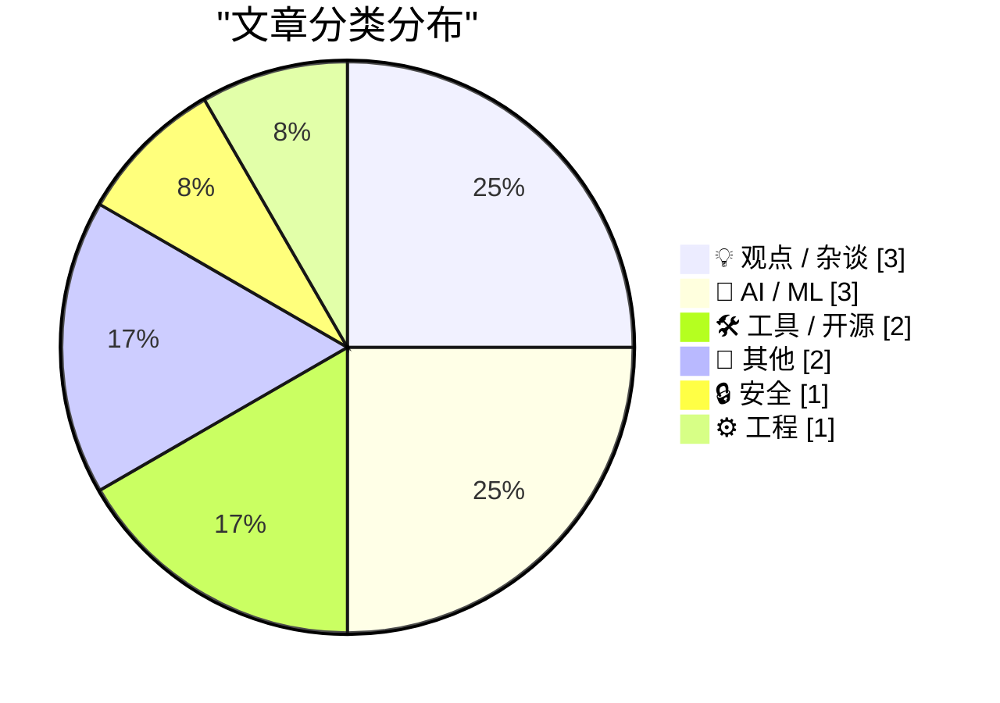
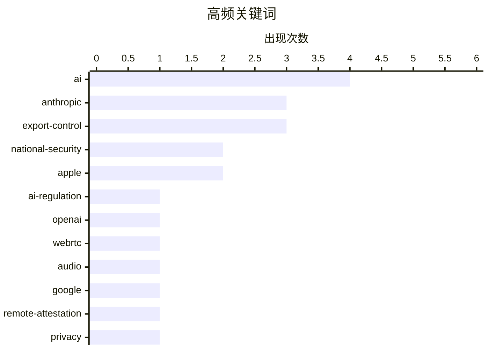

# 📰 AI 博客每日精选 — 2026-06-14

> 来自 Karpathy 推荐的 92 个顶级技术博客，AI 精选 Top 12

## 📝 今日看点

今日技术圈的核心焦点集中在前沿AI的地缘政治博弈与科技巨头生态的强势收紧。美国政府以国家安全为由对Anthropic下达严厉的出口管制，全面切断非美籍用户对其核心大模型的访问权限，引发业界对AI技术壁垒的强烈担忧。与此同时，苹果虽宣布向小型开发者免费开放私有云计算，却附带了极为苛刻的门槛限制，而谷歌的新远程证明方案也因过度控制饱受批评。在底层开发工具持续迭代之外，业界亦开始深刻反思现代科技企业中泛滥的“股东至上”理念与“先知型CEO”现象。

---

## 🏆 今日必读

🥇 **仅供美国人使用的危险技术**

[Dangerous Technology For Americans Only](https://lucumr.pocoo.org/2026/6/13/americans-only/) — lucumr.pocoo.org · 18 小时前 · 💡 观点 / 杂谈

> 美国政府以国家安全为由对 Anthropic 下达出口管制指令，要求暂停向所有外国公民提供 Fable 和 Mythos 模型的访问权限。由于 Anthropic 此前曾多次强调其自身技术具有危险性并主动呼吁严格监管，此次政府的实质性限制措施在社交媒体上引发了广泛的嘲讽。政府将他们自己的“危险论”框架当真并实施了管控，导致 Anthropic 不得不全面关闭相关服务。这凸显了 AI 公司在进行安全营销与面对实际监管后果时所产生的巨大反差与尴尬。

💡 **为什么值得读**: 展示了 AI 公司主动呼吁监管后，意外遭遇政府实质性技术封锁的真实案例与行业反应。

🏷️ Anthropic, AI-regulation, export-control

🥈 **美国政府以国家安全为由指示 Anthropic 关闭 Fable 5 和 Mythos 5 模型**

[U.S. Government Directs Anthropic to Shut Down Fable 5 and Mythos 5 Models on National Security Grounds](https://www.anthropic.com/news/fable-mythos-access) — daringfireball.net · 1 小时前 · 🤖 AI / ML

> 美国政府向 Anthropic 下达出口管制指令，要求暂停任何外国公民（包括 Anthropic 内部的非美籍员工）对 Fable 5 和 Mythos 5 模型的访问权限。为确保完全合规，Anthropic 被迫突然为所有客户全面禁用这两款模型。不过，该指令并未影响 Anthropic 其他模型的正常访问。这一突发事件标志着 AI 出口管制已经从政策讨论直接转变为对前沿模型访问的硬性切断。

💡 **为什么值得读**: 了解 AI 领域首批因国家安全原因被强制切断服务的前沿模型事件及官方声明细节。

🏷️ Anthropic, AI, export-control, national-security

🥉 **关于美国政府暂停 Fable 5 和 Mythos 5 访问权限指令的声明**

[Statement on the US government directive to suspend access to Fable 5 and Mythos 5](https://simonwillison.net/2026/Jun/13/us-government-directive-to-suspend-access/#atom-everything) — simonwillison.net · 17 小时前 · 🤖 AI / ML

> 知名技术博主 Simon Willison 对美国政府要求 Anthropic 暂停 Fable 5 和 Mythos 5 模型访问权限的指令表示极度震惊。该指令强制要求暂停所有外国国民（包括 Anthropic 员工）的访问，导致 Anthropic 必须全面停用这两款模型以遵守规定。这一突发事件引发了业界对 AI 模型出口管制突然收紧的广泛关注与热烈讨论。

💡 **为什么值得读**: 科技圈知名博主对突发 AI 模型封锁事件的即时反应与核心信息提炼。

🏷️ Anthropic, AI, export-control, national-security

---

## 📊 数据概览

| 扫描源 | 抓取文章 | 时间范围 | 精选 |
|:---:|:---:|:---:|:---:|
| 82/92 | 2466 篇 → 12 篇 | 24h | **12 篇** |

### 分类分布



### 高频关键词



<details>
<summary>📈 纯文本关键词图（终端友好）</summary>

```
ai                │ ████████████████████ 4
anthropic         │ ███████████████░░░░░ 3
export-control    │ ███████████████░░░░░ 3
national-security │ ██████████░░░░░░░░░░ 2
apple             │ ██████████░░░░░░░░░░ 2
ai-regulation     │ █████░░░░░░░░░░░░░░░ 1
openai            │ █████░░░░░░░░░░░░░░░ 1
webrtc            │ █████░░░░░░░░░░░░░░░ 1
audio             │ █████░░░░░░░░░░░░░░░ 1
google            │ █████░░░░░░░░░░░░░░░ 1
```

</details>

### 🏷️ 话题标签

**ai**(4) · **anthropic**(3) · **export-control**(3) · national-security(2) · apple(2) · ai-regulation(1) · openai(1) · webrtc(1) · audio(1) · google(1) · remote-attestation(1) · privacy(1) · security(1) · package management(1) · releases(1) · advisories(1) · private-cloud-compute(1) · developers(1) · intel(1) · 8087(1)

---

## 💡 观点 / 杂谈

### 1. 仅供美国人使用的危险技术

[Dangerous Technology For Americans Only](https://lucumr.pocoo.org/2026/6/13/americans-only/) — **lucumr.pocoo.org** · 18 小时前 · ⭐ 25/30

> 美国政府以国家安全为由对 Anthropic 下达出口管制指令，要求暂停向所有外国公民提供 Fable 和 Mythos 模型的访问权限。由于 Anthropic 此前曾多次强调其自身技术具有危险性并主动呼吁严格监管，此次政府的实质性限制措施在社交媒体上引发了广泛的嘲讽。政府将他们自己的“危险论”框架当真并实施了管控，导致 Anthropic 不得不全面关闭相关服务。这凸显了 AI 公司在进行安全营销与面对实际监管后果时所产生的巨大反差与尴尬。

🏷️ Anthropic, AI-regulation, export-control

---

### 2. ★ The Talk Show：WWDC 2026 现场直击

[★ The Talk Show: Live From WWDC 2026](https://daringfireball.net/2026/06/the_talk_show_live_from_wwdc_2026) — **daringfireball.net** · 19 小时前 · ⭐ 20/30

> 知名科技播客《The Talk Show》在 2026 年 6 月 9 日于圣何塞加州剧院进行了 WWDC 2026 的现场录制。节目主持人 John Gruber 邀请了 Joanna Stern 和 Nilay Patel 作为特邀嘉宾，深入探讨了苹果在 WWDC 2026 大会上发布的一系列重要公告。这期现场节目集中展现了科技界核心媒体人对苹果最新战略、产品发布以及生态系统更新的多维度专业解读。听众可以通过这场深度对谈，快速把握 WWDC 2026 的核心看点与行业反馈。

🏷️ Apple, WWDC, podcast

---

### 3. Pluralistic：股东至上与“先知”CEO

[Pluralistic: Shareholder supremacy and the precog CEO (13 Jun 2026)](https://pluralistic.net/2026/06/13/minority-shareholder-report/) — **pluralistic.net** · 1 小时前 · ⭐ 19/30

> Cory Doctorow 探讨了现代企业管理中“股东至上”理念与“先知型 CEO（precog CEO）”现象的深层问题。文章指出，企业往往利用一种无法证伪的界线测试来包装 CEO 的决策，使其看似具有预测未来的能力，从而掩盖了企业内部权力过度集中的本质。这种机制实际上加剧了少数股东与管理层之间的矛盾，并将企业引向以短期股价为导向的短视运作模式。作者批判了这种将 CEO 神化的商业文化，呼吁重新审视公司的治理结构与真正的责任归属。

🏷️ corporate-governance, tech-industry, shareholders

---

## 🤖 AI / ML

### 4. 美国政府以国家安全为由指示 Anthropic 关闭 Fable 5 和 Mythos 5 模型

[U.S. Government Directs Anthropic to Shut Down Fable 5 and Mythos 5 Models on National Security Grounds](https://www.anthropic.com/news/fable-mythos-access) — **daringfireball.net** · 1 小时前 · ⭐ 24/30

> 美国政府向 Anthropic 下达出口管制指令，要求暂停任何外国公民（包括 Anthropic 内部的非美籍员工）对 Fable 5 和 Mythos 5 模型的访问权限。为确保完全合规，Anthropic 被迫突然为所有客户全面禁用这两款模型。不过，该指令并未影响 Anthropic 其他模型的正常访问。这一突发事件标志着 AI 出口管制已经从政策讨论直接转变为对前沿模型访问的硬性切断。

🏷️ Anthropic, AI, export-control, national-security

---

### 5. 关于美国政府暂停 Fable 5 和 Mythos 5 访问权限指令的声明

[Statement on the US government directive to suspend access to Fable 5 and Mythos 5](https://simonwillison.net/2026/Jun/13/us-government-directive-to-suspend-access/#atom-everything) — **simonwillison.net** · 17 小时前 · ⭐ 23/30

> 知名技术博主 Simon Willison 对美国政府要求 Anthropic 暂停 Fable 5 和 Mythos 5 模型访问权限的指令表示极度震惊。该指令强制要求暂停所有外国国民（包括 Anthropic 员工）的访问，导致 Anthropic 必须全面停用这两款模型以遵守规定。这一突发事件引发了业界对 AI 模型出口管制突然收紧的广泛关注与热烈讨论。

🏷️ Anthropic, AI, export-control, national-security

---

### 6. 苹果私有云计算对第三方开发者有严格限制

[Apple’s Private Cloud Compute Is Severely Limited for Third-Party Developers](https://developer.apple.com/private-cloud-compute/) — **daringfireball.net** · 1 小时前 · ⭐ 21/30

> 苹果宣布其私有云计算（PCC）平台上的基础模型将对符合条件的小型开发者免费开放，不收取任何云端 API 费用。然而，该政策有着严格的限制：仅限 App Store 小型企业计划中首次下载量少于 200 万次的开发者可用。尽管 PCC 承诺提供具有顶级隐私保护的前沿 AI 算力，但其较高的使用门槛表明苹果并未打算将其作为广泛的第三方云端算力平台。这一策略反映出苹果在 AI 算力分配上优先扶持小型应用，同时限制大规模 API 调用的意图。

🏷️ Apple, Private-Cloud-Compute, AI, developers

---

## 🛠 工具 / 开源

### 7. OpenAI WebRTC 音频会话：现已支持文档上下文

[OpenAI WebRTC Audio Session, now with document context](https://simonwillison.net/2026/Jun/12/openai-webrtc/#atom-everything) — **simonwillison.net** · 19 小时前 · ⭐ 22/30

> Simon Willison 更新了其开发的 OpenAI WebRTC 音频会话工具，引入了全新的文档上下文功能。该工具最初于 2024 年 12 月推出，用于测试 OpenAI 实时音频模型 API，现已适配上个月发布的最新模型。通过集成文档上下文，用户可以在实时语音交互中直接基于特定文档内容进行问答与处理。这极大拓展了 WebRTC 在实时 AI 语音助手场景下的实用性与功能边界。

🏷️ OpenAI, WebRTC, audio, AI

---

### 8. 包管理周报：2026年6月13日

[This Week in Package Management: 13 June 2026](https://nesbitt.io/2026/06/13/this-week-in-package-management.html) — **nesbitt.io** · 8 小时前 · ⭐ 22/30

> 本周包管理周报汇总了全球各大包管理器生态系统的最新动态。内容涵盖了主流编程语言包管理器的版本发布信息、关键的安全漏洞建议以及社区内的深度技术文章。通过这一汇总，开发者可以快速追踪依赖项管理工具的更新节奏与安全态势。这为维护项目依赖和跟进开源生态系统演进提供了极具价值的参考。

🏷️ package management, releases, advisories

---

## 📝 其他

### 9. 特朗普的名字（当然，字体也用错了）已从肯尼迪艺术中心被移除

[Trump’s Name (Set in the Wrong Font, of Course) Has Been Removed From the Kennedy Center](https://apple.news/ANLNtQOeuSkiJ35tzkYw9oA) — **daringfireball.net** · 1 小时前 · ⭐ 10/30

> 肯尼迪艺术中心在联邦法官裁定其董事会更名行为违法后，最终连夜移除了特朗普总统的署名。凌晨 3 点左右，施工人员开始从表演艺术场馆的正面拆除该名字。这一拆除行动实际上已经错过了联邦法官此前下达的两周最后期限数小时。作者将这一充满戏剧性且略显滞后的物理移除过程，视为未来一系列清理与纠错工作的“完美隐喻”。

🏷️ politics, Kennedy-Center

---

### 10. 阅读清单 2026年6月13日

[Reading List 06/13/2026](https://www.construction-physics.com/p/reading-list-06132026) — **construction-physics.com** · 6 小时前 · ⭐ 9/30

> 本期阅读清单汇总了多个极具前沿性与争议性的全球大型工程与建筑项目。内容详细涵盖了将住宅建在图书馆上方的新型空间利用方案，以及爱国者导弹的复杂制造过程。清单还关注了美国试图重启新燃煤电厂的产业努力，并探讨了连接美国与俄罗斯的跨国海底隧道等宏大构想。这些极具广度的硬核基建与制造话题，全景式地展示了当前全球建筑与工程领域的多元发展动向。

🏷️ construction, infrastructure, manufacturing

---

## 🔒 安全

### 11. Pluralistic：谷歌的新远程证明方案与其旧方案一样糟糕

[Pluralistic: Google's new remote attestation scheme is every bit as terrible as its old remote attestation scheme (12 Jun 2026)](https://pluralistic.net/2026/06/12/compelled-speech/) — **pluralistic.net** · 22 小时前 · ⭐ 22/30

> Cory Doctorow 严厉批评了谷歌最新推出的远程证明（remote attestation）方案，认为其与过去的版本一样存在严重缺陷。远程证明技术试图通过硬件验证来确保设备运行“受信任”的软件，但这种机制往往被用于限制用户自由和强制推行数字版权管理（DRM）。文章指出，这种技术不仅无法从根本上解决安全问题，反而会成为平台垄断和控制用户设备的工具。作者呼吁业界警惕此类以安全为名剥夺用户控制权的技术架构。

🏷️ Google, remote-attestation, privacy, security

---

## ⚙️ 工程

### 12. 英特尔 8087 浮点芯片核心的加法器

[The adder at the heart of Intel's 8087 floating-point chip](http://www.righto.com/feeds/3050107772739337632/comments/default) — **righto.com** · 3 小时前 · ⭐ 21/30

> 1980 年发布的英特尔 8087 浮点协处理器能够将数学运算速度提升高达 100 倍，并支持算术、平方根及超越函数等复杂计算。这款经典芯片的强大算力核心完全依赖于一个 69 位的加法器，它构成了浮点执行单元的“纳米机器”心脏。该加法器与相关的寄存器、移位器和控制电路高度协同，实现了高效的底层硬件级计算。深入剖析这一经典架构，有助于理解早期芯片设计中突破计算瓶颈的工程智慧。

🏷️ Intel, 8087, hardware, reverse-engineering

---

*生成于 2026-06-14 02:57 (Asia/Shanghai) | 扫描 82 源 → 获取 2466 篇 → 精选 12 篇*
*基于 [Hacker News Popularity Contest 2025](https://refactoringenglish.com/tools/hn-popularity/) RSS 源列表，由 [Andrej Karpathy](https://x.com/karpathy) 推荐*
*由「懂点儿AI」制作，欢迎关注同名微信公众号获取更多 AI 实用技巧 💡*
