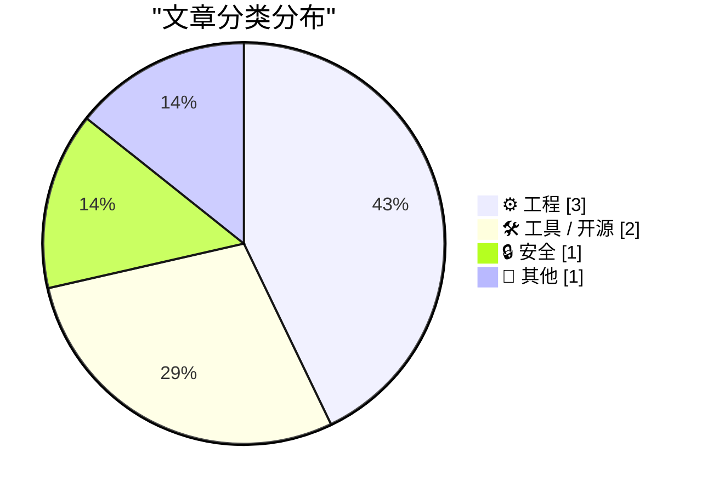
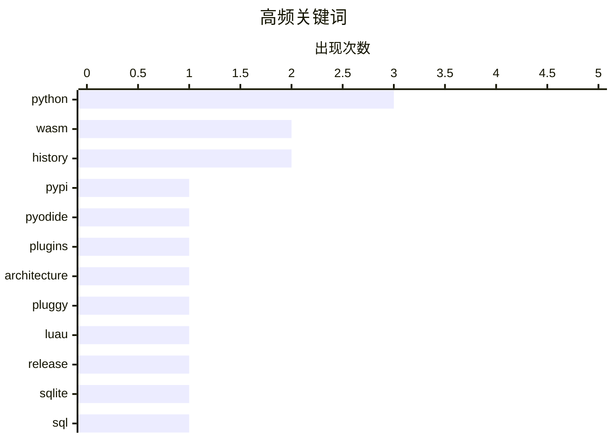

# 📰 AI 博客每日精选 — 2026-06-15

> 来自 Karpathy 推荐的 92 个顶级技术博客，AI 精选 Top 7

## 📝 今日看点

今日技术圈的核心焦点是 WebAssembly 与 Python 生态的深度融合，随着 PyPI 官方支持发布 WASM wheels，开发者得以更便捷地将各类语言编译并在浏览器端运行。在系统架构与底层优化方面，从复杂插件生态的钩子机制设计到 SQLite 查询结果的精准溯源，体现了软件工程对应用扩展性与数据上下文的深度探索。同时，硬核极客精神与安全历史依然引人瞩目，既有开发者动手打造集成串口与 VGA 的便携式控制台，也有文章重温了早期以极简代码抗议加密技术出口禁令的密码学抗争史。

---

## 🏆 今日必读

🥇 **将 WASM wheels 发布到 PyPI 以供 Pyodide 使用**

[Publishing WASM wheels to PyPI for use with Pyodide](https://simonwillison.net/2026/Jun/13/publishing-wasm-wheels/#atom-everything) — simonwillison.net · 18 小时前 · 🛠 工具 / 开源

> Pyodide 314.0 版本宣布支持将针对 Pyodide（或兼容 PEP 783 中定义的 PyEmscripten 平台的 Python 运行时）构建的包直接发布到 PyPI。开发者现在可以直接从 PyPI 安装这些 WebAssembly (WASM) wheels，大幅简化了在浏览器环境中分发和部署 Python WASM 模块的过程。这一更新标志着 Python 生态在 WebAssembly 集成方面迈出了关键一步。

💡 **为什么值得读**: 想要了解如何利用 PyPI 轻松分发和安装 Python WebAssembly 包的开发者必读。

🏷️ WASM, PyPI, Pyodide, Python

🥈 **插件案例研究：Pluggy**

[Plugins case study: Pluggy](https://eli.thegreenplace.net/2026/plugins-case-study-pluggy/) — eli.thegreenplace.net · 15 小时前 · ⚙️ 工程

> Pluggy 是一个专为开发插件系统设计的 Python 库，最初作为 pytest 项目的一部分诞生，后被提取为独立的通用库。它为希望在应用中引入复杂插件生态的开发者提供了一套成熟的钩子机制设计方案。通过分析其架构与实际应用场景，可以深入了解如何在大型项目中实现高扩展性和松耦合的模块化结构。

💡 **为什么值得读**: 适合需要在 Python 项目中构建强大且可扩展的插件生态系统的架构师和开发者阅读。

🏷️ Python, Plugins, Architecture, Pluggy

🥉 **luau-wasm 0.1a0**

[luau-wasm 0.1a0](https://simonwillison.net/2026/Jun/13/luau-wasm/#atom-everything) — simonwillison.net · 19 小时前 · 🛠 工具 / 开源

> 作者发布了 luau-wasm 0.1a0 版本，将 Luau（Lua 的一种衍生语言）编译为 WebAssembly。该项目直接利用了 PyPI 现在支持发布 WASM wheels 的新特性，使其能够顺畅地在 Pyodide 环境中运行。这为在浏览器端或其他 WASM 沙箱中嵌入和执行 Lua 脚本提供了极大的便利。

💡 **为什么值得读**: 提供了一个绝佳的实战案例，展示如何利用最新的 PyPI WASM 支持将其他语言生态引入 Pyodide。

🏷️ Luau, WASM, Python, Release

---

## 📊 数据概览

| 扫描源 | 抓取文章 | 时间范围 | 精选 |
|:---:|:---:|:---:|:---:|
| 82/92 | 2473 篇 → 7 篇 | 24h | **7 篇** |

### 分类分布



### 高频关键词



<details>
<summary>📈 纯文本关键词图（终端友好）</summary>

```
python       │ ████████████████████ 3
wasm         │ █████████████░░░░░░░ 2
history      │ █████████████░░░░░░░ 2
pypi         │ ███████░░░░░░░░░░░░░ 1
pyodide      │ ███████░░░░░░░░░░░░░ 1
plugins      │ ███████░░░░░░░░░░░░░ 1
architecture │ ███████░░░░░░░░░░░░░ 1
pluggy       │ ███████░░░░░░░░░░░░░ 1
luau         │ ███████░░░░░░░░░░░░░ 1
release      │ ███████░░░░░░░░░░░░░ 1
```

</details>

### 🏷️ 话题标签

**python**(3) · **wasm**(2) · **history**(2) · pypi(1) · pyodide(1) · plugins(1) · architecture(1) · pluggy(1) · luau(1) · release(1) · sqlite(1) · sql(1) · database(1) · datasette(1) · rsa(1) · cryptography(1) · perl(1) · hardware(1) · serial(1) · vga(1)

---

## ⚙️ 工程

### 1. 插件案例研究：Pluggy

[Plugins case study: Pluggy](https://eli.thegreenplace.net/2026/plugins-case-study-pluggy/) — **eli.thegreenplace.net** · 15 小时前 · ⭐ 21/30

> Pluggy 是一个专为开发插件系统设计的 Python 库，最初作为 pytest 项目的一部分诞生，后被提取为独立的通用库。它为希望在应用中引入复杂插件生态的开发者提供了一套成熟的钩子机制设计方案。通过分析其架构与实际应用场景，可以深入了解如何在大型项目中实现高扩展性和松耦合的模块化结构。

🏷️ Python, Plugins, Architecture, Pluggy

---

### 2. 将 SQLite 结果列映射回其源 `table.column`

[Mapping SQLite result columns back to their source `table.column`](https://simonwillison.net/2026/Jun/13/sqlite-column-provenance/#atom-everything) — **simonwillison.net** · 19 小时前 · ⭐ 19/30

> 作者探索如何在 Datasette 中，将任意 SQL 查询返回的结果列准确映射回其原始的 `table.column` 来源。实现这一功能可以让查询结果展示更多基于源表的附加上下文信息，从而提升数据呈现的可读性。这需要深入解析复杂的 SQL 语句（如多表连接和别名），以提取每个返回列在数据库结构中的真实出处。

🏷️ SQLite, SQL, Database, Datasette

---

### 3. 构建串口和 VGA 的“全能控制台”

[Building a serial and VGA "everything console"](https://oldvcr.blogspot.com/feeds/7900423283602789203/comments/default) — **oldvcr.blogspot.com** · 17 小时前 · ⭐ 16/30

> 为了摆脱维护老式系统时必须搬运笨重 CRT 终端或占用笔记本的困扰，作者决定自己动手打造一个便携的“全能控制台”。这个 DIY 设备旨在成为一个独立、轻量且低成本的解决方案，集成串口和 VGA 接口功能，以替代昂贵且笨重的商用多合一设备。该项目为复古计算机爱好者和硬件极客提供了一个高性价比的硬件调试终端思路。

🏷️ Hardware, Serial, VGA, Console

---

## 🛠 工具 / 开源

### 4. 将 WASM wheels 发布到 PyPI 以供 Pyodide 使用

[Publishing WASM wheels to PyPI for use with Pyodide](https://simonwillison.net/2026/Jun/13/publishing-wasm-wheels/#atom-everything) — **simonwillison.net** · 18 小时前 · ⭐ 23/30

> Pyodide 314.0 版本宣布支持将针对 Pyodide（或兼容 PEP 783 中定义的 PyEmscripten 平台的 Python 运行时）构建的包直接发布到 PyPI。开发者现在可以直接从 PyPI 安装这些 WebAssembly (WASM) wheels，大幅简化了在浏览器环境中分发和部署 Python WASM 模块的过程。这一更新标志着 Python 生态在 WebAssembly 集成方面迈出了关键一步。

🏷️ WASM, PyPI, Pyodide, Python

---

### 5. luau-wasm 0.1a0

[luau-wasm 0.1a0](https://simonwillison.net/2026/Jun/13/luau-wasm/#atom-everything) — **simonwillison.net** · 19 小时前 · ⭐ 19/30

> 作者发布了 luau-wasm 0.1a0 版本，将 Luau（Lua 的一种衍生语言）编译为 WebAssembly。该项目直接利用了 PyPI 现在支持发布 WASM wheels 的新特性，使其能够顺畅地在 Pyodide 环境中运行。这为在浏览器端或其他 WASM 沙箱中嵌入和执行 Lua 脚本提供了极大的便利。

🏷️ Luau, WASM, Python, Release

---

## 🔒 安全

### 6. RSA 军火 T 恤

[RSA munitions T-shirt](https://www.johndcook.com/blog/2026/06/13/rsa-munitions-t-shirt/) — **johndcook.com** · 22 小时前 · ⭐ 16/30

> 1995 年期间，美国政府将强加密技术归类为“军火”并严禁出口。为了抗议这一规定，Adam Back 编写了一段极其简短且混淆的 Perl 代码来实现 RSA 公钥加密算法，并将其作为电子邮件签名广泛传播。这段代码甚至被印在了 T 恤上，导致该 T 恤在法律意义上也被界定为“受限军火”。这一历史事件生动展现了早期极客对数字权利和密码自由的不屈抗争。

🏷️ RSA, Cryptography, History, Perl

---

## 📝 其他

### 7. 弗兰克·辛纳屈真的认为《Something》是列侬/麦卡特尼的歌吗？

[Did Frank Sinatra really think "Something" was a Lennon/McCartney song?](https://shkspr.mobi/blog/2026/06/did-frank-sinatra-really-think-something-was-a-lennon-mccartney-song/) — **shkspr.mobi** · 7 小时前 · ⭐ 9/30

> 关于披头士乐队有一个流传甚广的轶事：弗兰克·辛纳屈曾多次在演唱时将他翻唱的乔治·哈里森名曲《Something》介绍为“最喜欢的列侬与麦卡特尼作品”。作者通过调查指出，这很可能与“林戈不是披头士最好的鼓手”一样，是一句半杜撰、被过度传播的假名言。文章深入挖掘了这句话的真实出处和背景，试图还原流行音乐史的真实面貌。

🏷️ Music, History, The Beatles

---

*生成于 2026-06-15 02:50 (Asia/Shanghai) | 扫描 82 源 → 获取 2473 篇 → 精选 7 篇*
*基于 [Hacker News Popularity Contest 2025](https://refactoringenglish.com/tools/hn-popularity/) RSS 源列表，由 [Andrej Karpathy](https://x.com/karpathy) 推荐*
*由「懂点儿AI」制作，欢迎关注同名微信公众号获取更多 AI 实用技巧 💡*
