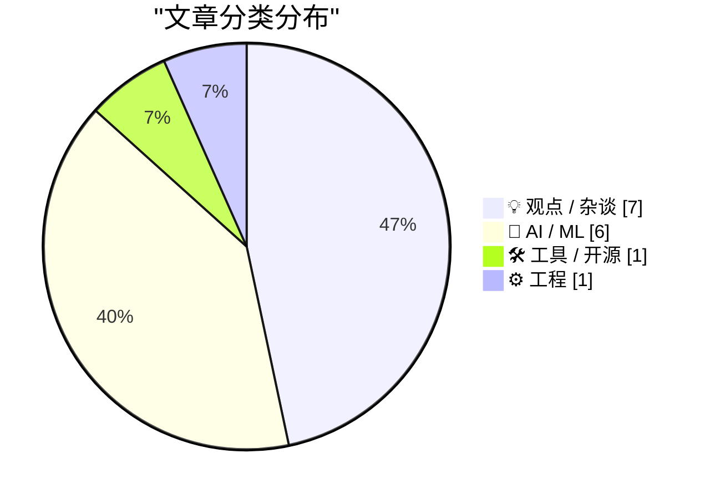
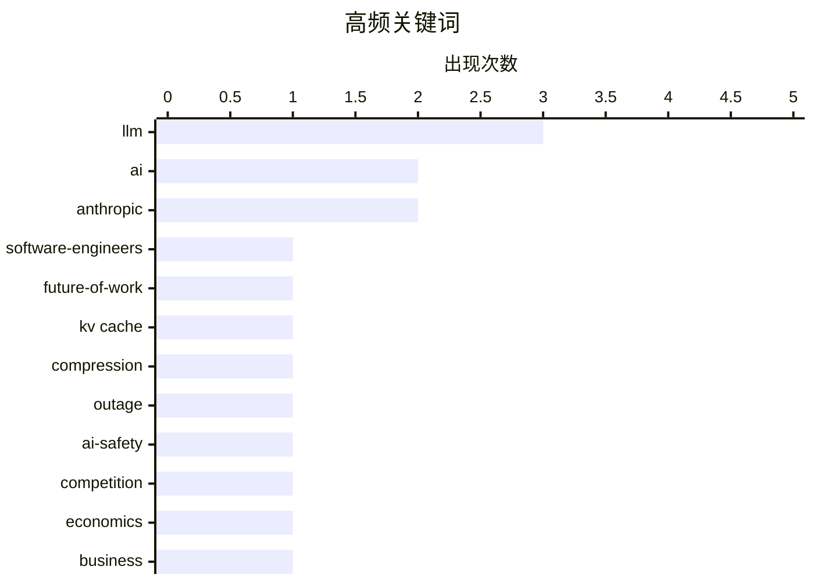

# 📰 AI 博客每日精选 — 2026-06-16

> 来自 Karpathy 推荐的 92 个顶级技术博客，AI 精选 Top 15

## 📝 今日看点

今日技术圈焦点直指生成式AI的底层现实与生态博弈。业界正重新审视AI的经济效益与硬件寿命，不仅用详实数据打破“AI取代软件工程师”和“GPU短命”的泡沫恐慌，更深刻反思当前AI狂热基本面的不可持续性。同时，巨头间的商业竞争与地缘监管暗流涌动，从Anthropic将“安全”异化为排他性商业武器，到谷歌系统级整合AI遭欧盟反垄断阻击，AI行业的利益分歧日益凸显。此外，随着AI智能体加速落地，从KV缓存等底层技术优化到专属身份验证协议的出现，以及AI自动提交代码引发的开源信任危机，标志着AI基建与协作生态正全面迈入深水区。

---

## 🏆 今日必读

🥇 **为什么AI没有取代软件工程师，未来也不会**

[Why AI hasn’t replaced software engineers, and won’t](https://simonwillison.net/2026/Jun/14/why-ai-hasnt-replaced-software-engineers/#atom-everything) — simonwillison.net · 21 小时前 · 💡 观点 / 杂谈

> 软件工程作为最易受AI自动化冲击的职业，其当前状态是对“AI失业论”的最佳检验。Arvind Narayanan 和 Sayash Kappor 通过详实分析指出，现有证据已足以反驳“AI能力达到阈值就会导致大规模失业”的叙事。AI虽然显著提升了编码效率，但无法替代工程师在复杂系统设计、需求拆解和架构权衡上的核心能力。结论是，AI技术的演进将作为辅助工具重塑开发流程，而非触发软件工程领域的就业末日。

💡 **为什么值得读**: 通过实证数据与逻辑推演，有力打破了行业内泛滥的“AI取代程序员”焦虑，为技术从业者提供了极为客观的职业前景视角。

🏷️ AI, software-engineers, future-of-work

🥈 **KV缓存压缩技术发展简史**

[A brief history of KV cache compression developments](https://martinalderson.com/posts/a-brief-history-of-kv-cache-compression-developments/?utm_source=rss&amp;utm_medium=rss&amp;utm_campaign=feed) — martinalderson.com · 20 小时前 · 🤖 AI / ML

> KV缓存压缩技术是解锁现代大语言模型（LLM）超长上下文窗口，并推动智能体工作流落地的核心底层支撑。文章系统梳理了该技术从多查询注意力（MQA）、分组查询注意力（GQA）到多头潜在注意力（MLA）以及线性注意力混合模型的演进历程。这些架构层面的创新极大地降低了推理过程中的显存占用瓶颈，使得处理海量Token成为可能。深入理解这些底层机制，对于把握下一代大模型的基础设施演进方向至关重要。

💡 **为什么值得读**: 清晰梳理了从MQA到MLA等注意力机制底层算法的演进脉络，是理解当今大模型如何突破长文本处理瓶颈的最佳技术入门材料。

🏷️ KV cache, LLM, compression

🥉 **“他们坑了我们”：内部冲突导致 Anthropic 模型下线**

["They screwed us": Personality clashes sent Anthropic's models offline](https://simonwillison.net/2026/Jun/15/axios-clashes-anthropics/#atom-everything) — simonwillison.net · 5 小时前 · 🤖 AI / ML

> Axios 深度披露了 Anthropic 与美国政府之间因出口管制政策而引发的幕后冲突与利益博弈。文章引述了大量政府内部及接近 Anthropic 的知情人士消息，揭示了因性格冲突和利益分歧导致 Claude 模型一度下线的内幕。这一事件折射出头部 AI 公司在维持商业扩张与迎合国家安全监管之间面临的极端拉扯。作者借此展示了当前 AI 政策制定过程中的混乱局面与复杂的权力摩擦。

💡 **为什么值得读**: 汇集了大量鲜为人知的内部消息源，独家揭秘了顶级AI公司与美国政府监管机构之间的激烈博弈内幕，极具科技政治维度的阅读价值。

🏷️ Anthropic, outage, LLM

---

## 📊 数据概览

| 扫描源 | 抓取文章 | 时间范围 | 精选 |
|:---:|:---:|:---:|:---:|
| 81/92 | 2444 篇 → 17 篇 | 24h | **15 篇** |

### 分类分布



### 高频关键词



<details>
<summary>📈 纯文本关键词图（终端友好）</summary>

```
llm                │ ████████████████████ 3
ai                 │ █████████████░░░░░░░ 2
anthropic          │ █████████████░░░░░░░ 2
software-engineers │ ███████░░░░░░░░░░░░░ 1
future-of-work     │ ███████░░░░░░░░░░░░░ 1
kv cache           │ ███████░░░░░░░░░░░░░ 1
compression        │ ███████░░░░░░░░░░░░░ 1
outage             │ ███████░░░░░░░░░░░░░ 1
ai-safety          │ ███████░░░░░░░░░░░░░ 1
competition        │ ███████░░░░░░░░░░░░░ 1
```

</details>

### 🏷️ 话题标签

**llm**(3) · **ai**(2) · **anthropic**(2) · software-engineers(1) · future-of-work(1) · kv cache(1) · compression(1) · outage(1) · ai-safety(1) · competition(1) · economics(1) · business(1) · ai-agents(1) · authentication(1) · protocol(1) · gpu(1) · hardware(1) · sustainability(1) · generative-ai(1) · content(1)

---

## 💡 观点 / 杂谈

### 1. 为什么AI没有取代软件工程师，未来也不会

[Why AI hasn’t replaced software engineers, and won’t](https://simonwillison.net/2026/Jun/14/why-ai-hasnt-replaced-software-engineers/#atom-everything) — **simonwillison.net** · 21 小时前 · ⭐ 25/30

> 软件工程作为最易受AI自动化冲击的职业，其当前状态是对“AI失业论”的最佳检验。Arvind Narayanan 和 Sayash Kappor 通过详实分析指出，现有证据已足以反驳“AI能力达到阈值就会导致大规模失业”的叙事。AI虽然显著提升了编码效率，但无法替代工程师在复杂系统设计、需求拆解和架构权衡上的核心能力。结论是，AI技术的演进将作为辅助工具重塑开发流程，而非触发软件工程领域的就业末日。

🏷️ AI, software-engineers, future-of-work

---

### 2. AI 的破壁经济学

[AI's Brokenomics](https://www.wheresyoured.at/brokenomics/) — **wheresyoured.at** · 1 小时前 · ⭐ 24/30

> 针对当前生成式 AI 行业狂热但基本面难以闭环的现状，作者提出了“Brokenomics（破壁经济学）”的概念来拆解其不可持续性。文章深入分析了 NVIDIA、Anthropic 等核心玩家背后惊人的算力成本、高昂的资本支出与实际营收之间的巨大鸿沟。指出当前 AI 的应用层收入根本无法覆盖其基础设施投入，整个行业的繁荣高度依赖于资本的持续输血。结论是目前的 AI 经济模型存在严重泡沫，面临随时破灭的系统性风险。

🏷️ AI, economics, business

---

### 3. 多元化：AI 与业余主义（2026年6月15日）

[Pluralistic: AI and amateurism (15 Jun 2026)](https://pluralistic.net/2026/06/15/vernacular/) — **pluralistic.net** · 5 小时前 · ⭐ 21/30

> 文章探讨了生成式 AI 内容的泛滥对人类原创生态的冲击，并提出了“生成式内容何时能被视为本土俗语”的核心拷问。作者 Cory Doctorow 认为，依靠大模型批量生成的“业余”内容缺乏真正的创造力与文化根基，无法等同于人类自发的底层创作。文章穿插了对数字时代文化产物（如 IP 混搭、科技巨头收购）的观察，严厉批评了科技公司试图用 AI 替代人类创造力的傲慢。结论是真正的“伟大”与艺术价值，永远无法被剥离了人类生活语境的算法所批量复制。

🏷️ generative-AI, content, amateurism

---

### 4. 引发思考的事物：开源信任关系、无溯源知识与理论构建

[Things that made me think: Open Source trust relationships, knowledge without provenance, and theory building](https://tomrenner.com/posts/ttmmt-4/) — **tomrenner.com** · 20 小时前 · ⭐ 19/30

> 随着 AI 智能体开始通过冷邮件自动向大型开源项目提交 PR，软件供应链的信任机制正面临前所未有的挑战。文章探讨了在 AI 时代，当代码贡献者不再是人类时，开源社区如何维护基于人际互动建立的传统信任关系。作者进一步剖析了“无溯源知识”带来的风险，即大模型生成的代码缺乏可追溯的上下文与明确的责任主体。结论是开源生态亟需建立新的身份验证与代码审查机制，以应对自动化工具带来的系统性安全隐患。

🏷️ open source, trust, AI agents

---

### 5. EU & Civil Society need to progress on Digital Autonomy

[EU & Civil Society need to progress on Digital Autonomy](https://berthub.eu/articles/posts/eu-civil-society-need-progress-digital-autonomy/) — **berthub.eu** · 7 小时前 · ⭐ 18/30

> EU & Civil Society need to progress on Digital Autonomy

🏷️ digital autonomy, EU, policy

---

### 6. Quoting Julia Evans

[Quoting Julia Evans](https://simonwillison.net/2026/Jun/15/julia-evans/#atom-everything) — **simonwillison.net** · 18 小时前 · ⭐ 17/30

> Quoting Julia Evans

🏷️ writing, communication, audience

---

### 7. [RSS Club] What happens to old posts?

[[RSS Club] What happens to old posts?](https://shkspr.mobi/blog/2026/06/rss-club-what-happens-to-old-posts/) — **shkspr.mobi** · 9 小时前 · ⭐ 13/30

> [RSS Club] What happens to old posts?

🏷️ RSS, blogging, archives

---

## 🤖 AI / ML

### 8. KV缓存压缩技术发展简史

[A brief history of KV cache compression developments](https://martinalderson.com/posts/a-brief-history-of-kv-cache-compression-developments/?utm_source=rss&amp;utm_medium=rss&amp;utm_campaign=feed) — **martinalderson.com** · 20 小时前 · ⭐ 25/30

> KV缓存压缩技术是解锁现代大语言模型（LLM）超长上下文窗口，并推动智能体工作流落地的核心底层支撑。文章系统梳理了该技术从多查询注意力（MQA）、分组查询注意力（GQA）到多头潜在注意力（MLA）以及线性注意力混合模型的演进历程。这些架构层面的创新极大地降低了推理过程中的显存占用瓶颈，使得处理海量Token成为可能。深入理解这些底层机制，对于把握下一代大模型的基础设施演进方向至关重要。

🏷️ KV cache, LLM, compression

---

### 9. “他们坑了我们”：内部冲突导致 Anthropic 模型下线

["They screwed us": Personality clashes sent Anthropic's models offline](https://simonwillison.net/2026/Jun/15/axios-clashes-anthropics/#atom-everything) — **simonwillison.net** · 5 小时前 · ⭐ 24/30

> Axios 深度披露了 Anthropic 与美国政府之间因出口管制政策而引发的幕后冲突与利益博弈。文章引述了大量政府内部及接近 Anthropic 的知情人士消息，揭示了因性格冲突和利益分歧导致 Claude 模型一度下线的内幕。这一事件折射出头部 AI 公司在维持商业扩张与迎合国家安全监管之间面临的极端拉扯。作者借此展示了当前 AI 政策制定过程中的混乱局面与复杂的权力摩擦。

🏷️ Anthropic, outage, LLM

---

### 10. Anthropic 的“安全超级权力”

[‘Anthropic’s Safety Superpower’](https://stratechery.com/2026/anthropics-safety-superpower/) — **daringfireball.net** · 3 小时前 · ⭐ 24/30

> Ben Thompson 在 Stratechery 撰文剖析了 Anthropic 引以为傲的“安全”策略，指出其本质上是一种排他性的商业竞争武器。文章认为，Anthropic 试图以“安全”为由建立护城河，不仅拒绝协助竞争对手，甚至暗示除自己外其他公司都不应涉足前沿大模型的研发。这种政策在 Anthropic 与美国战争部因 Claude 模型使用权发生纠纷仅两个月后便推出，显得尤为虚伪。作者一针见血地揭露了“AI安全”话语如何被企业异化为巩固自身垄断地位的工具。

🏷️ Anthropic, AI-safety, competition

---

### 11. AI GPU 的实际寿命可能远超三年

[AI GPUs probably live longer than three years](https://seangoedecke.com/ai-gpus-live-longer-than-three-years/) — **seangoedecke.com** · 20 小时前 · ⭐ 21/30

> 业界常以“推理 GPU 满载寿命最多三年”的传闻来佐证当前 AI 基础设施投资的不可持续性，但这其实是一个严重的认知误区。文章通过分析指出，在真实的数据中心运行环境下，AI GPU 的物理寿命通常比传闻中的三年极限要长得多。这意味着硬件折旧周期被低估，导致当前的算力成本核算模型存在偏差。结论是更长的硬件寿命为 AI 模型的持续迭代和商业闭环提供了远比悲观主义者预期更宽裕的时间窗口。

🏷️ GPU, hardware, sustainability

---

### 12. 欧盟委员会数月前已裁定：谷歌在安卓中整合 Gemini 违反了 DMA

[The European Commission Ruled Months Ago That Google’s Integration of Gemini in Android Violates the DMA](https://arstechnica.com/ai/2026/04/europe-could-force-google-to-open-android-to-other-ai-assistants/) — **daringfireball.net** · 1 小时前 · ⭐ 20/30

> 欧盟委员会早前已初步裁定，谷歌将 Gemini AI 深度整合进 Android 系统的做法违反了《数字市场法案》（DMA）。欧洲监管机构正推动多项改革，要求允许第三方 AI 工具通过系统级热词或按键被唤醒，并赋予其查看屏幕上下文和访问本地数据的同等权限。此举旨在打破科技巨头对移动端 AI 助手的垄断，强制开放系统底层的交互接口。这一裁决标志着反垄断监管的触角已正式延伸至端侧 AI 领域，将深刻重塑智能手机 AI 的竞争格局。

🏷️ Google, Gemini, Android, regulation

---

### 13. Writing Prolog with ChatGPT

[Writing Prolog with ChatGPT](https://www.johndcook.com/blog/2026/06/15/writing-prolog-with-chatgpt/) — **johndcook.com** · 3 小时前 · ⭐ 16/30

> Writing Prolog with ChatGPT

🏷️ ChatGPT, Prolog, LLM

---

## 🛠 工具 / 开源

### 14. WorkOS 推出 Auth.md —— 面向 AI 智能体的开放注册协议

[WorkOS Launches Auth.md — an Open Protocol for Agent Registration](https://workos.com/auth-md?utm_source=daringfireball&amp;utm_medium=newsletter&amp;utm_campaign=q22026) — **daringfireball.net** · 3 小时前 · ⭐ 23/30

> 传统的网页注册表单是为浏览器中的人类设计的，而 Auth.md 协议旨在解决 AI 智能体如何以编程方式向服务进行身份验证的痛点。该开源协议通过在服务根目录暴露一个机器可读的 Markdown 文件，允许 AI 智能体动态发现 OAuth 受保护资源元数据。智能体可以借此自动解析所需的权限范围，并无缝完成注册和认证流程。这一方案巧妙利用极简的 Markdown 格式，为智能体与第三方服务的标准化交互提供了优雅的基础设施。

🏷️ AI-agents, authentication, protocol

---

## ⚙️ 工程

### 15. Quaternion Rotations, Claude, and Lean

[Quaternion Rotations, Claude, and Lean](https://www.johndcook.com/blog/2026/06/15/quaternions-claude-lean/) — **johndcook.com** · 1 小时前 · ⭐ 18/30

> Quaternion Rotations, Claude, and Lean

🏷️ Claude, quaternions, Lean

---

*生成于 2026-06-16 04:54 (Asia/Shanghai) | 扫描 81 源 → 获取 2444 篇 → 精选 15 篇*
*基于 [Hacker News Popularity Contest 2025](https://refactoringenglish.com/tools/hn-popularity/) RSS 源列表，由 [Andrej Karpathy](https://x.com/karpathy) 推荐*
*由「懂点儿AI」制作，欢迎关注同名微信公众号获取更多 AI 实用技巧 💡*
