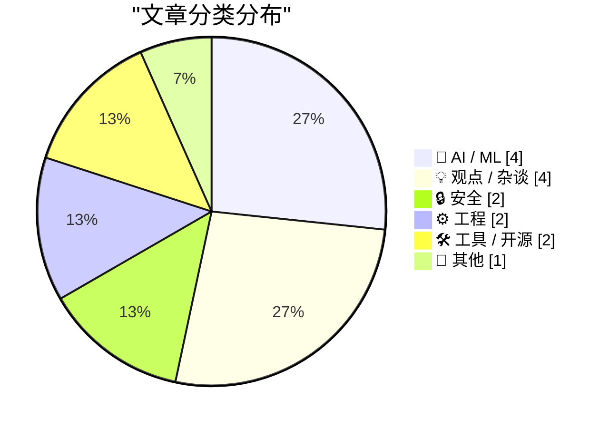
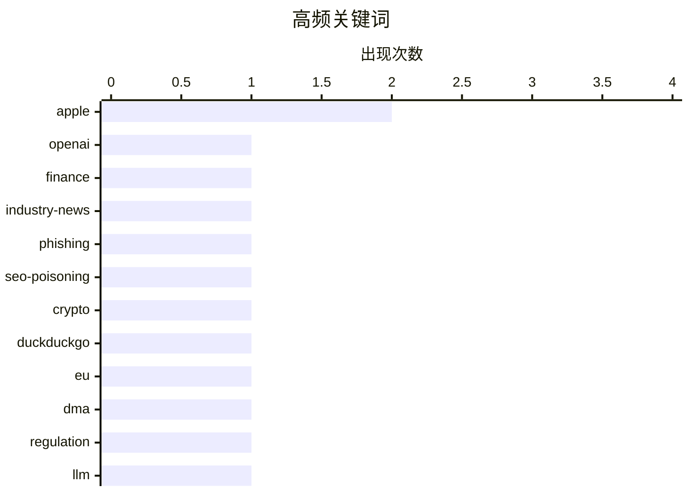

# 📰 AI 博客每日精选 — 2026-06-17

> 来自 Karpathy 推荐的 92 个顶级技术博客，AI 精选 Top 15

## 📝 今日看点

今日技术圈的焦点集中在生成式AI的极端商业化成本与全球科技监管博弈。首先，OpenAI高达数百亿美元的预期亏损暴露出云端大模型惊人的烧钱速度，这促使开发者们愈发关注如何利用强大的本地模型来应对实际的编程与架构挑战。其次，欧盟严苛的数字监管法案不仅阻断了苹果新AI功能在欧洲的落地，更引发了关于区域数字主权以及如何摆脱科技巨头依赖的激烈讨论。此外，从主流搜索引擎的恶意引流漏洞到复杂的生产环境调试，网络安全隐患与底层工程优化依然是开发者需要时刻警惕的日常底线。

---

## 🏆 今日必读

🥇 **独家：OpenAI 2025年亏损激增近8倍，支出高达340亿美元**

[Exclusive: OpenAI Losses Increased Nearly 8X in 2025, With Spending Hitting $34 Billion](https://www.wheresyoured.at/exclusive-openai-financials/) — wheresyoured.at · 16 小时前 · 🤖 AI / ML

> 独家披露的 OpenAI 2025 年财务数据显示，其亏损激增近 8 倍，总支出高达 340 亿美元。巨额支出反映了当前生成式 AI 模型训练和基础设施建设的极端成本。这种不可持续的烧钱速度对 AI 行业的长期商业模式提出了严峻挑战。作者认为，尽管技术不断进步，但基础模型的经济效益仍是未解之谜。

💡 **为什么值得读**: 通过最新独家财务数据揭示了生成式AI头部企业惊人的烧钱速度和潜在的商业模式危机。

🏷️ OpenAI, finance, industry-news

🥈 **你想在 DuckDuckGo 搜索结果的最顶部看到一个加密货币窃取器吗？**

[Would you like a drainer served at the very top of DuckDuckGo?](https://timsh.org/drainer-at-the-top-of-duckduckgo/) — timsh.org · 7 小时前 · 🔒 安全

> 作者发现 DuckDuckGo 搜索引擎的置顶结果中竟然出现了一个包含加密货币窃取器（drainer）的钓鱼网站。该网站完美仿冒了 Tronscan 区块链浏览器，极具欺骗性和危险性。这暴露了 DuckDuckGo 在广告和搜索结果审核机制上的严重漏洞。搜索引擎必须立即修复此类将高危恶意链接置于顶部的推荐逻辑。

💡 **为什么值得读**: 揭示了一个主流搜索引擎将高危加密货币钓鱼网站置顶的真实安全事件，对开发者和普通用户都是重要警示。

🏷️ phishing, SEO-poisoning, crypto, DuckDuckGo

🥉 **《华盛顿邮报》评欧盟《数字市场法案》的愚蠢之处**

[The Washington Post on the EU’s DMA Folly](https://www.washingtonpost.com/opinions/2026/06/14/apple-withholding-siri-ai-europe-is-another-dma-failure/) — daringfireball.net · 18 小时前 · 💡 观点 / 杂谈

> 《华盛顿邮报》发文批评欧盟《数字市场法案》（DMA）导致苹果新 AI 功能（新版 Siri）无法在欧洲推出。DMA 强制要求苹果向竞争对手的 AI 智能体开放用户消息、文件和聊天历史的同等权限。苹果提议增加软件安全层但未获欧盟同意，最终选择暂缓在欧洲发布该功能。这表明旨在促进竞争的监管政策可能反而会损害本地消费者的利益。

💡 **为什么值得读**: 深入分析了科技巨头反垄断监管（DMA）与用户数据安全之间的冲突，以及监管带来的意想不到的负面后果。

🏷️ EU, DMA, Apple, regulation

---

## 📊 数据概览

| 扫描源 | 抓取文章 | 时间范围 | 精选 |
|:---:|:---:|:---:|:---:|
| 81/92 | 2450 篇 → 23 篇 | 24h | **15 篇** |

### 分类分布



### 高频关键词



<details>
<summary>📈 纯文本关键词图（终端友好）</summary>

```
apple         │ ████████████████████ 2
openai        │ ██████████░░░░░░░░░░ 1
finance       │ ██████████░░░░░░░░░░ 1
industry-news │ ██████████░░░░░░░░░░ 1
phishing      │ ██████████░░░░░░░░░░ 1
seo-poisoning │ ██████████░░░░░░░░░░ 1
crypto        │ ██████████░░░░░░░░░░ 1
duckduckgo    │ ██████████░░░░░░░░░░ 1
eu            │ ██████████░░░░░░░░░░ 1
dma           │ ██████████░░░░░░░░░░ 1
```

</details>

### 🏷️ 话题标签

**apple**(2) · **openai**(1) · **finance**(1) · industry-news(1) · phishing(1) · seo-poisoning(1) · crypto(1) · duckduckgo(1) · eu(1) · dma(1) · regulation(1) · llm(1) · qwen(1) · coding(1) · backpressure(1) · system-design(1) · scalability(1) · startup(1) · lean(1) · entrepreneurship(1)

---

## 🤖 AI / ML

### 1. 独家：OpenAI 2025年亏损激增近8倍，支出高达340亿美元

[Exclusive: OpenAI Losses Increased Nearly 8X in 2025, With Spending Hitting $34 Billion](https://www.wheresyoured.at/exclusive-openai-financials/) — **wheresyoured.at** · 16 小时前 · ⭐ 27/30

> 独家披露的 OpenAI 2025 年财务数据显示，其亏损激增近 8 倍，总支出高达 340 亿美元。巨额支出反映了当前生成式 AI 模型训练和基础设施建设的极端成本。这种不可持续的烧钱速度对 AI 行业的长期商业模式提出了严峻挑战。作者认为，尽管技术不断进步，但基础模型的经济效益仍是未解之谜。

🏷️ OpenAI, finance, industry-news

---

### 2. 引用 Georgi Gerganov 的观点

[Quoting Georgi Gerganov](https://simonwillison.net/2026/Jun/16/georgi-gerganov/#atom-everything) — **simonwillison.net** · 4 小时前 · ⭐ 21/30

> Georgi Gerganov 证实 Qwen3.6-27B 是一款用于编程任务的强大本地模型。过去一个半月内，他在 M2 Ultra 或 RTX 5090 设备上几乎每天使用该模型。该模型主要用于处理 ggml-org 仓库中一些日常琐碎的代码任务。这表明开源大模型在辅助本地代码生成方面已具备极高的实用价值。

🏷️ LLM, Qwen, coding

---

### 3. JAX：承诺问题（设备分配与执行陷阱）

[JAX: commitment issues](https://www.gilesthomas.com/2026/06/jax-commitment-issues) — **gilesthomas.com** · 23 小时前 · ⭐ 20/30

> 深入探讨了在配置了 CUDA 的机器上运行 JAX 代码时遇到的设备分配与执行陷阱。JAX 的异步计算模型和显式设备放置机制常常会让开发者产生“承诺问题（commitment issues）”，导致难以预测的计算阻塞或同步错误。理解 JAX 底层的调度逻辑和数组在 CPU/GPU 间的传输机制是解决这些问题的关键。掌握这些细节能显著提升高性能计算代码的调试效率。

🏷️ JAX, CUDA, machine-learning

---

### 4. Quoting Matteo Wong, The Atlantic

[Quoting Matteo Wong, The Atlantic](https://simonwillison.net/2026/Jun/16/matteo-wong-the-atlantic/#atom-everything) — **simonwillison.net** · 17 小时前 · ⭐ 18/30

> Quoting Matteo Wong, The Atlantic

🏷️ Anthropic, AI-policy, security

---

## 💡 观点 / 杂谈

### 5. 《华盛顿邮报》评欧盟《数字市场法案》的愚蠢之处

[The Washington Post on the EU’s DMA Folly](https://www.washingtonpost.com/opinions/2026/06/14/apple-withholding-siri-ai-europe-is-another-dma-failure/) — **daringfireball.net** · 18 小时前 · ⭐ 22/30

> 《华盛顿邮报》发文批评欧盟《数字市场法案》（DMA）导致苹果新 AI 功能（新版 Siri）无法在欧洲推出。DMA 强制要求苹果向竞争对手的 AI 智能体开放用户消息、文件和聊天历史的同等权限。苹果提议增加软件安全层但未获欧盟同意，最终选择暂缓在欧洲发布该功能。这表明旨在促进竞争的监管政策可能反而会损害本地消费者的利益。

🏷️ EU, DMA, Apple, regulation

---

### 6. 斯坦福大学精益创业课程 2026 —— 经验教训分享

[Lean Launch Pad 2026 @ Stanford – Lessons Learned Presentations](https://steveblank.com/2026/06/16/lean-launch-pad-2026-stanford-lessons-learned-presentations/) — **steveblank.com** · 7 小时前 · ⭐ 21/30

> 斯坦福大学刚刚结束了第 16 届年度精益创业课程（Lean LaunchPad）的经验分享。在过去的 16 年里，精益创业方法从一个激进的新理念，逐渐演变为当今构建初创企业的标准框架。课程展示了多个团队在客户开发和商业模式验证过程中的实战经验与教训。这证明了精益方法论在现代创业教育中的核心地位和持久价值。

🏷️ startup, lean, entrepreneurship

---

### 7. 不要邀请大型科技公司参加你的数字自主权讨论

[Do not invite big-tech to join your digital autonomy discussion](https://berthub.eu/articles/posts/do-not-invite-big-tech-to-your-digital-autonomy-discussion/) — **berthub.eu** · 4 小时前 · ⭐ 19/30

> 作者在参加一场探讨欧洲数字自主权与数字依赖性的活动时，发现美国科技巨头被邀请并深度参与议程。尽管在未来的数字经济中，欧洲仍不可避免地需要与微软、谷歌和亚马逊等企业保持商业合作。但在讨论如何摆脱依赖、建立本土技术主权时，让这些既得利益者主导对话是极其荒谬的。真正的数字自主权战略必须独立于供应商的利益诉求来制定。

🏷️ digital-autonomy, big-tech, europe

---

### 8. How Open Source Projects Change Hands

[How Open Source Projects Change Hands](https://nesbitt.io/2026/06/16/how-open-source-projects-change-hands.html) — **nesbitt.io** · 10 小时前 · ⭐ 18/30

> How Open Source Projects Change Hands

🏷️ open-source, maintainership, community

---

## 🔒 安全

### 9. 你想在 DuckDuckGo 搜索结果的最顶部看到一个加密货币窃取器吗？

[Would you like a drainer served at the very top of DuckDuckGo?](https://timsh.org/drainer-at-the-top-of-duckduckgo/) — **timsh.org** · 7 小时前 · ⭐ 24/30

> 作者发现 DuckDuckGo 搜索引擎的置顶结果中竟然出现了一个包含加密货币窃取器（drainer）的钓鱼网站。该网站完美仿冒了 Tronscan 区块链浏览器，极具欺骗性和危险性。这暴露了 DuckDuckGo 在广告和搜索结果审核机制上的严重漏洞。搜索引擎必须立即修复此类将高危恶意链接置于顶部的推荐逻辑。

🏷️ phishing, SEO-poisoning, crypto, DuckDuckGo

---

### 10. The Fable 5 Export Controls Harm US Cyber Defense

[The Fable 5 Export Controls Harm US Cyber Defense](https://simonwillison.net/2026/Jun/16/fable-5-export-controls/#atom-everything) — **simonwillison.net** · 15 小时前 · ⭐ 18/30

> The Fable 5 Export Controls Harm US Cyber Defense

🏷️ export-controls, cyber-defense, policy

---

## ⚙️ 工程

### 11. 精益，而非背压

[Lean, not backpressure](https://entropicthoughts.com/lean-not-backpressure) — **entropicthoughts.com** · 22 小时前 · ⭐ 21/30

> Lucas Costa 撰文探讨了如何构建能够应对代码生成机器人的系统，但错误地使用了“背压（backpressure）”这一概念。真正的背压机制是向上游进程发出信号要求其减速，而 Costa 提出的建议实际上是要求上游改变工作方式以确保质量。这种机制更符合“精益（Lean）”理念，即通过质量约束来控制和优化生产流程。准确理解这些概念有助于开发者设计出更健壮的自动化代码处理流水线。

🏷️ backpressure, system-design, scalability

---

### 12. 生产环境调试

[Debugging on Prod](https://idiallo.com/blog/debugging-on-prod) — **idiallo.com** · 19 分钟前 · ⭐ 19/30

> 重新设计十年老博客并清理大量冗余代码后，遭遇了仅在生成环境中触发的 500 错误。这类仅在 Prod 环境出现的 Bug 通常与特定的服务器配置、缓存或并发请求有关。作者详细记录了从复现问题到排查底层代码与部署环境差异的完整调试过程。解决此类问题的关键在于建立环境等价性测试并利用精准的日志进行追踪。

🏷️ debugging, production, web-development

---

## 🛠 工具 / 开源

### 13. Key, in sight

[Key, in sight](https://aresluna.org/key-in-sight) — **aresluna.org** · 1 小时前 · ⭐ 19/30

> Key, in sight

🏷️ keyboard, customization, productivity

---

### 14. Cloudflare CAPTCHA on at least one ampersand

[Cloudflare CAPTCHA on at least one ampersand](https://simonwillison.net/2026/Jun/16/captcha-on-at-least-one-ampersand/#atom-everything) — **simonwillison.net** · 20 小时前 · ⭐ 16/30

> Cloudflare CAPTCHA on at least one ampersand

🏷️ Cloudflare, CAPTCHA, WAF

---

## 📝 其他

### 15. App Store 新功能：个性化推荐

[New in the App Store: Personalized Recommendations](https://techcrunch.com/2026/06/09/apples-app-store-rolls-out-personalized-recommendations/) — **daringfireball.net** · 4 小时前 · ⭐ 19/30

> 苹果在 WWDC 上宣布推出 App Store 个性化推荐功能，基于用户的兴趣和行为展示定制化应用。新功能包括“个性化合集（Personalized Collections）”和解释推荐原因的“应用说明（App Notes）”。这为开发者提供了应用曝光的新途径，也提升了用户发现应用的效率。苹果正通过引入更细粒度的推荐算法来重塑应用市场的分发机制。

🏷️ Apple, App Store, WWDC

---

*生成于 2026-06-17 04:37 (Asia/Shanghai) | 扫描 81 源 → 获取 2450 篇 → 精选 15 篇*
*基于 [Hacker News Popularity Contest 2025](https://refactoringenglish.com/tools/hn-popularity/) RSS 源列表，由 [Andrej Karpathy](https://x.com/karpathy) 推荐*
*由「懂点儿AI」制作，欢迎关注同名微信公众号获取更多 AI 实用技巧 💡*
