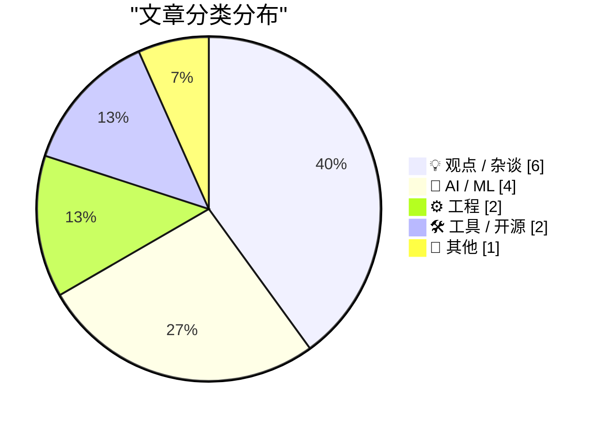
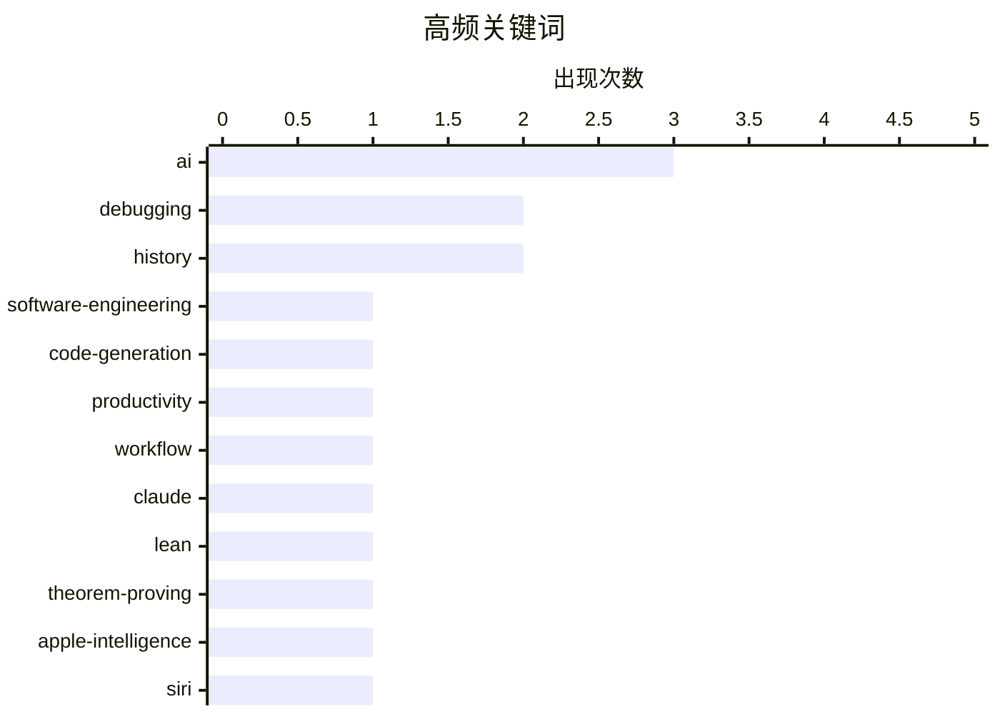

# 📰 AI 博客每日精选 — 2026-06-18

> 来自 Karpathy 推荐的 92 个顶级技术博客，AI 精选 Top 15

## 📝 今日看点

今日技术圈的核心焦点在于AI对编程经济学和企业生产力的双重冲击。AI让代码生成变得几乎免费且一次性，彻底颠覆了传统的软件资产观，但个体效率的红利却被企业固有架构与流程的瓶颈所抵消。同时，大模型能力正向更硬核的数学定理证明和复杂的底层模型调试延伸，科技巨头在消费级AI体验上的博弈也愈演愈烈。此外，从生产环境调试到基础数据工具迭代，经典的软件工程实践依然是开发者持续深耕的基石。

---

## 🏆 今日必读

🥇 **引用 Charity Majors 的观点**

[Quoting Charity Majors](https://simonwillison.net/2026/Jun/17/charity-majors/#atom-everything) — simonwillison.net · 2 小时前 · 🤖 AI / ML

> 2025年代码生成的经济学发生了根本性颠覆，代码编写从困难、耗时且昂贵瞬间转变为几乎免费且即时。这种转变导致代码的价值定位彻底改变，不再被视作需要珍视、复用或精心维护的资产。相反，代码已经变成了一次性且可随时再生的消耗品。

💡 **为什么值得读**: 深刻洞察了 AI 时代下代码价值从“资产”向“消耗品”的根本性转变，值得开发者重新思考工程纪律。

🏷️ AI, software-engineering, code-generation

🥈 **你变快了，但你的公司并没有**

[You Got Faster. Your Company Didn’t.](https://terriblesoftware.org/2026/06/17/you-got-faster-your-company-didnt/) — terriblesoftware.org · 2 小时前 · 💡 观点 / 杂谈

> AI 工具确实提升了个体开发者的编码速度，但这并不等同于企业整体生产力的提高。开发者实际上只是将项目中缓慢、繁琐的协作环节外包给了团队中的其他人。个体的效率提升完全被组织架构和业务流程的固有瓶颈所抵消。如果不改变团队协作模式，单纯依赖 AI 加速个人编码无法带动整个公司效能的飞跃。

💡 **为什么值得读**: 一针见血地指出了 AI 提效的局部性陷阱，揭示了个人编码速度与企业整体生产力之间的巨大鸿沟。

🏷️ AI, productivity, workflow

🥉 **使用 Lean 4 和 Claude 形式化证明环定理**

[Formalizing a ring theorem with Lean 4 and Claude](https://www.johndcook.com/blog/2026/06/17/rings-with-lean-claude/) — johndcook.com · 5 小时前 · 🤖 AI / ML

> 测试了 Claude 大语言模型生成 Lean 4 代码以进行数学定理证明的能力。作者在此前的实验中成功验证了部分计算，但也经历过形式化半范数 pqr 定理失败的尝试。本次实验重点要求 Claude 对特定的环定理进行完整的形式化证明。结果展示了当前 AI 辅助形式化验证工具在处理复杂数学逻辑时的实际表现与潜力。

💡 **为什么值得读**: 展示了 LLM 在形式化验证和高级数学证明中的前沿应用，为研究 AI 与定理证明器结合的开发者提供了真实案例。

🏷️ Claude, Lean, theorem-proving

---

## 📊 数据概览

| 扫描源 | 抓取文章 | 时间范围 | 精选 |
|:---:|:---:|:---:|:---:|
| 82/92 | 2473 篇 → 15 篇 | 24h | **15 篇** |

### 分类分布



### 高频关键词



<details>
<summary>📈 纯文本关键词图（终端友好）</summary>

```
ai                   │ ████████████████████ 3
debugging            │ █████████████░░░░░░░ 2
history              │ █████████████░░░░░░░ 2
software-engineering │ ███████░░░░░░░░░░░░░ 1
code-generation      │ ███████░░░░░░░░░░░░░ 1
productivity         │ ███████░░░░░░░░░░░░░ 1
workflow             │ ███████░░░░░░░░░░░░░ 1
claude               │ ███████░░░░░░░░░░░░░ 1
lean                 │ ███████░░░░░░░░░░░░░ 1
theorem-proving      │ ███████░░░░░░░░░░░░░ 1
```

</details>

### 🏷️ 话题标签

**ai**(3) · **debugging**(2) · **history**(2) · software-engineering(1) · code-generation(1) · productivity(1) · workflow(1) · claude(1) · lean(1) · theorem-proving(1) · apple-intelligence(1) · siri(1) · wwdc(1) · logic(1) · book(1) · programming(1) · datasette(1) · database(1) · release(1) · apple(1)

---

## 💡 观点 / 杂谈

### 1. 你变快了，但你的公司并没有

[You Got Faster. Your Company Didn’t.](https://terriblesoftware.org/2026/06/17/you-got-faster-your-company-didnt/) — **terriblesoftware.org** · 2 小时前 · ⭐ 23/30

> AI 工具确实提升了个体开发者的编码速度，但这并不等同于企业整体生产力的提高。开发者实际上只是将项目中缓慢、繁琐的协作环节外包给了团队中的其他人。个体的效率提升完全被组织架构和业务流程的固有瓶颈所抵消。如果不改变团队协作模式，单纯依赖 AI 加速个人编码无法带动整个公司效能的飞跃。

🏷️ AI, productivity, workflow

---

### 2. 盘点 iOS 的“跨大陆乐趣鸿沟”

[Checking In on the iOS Continental Fun-Gap Drift](https://daringfireball.net/2024/09/ios_continental_drift_fun_gap) — **daringfireball.net** · 18 小时前 · ⭐ 17/30

> 作者回顾了其在 2024 年提出的一个质疑：“欧洲用户的 iPhone 现在更好玩了吗”。当时欧盟用户受限于法规，无法使用 Apple Intelligence 和 iPhone Mirroring 等实用且有趣的新功能。时隔两年，作者重新审视了这种被称为“跨大陆乐趣鸿沟”的现象。文章暗示，在获取最新前沿科技体验方面，欧美两地用户之间依然存在着明显的差距。

🏷️ Apple, EU, regulation

---

### 3. Pluralistic：真正的死亡经济学理论

[Pluralistic: The (real) dead economy theory (17 Jun 2026)](https://pluralistic.net/2026/06/17/its-the-stupid-economy-stupid/) — **pluralistic.net** · 1 小时前 · ⭐ 17/30

> 作者提出了一种“真正的死亡经济学理论”，认为当前的经济环境已经沦为全凭感觉和炒作 Meme 股票的虚无游戏。文章通过一系列新闻摘录佐证了这一观点，涉及了苹果 iTunes 的 DRM 争议、法国互联网监管政策以及 1901 年的海底电缆历史等。这些看似不相关的历史与现实事件，共同拼凑出了一幅荒诞的经济图景。核心观点直指现代金融与科技生态中非理性繁荣的脆弱本质。

🏷️ tech-policy, economy, DRM

---

### 4. John Gruber 做客 The Vergecast：Markdown 的史诗故事

[Yours Truly on The Vergecast: ‘# the **Epic** Story of Markdown’](https://www.theverge.com/podcast/950082/markdown-history-gruber-vergecast) — **daringfireball.net** · 4 小时前 · ⭐ 16/30

> Markdown 创始人 John Gruber 与 Anil Dash 在 The Vergecast 播客中深入探讨了 Markdown 的起源及其席卷全球的发展历程。随着大语言模型（LLM）和智能体系统的爆发，Markdown 已成为该领域事实上的通用语言（lingua franca），迎来了受欢迎程度的阶跃式增长。这次对话不仅回顾了这一轻量级标记语言的历史，也揭示了它在现代 AI 架构中的关键地位。这种经典技术“焕发新生”的现象，凸显了简洁数据格式在人机交互中的核心价值。

🏷️ Markdown, history, podcast

---

### 5. NetNewsWire 的现状与纯粹的开发精神

[NetNewsWire Status](https://simonwillison.net/2026/Jun/17/netnewswire-status/#atom-everything) — **simonwillison.net** · 16 小时前 · ⭐ 14/30

> 开发者 Brent Simmons 在退休后接手了始于 2002 年的经典 RSS 阅读器 NetNewsWire，致力于在没有商业压力的环境下将其打磨到极致。这款被描述为“阅读版的播客”软件，代表了纯粹为了用户体验和软件工艺而开发的开源精神。作者的分享不仅是对该软件当前发展状况的介绍，更是对这种远离商业化喧嚣、专注打造单一精品软件态度的赞叹与致敬。这种“为爱发电”的项目证明了脱离功利主义依然能诞生卓越的软件产品。

🏷️ NetNewsWire, open-source, RSS

---

### 6. 召唤恶魔

[Summoning the Demon](https://geohot.github.io//blog/jekyll/update/2026/06/17/summoning-the-demon.html) — **geohot.github.io** · 12 小时前 · ⭐ 14/30

> tinygrad 创始人 George Hotz (geohot) 在这篇博客中通过引用歌词和隐喻，表达了对当前科技界某种现象（可能针对盲目追逐的 AI 狂热）的强烈批判与反思。文章标题“召唤恶魔”通常被科技界用来形容人类创造出无法控制的强大力量（如强人工智能），暗示了作者对行业发展方向的担忧。通过充满挑衅性和文学性的表达，作者呼吁业界反思正在构建的技术体系及其潜在的破坏性。这是一篇充满个人色彩且发人深省的行业评论。

🏷️ AI, critique, opinion

---

## 🤖 AI / ML

### 7. 引用 Charity Majors 的观点

[Quoting Charity Majors](https://simonwillison.net/2026/Jun/17/charity-majors/#atom-everything) — **simonwillison.net** · 2 小时前 · ⭐ 23/30

> 2025年代码生成的经济学发生了根本性颠覆，代码编写从困难、耗时且昂贵瞬间转变为几乎免费且即时。这种转变导致代码的价值定位彻底改变，不再被视作需要珍视、复用或精心维护的资产。相反，代码已经变成了一次性且可随时再生的消耗品。

🏷️ AI, software-engineering, code-generation

---

### 8. 使用 Lean 4 和 Claude 形式化证明环定理

[Formalizing a ring theorem with Lean 4 and Claude](https://www.johndcook.com/blog/2026/06/17/rings-with-lean-claude/) — **johndcook.com** · 5 小时前 · ⭐ 21/30

> 测试了 Claude 大语言模型生成 Lean 4 代码以进行数学定理证明的能力。作者在此前的实验中成功验证了部分计算，但也经历过形式化半范数 pqr 定理失败的尝试。本次实验重点要求 Claude 对特定的环定理进行完整的形式化证明。结果展示了当前 AI 辅助形式化验证工具在处理复杂数学逻辑时的实际表现与潜力。

🏷️ Claude, Lean, theorem-proving

---

### 9. MacBreak Weekly 播客：新的 Siri AI 好用吗？

[Yours Truly on MacBreak Weekly: Is the New Siri AI Good?](https://twit.tv/shows/macbreak-weekly/episodes/1029?autostart=false) — **daringfireball.net** · 3 小时前 · ⭐ 20/30

> Daring Fireball 的 John Gruber 作为嘉宾参与了 MacBreak Weekly 播客，深入探讨了 WWDC 后苹果全新的 Siri 体验。讨论重点包括 Apple Intelligence 和新版 Siri 的实际表现，以及它们为何在今年晚些时候不会登陆欧盟市场。节目还探讨了今年 iPhone Ultra 的发布是否会面临延迟。对话全面涵盖了近期苹果生态系统的核心热点议题。

🏷️ Apple-Intelligence, Siri, WWDC

---

### 10. Flax 调试：利用哈希解决问题

[Flax debugging: making a hash of things](https://www.gilesthomas.com/2026/06/hashing-jax-parameters) — **gilesthomas.com** · 17 小时前 · ⭐ 17/30

> 在调试 JAX/Flax NNX 训练循环时，定位梯度是否真正传递并更新到模型参数是一个棘手问题。开发者通常难以通过直接打印参数来判断优化器或损失函数是否生效，因为底层数据结构的更新方式十分隐蔽。作者分享了一个巧妙的小技巧，通过计算和比对参数的哈希值来追踪训练过程中的实际变化。这种方法有效隔离了模型缺陷、损失函数错误与底层“管道”通信不畅等常见机器学习调试障碍。

🏷️ JAX, Flax, debugging

---

## ⚙️ 工程

### 11. 《程序员逻辑》v0.15 发布与实况编程

[Logic for Programmers v0.15, Livecoding](https://buttondown.com/hillelwayne/archive/logic-for-programmers-v015-livecoding/) — **buttondown.com/hillelwayne** · 3 小时前 · ⭐ 19/30

> 技术书籍《Logic for Programmers》正式发布了 v0.15 版本，标志着该书迎来了第一个真正的候选发布版本（RC）。当前版本的所有核心内容均已撰写完毕，并完成了全面的文案编辑和校对。除非出现极其重大的问题，该书的下一个发布版本将直接是 1.0 正式版，并同步推出实体印刷版。作者还分享了后续的 Livecoding 计划。

🏷️ logic, book, programming

---

### 12. 在生产环境中调试

[Debugging on Prod](https://idiallo.com/blog/debugging-on-prod) — **idiallo.com** · 23 小时前 · ⭐ 17/30

> 最令人头疼的软件缺陷是那些仅在真实生产环境中复现的 500 错误。作者在博客维持了 10 年的旧设计后，决定进行全面改版并清理了大量无用模板和废弃 CSS 代码。尽管第一版部署上线后页面初始表现正常，但随后却在生产环境中暴露出严重问题。这揭示了在清理历史遗留代码并部署时，由于环境差异带来的隐蔽 Bug 和调试挑战。

🏷️ debugging, production, web-development

---

## 🛠 工具 / 开源

### 13. Datasette 1.0a34 版本发布

[datasette 1.0a34](https://simonwillison.net/2026/Jun/16/datasette/#atom-everything) — **simonwillison.net** · 22 小时前 · ⭐ 18/30

> 开源数据探索工具 Datasette 发布了 1.0a34 alpha 版本。该版本的核心新功能是支持在 Datasette 的用户界面中直接插入、编辑和删除数据行。这些数据操作功能现已集成在表页面中，同时编辑和删除选项也作为快捷操作项添加到了独立行页面。这极大地提升了用户在 Web 界面下管理底层 SQLite 数据库的交互体验。

🏷️ Datasette, database, release

---

### 14. <click-to-play> —— 一个可播放的静态帧组件

[<click-to-play> — a still that plays](https://simonwillison.net/2026/Jun/17/click-to-play-component/#atom-everything) — **simonwillison.net** · 15 小时前 · ⭐ 16/30

> <click-to-play> 是一个采用渐进增强技术的 Web Component，它能将包含图片和 GIF 链接的简单 HTML 标签转换为带有“点击播放”按钮的静态帧。该组件的核心作用是按需加载大体积 GIF 文件，只有当用户真正点击时才会请求加载完整动图。这种方案有效解决了网页因预加载大量 GIF 而导致的性能下降和带宽浪费问题。作者通过提供这一轻量级工具，帮助开发者在保持页面丰富视觉内容的同时大幅优化加载体验。

🏷️ web-component, frontend, javascript

---

## 📝 其他

### 15. 1979 年 6 月的微软产品如何促成 IBM PC 的诞生

[How a Microsoft product from June 1979 led to the IBM PC](https://dfarq.homeip.net/how-a-microsoft-product-from-june-1979-led-to-the-ibm-pc/?utm_source=rss&#038;utm_medium=rss&#038;utm_campaign=how-a-microsoft-product-from-june-1979-led-to-the-ibm-pc) — **dfarq.homeip.net** · 8 小时前 · ⭐ 15/30

> 1979 年 6 月是微软历史上的关键转折点，当时其旗舰产品 8080 Basic 的装机量成功突破了 20 万大关。同时，微软在同年 6 月 18 日发布了该软件的新版本，这一系列成就直接奠定了微软在微机软件领域的霸主地位。文章详细剖析了这一时期的产品成功与市场渗透，如何为后来微软与 IBM 的历史性合作铺平了道路。最终，这段早期积累促成了 IBM PC 的诞生及其搭载的 MS-DOS 系统的辉煌。

🏷️ Microsoft, IBM, history

---

*生成于 2026-06-18 03:40 (Asia/Shanghai) | 扫描 82 源 → 获取 2473 篇 → 精选 15 篇*
*基于 [Hacker News Popularity Contest 2025](https://refactoringenglish.com/tools/hn-popularity/) RSS 源列表，由 [Andrej Karpathy](https://x.com/karpathy) 推荐*
*由「懂点儿AI」制作，欢迎关注同名微信公众号获取更多 AI 实用技巧 💡*
