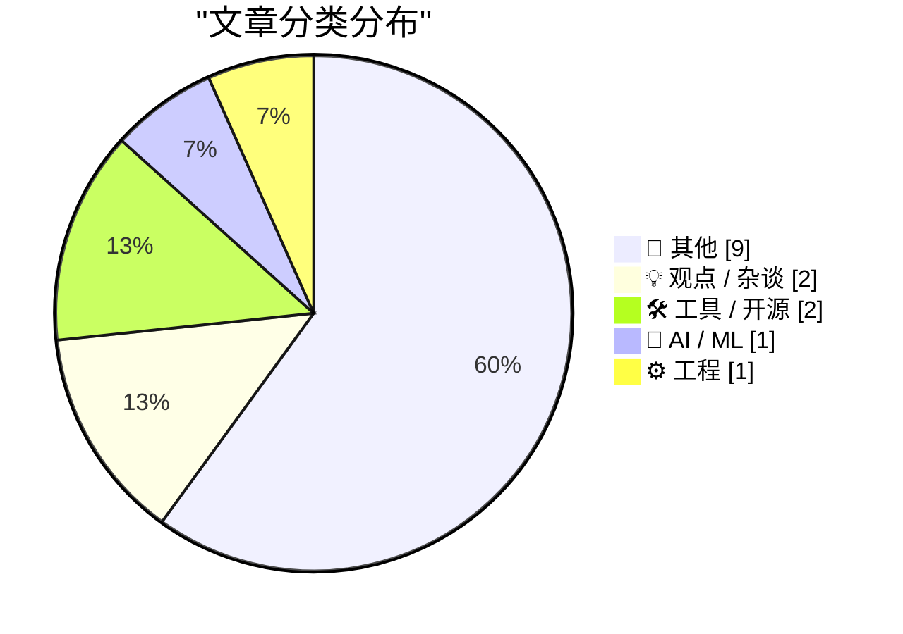
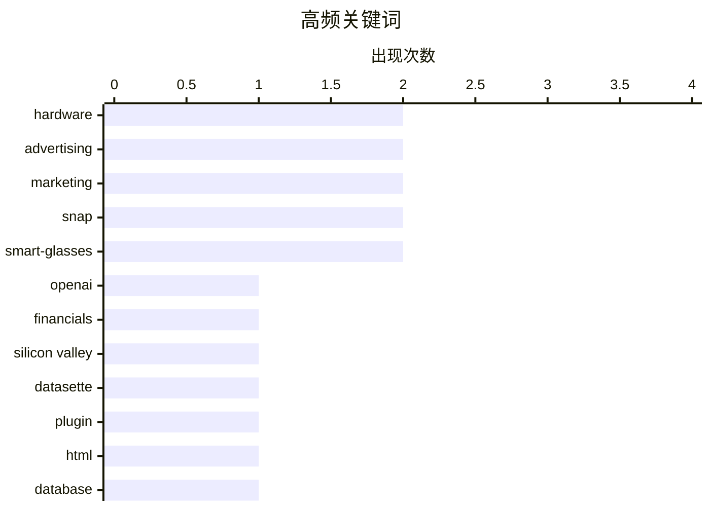

# 📰 AI 博客每日精选 — 2026-06-20

> 来自 Karpathy 推荐的 92 个顶级技术博客，AI 精选 Top 15

## 📝 今日看点

今日技术圈焦点集中在AI行业的财务现实与底层架构的演进。一方面，OpenAI巨额的收支缺口引发了市场对硅谷AI投资泡沫的深度担忧，同时业界再次强调海量底层数据才是支撑AI涌现能力的决定性力量。另一方面，去中心化网络协议正打破传统服务器节点模式，而各类开发工具与本地智能应用则愈发强调安全沙箱与设备端隐私保护。此外，流媒体平台的百亿级并购与旧款硬件换壳营销的真相，也折射出泛科技商业领域的资本博弈与祛魅过程。

---

## 🏆 今日必读

🥇 **硅谷泡沫（第二部分）：高级会员专享**

[Premium: The Silicon Valley Bubble (Part 2)](https://www.wheresyoured.at/premium-the-silicon-valley-bubble-part-2/) — wheresyoured.at · 2 小时前 · 💡 观点 / 杂谈

> OpenAI 2024及2025年的审计财务数据揭示了其在收入与支出上的巨大缺口。该公司花费了高达340亿美元，却仅产生了130.7亿美元的收入，引发了关于硅谷AI投资泡沫的广泛讨论与不同反应。作者深入剖析了这些惊人数字背后所隐藏的商业可持续性危机。结论指出，这种极其不平衡的烧钱速度是当前硅谷AI热潮存在严重泡沫的一个危险信号。

💡 **为什么值得读**: 通过独家披露的OpenAI真实财务数据，直观揭示了当前AI行业狂热背后的巨额亏损与潜在泡沫风险。

🏷️ OpenAI, financials, Silicon Valley

🥈 **Datasette Apps：在 Datasette 内托管自定义 HTML 应用**

[Datasette Apps: Host custom HTML applications inside Datasette](https://simonwillison.net/2026/Jun/18/datasette-apps/#atom-everything) — simonwillison.net · 19 小时前 · 🛠 工具 / 开源

> Datasette 推出了全新的插件 `datasette-apps`，允许开发者在 Datasette 环境中直接托管独立的 HTML+JavaScript 应用程序。这些应用在高度受限的安全沙箱内运行，确保了数据处理的隐私与安全。该方案提供了一种轻量级的方式来扩展 Datasette 的功能并构建定制化的交互界面。作者认为，这极大地降低了基于已有数据快速构建内部工具或前端面板的门槛。

💡 **为什么值得读**: 介绍了实用的Datasette新插件，为想要在现有数据集上快速构建安全前端应用的开发者提供了绝佳方案。

🏷️ Datasette, plugin, HTML, database

🥉 **AI 中心的数据黑洞**

[The data black hole at the center of AI](https://www.dwarkesh.com/p/the-sample-efficiency-black-hole-2) — dwarkesh.com · 2 小时前 · 🤖 AI / ML

> 现代AI系统展现出如同星系般璀璨的能力，但其核心却是一个巨大且难以察觉的“数据黑洞”。文章将AI的涌现能力与支撑这些能力的海量底层数据进行了隐喻式的对比，指出数据才是维系整个系统运转的决定性力量。我们在惊叹模型表现的同时，往往忽略了数据收集与处理所耗费的惊人资源。作者的核心观点是，这种对海量数据的极端依赖是AI繁荣背后不可忽视的本质。

💡 **为什么值得读**: 以生动且深刻的比喻揭示了海量底层数据才是驱动AI展现璀璨能力的真正核心，引人深思。

🏷️ AI, data, scaling laws

---

## 📊 数据概览

| 扫描源 | 抓取文章 | 时间范围 | 精选 |
|:---:|:---:|:---:|:---:|
| 81/92 | 2464 篇 → 15 篇 | 24h | **15 篇** |

### 分类分布



### 高频关键词



<details>
<summary>📈 纯文本关键词图（终端友好）</summary>

```
hardware       │ ████████████████████ 2
advertising    │ ████████████████████ 2
marketing      │ ████████████████████ 2
snap           │ ████████████████████ 2
smart-glasses  │ ████████████████████ 2
openai         │ ██████████░░░░░░░░░░ 1
financials     │ ██████████░░░░░░░░░░ 1
silicon valley │ ██████████░░░░░░░░░░ 1
datasette      │ ██████████░░░░░░░░░░ 1
plugin         │ ██████████░░░░░░░░░░ 1
```

</details>

### 🏷️ 话题标签

**hardware**(2) · **advertising**(2) · **marketing**(2) · snap(2) · smart-glasses(2) · openai(1) · financials(1) · silicon valley(1) · datasette(1) · plugin(1) · html(1) · database(1) · ai(1) · data(1) · scaling laws(1) · atproto(1) · bluesky(1) · architecture(1) · federation(1) · mac(1)

---

## 📝 其他

### 1. 将燃煤电厂改造为天然气电厂

[Converting Coal Plants to Natural Gas](https://www.construction-physics.com/p/converting-coal-plants-to-natural) — **construction-physics.com** · 7 小时前 · ⭐ 17/30

> 煤炭在过去几百年中一直是全球首选的发电燃料，但能源结构的转型促使大量燃煤电厂面临淘汰或改造。文章详细探讨了将现有燃煤电厂转化为天然气电厂的工程可行性、改造步骤与经济账。这种改造涉及涡轮机更换、排放系统重构以及现有电网基础设施的重新利用。结论指出，虽然改造初期投资巨大，但利用现有厂址和电网接入点能显著降低能源转型的总成本。

🏷️ energy, infrastructure, natural-gas

---

### 2. 福克斯以 250 亿美元收购 Roku 流媒体平台

[Fox to Buy Roku Streaming Service in $25 Billion Deal](https://www.wsj.com/business/deals/fox-roku-deal-f6e564f9?st=mKdQwC&amp;reflink=desktopwebshare_permalink) — **daringfireball.net** · 55 分钟前 · ⭐ 16/30

> 福克斯公司宣布以约 250 亿美元的价格收购流媒体平台 Roku，这是福克斯迄今为止最大的一笔交易。此次合并将福克斯在新闻和体育直播方面的内容优势与 Roku 在智能电视流媒体平台的霸主地位结合了起来。此举旨在扩大福克斯的广告支持流媒体业务规模，特别是整合其旗下的免费服务 Tubi。这笔交易标志着传统媒体巨头对广告支持流媒体未来的重大战略押注。

🏷️ Roku, streaming, acquisition

---

### 3. 奇幻策略游戏中的“金发姑娘原则”

[The Goldilocks Principle in Fantasy Strategy](https://www.filfre.net/2026/06/the-goldilocks-principle-in-fantasy-strategy/) — **filfre.net** · 3 小时前 · ⭐ 14/30

> 奇幻策略游戏的设计往往需要在复杂度与易上手性之间寻找完美的平衡点，这被称为“金发姑娘原则”（适度原则）。作者以耗费了其大量时间的经典游戏《英雄无敌2》为例，剖析了这种恰到好处的游戏机制设计。游戏既不能过于简单导致枯燥，也不能因为系统过于庞杂而让玩家望而生畏。结论强调，正是这种适中的数值与策略深度，造就了经典策略游戏的持久耐玩性。

🏷️ gaming, strategy games, game history

---

### 4. 特朗普 T1 手机实为镀金的两年前旧款 HTC U24 Pro

[Trump Mobile T1 Phone Is a Gold-Painted Two-Year-Old HTC U24 Pro](https://www.nbcnews.com/tech/gadgets/trump-mobile-t1-phone-nearly-identical-htc-device-analysis-rcna349293) — **daringfireball.net** · 38 分钟前 · ⭐ 13/30

> 备受争议的“特朗普 T1”手机在营销时曾标榜为“美国制造”，但最新的专业拆解揭示了其真实来源。iFixit 与 NBC 新闻的合作分析表明，这款手机在硬件上几乎与两年前台湾 HTC 公司发布的 U24 Pro 完全相同。除了外观上的镀金处理和品牌标识外，其内部零件和设计均源自现有的中国供应链。这一发现再次打破了其高端本土制造的虚假宣传。

🏷️ smartphone, hardware, teardown

---

### 5. Jay Miner：Atari 与 Amiga 电脑的设计师

[Jay Miner, Atari and Amiga computer designer](https://dfarq.homeip.net/jay-miner-atari-and-amiga-computer-designer/?utm_source=rss&#038;utm_medium=rss&#038;utm_campaign=jay-miner-atari-and-amiga-computer-designer) — **dfarq.homeip.net** · 8 小时前 · ⭐ 13/30

> Jay Miner 是一位杰出的硬件设计师，曾主导设计了 Atari 2600 游戏机、Atari 8 位电脑以及经典的 Amiga 电脑。在消费电子和早期个人电脑领域，他留下了极其深远的影响。不仅如此，他还将自己的技术专长应用于医疗领域，为人类福祉做出了额外贡献。作为计算机发展史上的传奇人物，作者高度赞扬了他的卓越成就，并将其视为心中的英雄。

🏷️ computer history, hardware, Atari

---

### 6. Verizon：曾经的“邪恶移动运营商”

[Verizon, Formerly Menace Mobile](https://www.youtube.com/watch?v=lzmntndEXWo) — **daringfireball.net** · 18 小时前 · ⭐ 12/30

> Verizon 推出了一支以《王牌大贱谍》为背景的两分钟全新广告，原班人马如 Mike Myers 等悉数回归。广告设定 Dr. Evil 提议成立一家定价和套餐极其令人困惑的无线运营商“Menace Mobile”。他的儿子在广告中吐槽这根本算不上邪恶。这种自嘲式的营销策略旨在凸显 Verizon 过去令人诟病的业务模式。同时，这也试图通过幽默拉近与消费者的距离。

🏷️ Verizon, advertising, marketing

---

### 7. Snap 推出由迈克尔·凯恩主演的 Specs 眼镜广告

[Snap Launches Ad Campaign for Specs Starring Michael Caine](https://www.reddit.com/r/funny/comments/1jk6onr/bloody_large_glasses_by_michael_caine/) — **daringfireball.net** · 2 小时前 · ⭐ 10/30

> Snap 公司为其智能眼镜产品 Specs 推出了全新的广告活动，并邀请著名演员迈克尔·凯恩主演。广告文案强调眼镜代表着权力，以及佩戴它们的权势人物。这种充满英伦幽默和复古风格的营销手段十分独特。其核心目的是引发大众对这款智能眼镜时尚属性的关注。尽管作者对这种设计的实际舒适度持保留态度，但依然认可其话题性。

🏷️ Snap, smart-glasses, advertising

---

### 8. 杰瑞·宋飞试戴 Snap 的 Specs 智能眼镜

[Jerry Seinfeld Tries Out Snap’s Specs](https://youtu.be/siM8NW24QPs?t=217) — **daringfireball.net** · 3 小时前 · ⭐ 10/30

> 著名脱口秀演员杰瑞·宋飞及其父亲亲自体验了 Snap 公司最新推出的 Specs 智能眼镜。在互动中，宋飞以一句“嘿，伙计，镜框不错”对该产品的外观设计给予了肯定。这一明星试戴体验活动通过轻松幽默的日常场景，有效提升了这款硬件产品的曝光度。此举展示了 Snap 在产品推广上对名人效应的重视。

🏷️ Snap, smart-glasses, wearables

---

### 9. 达美乐承认他们的披萨吃起来像硬纸板

[Domino’s Admitted Their Pizza Tasted Like Cardboard](https://www.inc.com/jeff-haden/10-years-ago-cardboard-pizza-almost-killed-dominos-then-dominos-did-something-brilliant.html) — **daringfireball.net** · 3 小时前 · ⭐ 7/30

> 达美乐披萨曾公开承认其产品口感极差，甚至“吃起来像硬纸板”。这与 Verizon 近期直面自身业务缺陷的公关策略如出一辙。通过回顾《Inc.》杂志的文章，可以看到达美乐在十多年前如何应对这场品牌危机。他们利用这种罕见的“自曝其短”的诚实态度，成功扭转了公众印象并实现了业务反弹。这种将劣势转化为信任的营销策略为现代企业公关提供了经典案例。

🏷️ marketing, business, branding

---

## 💡 观点 / 杂谈

### 10. 硅谷泡沫（第二部分）：高级会员专享

[Premium: The Silicon Valley Bubble (Part 2)](https://www.wheresyoured.at/premium-the-silicon-valley-bubble-part-2/) — **wheresyoured.at** · 2 小时前 · ⭐ 26/30

> OpenAI 2024及2025年的审计财务数据揭示了其在收入与支出上的巨大缺口。该公司花费了高达340亿美元，却仅产生了130.7亿美元的收入，引发了关于硅谷AI投资泡沫的广泛讨论与不同反应。作者深入剖析了这些惊人数字背后所隐藏的商业可持续性危机。结论指出，这种极其不平衡的烧钱速度是当前硅谷AI热潮存在严重泡沫的一个危险信号。

🏷️ OpenAI, financials, Silicon Valley

---

### 11. 全页瘫痪（完成比开始更难）

[Full Page Paralysis](https://blog.jim-nielsen.com/2026/full-page-paralysis/) — **blog.jim-nielsen.com** · 25 分钟前 · ⭐ 17/30

> 人们常说的“空白页综合症”往往用来形容开始的困难，但在软件和创意工作中，真正艰难的是最后的收尾阶段。文章指出，无论是软件开发中的“最后90%”还是物流中的“最后一公里”，最终阶段的阻力总是不成比例地巨大。因为收尾意味着作品将变得具体且有限，从而开始面对外界的审视与评判。作者认为，克服这种临近终点时的拖延与焦虑，是项目成功落地的关键。

🏷️ software development, productivity, psychology

---

## 🛠 工具 / 开源

### 12. Datasette Apps：在 Datasette 内托管自定义 HTML 应用

[Datasette Apps: Host custom HTML applications inside Datasette](https://simonwillison.net/2026/Jun/18/datasette-apps/#atom-everything) — **simonwillison.net** · 19 小时前 · ⭐ 25/30

> Datasette 推出了全新的插件 `datasette-apps`，允许开发者在 Datasette 环境中直接托管独立的 HTML+JavaScript 应用程序。这些应用在高度受限的安全沙箱内运行，确保了数据处理的隐私与安全。该方案提供了一种轻量级的方式来扩展 Datasette 的功能并构建定制化的交互界面。作者认为，这极大地降低了基于已有数据快速构建内部工具或前端面板的门槛。

🏷️ Datasette, plugin, HTML, database

---

### 13. Cotypist：Mac 上的智能自动补全工具

[Cotypist – Smart Autocomplete Utility for Mac](https://cotypist.app/) — **daringfireball.net** · 23 小时前 · ⭐ 21/30

> Cotypist 是一款专为 Mac 设计的 AI 驱动的智能文本自动补全工具。该应用完全依赖设备端的本地模型进行计算，最大程度地保护了用户隐私。它深度融入了 macOS 的设计语言和文件管理规范，提供了极其原生且符合苹果生态规范的使用体验。该工具能在光标处实时预测并建议接下来的几个词汇，从而有效提升日常打字效率。

🏷️ Mac, autocomplete, on-device-ai

---

## 🤖 AI / ML

### 14. AI 中心的数据黑洞

[The data black hole at the center of AI](https://www.dwarkesh.com/p/the-sample-efficiency-black-hole-2) — **dwarkesh.com** · 2 小时前 · ⭐ 24/30

> 现代AI系统展现出如同星系般璀璨的能力，但其核心却是一个巨大且难以察觉的“数据黑洞”。文章将AI的涌现能力与支撑这些能力的海量底层数据进行了隐喻式的对比，指出数据才是维系整个系统运转的决定性力量。我们在惊叹模型表现的同时，往往忽略了数据收集与处理所耗费的惊人资源。作者的核心观点是，这种对海量数据的极端依赖是AI繁荣背后不可忽视的本质。

🏷️ AI, data, scaling laws

---

## ⚙️ 工程

### 15. atproto 中没有“实例”的概念

[There Are No Instances in atproto](https://overreacted.io/there-are-no-instances-in-atproto/) — **overreacted.io** · 19 小时前 · ⭐ 23/30

> atproto 协议打破了传统联邦宇宙中依赖独立服务器节点的模式，其架构设计实际上并不存在传统的“实例”概念。文章将其与 RSS 和 Google Reader 的聚合模式进行类比，解释了身份与数据在协议层的彻底解耦。这种设计意味着用户的数据不再被单一服务器物理绑定，而是可以自由流动和聚合。作者认为，这种去中心化且灵活的架构是区别于传统平台的关键所在。

🏷️ atproto, Bluesky, architecture, federation

---

*生成于 2026-06-20 03:25 (Asia/Shanghai) | 扫描 81 源 → 获取 2464 篇 → 精选 15 篇*
*基于 [Hacker News Popularity Contest 2025](https://refactoringenglish.com/tools/hn-popularity/) RSS 源列表，由 [Andrej Karpathy](https://x.com/karpathy) 推荐*
*由「懂点儿AI」制作，欢迎关注同名微信公众号获取更多 AI 实用技巧 💡*
