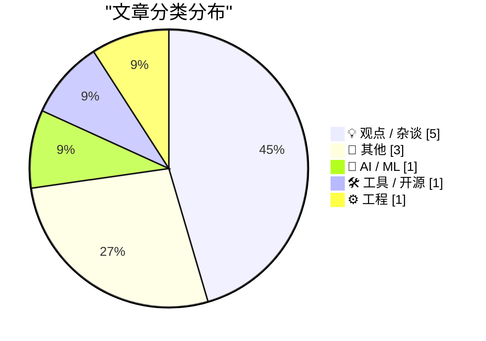
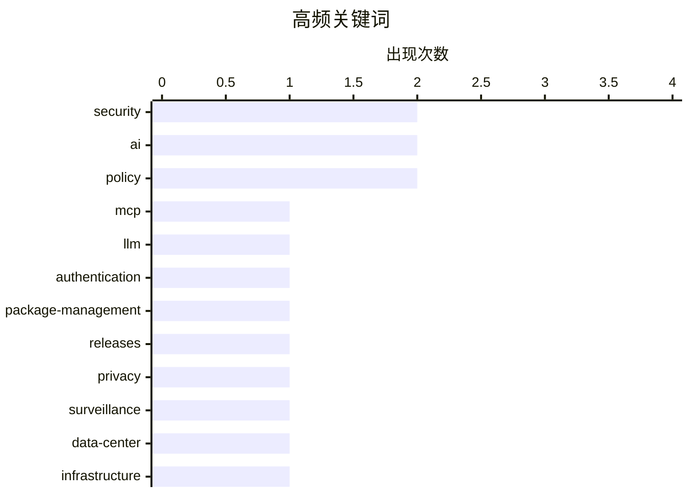

# 📰 AI 博客每日精选 — 2026-06-21

> 来自 Karpathy 推荐的 92 个顶级技术博客，AI 精选 Top 11

## 📝 今日看点

今日技术圈正掀起对生成式AI的“祛魅”与底层架构的深度反思。业界不仅犀利批判了单纯堆砌AI内容的“大骗局”，更开始理性探讨模型上下文协议（MCP）在安全认证隔离上的真实价值。与此同时，从包管理器的安全更新到SVG格式的开源协议争议，凸显了软件工程在合规与基建层面的持续演进。此外，技术落地与产品研发正展现出打破常规的务实视角，无论是探讨克服项目收尾的“最后阻碍”，还是提出将智能眼镜反向推销给老年群体，都表明行业正愈发关注真实的场景应用与效能转化。

---

## 🏆 今日必读

🥇 **引用 Sean Lynch 的话**

[Quoting Sean Lynch](https://simonwillison.net/2026/Jun/19/sean-lynch/#atom-everything) — simonwillison.net · 20 小时前 · 🤖 AI / ML

> MCP（模型上下文协议）相较于 skills/CLI 的真正核心价值，在于将认证流程隔离在智能体的上下文窗口之外，甚至完全脱离运行环境。理想状态下的 MCP 甚至可以仅仅作为 API 的认证网关。即便仅实现这一功能，也是一项重大的技术突破。

💡 **为什么值得读**: 深入探讨了 MCP（模型上下文协议）在 AI 智能体架构中的独特定位与核心价值，为理解认证流程隔离提供了全新视角。

🏷️ MCP, LLM, authentication

🥈 **本周包管理资讯：2026年6月20日**

[This Week in Package Management: 20 June 2026](https://nesbitt.io/2026/06/20/this-week-in-package-management.html) — nesbitt.io · 8 小时前 · 🛠 工具 / 开源

> 本周包管理领域的最新动态汇总，涵盖了各大包管理器的版本发布、安全公告以及相关技术文章。内容聚焦于生态系统内的关键更新与安全漏洞修复建议。读者可以通过此资讯快速掌握当前包管理行业的核心发展趋势。

💡 **为什么值得读**: 适合开发者和运维人员高效跟进包管理生态的最新版本发布与安全漏洞修复动态。

🏷️ package-management, releases, security

🥉 **Pluralistic：大骗局（2026年6月19日）**

[Pluralistic: The Big Con (19 Jun 2026)](https://pluralistic.net/2026/06/19/too-big-to-fact-check/) — pluralistic.net · 22 小时前 · 💡 观点 / 杂谈

> 作者犀利批评了当前科技领域的“大骗局”，指出单纯扩大生成式 AI 产生的垃圾内容堆并不能带来真正的价值。文章还回顾了包括 TVA 对阵 SETI@Home、W3C 对阵安全研究、以及 Meta 公开用户 AI 提示词等一系列近期热点事件。其核心观点是对当前 AI 泡沫和科技巨头行为的深刻质疑。

💡 **为什么值得读**: Cory Doctorow 对 AI 内容泛滥和科技巨头的犀利吐槽，为理解当前 AI 泡沫提供了批判性的社会学视角。

🏷️ AI, security, policy

---

## 📊 数据概览

| 扫描源 | 抓取文章 | 时间范围 | 精选 |
|:---:|:---:|:---:|:---:|
| 81/92 | 2464 篇 → 11 篇 | 24h | **11 篇** |

### 分类分布



### 高频关键词



<details>
<summary>📈 纯文本关键词图（终端友好）</summary>

```
security           │ ████████████████████ 2
ai                 │ ████████████████████ 2
policy             │ ████████████████████ 2
mcp                │ ██████████░░░░░░░░░░ 1
llm                │ ██████████░░░░░░░░░░ 1
authentication     │ ██████████░░░░░░░░░░ 1
package-management │ ██████████░░░░░░░░░░ 1
releases           │ ██████████░░░░░░░░░░ 1
privacy            │ ██████████░░░░░░░░░░ 1
surveillance       │ ██████████░░░░░░░░░░ 1
```

</details>

### 🏷️ 话题标签

**security**(2) · **ai**(2) · **policy**(2) · mcp(1) · llm(1) · authentication(1) · package-management(1) · releases(1) · privacy(1) · surveillance(1) · data-center(1) · infrastructure(1) · battery(1) · svg(1) · open-source(1) · licensing(1) · software-development(1) · productivity(1) · project-management(1) · learning(1)

---

## 💡 观点 / 杂谈

### 1. Pluralistic：大骗局（2026年6月19日）

[Pluralistic: The Big Con (19 Jun 2026)](https://pluralistic.net/2026/06/19/too-big-to-fact-check/) — **pluralistic.net** · 22 小时前 · ⭐ 20/30

> 作者犀利批评了当前科技领域的“大骗局”，指出单纯扩大生成式 AI 产生的垃圾内容堆并不能带来真正的价值。文章还回顾了包括 TVA 对阵 SETI@Home、W3C 对阵安全研究、以及 Meta 公开用户 AI 提示词等一系列近期热点事件。其核心观点是对当前 AI 泡沫和科技巨头行为的深刻质疑。

🏷️ AI, security, policy

---

### 2. Pluralistic：爱泼斯坦阶层是如何招募的（2026年6月20日）

[Pluralistic: How the Epstein Class recruits (20 Jun 2026)](https://pluralistic.net/2026/06/20/any-club-that-would-have-me/) — **pluralistic.net** · 2 小时前 · ⭐ 19/30

> 文章探讨了精英权贵阶层（如爱泼斯坦圈子）的招募机制与运作逻辑，揭示了顶级富豪阶层背后的社会网络。同时，作者还汇编了多篇科技与社会新闻，包括 MPAA 遭到华尔街日报抨击、Dweb 与创始人脆弱性的对抗，以及俄勒冈州对抗企业医疗等事件。文章旨在剖析权力与资本的深度交织。

🏷️ policy, privacy, surveillance

---

### 3. 整页瘫痪（完成项目的最后阻碍）

[Full Page Paralysis](https://blog.jim-nielsen.com/2026/full-page-paralysis/) — **blog.jim-nielsen.com** · 23 小时前 · ⭐ 18/30

> 人们常说的“空白页瘫痪”指的是开始做一件事很困难，但实际上，完成项目才是最艰难的环节。就像软件开发中的“最后的 90%”或物流中的“最后一公里”，最后冲刺阶段往往困难重重。因为“完成”意味着项目变得真实、有限，并开始接受外界的评判，这常常让创作者在临近终点时感到畏惧。

🏷️ software-development, productivity, project-management

---

### 4. 我会功夫（I know Kung-fu）

[I know Kung-fu](https://idiallo.com/blog/i-know-kung-fu) — **idiallo.com** · 15 小时前 · ⭐ 16/30

> 《黑客帝国》中尼奥通过直接上传学会功夫的场景暗示了“只要信息触手可及，知识仅需上传至大脑”的设想。然而，这种认知忽略了从获取信息到真正掌握技能之间的巨大鸿沟。文章指出，单纯的信息获取并不等同于实践能力的形成。真正的知识需要通过实践与内化，而不仅仅是信息的被动接收。

🏷️ learning, AI, skills

---

### 5. “老爷爷和老花镜是怎么回事？”（探讨老年群体与智能眼镜）

[‘What’s the Deal With Old Guys and Giant Glasses?’](https://www.youtube.com/watch?v=8DYGxn6Xvt0) — **daringfireball.net** · 17 小时前 · ⭐ 8/30

> 科技产品的早期采用通常被认为是年轻人的专利，但 Snap Specs（智能眼镜）可能会颠覆这一传统观念。作者探讨了将智能眼镜直接推销给养老院老年群体的可能性。这种反常规的市场定位或许能为可穿戴设备打开新的受众市场。

🏷️ gadgets, aging

---

## 📝 其他

### 6. 阅读清单：2026年6月20日

[Reading List 06/20/26](https://www.construction-physics.com/p/reading-list-062026) — **construction-physics.com** · 6 小时前 · ⭐ 19/30

> 本期阅读清单推荐了多份关于建筑与房地产领域的重磅文章，涵盖了一项全新的住房法案以及通用汽车进军电网级电池市场的动态。此外，清单还收录了对数据中心建设延误的质疑以及固态空调技术的最新进展。这些内容为关注建筑物理和基础设施发展的读者提供了高价值的行业洞察。

🏷️ data-center, infrastructure, battery

---

### 7. Bobby Prince 逝世

[Bobby Prince has died](https://oldvcr.blogspot.com/feeds/8983624217005254252/comments/default) — **oldvcr.blogspot.com** · 17 小时前 · ⭐ 16/30

> 90年代传奇 FPS 游戏音乐人、id Software 长期合作伙伴 Bobby Prince 享年 81 岁逝世。他曾为《指挥官基恩》、《德军总部 3D》以及后续经典游戏创作了极具标志性的配乐，其音乐风格从早期的可爱滑稽完美过渡到了后期硬核的射击游戏风格。他的离世标志着早期电子游戏黄金时代一位重要声音的消逝。

🏷️ obituary, game-music, id-Software

---

### 8. “抱歉，我们以前很难喝”真实广告档案又一案例：嘉士伯啤酒

[Another One for the ‘Sorry, We Used to Be Crap’ Truth-in-Advertising File: Carlsberg Beer](https://www.independent.co.uk/news/business/news/carlsberg-probably-not-best-beer-in-world-lager-brewer-a8874016.html) — **daringfireball.net** · 17 小时前 · ⭐ 6/30

> 丹麦啤酒品牌嘉士伯承认其使用了40年的广告语“可能是世界上最好的啤酒”并不属实。面对不断下滑的销量和消费者对口感日益严厉的批评，嘉士伯不仅推出了全新的啤酒配方，还采取了极其坦诚的营销策略。新营销活动直言“可能不是世界上最好的啤酒，所以我们改变了它”，以此作为品牌重塑的切入点。这种“自黑”式的反向营销表明，承认产品缺陷并辅以实质性改进，反而能有效挽回消费者的信任。

🏷️ advertising, marketing

---

## 🤖 AI / ML

### 9. 引用 Sean Lynch 的话

[Quoting Sean Lynch](https://simonwillison.net/2026/Jun/19/sean-lynch/#atom-everything) — **simonwillison.net** · 20 小时前 · ⭐ 22/30

> MCP（模型上下文协议）相较于 skills/CLI 的真正核心价值，在于将认证流程隔离在智能体的上下文窗口之外，甚至完全脱离运行环境。理想状态下的 MCP 甚至可以仅仅作为 API 的认证网关。即便仅实现这一功能，也是一项重大的技术突破。

🏷️ MCP, LLM, authentication

---

## 🛠 工具 / 开源

### 10. 本周包管理资讯：2026年6月20日

[This Week in Package Management: 20 June 2026](https://nesbitt.io/2026/06/20/this-week-in-package-management.html) — **nesbitt.io** · 8 小时前 · ⭐ 22/30

> 本周包管理领域的最新动态汇总，涵盖了各大包管理器的版本发布、安全公告以及相关技术文章。内容聚焦于生态系统内的关键更新与安全漏洞修复建议。读者可以通过此资讯快速掌握当前包管理行业的核心发展趋势。

🏷️ package-management, releases, security

---

## ⚙️ 工程

### 11. 哪种 Copyleft 许可证适合 SVG 格式？

[Which Copyleft Licence is Suitable for an SVG?](https://shkspr.mobi/blog/2026/06/which-copyleft-licence-is-suitable-for-an-svg/) — **shkspr.mobi** · 7 小时前 · ⭐ 18/30

> SVG（可缩放矢量图形）是一种基于 XML 并使用数学运算来精准定义图像的格式，具有在任何尺寸下都清晰锐利的优势。文章探讨了在开源协议体系中，如何为这种融合了代码与艺术特性的 SVG 格式选择合适的 Copyleft 许可证。作者针对 SVG 既被视为代码又被视为图像的双重属性，剖析了许可证选择的复杂性。

🏷️ SVG, open-source, licensing

---

*生成于 2026-06-21 02:57 (Asia/Shanghai) | 扫描 81 源 → 获取 2464 篇 → 精选 11 篇*
*基于 [Hacker News Popularity Contest 2025](https://refactoringenglish.com/tools/hn-popularity/) RSS 源列表，由 [Andrej Karpathy](https://x.com/karpathy) 推荐*
*由「懂点儿AI」制作，欢迎关注同名微信公众号获取更多 AI 实用技巧 💡*
