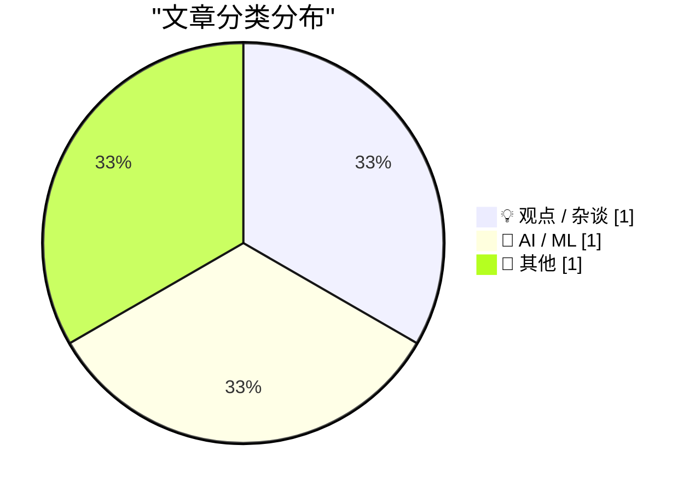
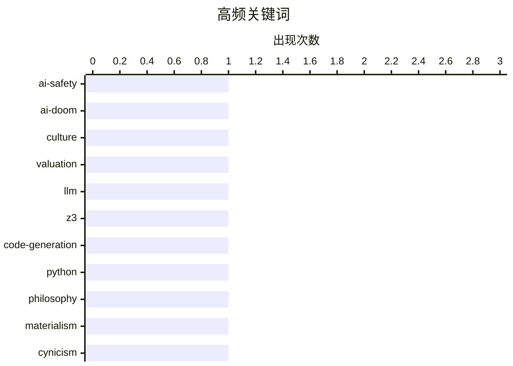

# 📰 AI 博客每日精选 — 2026-06-22

> 来自 Karpathy 推荐的 92 个顶级技术博客，AI 精选 Top 3

## 📝 今日看点

今日技术圈的焦点呈现出“工具应用”与“行业反思”并行的趋势。在工程实践方面，大语言模型正被广泛作为生产力工具，用于生成代码并解决复杂的逻辑与数学谜题。与此同时，行业内部对当前的AI文化与科技价值观展开了深刻批判。多位观察者直指科技圈内利用“末日论”炒作估值、以及陷入庸俗唯物主义与极端犬儒心态的浮躁现象，呼吁在技术狂奔中回归理性的底层思考。

---

## 🏆 今日必读

🥇 **末日论印证了估值**

[The doom justifies the valuation](https://geohot.github.io//blog/jekyll/update/2026/06/21/the-doom-justifies-the-valuation.html) — geohot.github.io · 11 小时前 · 💡 观点 / 杂谈

> George Hotz 观察到伯克利 AI 圈子中存在一种极端的“无神论享乐主义”文化。他们将“AI 末日论”视为证明自身人生选择、追求影响力和估值的借口。作者指出这种极端的心态和内卷现象导致了当地环境的恶化，甚至引发了人们对旧金山现状的尖锐讽刺。这种对末日论的病态依赖，本质上是为了掩盖行业内的过度竞争与虚无主义。

💡 **为什么值得读**: 了解知名黑客 George Hotz 对当前硅谷 AI 末日论与内卷文化的犀利批评与独特视角。

🏷️ AI-safety, AI-doom, culture, valuation

🥈 **在 6x5 棋盘上放置所有棋子**

[All pieces on a 6 by 5 board](https://www.johndcook.com/blog/2026/06/20/z3-python-claude/) — johndcook.com · 21 小时前 · 🤖 AI / ML

> 探讨如何利用大语言模型（LLM）生成代码来解决复杂的国际象棋谜题。文章记录了使用 Claude 生成 Z3/Python 代码的实践过程，以解决在 6x5 棋盘上放置所有国际象棋棋子（国王、王后、双车等）的特定排布问题。这是继之前使用 Claude 和 ChatGPT 生成 Prolog 代码之后的进一步尝试。实验展示了 LLM 在结合形式化验证工具（如 Z3 约束求解器）解决复杂逻辑问题方面的应用潜力。

💡 **为什么值得读**: 展示了如何通过提示词引导 LLM 结合 Z3 约束求解器解决复杂的逻辑推理问题，为 AI 辅助编程提供实用参考。

🏷️ LLM, Z3, code-generation, Python

🥉 **论庸俗唯物主义**

[On Vulgar Materialism](https://borretti.me/article/on-vulgar-materialism) — borretti.me · 18 小时前 · 📝 其他

> 探讨了科技或哲学领域中“庸俗唯物主义”的本质及其带来的认知陷阱。文章提出“足够先进的犬儒主义与天真无异”这一核心观点，揭示了极端的悲观与犬儒态度最终会演变成一种盲目的天真。作者借此批判了当下技术圈内过度简化物质与技术决定论的思潮。这种思想倾向往往会导致思维的僵化，需要引起人们的警惕。

💡 **为什么值得读**: 以独特的哲学视角审视科技圈的犬儒主义与庸俗唯物论，为理解复杂的技术决定论提供深刻的思想启发。

🏷️ philosophy, materialism, cynicism

---

## 📊 数据概览

| 扫描源 | 抓取文章 | 时间范围 | 精选 |
|:---:|:---:|:---:|:---:|
| 82/92 | 2482 篇 → 3 篇 | 24h | **3 篇** |

### 分类分布



### 高频关键词



<details>
<summary>📈 纯文本关键词图（终端友好）</summary>

```
ai-safety       │ ████████████████████ 1
ai-doom         │ ████████████████████ 1
culture         │ ████████████████████ 1
valuation       │ ████████████████████ 1
llm             │ ████████████████████ 1
z3              │ ████████████████████ 1
code-generation │ ████████████████████ 1
python          │ ████████████████████ 1
philosophy      │ ████████████████████ 1
materialism     │ ████████████████████ 1
```

</details>

### 🏷️ 话题标签

**ai-safety**(1) · **ai-doom**(1) · **culture**(1) · valuation(1) · llm(1) · z3(1) · code-generation(1) · python(1) · philosophy(1) · materialism(1) · cynicism(1)

---

## 💡 观点 / 杂谈

### 1. 末日论印证了估值

[The doom justifies the valuation](https://geohot.github.io//blog/jekyll/update/2026/06/21/the-doom-justifies-the-valuation.html) — **geohot.github.io** · 11 小时前 · ⭐ 23/30

> George Hotz 观察到伯克利 AI 圈子中存在一种极端的“无神论享乐主义”文化。他们将“AI 末日论”视为证明自身人生选择、追求影响力和估值的借口。作者指出这种极端的心态和内卷现象导致了当地环境的恶化，甚至引发了人们对旧金山现状的尖锐讽刺。这种对末日论的病态依赖，本质上是为了掩盖行业内的过度竞争与虚无主义。

🏷️ AI-safety, AI-doom, culture, valuation

---

## 🤖 AI / ML

### 2. 在 6x5 棋盘上放置所有棋子

[All pieces on a 6 by 5 board](https://www.johndcook.com/blog/2026/06/20/z3-python-claude/) — **johndcook.com** · 21 小时前 · ⭐ 19/30

> 探讨如何利用大语言模型（LLM）生成代码来解决复杂的国际象棋谜题。文章记录了使用 Claude 生成 Z3/Python 代码的实践过程，以解决在 6x5 棋盘上放置所有国际象棋棋子（国王、王后、双车等）的特定排布问题。这是继之前使用 Claude 和 ChatGPT 生成 Prolog 代码之后的进一步尝试。实验展示了 LLM 在结合形式化验证工具（如 Z3 约束求解器）解决复杂逻辑问题方面的应用潜力。

🏷️ LLM, Z3, code-generation, Python

---

## 📝 其他

### 3. 论庸俗唯物主义

[On Vulgar Materialism](https://borretti.me/article/on-vulgar-materialism) — **borretti.me** · 18 小时前 · ⭐ 11/30

> 探讨了科技或哲学领域中“庸俗唯物主义”的本质及其带来的认知陷阱。文章提出“足够先进的犬儒主义与天真无异”这一核心观点，揭示了极端的悲观与犬儒态度最终会演变成一种盲目的天真。作者借此批判了当下技术圈内过度简化物质与技术决定论的思潮。这种思想倾向往往会导致思维的僵化，需要引起人们的警惕。

🏷️ philosophy, materialism, cynicism

---

*生成于 2026-06-22 02:57 (Asia/Shanghai) | 扫描 82 源 → 获取 2482 篇 → 精选 3 篇*
*基于 [Hacker News Popularity Contest 2025](https://refactoringenglish.com/tools/hn-popularity/) RSS 源列表，由 [Andrej Karpathy](https://x.com/karpathy) 推荐*
*由「懂点儿AI」制作，欢迎关注同名微信公众号获取更多 AI 实用技巧 💡*
