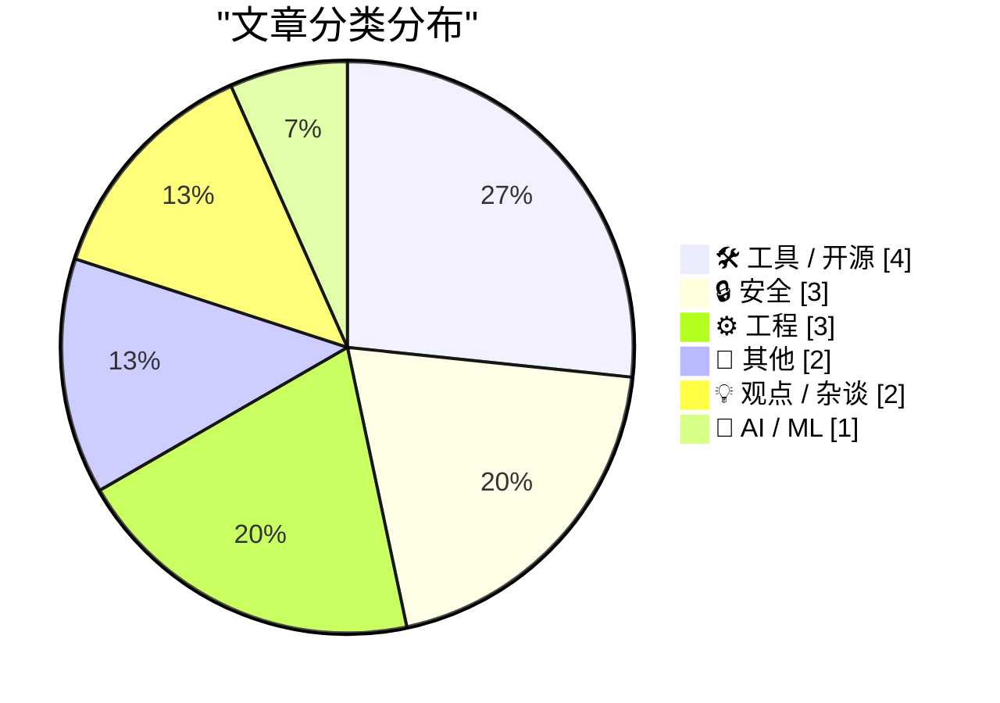
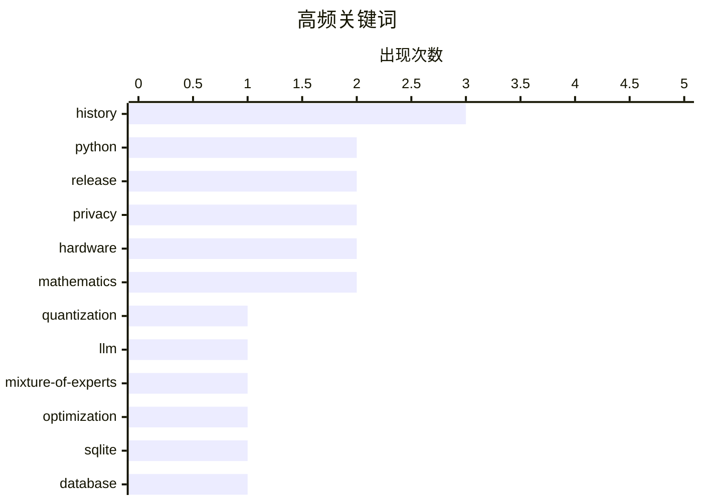

# 📰 AI 博客每日精选 — 2026-06-23

> 来自 Karpathy 推荐的 92 个顶级技术博客，AI 精选 Top 15

## 📝 今日看点

今日技术圈聚焦于人工智能的深度优化与日益严峻的安全隐私挑战。在AI领域，混合专家模型的极致量化策略与专为AI代理设计的无门槛云部署方案，标志着AI基础设施正快速向高效能与智能化演进。与此同时，网络安全话题引发热议，无论是针对商务旅客的实战防护指南，还是对知名网站数据共享行为的严厉曝光，都凸显了当前数字世界暗藏的隐私危机。此外，经典开发者工具sqlite-utils迎来包含嵌套事务在内的重磅更新，苹果新系统的UI变革与受供应链影响的潜在涨价同样备受业界瞩目。

---

## 🏆 今日必读

🥇 **专家感知量化：以接近 Q2 的大小实现接近 Q4 的质量？**

[Expert-aware quantisation: near-Q4 quality at near-Q2 size?](https://martinalderson.com/posts/expert-aware-quantisation/?utm_source=rss&amp;utm_medium=rss&amp;utm_campaign=feed) — martinalderson.com · 20 小时前 · 🤖 AI / ML

> 针对混合专家模型在特定任务下不同专家重要性不同的问题，提出了一种基于性能分析的量化策略。该方法通过分析找出对特定任务至关重要的“热”专家，并对不活跃的“冷”专家进行极度激进的量化压缩。实验结果表明，这种策略能够在保持接近 Q4 量化精度的同时，实现接近 Q2 量化的体积缩减。这为在本地环境高效运行大型 MoE 模型提供了极具潜力的解决方案。

💡 **为什么值得读**: 如果你需要在本地资源受限的设备上运行庞大的 MoE 模型，这种非对称量化思路能帮你找到性能与体积的最佳平衡点。

🏷️ quantization, LLM, mixture-of-experts, optimization

🥈 **sqlite-utils 4.0rc1 新增迁移和嵌套事务功能**

[sqlite-utils 4.0rc1 adds migrations and nested transactions](https://simonwillison.net/2026/Jun/21/sqlite-utils-40rc1/#atom-everything) — simonwillison.net · 20 小时前 · 🛠 工具 / 开源

> sqlite-utils 作为一个结合了 Python 库和 CLI 工具的 SQLite 数据库管理工具，发布了 4.0rc1 版本。新版本在 Python 默认的 sqlite3 包之上，引入了对复杂数据表转换、自动建表等高级操作的支持。此次更新的核心亮点是增加了数据库迁移和嵌套事务处理能力，大幅提升了开发者的数据库管理效率。

💡 **为什么值得读**: SQLite 开发者必看，了解 sqlite-utils 最新版本如何通过原生迁移和嵌套事务功能简化数据库管理流程。

🏷️ sqlite, python, database, release

🥉 **面向 AI 代理的临时 Cloudflare 账户**

[Temporary Cloudflare Accounts for AI agents](https://simonwillison.net/2026/Jun/21/temporary-cloudflare-accounts/#atom-everything) — simonwillison.net · 22 小时前 · 🛠 工具 / 开源

> Cloudflare 推出了一项名为“临时账户”的新功能，允许用户在不注册账户的情况下直接部署 Cloudflare Workers 项目。官方宣称该功能专为 AI 代理设计，但其免注册即可通过 `npx wrangler deploy --temporary` 部署的特性，实际上对所有开发者都具有极高的实用价值。这大幅降低了 Serverless 应用部署的门槛，实现了真正的即开即用。

💡 **为什么值得读**: 了解 Cloudflare 如何通过零门槛的免注册部署体验，彻底改变 Serverless 应用的启动和测试方式。

🏷️ cloudflare, ai-agents, accounts

---

## 📊 数据概览

| 扫描源 | 抓取文章 | 时间范围 | 精选 |
|:---:|:---:|:---:|:---:|
| 80/92 | 2455 篇 → 19 篇 | 24h | **15 篇** |

### 分类分布



### 高频关键词



<details>
<summary>📈 纯文本关键词图（终端友好）</summary>

```
history            │ ████████████████████ 3
python             │ █████████████░░░░░░░ 2
release            │ █████████████░░░░░░░ 2
privacy            │ █████████████░░░░░░░ 2
hardware           │ █████████████░░░░░░░ 2
mathematics        │ █████████████░░░░░░░ 2
quantization       │ ███████░░░░░░░░░░░░░ 1
llm                │ ███████░░░░░░░░░░░░░ 1
mixture-of-experts │ ███████░░░░░░░░░░░░░ 1
optimization       │ ███████░░░░░░░░░░░░░ 1
```

</details>

### 🏷️ 话题标签

**history**(3) · **python**(2) · **release**(2) · privacy(2) · hardware(2) · mathematics(2) · quantization(1) · llm(1) · mixture-of-experts(1) · optimization(1) · sqlite(1) · database(1) · cloudflare(1) · ai-agents(1) · accounts(1) · sqlite-utils(1) · cybersecurity(1) · travel(1) · espionage(1) · macos(1)

---

## 🛠 工具 / 开源

### 1. sqlite-utils 4.0rc1 新增迁移和嵌套事务功能

[sqlite-utils 4.0rc1 adds migrations and nested transactions](https://simonwillison.net/2026/Jun/21/sqlite-utils-40rc1/#atom-everything) — **simonwillison.net** · 20 小时前 · ⭐ 24/30

> sqlite-utils 作为一个结合了 Python 库和 CLI 工具的 SQLite 数据库管理工具，发布了 4.0rc1 版本。新版本在 Python 默认的 sqlite3 包之上，引入了对复杂数据表转换、自动建表等高级操作的支持。此次更新的核心亮点是增加了数据库迁移和嵌套事务处理能力，大幅提升了开发者的数据库管理效率。

🏷️ sqlite, python, database, release

---

### 2. 面向 AI 代理的临时 Cloudflare 账户

[Temporary Cloudflare Accounts for AI agents](https://simonwillison.net/2026/Jun/21/temporary-cloudflare-accounts/#atom-everything) — **simonwillison.net** · 22 小时前 · ⭐ 24/30

> Cloudflare 推出了一项名为“临时账户”的新功能，允许用户在不注册账户的情况下直接部署 Cloudflare Workers 项目。官方宣称该功能专为 AI 代理设计，但其免注册即可通过 `npx wrangler deploy --temporary` 部署的特性，实际上对所有开发者都具有极高的实用价值。这大幅降低了 Serverless 应用部署的门槛，实现了真正的即开即用。

🏷️ cloudflare, ai-agents, accounts

---

### 3. sqlite-utils 4.0rc1

[sqlite-utils 4.0rc1](https://simonwillison.net/2026/Jun/21/sqlite-utils/#atom-everything) — **simonwillison.net** · 20 小时前 · ⭐ 20/30

> Simon Willison 宣布发布 sqlite-utils 4.0rc1 版本。这是一个简单的版本发布公告，指向了关于新功能的详细介绍页面。此次更新的核心内容包括数据库迁移和嵌套事务支持等高级特性。

🏷️ sqlite-utils, python, release

---

### 4. Mux：面向开发者的视频智能基础设施

[Mux — Video for Developers](https://www.mux.com/?utm_campaign=fireball&amp;utm_source=DF) — **daringfireball.net** · 22 小时前 · ⭐ 13/30

> 视频文件中包含海量的音频、对象和场景数据，传统技术栈通常难以直接读取这些深层信息。Mux Robots 能够将底层的视频数据转化为可操作的视频智能。开发者只需配置一次视频工作流，系统即可对所有新上传的内容自动执行提问、生成摘要或提取关键时刻等操作。该方案完全无需依赖资产 Webhooks 或自建中间件代码，极大降低了视频处理的后端开发门槛。

🏷️ video, api, mux

---

## 🔒 安全

### 5. 偏执型商务旅客的网络安全指南

[Cybersecurity for the paranoid business traveller](https://shkspr.mobi/blog/2026/06/cybersecurity-for-the-paranoid-business-traveller/) — **shkspr.mobi** · 8 小时前 · ⭐ 20/30

> 针对商务旅行者面临的日益严重的网络间谍、勒索及国家级黑客攻击威胁，文章汇总了一系列实用的安全建议。作者基于多年协助不同风险容忍度组织的经验，指出了许多企业对员工出行安全威胁存在轻视的问题。这份指南为那些需要高度保护商业机密和个人隐私的“偏执型”旅客提供了一套操作性强的高级别防御策略。

🏷️ cybersecurity, travel, privacy, espionage

---

### 6. 本周恶劣行径：The Observer 的隐私侵犯

[Dickover of the Week: The Observer](https://bvsveera.net/observer-dickover/) — **daringfireball.net** · 3 小时前 · ⭐ 16/30

> 针对 The Observer 网站标榜保护隐私却在后台将用户数据共享给 161 个第三方合作伙伴的虚伪行为进行了严厉批评。作者指出，这种行为就像是你在 1791 年买了一份报纸，却有 161 个人全天候跟踪记录你的一切行动。文章认为，在一个网站上植入 161 个第三方追踪器不仅是糟糕的体验，更是一种反乌托邦式的数据监控。

🏷️ privacy, data-sharing, tracking

---

### 7. Matt 当时在想什么？

[What Was Matt Thinking?](https://feed.tedium.co/link/15204/17365463/matts-script-archive-retrospective) — **tedium.co** · 1 小时前 · ⭐ 16/30

> 文章回顾了 1996 年由一名高中生开发的经典早期网络程序库 Matt's Script Archive。虽然作者指出该程序库在构建时完全没有考虑安全性并导致了大量漏洞，但它并非只有负面历史。文章探讨了这套曾经风靡全球论坛和留言板的代码库在互联网早期的历史意义和深远影响。

🏷️ history, perl, vulnerabilities, cgi

---

## ⚙️ 工程

### 8. 纪念在单词下划出红色和绿色波浪线的人

[In memory of the man who put red and green squiggles under words](https://devblogs.microsoft.com/oldnewthing/20260622-00/?p=112451) — **devblogs.microsoft.com/oldnewthing** · 6 小时前 · ⭐ 16/30

> 文章旨在纪念拼写和语法检查功能（即文字下方的红绿波浪线）的发明者。这项技术最初起源于 Microsoft Word，随后扩展到了几乎所有其他文字处理软件甚至非文字处理应用中。作者借此文回顾了这一深刻影响现代数字文本编辑体验的伟大创举。

🏷️ history, spell-check, word-processor

---

### 9. 洛巴切夫斯基积分公式

[Lobachevsky’s integral formula](https://www.johndcook.com/blog/2026/06/22/lobachevskys-integral-formula/) — **johndcook.com** · 24 分钟前 · ⭐ 15/30

> 洛巴切夫斯基积分公式展示了周期为π的偶函数所具备的显著数学性质。该定理在傅里叶分析和信号处理领域具有重要且直接的应用价值。即使在 f(x) = 1 的特殊情况下，该公式依然能提供有意义的数学洞察。它是处理复杂信号周期性积分与求和问题的有力理论工具。

🏷️ mathematics, signal-processing, fourier-analysis

---

### 10. 素数阶棋盘上的皇后问题

[Queens on a prime order board](https://www.johndcook.com/blog/2026/06/21/queens-prime/) — **johndcook.com** · 20 小时前 · ⭐ 14/30

> N皇后问题要求在n×n的棋盘上放置n个皇后且使其互不攻击。当棋盘阶数n为大于等于5的素数时，存在一种极其优雅的几何求解策略。只需将皇后放置在斜率为2、3、4等特定数值的直线上，即可满足无任何水平、垂直或对角线攻击的条件。这为数论与经典组合谜题的结合提供了一个巧妙的数学证明。

🏷️ algorithms, mathematics, n-queens

---

## 📝 其他

### 11. MacOS 27 Golden Gate Beta 1 图标更新前后对比

[Before and After: MacOS 27 Golden Gate Beta 1’s App Icons](https://basicappleguy.com/basicappleblog/macos-golden-gate-icon-comparison) — **daringfireball.net** · 21 小时前 · ⭐ 17/30

> 针对 macOS Golden Gate 第一个测试版中应用图标的视觉变化，文章进行了详细的前后对比分析。新系统采用了色彩更加大胆的设计，调整了部分图标，并显著改变了 Liquid Glass 效果的折射表现（如 Journal 图标）。整体而言，新图标呈现出更高的锐度以及液态玻璃效果的扁平化趋势。

🏷️ macos, ui, design

---

### 12. AMD Athlon：1999年改变游戏规则的AMD处理器

[AMD Athlon: AMD’s game changing CPU from 1999](https://dfarq.homeip.net/amd-athlon-amds-game-changing-cpu-from-1999/?utm_source=rss&#038;utm_medium=rss&#038;utm_campaign=amd-athlon-amds-game-changing-cpu-from-1999) — **dfarq.homeip.net** · 9 小时前 · ⭐ 12/30

> AMD于1999年6月23日发布了备受瞩目的Athlon（速龙）CPU，作为其大获成功的K6处理器的继任者。该处理器在不到两个月后的8月9日正式推向市场。Athlon凭借其出色的架构设计，成功打破了当时的市场格局。它不仅是AMD发展史上的关键转折点，更是真正奠定AMD与Intel在高端CPU市场分庭抗礼地位的核心产品。

🏷️ hardware, history, cpu, amd

---

## 💡 观点 / 杂谈

### 13. 苹果即将提高设备价格——但会在何时？

[Apple Is Going to Raise Device Prices — but When?](https://x.com/markgurman/status/2067741507273289766) — **daringfireball.net** · 21 分钟前 · ⭐ 16/30

> 由于近期 RAM 和 SSD 价格的大幅上涨，苹果 CEO Tim Cook 罕见地公开警告称即将上调产品售价。知名记者 Mark Gurman 推测，考虑到苹果即将开启的“返校季”促销活动，此次涨价可能会在近期迅速落地，以促销作为缓冲。文章认为苹果产品涨价已迫在眉睫，不会推迟到今年秋季。

🏷️ apple, hardware, pricing

---

### 14. Pluralistic：好的政治（2026年6月22日）

[Pluralistic: Good politics (22 Jun 2026)](https://pluralistic.net/2026/06/22/8-for-what-we-will/) — **pluralistic.net** · 3 小时前 · ⭐ 14/30

> 核心政治理念在于通过切实改善人民生活来体现真正的“好政治”。文章汇编了近期科技与文化领域的诸多热点事件与批判，涵盖Xbox安全失误、GPU“排放门”以及Peloton变砖跑步机等产品争议。同时也探讨了诸如为了在监狱获得医疗保健而抢银行等极端社会现象，并对Juul的伪科学和奇点怀疑论进行了尖锐点评。整体折射出对当前科技资本运作与社会福利制度的深刻反思。

🏷️ politics, internet-culture, linkblog

---

## 🤖 AI / ML

### 15. 专家感知量化：以接近 Q2 的大小实现接近 Q4 的质量？

[Expert-aware quantisation: near-Q4 quality at near-Q2 size?](https://martinalderson.com/posts/expert-aware-quantisation/?utm_source=rss&amp;utm_medium=rss&amp;utm_campaign=feed) — **martinalderson.com** · 20 小时前 · ⭐ 25/30

> 针对混合专家模型在特定任务下不同专家重要性不同的问题，提出了一种基于性能分析的量化策略。该方法通过分析找出对特定任务至关重要的“热”专家，并对不活跃的“冷”专家进行极度激进的量化压缩。实验结果表明，这种策略能够在保持接近 Q4 量化精度的同时，实现接近 Q2 量化的体积缩减。这为在本地环境高效运行大型 MoE 模型提供了极具潜力的解决方案。

🏷️ quantization, LLM, mixture-of-experts, optimization

---

*生成于 2026-06-23 04:27 (Asia/Shanghai) | 扫描 80 源 → 获取 2455 篇 → 精选 15 篇*
*基于 [Hacker News Popularity Contest 2025](https://refactoringenglish.com/tools/hn-popularity/) RSS 源列表，由 [Andrej Karpathy](https://x.com/karpathy) 推荐*
*由「懂点儿AI」制作，欢迎关注同名微信公众号获取更多 AI 实用技巧 💡*
