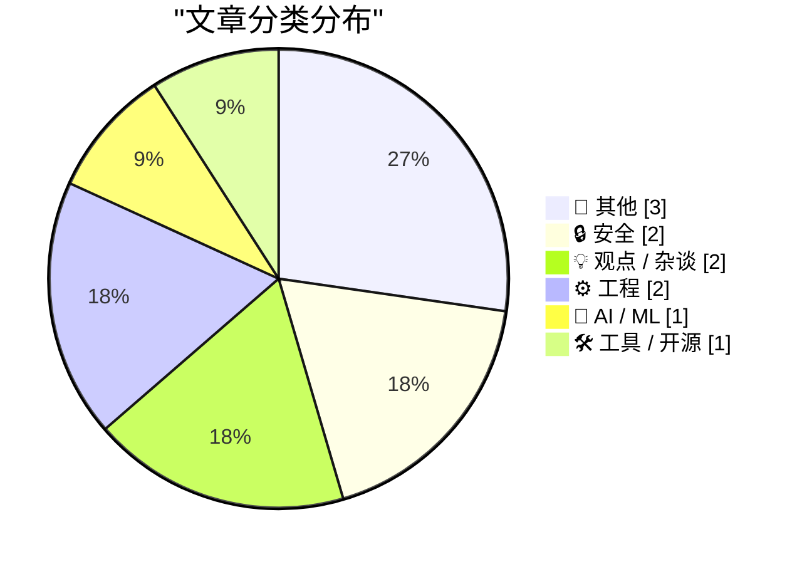
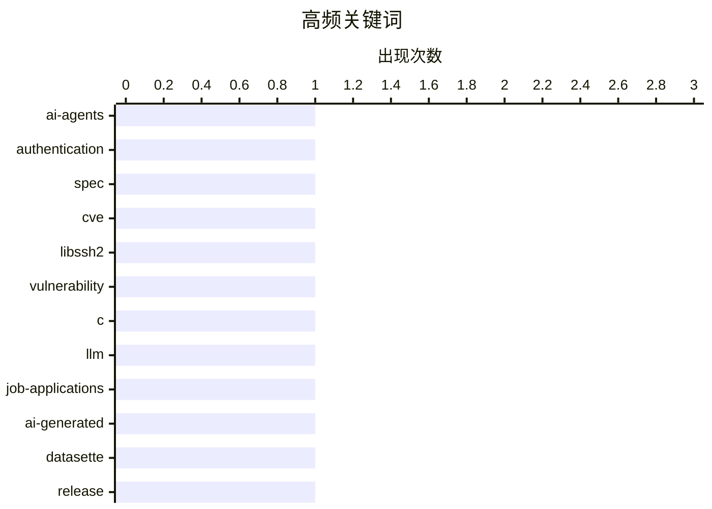

# 📰 AI 博客每日精选 — 2026-06-25

> 来自 Karpathy 推荐的 92 个顶级技术博客，AI 精选 Top 11

## 📝 今日看点

今日技术圈的焦点高度集中于人工智能的深度渗透及其引发的基础设施与生态变革。一方面，AI代理正在催生全新的身份验证规范，而AI生成内容的泛滥也已实质性地冲击了传统的招聘与人才评估体系，迫使行业寻找新的应对机制。另一方面，底层系统安全与经典工程实践依然是不可忽视的基石，一场由libssh2漏洞引发的抢修潮，与对软件设计文档和跨环境正则表达式的深度探讨交相呼应。同时，从USB-C接口背后的隐藏复杂性到对无弹窗纯净博客的呼吁，也折射出技术圈在硬核探索之外对回归用户体验本质的持续思考。

---

## 🏆 今日必读

🥇 **WorkOS：AI 代理需要身份验证，现在有了相关规范**

[[Sponsor] WorkOS: Agents Need Auth. There’s Now a Spec for It.](http://workos.com/auth-md?utm_source=daringfireball&amp;utm_medium=newsletter&amp;utm_campaign=q32026) — daringfireball.net · 22 分钟前 · 🤖 AI / ML

> AI 代理在执行需要新账户的任务时，常常卡在传统的注册表单上，目前缺乏代理代用户进行注册的统一标准。WorkOS 提出了 `auth.md` 规范，类似于 `robots.txt`，用于向代理声明应用支持的注册流程、权限作用域和凭据颁发方式。该规范基于现有的 OAuth 标准构建，已被 Cloudflare、Firecrawl 和 Resend 等公司采用。这为 AI 代理无缝接入各类应用提供了标准化的身份验证解决方案。

💡 **为什么值得读**: 了解 `auth.md` 规范如何解决 AI 代理与各类应用之间的身份验证鸿沟。

🏷️ AI-agents, authentication, spec

🥈 **“无法预防此类问题”，唯一经常发生此问题的语言用户如是说**

["No way to prevent this" say users of only language where this regularly happens](https://xeiaso.net/shitposts/no-way-to-prevent-this/memory-safety/CVE-2026-55200/) — xeiaso.net · 19 小时前 · 🔒 安全

> libssh2 项目最新披露的 CVE-2026-55200 漏洞引发了运维人员的疯狂抢修，该漏洞源于 `ssh2_transport_read()` 中对 `packet_length` 字段缺少上限检查，从而导致越界写入、堆损坏和潜在的远程代码执行（RCE）。作者以讽刺的口吻指出，这类致命的内存安全漏洞几乎专属存在于 C 语言编写的组件中。尽管业界频繁因此类漏洞陷入混乱，但 C 语言用户似乎总是无奈地表示“无法预防”。这再次凸显了非内存安全语言在现代基础设施中带来的巨大风险。

💡 **为什么值得读**: 以黑色幽默的视角审视 C 语言内存安全漏洞对整个软件供应链的破坏力。

🏷️ CVE, libssh2, vulnerability, C

🥉 **引用 Tom MacWright：当一切都由 AI 生成**

[Quoting Tom MacWright](https://simonwillison.net/2026/Jun/24/tom-macwright/#atom-everything) — simonwillison.net · 55 分钟前 · 💡 观点 / 杂谈

> Tom MacWright 观察到，近期收到的求职申请越来越明显地由大语言模型（LLM）参与编写，甚至关联的作品集网站、GitHub 项目和代码提交记录也全是由 AI 生成的。这种现象导致招聘者完全无法了解这些候选人的真实能力和个人特质，因为申请者没有展示任何真实的输出或自我表达。这反映了生成式 AI 的泛滥正在深刻破坏现有的技术人才评估和招聘体系。

💡 **为什么值得读**: 揭示了过度依赖 LLM 生成的求职材料正在让技术招聘失去有效的评估抓手。

🏷️ LLM, job-applications, AI-generated

---

## 📊 数据概览

| 扫描源 | 抓取文章 | 时间范围 | 精选 |
|:---:|:---:|:---:|:---:|
| 80/92 | 2421 篇 → 11 篇 | 24h | **11 篇** |

### 分类分布



### 高频关键词



<details>
<summary>📈 纯文本关键词图（终端友好）</summary>

```
ai-agents        │ ████████████████████ 1
authentication   │ ████████████████████ 1
spec             │ ████████████████████ 1
cve              │ ████████████████████ 1
libssh2          │ ████████████████████ 1
vulnerability    │ ████████████████████ 1
c                │ ████████████████████ 1
llm              │ ████████████████████ 1
job-applications │ ████████████████████ 1
ai-generated     │ ████████████████████ 1
```

</details>

### 🏷️ 话题标签

**ai-agents**(1) · **authentication**(1) · **spec**(1) · cve(1) · libssh2(1) · vulnerability(1) · c(1) · llm(1) · job-applications(1) · ai-generated(1) · datasette(1) · release(1) · database(1) · design-doc(1) · software-engineering(1) · documentation(1) · regex(1) · compatibility(1) · perl(1) · framework(1)

---

## 📝 其他

### 1. Framework 的 10G 以太网模块揭示了 USB-C 的复杂性

[Framework's 10G Ethernet module exposes USB-C's complexity](https://www.jeffgeerling.com/blog/2026/framework-10g-ethernet-module-usb-c-complexity/) — **jeffgeerling.com** · 5 小时前 · ⭐ 17/30

> Jeff Geerling 评测了 WisdPi 为 Framework 笔记本开发的 10G 以太网模块，该模块意外揭示了 USB-C 接口背后隐藏的复杂机制。在探索 5Gbps 和 10Gbps 以太网适配器的工作原理时，USB-C 的交替模式、引脚定义和供电管理等技术细节成为了焦点。这表明即使对于经验丰富的硬件开发者，USB-C 的底层实现依然充满挑战与坑点。

🏷️ Framework, Ethernet, USB-C, hardware

---

### 2. Designed in California：一部苹果历史播客

[Designed in California: An Apple History Podcast](https://designed.fm/) — **daringfireball.net** · 3 小时前 · ⭐ 11/30

> Jason Snell 和 Myke Hurley 在 Kickstarter 上发起了一项众筹，旨在制作一部长达 50 集的苹果 50 年历史叙事播客。该众筹项目已成功达成主要筹资目标，目前距离结束还有一周时间，正向更多的扩展目标推进。这档名为《Designed in California》的播客将为科技爱好者提供深度的苹果公司发展史回顾。对于喜欢《The Talk Show》等节目的听众来说，这是一个不容错过的支持机会。

🏷️ Apple, podcast, history

---

### 3. Windows 98于1998年6月25日发布

[Windows 98 shipped June 25, 1998](https://dfarq.homeip.net/windows-98-shipped-june-25-1998/?utm_source=rss&#038;utm_medium=rss&#038;utm_campaign=windows-98-shipped-june-25-1998) — **dfarq.homeip.net** · 8 小时前 · ⭐ 7/30

> 1998年6月25日，微软正式发布了Windows 98操作系统。尽管该系统的研发过程经历了延期与过度炒作，但其整体性能和稳定性实质上超越了前代产品 Windows 95。与 Win95 发布时引发的全社会狂热不同，Win98 虽然没有获得同等规模的轰动效应，却为用户提供了更优秀的日常使用体验。作为一款承前启后的系统，Windows 98 凭借更扎实的技术改进，在微软操作系统的发展史中占据了不可忽视的重要地位。

🏷️ Windows-98, Microsoft, retrospective

---

## 🔒 安全

### 4. “无法预防此类问题”，唯一经常发生此问题的语言用户如是说

["No way to prevent this" say users of only language where this regularly happens](https://xeiaso.net/shitposts/no-way-to-prevent-this/memory-safety/CVE-2026-55200/) — **xeiaso.net** · 19 小时前 · ⭐ 24/30

> libssh2 项目最新披露的 CVE-2026-55200 漏洞引发了运维人员的疯狂抢修，该漏洞源于 `ssh2_transport_read()` 中对 `packet_length` 字段缺少上限检查，从而导致越界写入、堆损坏和潜在的远程代码执行（RCE）。作者以讽刺的口吻指出，这类致命的内存安全漏洞几乎专属存在于 C 语言编写的组件中。尽管业界频繁因此类漏洞陷入混乱，但 C 语言用户似乎总是无奈地表示“无法预防”。这再次凸显了非内存安全语言在现代基础设施中带来的巨大风险。

🏷️ CVE, libssh2, vulnerability, C

---

### 5. 每周更新 509：家庭影院与认知偏差

[Weekly Update 509](https://www.troyhunt.com/weekly-update-509/) — **troyhunt.com** · 13 小时前 · ⭐ 15/30

> Troy Hunt 在本周更新中分享了他对家庭影院音视频（AV）系统的探索与思考。他坦言自己在这个领域达到了“有意识的无能”状态，即清楚地知道自己有哪些知识盲区。这种认知状态与大多数普通消费者所处于的“无意识的无能”截然不同。文章借此探讨了技术专家在面对陌生领域时的学习心态和认知差异。

🏷️ weekly update, security, home cinema

---

## 💡 观点 / 杂谈

### 6. 引用 Tom MacWright：当一切都由 AI 生成

[Quoting Tom MacWright](https://simonwillison.net/2026/Jun/24/tom-macwright/#atom-everything) — **simonwillison.net** · 55 分钟前 · ⭐ 23/30

> Tom MacWright 观察到，近期收到的求职申请越来越明显地由大语言模型（LLM）参与编写，甚至关联的作品集网站、GitHub 项目和代码提交记录也全是由 AI 生成的。这种现象导致招聘者完全无法了解这些候选人的真实能力和个人特质，因为申请者没有展示任何真实的输出或自我表达。这反映了生成式 AI 的泛滥正在深刻破坏现有的技术人才评估和招聘体系。

🏷️ LLM, job-applications, AI-generated

---

### 7. 写博客可以只是陈述显而易见的事实

[Blogging Can Just Be Stating The Obvious](https://blog.jim-nielsen.com/2026/blogging-stating-the-obvious/) — **blog.jim-nielsen.com** · 9 分钟前 · ⭐ 14/30

> Jim Nielsen 引用了 John Gruber 对网站泛滥弹窗的批评，引发了对博客写作本质的思考。Gruber 强调，用户访问网站是为了直接阅读内容，而不是被各种对用户不友好的弹窗拦截。Nielsen 指出，写博客有时候仅仅是把这种“显而易见”的道理陈述出来就具有巨大的价值。这提醒内容创作者和网站开发者，保持网页体验的纯粹和直白依然是最核心的原则。

🏷️ blogging, UX, web-design

---

## ⚙️ 工程

### 8. 如何编写高效的软件设计文档

[How to Write an Effective Software Design Document](https://refactoringenglish.com/excerpts/write-an-effective-design-doc/) — **refactoringenglish.com** · 19 小时前 · ⭐ 20/30

> 一份优秀的软件设计文档能够为团队节省数年的开发时间，并迫使开发者在陷入错误的实现之前深入思考关键决策。它也是协调团队成员和合作伙伴之间设计决策的最佳工具。作者结合自己在 Google、Microsoft 以及自己创业过程中的实践经验，分享了设计文档的编写方法论。掌握这一技能对于提高软件项目成功率和团队协作效率至关重要。

🏷️ design-doc, software-engineering, documentation

---

### 9. 在“任何地方”都能正常工作的正则表达式

[Regular expressions that work “everywhere”](https://www.johndcook.com/blog/2026/06/23/regex-everywhere/) — **johndcook.com** · 18 小时前 · ⭐ 18/30

> 正则表达式最令人沮丧的问题在于不同工具和语言之间的实现差异，特定功能可能完全缺失或语法略有不同。作者指出，在像 Perl 这样的最大化正则环境中学习的人，往往会在迁移到其他受限环境时感到受挫。为了解决这一痛点，文章探讨了如何编写具有广泛兼容性的正则表达式。这为需要在不同系统或工具间复用正则的开发者提供了实用的参考方案。

🏷️ regex, compatibility, Perl

---

## 🤖 AI / ML

### 10. WorkOS：AI 代理需要身份验证，现在有了相关规范

[[Sponsor] WorkOS: Agents Need Auth. There’s Now a Spec for It.](http://workos.com/auth-md?utm_source=daringfireball&amp;utm_medium=newsletter&amp;utm_campaign=q32026) — **daringfireball.net** · 22 分钟前 · ⭐ 24/30

> AI 代理在执行需要新账户的任务时，常常卡在传统的注册表单上，目前缺乏代理代用户进行注册的统一标准。WorkOS 提出了 `auth.md` 规范，类似于 `robots.txt`，用于向代理声明应用支持的注册流程、权限作用域和凭据颁发方式。该规范基于现有的 OAuth 标准构建，已被 Cloudflare、Firecrawl 和 Resend 等公司采用。这为 AI 代理无缝接入各类应用提供了标准化的身份验证解决方案。

🏷️ AI-agents, authentication, spec

---

## 🛠 工具 / 开源

### 11. Datasette 1.0a35 版本发布

[datasette 1.0a35](https://simonwillison.net/2026/Jun/23/datasette/#atom-everything) — **simonwillison.net** · 21 小时前 · ⭐ 20/30

> Simon Willison 发布了 Datasette 1.0a35，这是一个包含多项重要更新的 alpha 版本。此次更新的核心亮点是在数据库操作菜单中引入了全新的“创建表”界面，该功能由底层的 `/<database>/-/create` JSON API 提供支持。新界面允许用户直接定义列、主键等表结构属性。这大大增强了通过 Datasette 进行数据管理和结构操作的能力。

🏷️ datasette, release, database

---

*生成于 2026-06-25 03:09 (Asia/Shanghai) | 扫描 80 源 → 获取 2421 篇 → 精选 11 篇*
*基于 [Hacker News Popularity Contest 2025](https://refactoringenglish.com/tools/hn-popularity/) RSS 源列表，由 [Andrej Karpathy](https://x.com/karpathy) 推荐*
*由「懂点儿AI」制作，欢迎关注同名微信公众号获取更多 AI 实用技巧 💡*
