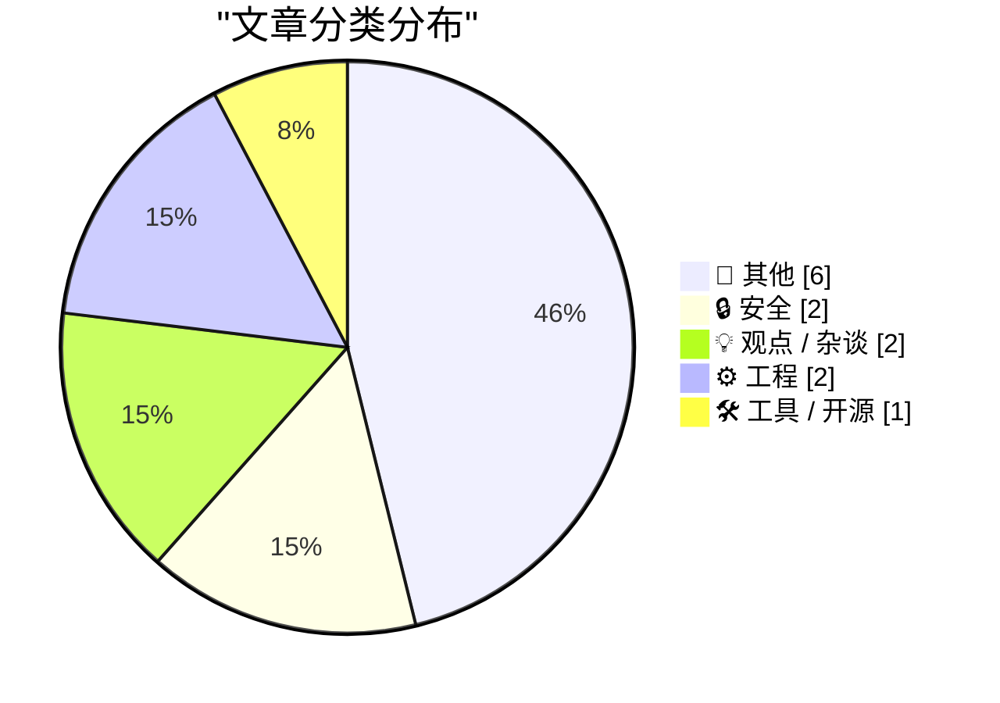
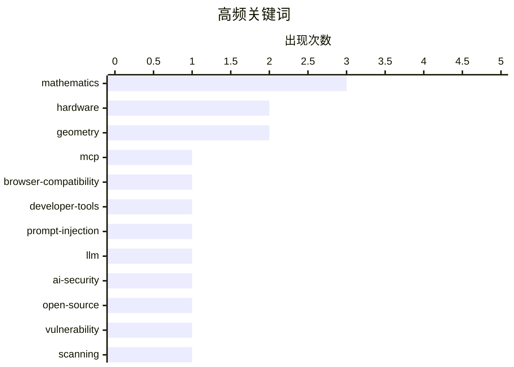

# 📰 AI 博客每日精选 — 2026-06-26

> 来自 Karpathy 推荐的 92 个顶级技术博客，AI 精选 Top 13

## 📝 今日看点

今日技术圈焦点主要集中在AI应用安全、底层工程排障以及科技商业博弈三大领域。随着大模型生态的深化，开发者正积极构建适配大语言模型的数据工具，但模型在提示词注入等防御机制上暴露出的严重漏洞，凸显了AI安全的严峻性，同时开源社区也在探索更友好的代码审计模式以减轻维护者负担。在底层技术方面，工程师们持续深挖系统内核，深度剖析了Windows内存加载机制的悬案与WebKit引擎的奇特Bug。此外，从苹果非核心产品线的大幅提价，到捍卫用户数字设备控制权的呼声，科技巨头的商业策略与数字产权争议再次引发业界反思。

---

## 🏆 今日必读

🥇 **simonw/browser-compat-db**

[simonw/browser-compat-db](https://simonwillison.net/2026/Jun/24/browser-compat-db/#atom-everything) — simonwillison.net · 19 小时前 · 🛠 工具 / 开源

> 受 Mozilla 最新推出的 MDN MCP 服务启发，开发者将包含全面浏览器兼容性数据的 mdn/browser-compat-data 仓库转换为了 SQLite 数据库。该工具能更好地为大语言模型（LLM）提供结构化的 API 兼容性查询支持。通过将庞大的兼容性数据转化为单文件数据库，大幅提升了数据检索的灵活性和集成便利性。这种方案为构建可靠的 AI 编程助手提供了高质量的数据底座。

💡 **为什么值得读**: 提供了一种利用 SQLite 集成浏览器兼容性数据的高效方案，对开发基于 LLM 的前端辅助工具极具参考价值。

🏷️ MCP, browser-compatibility, developer-tools

🥈 **关于“角色混淆”的思考**

[Thoughts on Role Confusion](https://www.gilesthomas.com/2026/06/role-confusion) — gilesthomas.com · 23 小时前 · 🔒 安全

> 大语言模型（LLM）在处理提示词注入时存在严重的安全漏洞，因为它们几乎忽略了 `<system>`、`<user>` 或 `<think>` 等角色标签。研究表明，模型转而依赖文本的语气和语义来判断指令的优先级。这种“角色混淆”意味着传统的系统提示词隔离机制并不像开发者预期的那样安全。因此，仅靠角色标签来防止恶意指令注入是远远不够的。

💡 **为什么值得读**: 深入剖析了 LLM 提示词注入的底层机制，提醒开发者不应盲目依赖系统角色标签来保障应用安全。

🏷️ prompt-injection, LLM, AI-security

🥉 **Scrutineer：在不淹没维护者的情况下扫描开源代码**

[Scrutineer: scanning open source without flooding maintainers](https://nesbitt.io/2026/06/25/scrutineer.html) — nesbitt.io · 9 小时前 · 🔒 安全

> 开源代码安全审计中，发现漏洞其实是最简单的环节，真正的挑战在于如何合理地报告和修复它们而不给维护者带来过载。Scrutineer 工具致力于在扫描开源项目时，自动过滤无效或低危问题，避免向维护者发送海量无意义的安全警报。这种机制在保障软件供应链安全的同时，极大减轻了开源社区的维护负担。合理的警报分发策略是实现可持续开源安全治理的关键。

💡 **为什么值得读**: 提出了一种兼顾安全审计与维护者体验的开源扫描策略，对改善开源协作生态具有实际指导意义。

🏷️ open-source, vulnerability, scanning

---

## 📊 数据概览

| 扫描源 | 抓取文章 | 时间范围 | 精选 |
|:---:|:---:|:---:|:---:|
| 80/92 | 2442 篇 → 13 篇 | 24h | **13 篇** |

### 分类分布



### 高频关键词



<details>
<summary>📈 纯文本关键词图（终端友好）</summary>

```
mathematics           │ ████████████████████ 3
hardware              │ █████████████░░░░░░░ 2
geometry              │ █████████████░░░░░░░ 2
mcp                   │ ███████░░░░░░░░░░░░░ 1
browser-compatibility │ ███████░░░░░░░░░░░░░ 1
developer-tools       │ ███████░░░░░░░░░░░░░ 1
prompt-injection      │ ███████░░░░░░░░░░░░░ 1
llm                   │ ███████░░░░░░░░░░░░░ 1
ai-security           │ ███████░░░░░░░░░░░░░ 1
open-source           │ ███████░░░░░░░░░░░░░ 1
```

</details>

### 🏷️ 话题标签

**mathematics**(3) · **hardware**(2) · **geometry**(2) · mcp(1) · browser-compatibility(1) · developer-tools(1) · prompt-injection(1) · llm(1) · ai-security(1) · open-source(1) · vulnerability(1) · scanning(1) · jailbreaking(1) · drm(1) · digital-rights(1) · dll(1) · windows(1) · debugging(1) · webkit(1) · safari(1)

---

## 📝 其他

### 1. 苹果将大部分产品提价 15-25%，但未波及 iPhone、Watch 和 AirPods

[Apple Raises Prices on Most Products by 15–25 Percent, but Not iPhones, Watches, or AirPods](https://www.wsj.com/tech/apple-raises-prices-on-macs-ipads-by-200-or-more-on-some-models-a7463f99?st=zse57R) — **daringfireball.net** · 2 小时前 · ⭐ 16/30

> 苹果公司近日对旗下产品线进行了全面调价，其中 Mac 电脑价格平均上涨约 15% 至 20%，iPad 价格涨幅在 15% 至 25% 之间。具体机型如基础款 MacBook Air 上涨 200 美元至 1299 美元，MacBook Pro 上涨 300 美元至 1999 美元。然而，iPhone、Apple Watch 和 AirPods 等核心移动设备的价格暂时保持不变。这一策略反映了苹果在不同产品线上的差异化定价与成本转嫁逻辑。

🏷️ Apple, hardware, pricing

---

### 2. 美国地铁建设中的横向通道泛滥问题

[US Subways Build Too Many Cross Passages](https://www.construction-physics.com/p/us-subways-build-too-many-cross-passages) — **construction-physics.com** · 5 小时前 · ⭐ 13/30

> 美国在地铁系统建设中存在盲目增加横向逃生通道的现象，这大幅推高了基础设施建设的整体成本。文章指出，过度设计这些横向通道不仅缺乏实际的安全收益评估，还导致了工期延误和资源浪费。优化通道建设标准、回归基于数据的工程设计，是改善美国公共交通交付效率的关键思路之一。合理的规范削减能够在不牺牲乘客安全的前提下显著降低基建预算。

🏷️ subway, transit, infrastructure

---

### 3. 勾股三角形的内切圆与外切圆

[Incircles and Excircles of Pythagorean triangles](https://www.johndcook.com/blog/2026/06/25/incircle-excircle/) — **johndcook.com** · 4 小时前 · ⭐ 12/30

> 数学博客深入探讨了勾股三角形（毕达哥拉斯三角形）的内切圆和外切圆半径特性，揭示了其与 Star Trek 引理之间的奇妙联系。作者在研究勾股数时偶然发现，这类特殊三角形的内切圆和外切圆半径满足一系列特定的代数关系。文章以直观的方式展示了这些几何属性是如何在代数方程中完美统一的。这为理解数论与几何学之间的跨学科联系提供了一个极具启发性的案例。

🏷️ mathematics, geometry

---

### 4. Consecutive Pythagorean triangle sides

[Consecutive Pythagorean triangle sides](https://www.johndcook.com/blog/2026/06/25/consecutive-pythagorean/) — **johndcook.com** · 7 小时前 · ⭐ 12/30

> Consecutive Pythagorean triangle sides

🏷️ mathematics, number-theory

---

### 5. The Star Trek lemma

[The Star Trek lemma](https://www.johndcook.com/blog/2026/06/24/star-trek-lemma/) — **johndcook.com** · 16 小时前 · ⭐ 12/30

> The Star Trek lemma

🏷️ mathematics, geometry

---

### 6. Raymond’s hot take on Hainanese chicken

[Raymond’s hot take on Hainanese chicken](https://devblogs.microsoft.com/oldnewthing/20260625-01/?p=112469) — **devblogs.microsoft.com/oldnewthing** · 5 小时前 · ⭐ 6/30

> Raymond’s hot take on Hainanese chicken

🏷️ food, personal

---

## 🔒 安全

### 7. 关于“角色混淆”的思考

[Thoughts on Role Confusion](https://www.gilesthomas.com/2026/06/role-confusion) — **gilesthomas.com** · 23 小时前 · ⭐ 23/30

> 大语言模型（LLM）在处理提示词注入时存在严重的安全漏洞，因为它们几乎忽略了 `<system>`、`<user>` 或 `<think>` 等角色标签。研究表明，模型转而依赖文本的语气和语义来判断指令的优先级。这种“角色混淆”意味着传统的系统提示词隔离机制并不像开发者预期的那样安全。因此，仅靠角色标签来防止恶意指令注入是远远不够的。

🏷️ prompt-injection, LLM, AI-security

---

### 8. Scrutineer：在不淹没维护者的情况下扫描开源代码

[Scrutineer: scanning open source without flooding maintainers](https://nesbitt.io/2026/06/25/scrutineer.html) — **nesbitt.io** · 9 小时前 · ⭐ 22/30

> 开源代码安全审计中，发现漏洞其实是最简单的环节，真正的挑战在于如何合理地报告和修复它们而不给维护者带来过载。Scrutineer 工具致力于在扫描开源项目时，自动过滤无效或低危问题，避免向维护者发送海量无意义的安全警报。这种机制在保障软件供应链安全的同时，极大减轻了开源社区的维护负担。合理的警报分发策略是实现可持续开源安全治理的关键。

🏷️ open-source, vulnerability, scanning

---

## 💡 观点 / 杂谈

### 9. 越狱不是盗窃 (Jailbreaking isn't theft)

[Pluralistic: Jailbreaking isn't theft (25 Jun 2026)](https://pluralistic.net/2026/06/25/thieve-different/) — **pluralistic.net** · 9 小时前 · ⭐ 21/30

> 作者主张数字时代的“越狱”行为不应被视为盗窃，认为大企业剥夺用户控制权才是真正的技术倒退。文章汇总了近期科技与文化领域的热点，包括重大 AI 突破、迪士尼版权诉讼、监控定价对消费者的影响等议题。核心观点是呼吁保护数字产权的合理使用，反对大厂的技术垄断。打破这些数字枷锁是维护公众利益和技术进步的必要手段。

🏷️ jailbreaking, DRM, digital-rights

---

### 10. VA Linux 退出硬件业务后的转型

[VA Linux’s transformation after leaving the hardware business](https://dfarq.homeip.net/va-linuxs-transformation-after-leaving-the-hardware-business/?utm_source=rss&#038;utm_medium=rss&#038;utm_campaign=va-linuxs-transformation-after-leaving-the-hardware-business) — **dfarq.homeip.net** · 8 小时前 · ⭐ 15/30

> 在互联网泡沫破裂的余波中，曾创下开盘纪录的明星初创公司 VA Linux 做出了退出硬件业务的艰难决定。自 2001 年 6 月 26 日起，公司全面调整战略，放弃了利润微薄的实体机制造。这一在当时看似奇怪的转型最终被证明是正确的，使其成功避开了硬件市场的残酷竞争并存活至今。转向软件和服务为企业找到了更具可持续性的商业模式。

🏷️ VA Linux, hardware, dotcom

---

## ⚙️ 工程

### 11. 一个未被正式卸载却不在内存中的 DLL 悬案（第一部分）

[The case of the DLL that was not present in memory despite not being formally unloaded, part 1](https://devblogs.microsoft.com/oldnewthing/20260625-00/?p=112467) — **devblogs.microsoft.com/oldnewthing** · 5 小时前 · ⭐ 19/30

> 深入排查了一个 DLL 文件虽然从未被系统正式卸载，却意外从内存中消失的底层技术问题。文章作为系列的第一部分，重点剖析了 Windows 操作系统内部加载器的工作机制以及追踪内存状态变化的方法。通过真实的调试案例，揭示了复杂应用环境下 DLL 生命周期管理的隐蔽陷阱。此类内存幽灵问题往往需要结合调用栈和底层系统钩子才能准确定位。

🏷️ DLL, Windows, debugging

---

### 12. WebKit 在所有应用中始终启用“复制”菜单项

[WebKit Always Enables the Copy Menu Item in Every App](https://lapcatsoftware.com/articles/2026/6/5.html) — **daringfireball.net** · 21 小时前 · ⭐ 18/30

> 当网页获得焦点时，Safari 和 Mail 等应用的主菜单中“复制”选项会被强制启用，即使页面上根本没有选中任何文本。这一 Bug 的根源在于 Apple 平台上的 WebKit 公共 API 处理逻辑。该问题不仅影响了原生应用的用户体验，也暴露了 WebKit 在处理系统级菜单状态同步时的缺陷。第三方应用在使用 WebKit 渲染内容时也普遍会受到这个 UI 逻辑异常的影响。

🏷️ WebKit, Safari, bug

---

## 🛠 工具 / 开源

### 13. simonw/browser-compat-db

[simonw/browser-compat-db](https://simonwillison.net/2026/Jun/24/browser-compat-db/#atom-everything) — **simonwillison.net** · 19 小时前 · ⭐ 24/30

> 受 Mozilla 最新推出的 MDN MCP 服务启发，开发者将包含全面浏览器兼容性数据的 mdn/browser-compat-data 仓库转换为了 SQLite 数据库。该工具能更好地为大语言模型（LLM）提供结构化的 API 兼容性查询支持。通过将庞大的兼容性数据转化为单文件数据库，大幅提升了数据检索的灵活性和集成便利性。这种方案为构建可靠的 AI 编程助手提供了高质量的数据底座。

🏷️ MCP, browser-compatibility, developer-tools

---

*生成于 2026-06-26 03:30 (Asia/Shanghai) | 扫描 80 源 → 获取 2442 篇 → 精选 13 篇*
*基于 [Hacker News Popularity Contest 2025](https://refactoringenglish.com/tools/hn-popularity/) RSS 源列表，由 [Andrej Karpathy](https://x.com/karpathy) 推荐*
*由「懂点儿AI」制作，欢迎关注同名微信公众号获取更多 AI 实用技巧 💡*
