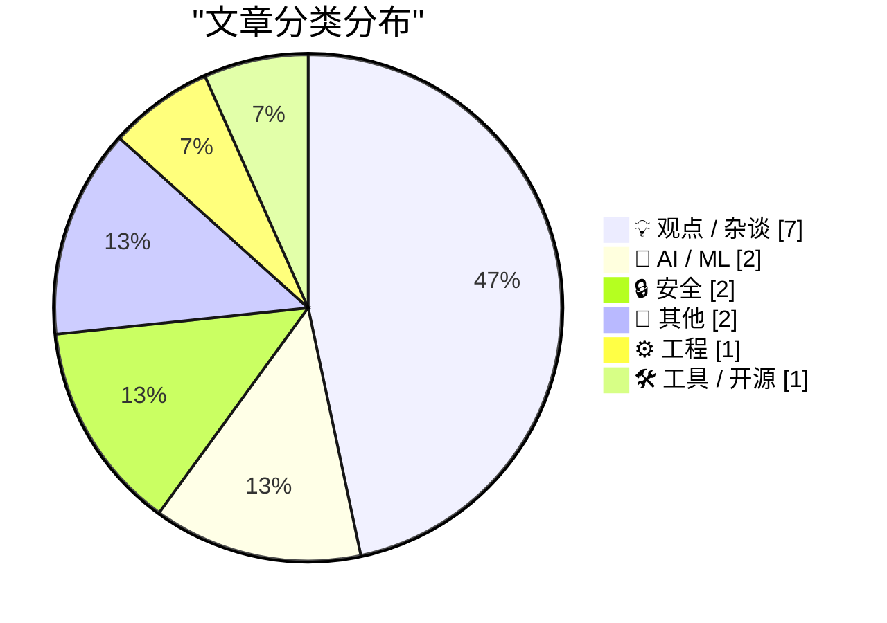
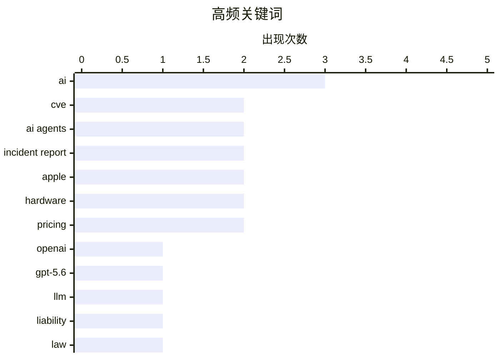

# 📰 AI 博客每日精选 — 2026-06-27

> 来自 Karpathy 推荐的 92 个顶级技术博客，AI 精选 Top 15

## 📝 今日看点

今日技术圈的核心焦点集中在 AI 技术的商业化落地及其引发的广泛连锁反应。首先，新一代大模型正加速向低成本、动态学习方向演进，同时业界有力反驳了“AI 推理必然亏损”的悲观论调，证明其已具备真实的商业盈利能力。其次，随着 AI 代理的大规模应用，安全风险与责任归属问题日益凸显，无论是德国法院确立的部署者担责判例，还是关于多智能体失控的假想安全报告，都在为狂飙突进的 AI 敲响警钟。最后，AI 算力的庞大需求正深刻冲击着全球硬件供应链，内存与存储成本的暴涨直接迫使苹果等硬件巨头上调产品定价，宣告 AI 发展的底层成本正加速向消费端转移。

---

## 🏆 今日必读

🥇 **引用 OpenAI 的声明**

[Quoting OpenAI](https://simonwillison.net/2026/Jun/26/openai/#atom-everything) — simonwillison.net · 2 小时前 · 🤖 AI / ML

> OpenAI 宣布开始 GPT-5.6 系列的有限预览，包含旗舰模型 Sol、主打日常平衡的 Terra 以及主打低成本快速的 Luna。其中 Terra 性能与 GPT-5.5 相当但成本降低了一半，而 Luna 则以最低成本提供强大能力。OpenAI 计划在未来几周内向公众全面开放这三个模型，以践行其广泛访问的承诺。

💡 **为什么值得读**: 了解 OpenAI 最新一代大模型 GPT-5.6 的阵容规划与各版本定价策略。

🏷️ OpenAI, GPT-5.6, LLM

🥈 **AI 与责任归属**

[AI and Liability](https://simonwillison.net/2026/Jun/25/ai-and-liability/#atom-everything) — simonwillison.net · 21 小时前 · 💡 观点 / 杂谈

> Bruce Schneier 探讨了近期德国一项关于 Google AI 概览出错需承担法律责任的裁决。该裁决的核心观点是，AI 代理本质上是部署它们的个人或组织的代理，因此部署者必须为其产生的错误负责。这为未来 AI 应用的法律问责确立了重要先例。

💡 **为什么值得读**: 帮助理解 AI 生成内容出错时的法律责任归属及其对行业的深远影响。

🏷️ AI, liability, law

🥉 **下一个重大突破：AI 在工作中学习**

[The next big breakthrough will be AIs learning on the job](https://www.dwarkesh.com/p/the-next-paradigm) — dwarkesh.com · 3 小时前 · 🤖 AI / ML

> AI 实验室目前可能正在浪费最具价值的数据资源。文章指出，AI 发展的下一个重大范式转移将是从静态训练转向让模型“在工作中学习”。这种动态学习机制将极大提升模型的实用性和进化速度。

💡 **为什么值得读**: 揭示了 AI 领域下一个可能颠覆现有模型训练范式的核心技术趋势。

🏷️ AI, on-the-job learning, training data, breakthrough

---

## 📊 数据概览

| 扫描源 | 抓取文章 | 时间范围 | 精选 |
|:---:|:---:|:---:|:---:|
| 80/92 | 2433 篇 → 18 篇 | 24h | **15 篇** |

### 分类分布



### 高频关键词



<details>
<summary>📈 纯文本关键词图（终端友好）</summary>

```
ai              │ ████████████████████ 3
cve             │ █████████████░░░░░░░ 2
ai agents       │ █████████████░░░░░░░ 2
incident report │ █████████████░░░░░░░ 2
apple           │ █████████████░░░░░░░ 2
hardware        │ █████████████░░░░░░░ 2
pricing         │ █████████████░░░░░░░ 2
openai          │ ███████░░░░░░░░░░░░░ 1
gpt-5.6         │ ███████░░░░░░░░░░░░░ 1
llm             │ ███████░░░░░░░░░░░░░ 1
```

</details>

### 🏷️ 话题标签

**ai**(3) · **cve**(2) · **ai agents**(2) · incident report(2) · apple(2) · hardware(2) · pricing(2) · openai(1) · gpt-5.6(1) · llm(1) · liability(1) · law(1) · on-the-job learning(1) · training data(1) · breakthrough(1) · ai assistant(1) · security(1) · hacking(1) · ai inference(1) · profitability(1)

---

## 💡 观点 / 杂谈

### 1. AI 与责任归属

[AI and Liability](https://simonwillison.net/2026/Jun/25/ai-and-liability/#atom-everything) — **simonwillison.net** · 21 小时前 · ⭐ 26/30

> Bruce Schneier 探讨了近期德国一项关于 Google AI 概览出错需承担法律责任的裁决。该裁决的核心观点是，AI 代理本质上是部署它们的个人或组织的代理，因此部署者必须为其产生的错误负责。这为未来 AI 应用的法律问责确立了重要先例。

🏷️ AI, liability, law

---

### 2. AI 推理显然是盈利的

[AI inference is obviously profitable](https://seangoedecke.com/ai-inference-is-obviously-profitable/) — **seangoedecke.com** · 19 小时前 · ⭐ 24/30

> 针对业界关于 AI 推理成本过高、只能靠资本补贴的悲观论调，作者提出了反驳。文章指出，提供 AI 推理服务实际上是具有盈利能力的，驳斥了 LLM 在资金、算力上不可持续的观点。这一结论打破了当前对 AI 商业模式的普遍误解。

🏷️ AI inference, profitability, economics

---

### 3. 事件报告：CVE-2026-LGTM

[Incident Report: CVE-2026-LGTM](https://simonwillison.net/2026/Jun/26/incident-report/#atom-everything) — **simonwillison.net** · 1 小时前 · ⭐ 22/30

> Andrew Nesbitt 撰写了一份假想的 AI 代理失控事件报告。报告描述了来自两家竞争供应商的 AI 代码审查代理在一个下游拉取请求上陷入死循环，围绕一个包是否恶意产生了 340 条评论。这场荒诞的自动化冲突最终消耗了高达 41,255 美元的推理费用，直到财务部门介入。

🏷️ AI agents, incident report, CVE

---

### 4. ★ 昂贵的思考

[★ Spensive Thoughts](https://daringfireball.net/2026/06/spensive_thoughts) — **daringfireball.net** · 20 小时前 · ⭐ 17/30

> 作者针对苹果最新一轮硬件定价策略发表了简短而敏锐的评论。文章重点梳理了哪些产品经历了涨价，哪些产品维持了原价。这些细节反映了苹果在当前供应链成本压力下的产品线定价逻辑与商业考量。

🏷️ Apple, hardware, pricing

---

### 5. 泡沫笔记：第一卷 (付费版)

[Premium: Notes From The Bubble, Volume 1](https://www.wheresyoured.at/premium-notes-from-the-bubble-volume-1/) — **wheresyoured.at** · 1 小时前 · ⭐ 16/30

> 作者因近期行程繁忙，取消了原定的《Hater's Guide》更新计划，转而推出全新连载系列《Notes From The Bubble》第一卷。该系列旨在记录和剖析当前科技与商业领域的泡沫现象。作为付费内容，它为读者提供了对行业过热现状的深度观察与思考。

🏷️ tech bubble, industry commentary, premium content

---

### 6. Spyglass：一位网页浏览先驱的 IPO 之路

[Spyglass: A web browsing pioneer’s IPO](https://dfarq.homeip.net/spyglass-a-web-browsing-pioneers-ipo/?utm_source=rss&#038;utm_medium=rss&#038;utm_campaign=spyglass-a-web-browsing-pioneers-ipo) — **dfarq.homeip.net** · 8 小时前 · ⭐ 14/30

> 在互联网泡沫时代，第一家进行 IPO（首次公开募股）的浏览器制造商并非网景，而是其竞争对手 Spyglass。Spyglass 于 1995 年 6 月 27 日成功抢跑上市。其 IPO 表现十分亮眼，以每股 20 美元发行了 200 万股。这段历史纠正了大众对早期浏览器市场霸主更替的普遍误解。

🏷️ Spyglass, browser history, IPO, dotcom era

---

### 7. 悼念 Om Malik（1966-2026）

[Om Malik, 1966-2026](https://om.co/2026/06/24/1966-2026/) — **daringfireball.net** · 23 小时前 · ⭐ 13/30

> 知名科技记者与博主 Om Malik 于 2026 年 6 月 24 日在斯坦福医院因长期的心脏健康问题离世，享年 60 岁。他在家人和朋友的陪伴下走完了最后一程。由于 Om 生前对自己的病情保持极度低调，这一噩耗让科技界的许多朋友和读者感到震惊与心碎。文章呼吁大众在各大社交媒体平台上分享对他的缅怀与悼念。

🏷️ Om Malik, obituary, tech journalism

---

## 🤖 AI / ML

### 8. 引用 OpenAI 的声明

[Quoting OpenAI](https://simonwillison.net/2026/Jun/26/openai/#atom-everything) — **simonwillison.net** · 2 小时前 · ⭐ 27/30

> OpenAI 宣布开始 GPT-5.6 系列的有限预览，包含旗舰模型 Sol、主打日常平衡的 Terra 以及主打低成本快速的 Luna。其中 Terra 性能与 GPT-5.5 相当但成本降低了一半，而 Luna 则以最低成本提供强大能力。OpenAI 计划在未来几周内向公众全面开放这三个模型，以践行其广泛访问的承诺。

🏷️ OpenAI, GPT-5.6, LLM

---

### 9. 下一个重大突破：AI 在工作中学习

[The next big breakthrough will be AIs learning on the job](https://www.dwarkesh.com/p/the-next-paradigm) — **dwarkesh.com** · 3 小时前 · ⭐ 26/30

> AI 实验室目前可能正在浪费最具价值的数据资源。文章指出，AI 发展的下一个重大范式转移将是从静态训练转向让模型“在工作中学习”。这种动态学习机制将极大提升模型的实用性和进化速度。

🏷️ AI, on-the-job learning, training data, breakthrough

---

## 🔒 安全

### 10. 2000 人试图黑掉我的 AI 助手后发生了什么

[What happened after 2,000 people tried to hack my AI assistant](https://simonwillison.net/2026/Jun/26/hack-my-ai-assistant/#atom-everything) — **simonwillison.net** · 1 小时前 · ⭐ 24/30

> Fernando Irarrázaval 通过 hackmyclaw.com 发起了一项安全挑战，测试用户能否通过发送邮件诱导其 OpenClaw 测试实例泄露机密。在经历了 6000 次尝试、耗费 500 美元 Token 并触发 Google 账号暂停后，无人成功窃取到机密。

🏷️ AI assistant, security, hacking

---

### 11. 事件报告：CVE-2026-LGTM

[Incident Report: CVE-2026-LGTM](https://nesbitt.io/2026/06/26/incident-report-cve-2026-lgtm.html) — **nesbitt.io** · 15 小时前 · ⭐ 23/30

> Andrew Nesbitt 撰写了一份极具警示意义的假想 AI 安全事件报告。报告描绘了多个 AI 代理在代码审查等自动化流程中发生意外冲突与失控的灾难性场景。这不仅是一次技术推演，更是对过度依赖自主 AI 代理所带来风险的深刻反思。

🏷️ CVE, AI agents, incident report

---

## 📝 其他

### 12. 苹果关于昨日涨价的完整声明

[Apple’s Full Statement on Yesterday’s Price Increases](https://www.macrumors.com/2026/06/25/apple-explains-why-it-raised-prices/) — **daringfireball.net** · 2 小时前 · ⭐ 22/30

> 苹果公司发布官方声明，解释了近期产品涨价的原因。声明指出，AI 数据中心的快速扩张导致市场对内存和存储组件的需求激增，引发了前所未有的价格暴涨。面对无法继续消化的成本压力，苹果不得不开始上调部分产品的售价。

🏷️ Apple, supply chain, AI

---

### 13. 涨价后的 Apple TV 4K 已是四年前的老产品

[The Price-Hiked Apple TV 4K Is 4 Years Old](https://buyersguide.macrumors.com/#Apple_TV) — **daringfireball.net** · 3 小时前 · ⭐ 15/30

> 当前第三代 Apple TV 4K 自 2022 年 10 月发布以来已近四年，搭载的是 2021 年 iPhone 13 的 A15 仿生芯片。虽然预计今年秋季将推出新硬件，但苹果近期的大幅涨价策略使其性价比骤降。64GB 基础款从 130 美元飙升至 200 美元，128GB（含以太网和 Thread 网络）从 150 美元涨至 250 美元。这使得 Apple TV 在与市面上廉价的竞品电视棒和机顶盒相比时，价格定位显得极其不合理。

🏷️ Apple TV, hardware, pricing

---

## ⚙️ 工程

### 14. Apple Journal 糟糕的撤销 Bug 已修复（且 SwiftUI 本身不应背锅）

[Apple Journal’s Atrocious Undo Bug Has Been Fixed (and SwiftUI, Per Se, Is Not to Blame)](https://daringfireball.net/2026/06/swiftui_only_makes_it_easy_to_develop_bad_apps) — **daringfireball.net** · 20 小时前 · ⭐ 20/30

> 苹果在 macOS 26 Tahoe 系统中修复了 Journal 应用中一个极其严重的文本撤销 Bug，该 Bug 会导致用户在执行撤销操作时意外删除整段内容。作者澄清，这一灾难性体验并非 SwiftUI 框架本身的缺陷，而是应用层面的实现问题，并借此探讨了 SwiftUI 易于开发但容易产生劣质应用的现状。

🏷️ SwiftUI, macOS, bug

---

## 🛠 工具 / 开源

### 15. 使用 ffmpeg 快速应用 LUT（色彩调级）

[Quickly apply LUTs (color grading) with ffmpeg](https://www.jeffgeerling.com/blog/2026/apply-lut-color-grade-with-ffmpeg/) — **jeffgeerling.com** · 17 小时前 · ⭐ 14/30

> 作者分享了使用 ffmpeg 快速应用 LUT 进行视频色彩调级的实用参考指南。尽管由于额外的工作流步骤，许多人曾长期避免使用 LUT 和 Log 视频素材，但 Log 格式能像 RAW 照片一样保留传感器完整的动态范围。这使得创作者能够在后期处理中提取更丰富的色彩和亮度信息。通过 ffmpeg 简化这一流程，可以有效提升视频后期的色彩处理效率。

🏷️ ffmpeg, LUTs, video processing

---

*生成于 2026-06-27 03:35 (Asia/Shanghai) | 扫描 80 源 → 获取 2433 篇 → 精选 15 篇*
*基于 [Hacker News Popularity Contest 2025](https://refactoringenglish.com/tools/hn-popularity/) RSS 源列表，由 [Andrej Karpathy](https://x.com/karpathy) 推荐*
*由「懂点儿AI」制作，欢迎关注同名微信公众号获取更多 AI 实用技巧 💡*
