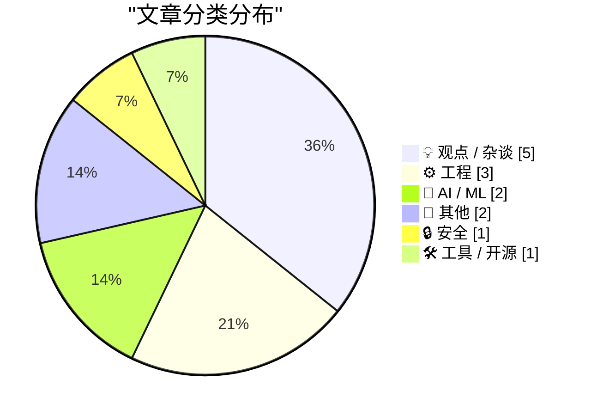
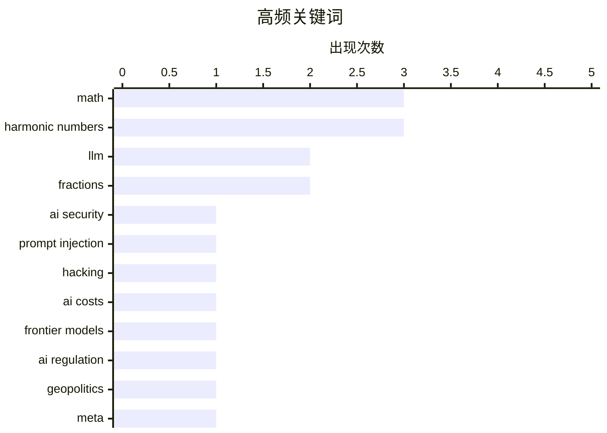

# 📰 AI 博客每日精选 — 2026-06-28

> 来自 Karpathy 推荐的 92 个顶级技术博客，AI 精选 Top 14

## 📝 今日看点

今日技术圈的核心焦点高度集中于人工智能领域的激烈博弈与底层硬件的供应链危机。随着前沿AI模型训练成本飙升、地缘政治博弈加剧以及针对AI助手的安全攻防愈演愈烈，AI产业的商业壁垒与合规风险正面临前所未有的考验。同时，全球内存短缺危机引发了业界对硬件供应链脆弱性及当前科技投资泡沫的深度反思。此外，从软件包管理生态的安全更新到经典数论算法的工程化探讨，开发者社区依然在基础工具与底层硬核技术上保持着稳健的探索步伐。

---

## 🏆 今日必读

🥇 **2000人试图黑掉我的AI助手后发生了什么**

[What happened after 2,000 people tried to hack my AI assistant](https://simonwillison.net/2026/Jun/26/hack-my-ai-assistant/#atom-everything) — simonwillison.net · 23 小时前 · 🔒 安全

> Fernando Irarrázaval 在 hackmyclaw.com 上发起了一项安全挑战，测试能否通过发送电子邮件诱导其 OpenClaw 测试实例泄露机密信息。在经历了整整 6000 次尝试后，没有任何人成功提取出秘密。此次测试消耗了价值 500 美元的 token，甚至因接收大量测试邮件导致关联的 Google 账户被暂停。结果表明，经过精心防御的 AI 助手在面对大规模真实红队攻击时，依然能保持极高的数据安全性。

💡 **为什么值得读**: 通过真实的众测案例揭示了当前 AI 助手在面对大规模诱导攻击时的防御能力与实际运营成本。

🏷️ AI security, prompt injection, hacking

🥈 **引用 Dean W. Ball 的话**

[Quoting Dean W. Ball](https://simonwillison.net/2026/Jun/26/dean-w-ball/#atom-everything) — simonwillison.net · 20 小时前 · 🤖 AI / ML

> 前沿 AI 模型的训练成本极其高昂，开发商通常依赖模型发布后短暂的垄断期来收回巨额投资。一旦几个月后竞争对手赶上，这些模型就不再具备前沿优势，利润率也会随之大幅压缩。这种行业动态意味着，模型发布日期的任何延迟都会直接吞噬开发商获取回报的狭窄时间窗口。这是当前 AI 商业化面临的严峻现实。

💡 **为什么值得读**: 深入剖析了 AI 领域前沿模型的巨额成本与短暂的盈利窗口期，对理解行业竞争逻辑极具参考价值。

🏷️ LLM, AI costs, frontier models

🥉 **3... 2... 1... 所有中国模型即将变为非法**

[All Chinese Models Will Be Illegal in 3... 2... 1...](https://idiallo.com/blog/all-chinese-models-will-be-illegal) — idiallo.com · 14 小时前 · 🤖 AI / ML

> 随着美国政府计划干预最先进大语言模型（LLM）的使用权限，继 Fable 被禁和 ChatGPT 5.6 面临限制之后，中国 AI 模型极有可能成为下一个封禁目标。尽管 Anthropic 等公司大肆渲染 AI 威胁论并推销其昂贵的秘密模型 Mythos，但 DeepSeek 等开源模型已证明能以极低成本实现相近性能，对美国市场造成了巨大冲击。这一监管趋势与开源模型的崛起正共同重塑全球 AI 的竞争格局。

💡 **为什么值得读**: 大胆预测了美国 AI 监管的下一步动向，并犀利对比了闭源昂贵模型与高性价比开源模型的生存博弈。

🏷️ AI regulation, LLM, geopolitics

---

## 📊 数据概览

| 扫描源 | 抓取文章 | 时间范围 | 精选 |
|:---:|:---:|:---:|:---:|
| 80/92 | 2456 篇 → 14 篇 | 24h | **14 篇** |

### 分类分布



### 高频关键词



<details>
<summary>📈 纯文本关键词图（终端友好）</summary>

```
math             │ ████████████████████ 3
harmonic numbers │ ████████████████████ 3
llm              │ █████████████░░░░░░░ 2
fractions        │ █████████████░░░░░░░ 2
ai security      │ ███████░░░░░░░░░░░░░ 1
prompt injection │ ███████░░░░░░░░░░░░░ 1
hacking          │ ███████░░░░░░░░░░░░░ 1
ai costs         │ ███████░░░░░░░░░░░░░ 1
frontier models  │ ███████░░░░░░░░░░░░░ 1
ai regulation    │ ███████░░░░░░░░░░░░░ 1
```

</details>

### 🏷️ 话题标签

**math**(3) · **harmonic numbers**(3) · **llm**(2) · fractions(2) · ai security(1) · prompt injection(1) · hacking(1) · ai costs(1) · frontier models(1) · ai regulation(1) · geopolitics(1) · meta(1) · whistleblowers(1) · privacy(1) · package management(1) · releases(1) · advisories(1) · memory(1) · hardware(1) · supply chain(1)

---

## 💡 观点 / 杂谈

### 1. 扎克伯格对举报人日益离奇的战争

[Pluralistic: Zuckerberg's increasingly bizarre war on whistleblowers (27 Jun 2026)](https://pluralistic.net/2026/06/27/zuckerstreisand-2/) — **pluralistic.net** · 7 小时前 · ⭐ 22/30

> 马克·扎克伯格为了阻止一本爆料书籍的传播，发起了高达 1.11 亿美元的索赔诉讼，并要求作者永久保持沉默。这种对举报人的极端打压手段引发了公众的强烈关注与反弹。作者指出，这种试图彻底掩盖信息的举动只会引发“斯特赖桑效应”（越想掩盖越引人注目），让事情变得更糟。文章以此事为引，探讨了大型科技公司试图噤声负面信息的荒谬行径。

🏷️ Meta, whistleblowers, privacy

---

### 2. 模糊的记忆

[Hazy Memory](https://feed.tedium.co/link/15204/17369108/apple-micron-ram-shortage-vertical-integration) — **tedium.co** · 4 小时前 · ⭐ 22/30

> 本周 Mac 和 Steam Box 等设备遭遇了严重的内存短缺危机，导致相关产品变成一机难求的“绝版货”。面对这场危机，内存制造商给出了一个将责任推卸给外部因素的便捷答案。文章深入探讨了这场硬件供应链危机背后的真正原因，并质疑了制造商的单方面说辞。这揭示了当前硬件市场中垂直整合与供应链脆弱性之间的深刻矛盾。

🏷️ memory, hardware, supply chain

---

### 3. Premium：来自泡沫的笔记，第一卷

[Premium: Notes From The Bubble, Volume 1](https://www.wheresyoured.at/premium-notes-from-the-bubble-volume-1/) — **wheresyoured.at** · 23 小时前 · ⭐ 22/30

> 作者由于近期日程极为繁忙，无法按原计划发布长篇的《Hater's Guide》。作为替代，作者开启了一个名为《来自泡沫的笔记》的全新连载系列。该系列旨在记录和剖析当前科技与投资泡沫期中的各种现象与思考。第一卷为读者提供了对当下市场狂热情绪的敏锐观察。这标志着作者内容创作方向的一次灵活调整。

🏷️ tech bubble, industry, commentary

---

### 4. 引用 Timothy B. Lee：关于大语言模型的学习曲线

[Quoting Timothy B. Lee](https://simonwillison.net/2026/Jun/26/timothy-b-lee/#atom-everything) — **simonwillison.net** · 21 小时前 · ⭐ 16/30

> Timothy B. Lee 巧妙反驳了“使用大语言模型（LLM）不需要技能”的流行观点。他将指挥 LLM 工作比作企业管理，指出“员工会按指令行事所以管理无门槛”的逻辑十分荒谬。这一比喻揭示出，即便 AI 能够生成内容，使用者依然面临陡峭的学习曲线。要想通过 LLM 产出高质量的结果，用户必须掌握提示词工程、任务拆解与结果验证等核心技能。

🏷️ management, AI assistants, learning curve

---

### 5. 说显而易见的话

[Saying the obvious thing](https://seangoedecke.com/saying-the-obvious-thing/) — **seangoedecke.com** · 18 小时前 · ⭐ 16/30

> 陈述显而易见的事实往往具有出人意料的实用价值。人类的大部分认知潜藏在意识阈值之下，导致我们常常对事物缺乏深刻的逻辑洞察。此时，读到诸如“准确性很重要”这类看似废话的直白陈述，能够有效唤醒并梳理潜意识中的已有认知。在信息过载的时代，这种对常识的明确表达反而能提供极为清晰的行动指南。因此，在写作和沟通中大胆陈述常识，是一种极具力量的表达策略。

🏷️ writing, communication, awareness

---

## ⚙️ 工程

### 6. a/b 的小数何时开始循环？

[When will the decimals in a/b repeat?](https://www.johndcook.com/blog/2026/06/27/decimal-period/) — **johndcook.com** · 19 分钟前 · ⭐ 17/30

> 分数 a/b 转化为小数后，其循环周期的长度是一个经典的数论问题。作者通过编写和提供具体的代码，探讨了分数小数部分的循环节长度规律。文章还结合了之前关于调和数的讨论，深入分析了数字周期背后的数学基础。这些代码和分析为处理分数和计算周期提供了实用的编程工具。读者可以借此快速计算出任意分数的循环周期。

🏷️ math, fractions, harmonic numbers

---

### 7. 调和数的高度

[Height of harmonic numbers](https://www.johndcook.com/blog/2026/06/27/height-of-harmonic-numbers/) — **johndcook.com** · 5 小时前 · ⭐ 17/30

> 将调和数表示为最简分数时，其分子和分母的位数可以通过渐近线进行有效估算。本文作为前文的后续，利用图表直观展示了调和数分子与分母位数的增长趋势。以 2 为底时，文章详细分析了分子和分母在二进制下的总位数表现。这种可视化分析有助于深入理解调和数的计算复杂度。这些图表揭示了调和数在底层表示中的巨大数值规模。

🏷️ math, harmonic numbers, asymptotics

---

### 8. 写下调和数

[Writing down harmonic numbers](https://www.johndcook.com/blog/2026/06/26/writing-down-harmonic-numbers/) — **johndcook.com** · 16 小时前 · ⭐ 17/30

> 第 n 个调和数是前 n 个正整数倒数之和，其分母的乘积恰好是 n 的阶乘（n!）。因此，调和数可以写成分数形式 Hn = p/q，其中 p 是整数，q 是 n!。文章探讨了这种分数表示方法在实际书写和计算中面临的问题。随着 n 的增大，这种表示方式会迅速产生极其庞大的数值。这为理解调和数的底层数学结构提供了基础视角。

🏷️ math, harmonic numbers, fractions

---

## 🤖 AI / ML

### 9. 引用 Dean W. Ball 的话

[Quoting Dean W. Ball](https://simonwillison.net/2026/Jun/26/dean-w-ball/#atom-everything) — **simonwillison.net** · 20 小时前 · ⭐ 22/30

> 前沿 AI 模型的训练成本极其高昂，开发商通常依赖模型发布后短暂的垄断期来收回巨额投资。一旦几个月后竞争对手赶上，这些模型就不再具备前沿优势，利润率也会随之大幅压缩。这种行业动态意味着，模型发布日期的任何延迟都会直接吞噬开发商获取回报的狭窄时间窗口。这是当前 AI 商业化面临的严峻现实。

🏷️ LLM, AI costs, frontier models

---

### 10. 3... 2... 1... 所有中国模型即将变为非法

[All Chinese Models Will Be Illegal in 3... 2... 1...](https://idiallo.com/blog/all-chinese-models-will-be-illegal) — **idiallo.com** · 14 小时前 · ⭐ 22/30

> 随着美国政府计划干预最先进大语言模型（LLM）的使用权限，继 Fable 被禁和 ChatGPT 5.6 面临限制之后，中国 AI 模型极有可能成为下一个封禁目标。尽管 Anthropic 等公司大肆渲染 AI 威胁论并推销其昂贵的秘密模型 Mythos，但 DeepSeek 等开源模型已证明能以极低成本实现相近性能，对美国市场造成了巨大冲击。这一监管趋势与开源模型的崛起正共同重塑全球 AI 的竞争格局。

🏷️ AI regulation, LLM, geopolitics

---

## 📝 其他

### 11. 阅读清单 06/27/26

[Reading List 06/27/26](https://www.construction-physics.com/p/reading-list-062726) — **construction-physics.com** · 6 小时前 · ⭐ 13/30

> 本期阅读清单汇总了建筑、房地产与基建领域的多篇深度行业观察。核心议题包括特朗普拒绝签署住房法案的政治与市场背景。文章还探讨了美国本土制造的门类等建筑材料所面临的异常高昂成本。此外，清单涵盖了卡车运输业的效率瓶颈，以及城市土地开发停滞的深层原因。这些内容共同为读者提供了理解当前美国房地产和供应链现状的宏观视角。

🏷️ housing, economy, logistics

---

### 12. ★ 致 Om

[★ Om](https://daringfireball.net/2026/06/om) — **daringfireball.net** · 19 小时前 · ⭐ 11/30

> 这是一篇饱含深情的致敬文章，探讨了人物“生理心脏”与“精神心脏”之间的深刻讽刺。作者感叹，一位在精神上拥有极其宽广、美丽且慷慨之心的人，却在现实中饱受严重生理心脏疾病的折磨。这种字面意义与比喻意义上的巨大反差，凸显了生命脆弱与精神不朽的对比。文章以略带感伤却充满敬意的笔触，高度赞美了主人公高尚的人格魅力与精神遗产。

🏷️ tribute, tech media

---

## 🔒 安全

### 13. 2000人试图黑掉我的AI助手后发生了什么

[What happened after 2,000 people tried to hack my AI assistant](https://simonwillison.net/2026/Jun/26/hack-my-ai-assistant/#atom-everything) — **simonwillison.net** · 23 小时前 · ⭐ 26/30

> Fernando Irarrázaval 在 hackmyclaw.com 上发起了一项安全挑战，测试能否通过发送电子邮件诱导其 OpenClaw 测试实例泄露机密信息。在经历了整整 6000 次尝试后，没有任何人成功提取出秘密。此次测试消耗了价值 500 美元的 token，甚至因接收大量测试邮件导致关联的 Google 账户被暂停。结果表明，经过精心防御的 AI 助手在面对大规模真实红队攻击时，依然能保持极高的数据安全性。

🏷️ AI security, prompt injection, hacking

---

## 🛠 工具 / 开源

### 14. 包管理本周资讯：2026年6月27日

[This Week in Package Management: 27 June 2026](https://nesbitt.io/2026/06/27/this-week-in-package-management.html) — **nesbitt.io** · 8 小时前 · ⭐ 22/30

> 本周包管理生态系统的最新动态汇总，涵盖了各类包管理器的版本发布、安全公告以及社区文章。文章为开发者提供了跨语言、跨平台的依赖管理最新资讯。对于关注软件供应链和生态演进的工程师来说，这是一份高效的周报。阅读它能快速掌握包管理领域的核心变更与安全动态。

🏷️ package management, releases, advisories

---

*生成于 2026-06-28 02:31 (Asia/Shanghai) | 扫描 80 源 → 获取 2456 篇 → 精选 14 篇*
*基于 [Hacker News Popularity Contest 2025](https://refactoringenglish.com/tools/hn-popularity/) RSS 源列表，由 [Andrej Karpathy](https://x.com/karpathy) 推荐*
*由「懂点儿AI」制作，欢迎关注同名微信公众号获取更多 AI 实用技巧 💡*
