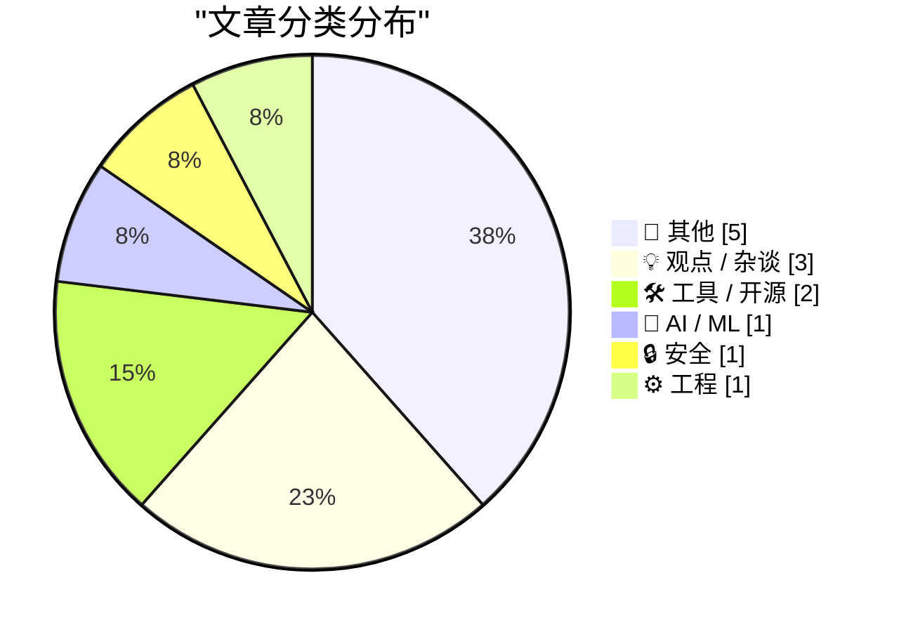
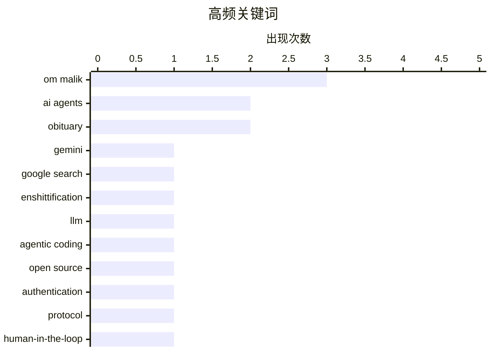

# 📰 AI 博客每日精选 — 2026-06-30

> 来自 Karpathy 推荐的 92 个顶级技术博客，AI 精选 Top 13

## 📝 今日看点

今日技术圈焦点高度集中于 AI 智能体的基建完善与理念重塑。从专属智能体编程的开源大模型，到解决智能体身份注册的开放协议，业界正加速构建纯 AI 驱动的应用生态，并开始重新审视人类在开发流程中的主导权。与此同时，AI 替代传统搜索引擎的趋势日益明显，但其在解决具体代码问题时的可信度边界依然引发了广泛探讨。在行业动态方面，科技界集体缅怀了深刻影响硅谷认知的先驱媒体人 Om Malik，而关于现代编程语言“标准库解绑”的讨论则折射出底层工程架构的持续演进。

---

## 🏆 今日必读

🥇 **Gemini 优于搜索，因为谷歌把搜索搞得一团糟 (2026年6月29日)**

[Pluralistic: Gemini is better than search because Google enshittified search (29 Jun 2026)](https://pluralistic.net/2026/06/29/arsonist-firefighters/) — pluralistic.net · 2 小时前 · 💡 观点 / 杂谈

> 谷歌搜索因为过度商业化导致质量严重下降，这为 AI 工具的崛起创造了巨大空间。相比之下，AI 工具 Gemini 在获取信息方面反而提供了更直接、更优质的体验。作者指出，这并非因为 AI 技术有多么神奇，而是因为传统搜索引擎已经遭到破坏。核心观点是谷歌自己摧毁了搜索的实用性，从而将用户推向了其他替代方案。

💡 **为什么值得读**: 提供了一个独特且辛辣的视角，解释了为什么 AI 正在取代传统搜索：并非 AI 完美无缺，而是搜索引擎的自我毁灭促成了这一结果。

🏷️ Gemini, Google Search, Enshittification

🥈 **Ornith-1.0：用于智能体编程的自我脚手架大语言模型**

[Ornith-1.0: Self-Scaffolding LLMs for Agentic Coding](https://simonwillison.net/2026/Jun/29/ornith/#atom-everything) — simonwillison.net · 3 小时前 · 🤖 AI / ML

> DeepReinforce 发布了其首个 MIT 许可证的开源模型系列 Ornith-1.0，专注于智能体编程任务。该系列包含 9B Dense、31B Dense、35B MoE 和 397B MoE 等多种参数变体。模型基于预训练的 Gemma 4 和 Qwen 3.5 构建，旨在为代码生成和自动化代理流程提供底层支持。在同等规模的开源模型中，该模型在多项编程基准测试上取得了最先进（SOTA）的性能表现。

💡 **为什么值得读**: 介绍了开源 AI 编程领域的新晋 SOTA 模型，为需要构建本地代码智能体的开发者提供了极具潜力的新选择。

🏷️ LLM, Agentic Coding, Open Source

🥉 **Auth.md：来自 WorkOS 的智能体注册开放协议**

[Auth.md — an Open Protocol for Agent Registration From WorkOS](https://workos.com/auth-md?utm_source=daringfireball&amp;utm_medium=newsletter&amp;utm_campaign=q22026) — daringfireball.net · 17 小时前 · 🔒 安全

> WorkOS 推出了一个名为 Auth.md 的开放协议，旨在解决 AI 智能体如何以编程方式向服务注册的问题。传统的注册表单是为浏览器中的人类用户设计的，而 Auth.md 通过在域名根目录托管一个 Markdown 文件来打破这一限制。该文件用于告知 AI 智能体如何代表用户进行注册以及系统支持的交互流程。这种方案巧妙利用了 Markdown 格式，为机器自动化与服务提供商之间建立了一套标准化的沟通机制。

💡 **为什么值得读**: 提出了一种基于 Markdown 的创新协议，填补了 AI Agent 与第三方服务之间自动化注册与授权交互的空白。

🏷️ Authentication, AI Agents, Protocol

---

## 📊 数据概览

| 扫描源 | 抓取文章 | 时间范围 | 精选 |
|:---:|:---:|:---:|:---:|
| 82/92 | 2488 篇 → 13 篇 | 24h | **13 篇** |

### 分类分布



### 高频关键词



<details>
<summary>📈 纯文本关键词图（终端友好）</summary>

```
om malik         │ ████████████████████ 3
ai agents        │ █████████████░░░░░░░ 2
obituary         │ █████████████░░░░░░░ 2
gemini           │ ███████░░░░░░░░░░░░░ 1
google search    │ ███████░░░░░░░░░░░░░ 1
enshittification │ ███████░░░░░░░░░░░░░ 1
llm              │ ███████░░░░░░░░░░░░░ 1
agentic coding   │ ███████░░░░░░░░░░░░░ 1
open source      │ ███████░░░░░░░░░░░░░ 1
authentication   │ ███████░░░░░░░░░░░░░ 1
```

</details>

### 🏷️ 话题标签

**om malik**(3) · **ai agents**(2) · **obituary**(2) · gemini(1) · google search(1) · enshittification(1) · llm(1) · agentic coding(1) · open source(1) · authentication(1) · protocol(1) · human-in-the-loop(1) · automation(1) · silicon valley(1) · photography(1) · tribute(1) · tech community(1) · hackathon(1) · students(1) · sprint(1)

---

## 📝 其他

### 1. 纽约时报：塑造了硅谷自我认知的博主 Om Malik 去世，享年 59 岁

[The New York Times: ‘Om Malik, Whose Blog Shaped How Silicon Valley Saw Itself, Dies at 59’](https://www.nytimes.com/2026/06/26/technology/om-malik-dead.html?unlocked_article_code=1.t1A.AyPT.p7GhDrDcJSfa) — **daringfireball.net** · 18 小时前 · ⭐ 20/30

> 著名科技博主、Gigaom 创始人 Om Malik 去世，享年 59 岁。在互联网泡沫破裂导致大量科技媒体倒闭的时期，Malik 凭借独家猛料和犀利观点填补了行业报道的空白，使 Gigaom 成为硅谷必读的博客。他的报道深刻影响了硅谷对自身的认知与定位。他的离世标志着一个科技博客黄金时代的落幕。

🏷️ Om Malik, Silicon Valley, Obituary

---

### 2. Daniel Agee：“缅怀 Om”

[Daniel Agee: ‘Remembering Om’](https://glass.photo/highlights/remembering-om) — **daringfireball.net** · 18 小时前 · ⭐ 18/30

> Daniel Agee 撰文悼念已故科技媒体人 Om Malik，回忆了他充满热情的个人魅力。尽管 Om 的摄影作品多取材于北极圈附近的冰冷土地，但他本人的性格却截然相反，像太阳一样温暖着身边的人。他具有强烈的好奇心和尊重他人的品质，不仅关注名流，也关心每一个遇到的人。作为互联网出版领域的先驱，Om 的热情和广博的知识为他赢得了深厚的友谊。

🏷️ Om Malik, Obituary, Photography

---

### 3. Matt Mullenweg：“条条大路通 Om”

[Matt Mullenweg: ‘All Roads Lead to Om’](https://ma.tt/2026/06/om-forever/) — **daringfireball.net** · 18 小时前 · ⭐ 18/30

> WordPress 创始人 Matt Mullenweg 撰文深切缅怀 Om Malik，称赞他是一个真正热爱人类的人。Om 无论走到哪里都能迅速融入当地，他不仅购买咖啡，还会了解咖啡师的名字和故事，对遇到的每一个人都怀有深深的好奇与尊重。他拥有百科全书般的知识和惊人的记忆力，在世界各地都建立起了真实的人际连接。Mullenweg 认为，Om 的这种特质使他成为了连接全球科技与人文社区的核心枢纽。

🏷️ Om Malik, Tribute, Tech Community

---

### 4. Hack Your Summer（黑客之夏）

[Hack Your Summer](https://simonwillison.net/2026/Jun/28/hack-your-summer/#atom-everything) — **simonwillison.net** · 23 小时前 · ⭐ 17/30

> “Hack Your Summer” 是一项为本科生、研究生及应届毕业生打造的高速项目冲刺计划。该计划为期 4 周，旨在帮助参与者在暑期构建出真实可用的项目。参与者在计划中将学习如何识别项目方向、保持稳定的开发进度，并获得导师和同伴的指导与支持。最终目标是创造出有形的、面向公众的作品集，以便在未来的求职中展示个人能力。

🏷️ Hackathon, Students, Sprint

---

### 5. 我把书的序言变成了短视频

[I turned my prologue into a short video](https://idiallo.com/byte-size/my-prologue-to-short-video) — **idiallo.com** · 17 小时前 · ⭐ 8/30

> 写一整本书是一项庞大的工程，作者因此调整策略，先将书的序言部分制作成一个短视频发布。这种方式既保持了创作输出，也为未来的完整出版做了预热。短视频成为长篇写作过程中的一种过渡性内容形态。

🏷️ Writing, Video, Content Creation

---

## 💡 观点 / 杂谈

### 6. Gemini 优于搜索，因为谷歌把搜索搞得一团糟 (2026年6月29日)

[Pluralistic: Gemini is better than search because Google enshittified search (29 Jun 2026)](https://pluralistic.net/2026/06/29/arsonist-firefighters/) — **pluralistic.net** · 2 小时前 · ⭐ 26/30

> 谷歌搜索因为过度商业化导致质量严重下降，这为 AI 工具的崛起创造了巨大空间。相比之下，AI 工具 Gemini 在获取信息方面反而提供了更直接、更优质的体验。作者指出，这并非因为 AI 技术有多么神奇，而是因为传统搜索引擎已经遭到破坏。核心观点是谷歌自己摧毁了搜索的实用性，从而将用户推向了其他替代方案。

🏷️ Gemini, Google Search, Enshittification

---

### 7. 引用 Jon Udell 的话：Agent in the loop（智能体在环中）

[Quoting Jon Udell](https://simonwillison.net/2026/Jun/28/jon-udell/#atom-everything) — **simonwillison.net** · 21 小时前 · ⭐ 20/30

> Jon Udell 反对在 AI 辅助开发中使用“Human in the loop”（人在环中）这一说法，认为它将控制权让给了机器。他主张转变叙事，强调流程的主导权应始终属于人类，即所谓的“Agent in the loop”（智能体在环中）。Agent 辅助的流程不应该是一个输入提示词就直接输出功能的黑盒，而应作为团队成员被人类招募进来。这种观点强调了在自动化开发中保持人类主导地位和流程透明度的重要性。

🏷️ AI Agents, Human-in-the-loop, Automation

---

### 8. AltaVista 发生了什么

[What happened to Altavista](https://dfarq.homeip.net/what-happened-to-altavista/?utm_source=rss&#038;utm_medium=rss&#038;utm_campaign=what-happened-to-altavista) — **dfarq.homeip.net** · 8 小时前 · ⭐ 12/30

> AltaVista 曾是 1990 年代最具影响力的搜索引擎之一，其域名 altavista.digital.com 是早期互联网用户的首选入口。文章回顾了 AltaVista 从崛起到最终被淘汰的完整历程。作为 Google 之前的搜索霸主，它的兴衰是互联网发展史上的经典案例。

🏷️ Altavista, search engine, internet history

---

## 🛠 工具 / 开源

### 9. 你该相信谁：Grok 还是官方文档？

[Who you gonna believe: Grok or the docs?](https://www.johndcook.com/blog/2026/06/29/who-you-gonna-believe/) — **johndcook.com** · 7 小时前 · ⭐ 17/30

> 计算器工具 bc 的精简数学库中虽然缺少正切函数（POSIX 版本），却出人意料地包含了贝塞尔函数 J(x) 的支持。作者针对这一奇特现象与 AI 模型 Grok 进行了交互验证。这引发了关于大语言模型输出与官方技术文档之间可信度差异的探讨。核心观点是，在面对技术细节和冷门技术逻辑时，经过验证的官方文档仍然比 AI 的生成内容更具有绝对权威性。

🏷️ bc, Grok, CLI, documentation

---

### 10. 统计 Safari 标签页数量

[Count the number of Safari tabs](https://simonwillison.net/2026/Jun/29/safari-tab-count/#atom-everything) — **simonwillison.net** · 48 分钟前 · ⭐ 12/30

> 一行 AppleScript 命令即可统计 Safari 浏览器中所有窗口的标签页总数。具体命令为 `osascript -e 'tell application "Safari" to count tabs of every window'`，在终端中直接运行即可返回数字。作者实测后发现自己竟打开了 370 个标签页，堪称"标签页羞耻"。

🏷️ AppleScript, Safari, macOS

---

## 🤖 AI / ML

### 11. Ornith-1.0：用于智能体编程的自我脚手架大语言模型

[Ornith-1.0: Self-Scaffolding LLMs for Agentic Coding](https://simonwillison.net/2026/Jun/29/ornith/#atom-everything) — **simonwillison.net** · 3 小时前 · ⭐ 25/30

> DeepReinforce 发布了其首个 MIT 许可证的开源模型系列 Ornith-1.0，专注于智能体编程任务。该系列包含 9B Dense、31B Dense、35B MoE 和 397B MoE 等多种参数变体。模型基于预训练的 Gemma 4 和 Qwen 3.5 构建，旨在为代码生成和自动化代理流程提供底层支持。在同等规模的开源模型中，该模型在多项编程基准测试上取得了最先进（SOTA）的性能表现。

🏷️ LLM, Agentic Coding, Open Source

---

## 🔒 安全

### 12. Auth.md：来自 WorkOS 的智能体注册开放协议

[Auth.md — an Open Protocol for Agent Registration From WorkOS](https://workos.com/auth-md?utm_source=daringfireball&amp;utm_medium=newsletter&amp;utm_campaign=q22026) — **daringfireball.net** · 17 小时前 · ⭐ 25/30

> WorkOS 推出了一个名为 Auth.md 的开放协议，旨在解决 AI 智能体如何以编程方式向服务注册的问题。传统的注册表单是为浏览器中的人类用户设计的，而 Auth.md 通过在域名根目录托管一个 Markdown 文件来打破这一限制。该文件用于告知 AI 智能体如何代表用户进行注册以及系统支持的交互流程。这种方案巧妙利用了 Markdown 格式，为机器自动化与服务提供商之间建立了一套标准化的沟通机制。

🏷️ Authentication, AI Agents, Protocol

---

## ⚙️ 工程

### 13. 解绑标准库

[Unbundling the standard library](https://nesbitt.io/2026/06/29/unbundling-the-standard-library.html) — **nesbitt.io** · 9 小时前 · ⭐ 17/30

> 文章探讨了现代编程语言中“标准库解绑”的发展趋势，即不再默认提供庞大的内置模块。传统上，编程语言通常会自带“电池”（batteries included）以提供开箱即用的全面功能，但现在的趋势是将这些模块分离，需要单独获取。这种转变旨在减少核心运行时的臃肿，提高灵活性，并允许各个组件进行独立更新。作者以幽默的口吻指出，曾经的标配现在变成了需要去特定“货架”单独购买的选配组件。

🏷️ standard library, dependencies, modules

---

*生成于 2026-06-30 03:24 (Asia/Shanghai) | 扫描 82 源 → 获取 2488 篇 → 精选 13 篇*
*基于 [Hacker News Popularity Contest 2025](https://refactoringenglish.com/tools/hn-popularity/) RSS 源列表，由 [Andrej Karpathy](https://x.com/karpathy) 推荐*
*由「懂点儿AI」制作，欢迎关注同名微信公众号获取更多 AI 实用技巧 💡*
