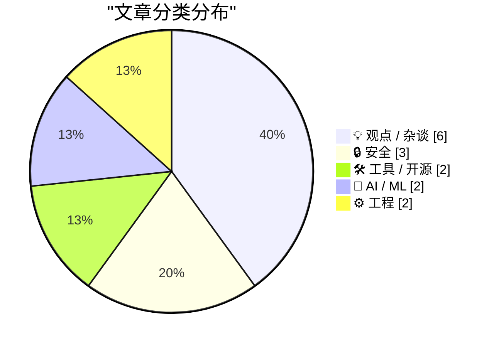
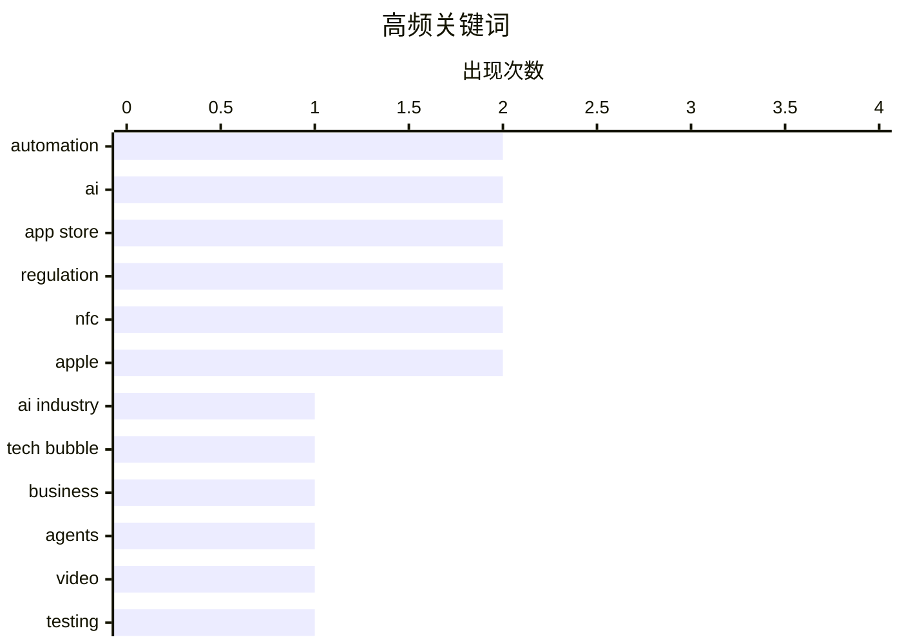

# 📰 AI 博客每日精选 — 2026-07-01

> 来自 Karpathy 推荐的 92 个顶级技术博客，AI 精选 Top 15

## 📝 今日看点

生成式AI行业正面临巨额基础设施投资与实际变现能力之间的严峻鸿沟，但这并未阻挡其在数学推演等前沿领域及底层训练框架上的持续探索。与此同时，全球科技反垄断监管持续升温，英国相关机构正强力推进打破苹果与谷歌在移动支付及应用商店“引导”机制上的垄断壁垒。此外，数据安全与数字基础设施问题日益凸显，不仅苹果供应链遭遇严重数据泄露曝光新一代硬件机密，开源软件作为现代社会底层支撑的关键属性也引发了深刻反思。

---

## 🏆 今日必读

🥇 **AI行业正在亏损**

[The AI Industry Is Losing](https://www.wheresyoured.at/the-ai-industry-is-losing/) — wheresyoured.at · 4 小时前 · 💡 观点 / 杂谈

> 生成式AI行业目前正面临严峻的商业化困境与巨额亏损。作者指出，尽管行业巨头投入了数千亿美元用于算力基础设施建设，但实际产生的收入远无法覆盖这些高昂的资本支出。当前的AI应用大多停留在低价值的消费级工具层面，未能真正打入企业核心利润池。如果不改变这种无法证明投资回报率（ROI）的现状，整个AI产业的泡沫必将破裂。

💡 **为什么值得读**: 它冷峻地揭示了AI领域巨额算力投资与实际商业变现能力之间的巨大鸿沟。

🏷️ AI Industry, Tech Bubble, Business

🥈 **让你的代理使用 shot-scraper video 记录其工作视频演示**

[Have your agent record video demos of its work with shot-scraper video](https://simonwillison.net/2026/Jun/30/shot-scraper-video/#atom-everything) — simonwillison.net · 2 小时前 · 🛠 工具 / 开源

> shot-scraper 1.10 版本引入了全新的 `shot-scraper video` 命令，专为自动化记录 Web 应用操作而设计。该功能通过解析 `storyboard.yml` 配置文件来定义交互流程，并利用 Playwright 引擎精准执行并录制整个操作过程。这为 AI 代理提供了一种标准化的方式，能够轻松为其自动化的工作成果生成直观的视频演示。

💡 **为什么值得读**: 提供了一种通过 YAML 配置结合 Playwright 自动生成 Agent 工作过程视频的实用开发技巧。

🏷️ automation, agents, video, testing

🥉 **Grant Sanderson：AI与数学的未来**

[Grant Sanderson – AI and the future of math](https://www.dwarkesh.com/p/grant-sanderson-2) — dwarkesh.com · 3 小时前 · 🤖 AI / ML

> 知名数学科普创作者 Grant Sanderson（3Blue1Brown）深入探讨了人工智能对纯数学领域的深远影响。数学由于其高度依赖逻辑与严密推演的本质，极有可能成为最先展现出超级智能能力的学科。对话展望了当 AI 能够自主提出数学猜想并完成复杂证明时，人类数学家在未来科研中的角色将如何重塑。

💡 **为什么值得读**: 由顶尖科普专家解读 AI 在数学领域可能率先实现超级智能的深层逻辑与未来图景。

🏷️ AI, Mathematics, Superintelligence

---

## 📊 数据概览

| 扫描源 | 抓取文章 | 时间范围 | 精选 |
|:---:|:---:|:---:|:---:|
| 82/92 | 2474 篇 → 25 篇 | 24h | **15 篇** |

### 分类分布



### 高频关键词



<details>
<summary>📈 纯文本关键词图（终端友好）</summary>

```
automation  │ ████████████████████ 2
ai          │ ████████████████████ 2
app store   │ ████████████████████ 2
regulation  │ ████████████████████ 2
nfc         │ ████████████████████ 2
apple       │ ████████████████████ 2
ai industry │ ██████████░░░░░░░░░░ 1
tech bubble │ ██████████░░░░░░░░░░ 1
business    │ ██████████░░░░░░░░░░ 1
agents      │ ██████████░░░░░░░░░░ 1
```

</details>

### 🏷️ 话题标签

**automation**(2) · **ai**(2) · **app store**(2) · regulation(2) · nfc(2) · apple(2) · ai industry(1) · tech bubble(1) · business(1) · agents(1) · video(1) · testing(1) · mathematics(1) · superintelligence(1) · cma(1) · llm(1) · jax(1) · machine learning(1) · training(1) · shot-scraper(1)

---

## 💡 观点 / 杂谈

### 1. AI行业正在亏损

[The AI Industry Is Losing](https://www.wheresyoured.at/the-ai-industry-is-losing/) — **wheresyoured.at** · 4 小时前 · ⭐ 26/30

> 生成式AI行业目前正面临严峻的商业化困境与巨额亏损。作者指出，尽管行业巨头投入了数千亿美元用于算力基础设施建设，但实际产生的收入远无法覆盖这些高昂的资本支出。当前的AI应用大多停留在低价值的消费级工具层面，未能真正打入企业核心利润池。如果不改变这种无法证明投资回报率（ROI）的现状，整个AI产业的泡沫必将破裂。

🏷️ AI Industry, Tech Bubble, Business

---

### 2. 英国CMA就移动应用引导机制和NFC访问权限展开咨询

[CMA Consultation on Mobile App Steering and NFC Access](https://www.gov.uk/government/news/cma-consults-on-new-requirements-for-apple-and-googles-mobile-platforms) — **daringfireball.net** · 3 小时前 · ⭐ 23/30

> 英国竞争与市场管理局（CMA）正针对苹果和谷歌的移动平台政策提出新的监管要求，核心焦点在于打破“引导”限制。目前苹果在英国完全禁止开发者引导用户使用平台外的支付选项，谷歌也施加了严格限制。CMA 的咨询框架旨在废除这些壁垒，允许开发者合法引导用户绕开平台高昂的强制抽成，并确保平台收取的相关费用维持在公平合理的水平。

🏷️ App Store, regulation, NFC, CMA

---

### 3. 英国监管机构考虑要求应用商店允许向Web端引导，并开放iOS NFC权限

[U.K. Regulator Considers Requiring App Store to Allow Steering to the Web, and iOS NFC to Be Open](https://www.reuters.com/world/uk-regulator-proposes-easing-apple-google-app-store-payment-rules-2026-06-30/) — **daringfireball.net** · 3 小时前 · ⭐ 22/30

> 英国竞争监管机构正在积极推进一项针对苹果和谷歌应用商店支付垄断的整改提案。该提案强制要求科技巨头解除应用内限制，允许开发者合法地将用户引导至外部网络平台进行替代性支付。此举旨在彻底打破高达 30% 的平台强制抽成壁垒，大幅削减开发者的运营成本，并进一步要求苹果向第三方开放其封闭的 iOS NFC 芯片权限。

🏷️ App Store, Apple, regulation, NFC

---

### 4. 字面意义上的“道路与桥梁”

[Taking Roads and Bridges literally](https://nesbitt.io/2026/06/30/taking-roads-and-bridges-literally.html) — **nesbitt.io** · 9 小时前 · ⭐ 22/30

> 作者基于参加 2026 年联合国开源周的体验，对开源软件在现代公共基础设施中的定位进行了深刻反思。文章将数字世界中的开源代码与现实世界中的“道路与桥梁”进行了直接类比，强调其作为社会底层支撑的关键属性。作者探讨了政府与社区应如何像维护实体基础设施一样，投入资源去维护和保障这些数字公共产品。

🏷️ open source, public infrastructure, community

---

### 5. Pluralistic：Jo Walton的《Everybody's Perfect》

[Pluralistic: Jo Walton's "Everybody's Perfect" (30 Jun 2026)](https://pluralistic.net/2026/06/30/serenissima/) — **pluralistic.net** · 8 小时前 · ⭐ 20/30

> Cory Doctorow 高度评价 Jo Walton 的新作《Everybody's Perfect》，称其为一部具有神秘色彩的杰作。这部作品能带来强烈的沉浸感，让读者顿觉此前平淡无奇的生活宛如一场无聊的梦境。文章还简要提及了关于腐败现象、AI 公司实际利润低下等近期关注话题。此外，作者分享了即将在伦敦、爱丁堡、悉尼等地出席的活动安排及最新著作动态。

🏷️ AI economics, book review, science fiction

---

### 6. AI 指南针

[The AI Compass](https://simonwillison.net/2026/Jun/30/the-ai-compass/#atom-everything) — **simonwillison.net** · 2 小时前 · ⭐ 17/30

> 一款名为 "The AI Compass" 的新型测试工具以“政治指南针”的形式评估用户在 AI 和 AI 伦理方面的立场。参与者需要回答 29 个精心设计的问题，测试结果会将用户归类为 30 种典型的 AI 态度原型之一。知名博主 Simon Willison 在体验后，其结果被精准地定义为“车库修理工”原型。该工具为理解当前复杂的 AI 伦理争议和个人技术价值观提供了一个有趣且直观的量化视角。

🏷️ AI, ethics, quiz

---

## 🔒 安全

### 7. ★ 最高法院裁定执法部门使用“地理围栏搜查令”属于“搜查”（但技术上自2024年起可能已无实际意义）

[★ The Supreme Court Rules That Law Enforcement’s Use of ‘Geofence Warrant’ Was a ‘Search’ (But May Be Moot, Technically, Since 2024)](https://daringfireball.net/2026/06/scotus_geofence_warrant_search) — **daringfireball.net** · 46 分钟前 · ⭐ 22/30

> 美国最高法院正式裁定，执法机构使用极具争议的“地理围栏搜查令”获取用户位置数据的行为在法律上构成宪法第四修正案意义上的“搜查”。然而，该裁决的实际效力可能已经大打折扣。自 2024 年起，谷歌已系统性改变了其位置数据的收集与存储方式，使其不再易受此类大范围搜查令的调取，而苹果更是从未在系统层面收集过此类敏感数据。

🏷️ privacy, geofence, Supreme Court, warrant

---

### 8. 印度供应商塔塔电子数据泄露，曝光iPhone 18 Pro细节与照片

[Data Breach at Indian Supplier Tata Electronics Exposes iPhone 18 Pro Details and Photos](https://www.reuters.com/business/media-telecom/apple-iphone-18-pro-supplier-list-parts-photos-exposed-tata-data-leak-2026-06-29/) — **daringfireball.net** · 18 小时前 · ⭐ 20/30

> 苹果的印度核心供应商塔塔电子遭到勒索软件攻击，导致高度机密的 iPhone 18 Pro 部件清单、供应链名单及产品实拍照片被发布至暗网。此次严重的数据泄露直接破坏了苹果长期以来极其严密的硬件保密体系，暴露了其全球供应链网络中的脆弱节点。这不仅可能影响苹果秋季的新品发布节奏，也对跨国制造业的数据安全防线敲响了警钟。

🏷️ data breach, ransomware, supply chain, Apple

---

### 9. 每周更新 510：与 Scott Helme 在马略卡岛的直播

[Weekly Update 510: Live From Mallorca with Scott Helme](https://www.troyhunt.com/weekly-update-510/) — **troyhunt.com** · 3 小时前 · ⭐ 19/30

> Troy Hunt 与 Scott Helme 回顾了 "Why no HTTPS?" 项目发起 8 周年的发展历程。该项目最初旨在通过公开点名的方式，督促企业正确实施传输层安全协议。两人在马略卡岛的直播中讨论了 Web 安全领域在过去 8 年间的演进与现状。他们分享了关于现代网络安全实践和 HTTPS 普及程度的深刻见解，揭示了网络安全意识的巨大转变。

🏷️ HTTPS, Web Security, TLS

---

## 🛠 工具 / 开源

### 10. 让你的代理使用 shot-scraper video 记录其工作视频演示

[Have your agent record video demos of its work with shot-scraper video](https://simonwillison.net/2026/Jun/30/shot-scraper-video/#atom-everything) — **simonwillison.net** · 2 小时前 · ⭐ 24/30

> shot-scraper 1.10 版本引入了全新的 `shot-scraper video` 命令，专为自动化记录 Web 应用操作而设计。该功能通过解析 `storyboard.yml` 配置文件来定义交互流程，并利用 Playwright 引擎精准执行并录制整个操作过程。这为 AI 代理提供了一种标准化的方式，能够轻松为其自动化的工作成果生成直观的视频演示。

🏷️ automation, agents, video, testing

---

### 11. shot-scraper 1.10 版本发布

[shot-scraper 1.10](https://simonwillison.net/2026/Jun/30/shot-scraper/#atom-everything) — **simonwillison.net** · 4 小时前 · ⭐ 22/30

> 命令行 Web 自动化工具 shot-scraper 正式发布 1.10 版本。本次更新的核心亮点是引入了 `shot-scraper video` 命令，允许用户通过 `storyboard.yml` 文件定义的流程来自动化录制 Web 应用的操作视频。这一功能极大地简化了为 AI 代理工作流或常规测试生成可视化演示的复杂度。

🏷️ shot-scraper, release, automation

---

## 🤖 AI / ML

### 12. Grant Sanderson：AI与数学的未来

[Grant Sanderson – AI and the future of math](https://www.dwarkesh.com/p/grant-sanderson-2) — **dwarkesh.com** · 3 小时前 · ⭐ 24/30

> 知名数学科普创作者 Grant Sanderson（3Blue1Brown）深入探讨了人工智能对纯数学领域的深远影响。数学由于其高度依赖逻辑与严密推演的本质，极有可能成为最先展现出超级智能能力的学科。对话展望了当 AI 能够自主提出数学猜想并完成复杂证明时，人类数学家在未来科研中的角色将如何重塑。

🏷️ AI, Mathematics, Superintelligence

---

### 13. 从头编写LLM（第34a部分）—— 为LLM训练构建JAX训练循环

[Writing an LLM from scratch, part 34a -- building a JAX training loop for an LLM training run](https://www.gilesthomas.com/2026/06/llm-from-scratch-34a-building-a-jax-training-loop-for-an-llm-training-run) — **gilesthomas.com** · 39 分钟前 · ⭐ 23/30

> 基于 Sebastian Raschka 的 LLM 构建指南，作者展示了如何脱离参考书籍，仅凭个人笔记从头搭建大语言模型的训练管线。本篇重点聚焦于系列教程的第 34a 部分，详细演示了如何使用高性能计算框架 JAX 编写完整的 LLM 训练循环。这一从零开始的工程实践为深入理解现代 AI 模型的底层训练机制提供了极佳的技术参考。

🏷️ LLM, JAX, machine learning, training

---

## ⚙️ 工程

### 14. 关于滥用 Windows 窗口类额外字节的兼容性说明

[A compatibility note on the abuse of Windows window class extra bytes](https://devblogs.microsoft.com/oldnewthing/20260630-00/?p=112488) — **devblogs.microsoft.com/oldnewthing** · 5 小时前 · ⭐ 19/30

> Windows 开发中存在一种滥用窗口类额外字节的非正规技术，开发者借此寻找隐秘的数据存储位置。这种做法虽然在某些场景下看似巧妙，但会引发严重的系统兼容性问题。微软官方从底层机制出发，解释了这种“奇技淫巧”为何会在系统更新或不同版本中导致不可预期的崩溃。文章详细阐述了正确的数据存储替代方案，以确保应用程序在未来的 Windows 版本中保持健壮性。

🏷️ Windows API, compatibility, system programming

---

### 15. Haskell 中的数据导向编程 (SICP 2.4.3)

[Data-directed programming in Haskell (SICP 2.4.3)](https://entropicthoughts.com/sicp-2-4-data-directed-programming-in-haskell) — **entropicthoughts.com** · 21 小时前 · ⭐ 18/30

> 探讨如何将经典计算机科学教材《SICP》中的数据导向编程理念引入 Haskell 语言。作者跳过了全书通读，直接针对该章节中有趣的核心概念进行剖析，从上周的“标记数据”自然过渡到更高级的数据导向设计。文章以复数为例，展示了如何在 Haskell 中同时处理直角坐标和极坐标的表示方式。通过类型类等 Haskell 特性，演示了如何实现操作与具体数据表示的彻底解耦。

🏷️ Haskell, SICP, functional programming

---

*生成于 2026-07-01 03:39 (Asia/Shanghai) | 扫描 82 源 → 获取 2474 篇 → 精选 15 篇*
*基于 [Hacker News Popularity Contest 2025](https://refactoringenglish.com/tools/hn-popularity/) RSS 源列表，由 [Andrej Karpathy](https://x.com/karpathy) 推荐*
*由「懂点儿AI」制作，欢迎关注同名微信公众号获取更多 AI 实用技巧 💡*
