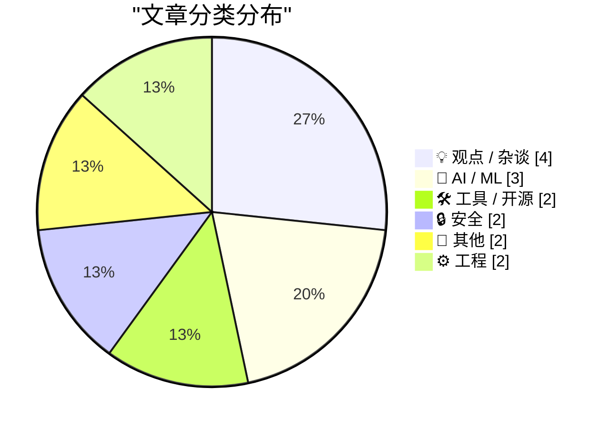
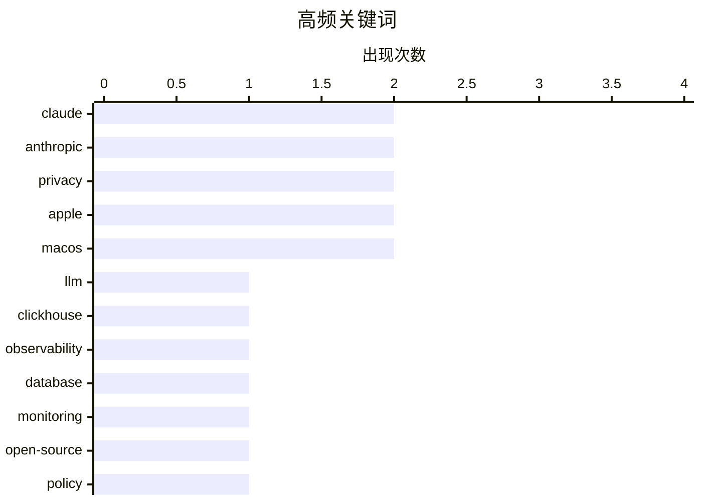

# 📰 AI 博客每日精选 — 2026-07-02

> 来自 Karpathy 推荐的 92 个顶级技术博客，AI 精选 Top 15

## 📝 今日看点

今日科技圈主要围绕AI大模型的迭代竞赛、科技巨头的反垄断博弈以及严峻的数据合规挑战展开。Anthropic与谷歌等巨头持续加码高性价比AI模型，同时AI领域的出口管制政策也迎来了松绑。在平台监管方面，苹果与Epic的垄断纠纷发酵至最高法院，引发业界对平台“技术癌化”现象的深刻反思。此外，从iCloud未修复的隐私漏洞到欧盟新规对开源社区造成的合规冲击，数字世界的安全底线与监管边界正面临前所未有的考验。

---

## 🏆 今日必读

🥇 **Claude Sonnet 5 有哪些新功能**

[What's new in Claude Sonnet 5](https://simonwillison.net/2026/Jun/30/claude-sonnet-5/#atom-everything) — simonwillison.net · 22 小时前 · 🤖 AI / ML

> Anthropic 最新发布了 Claude Sonnet 5 模型。其性能表现接近 Opus 4.8，但提供了更具性价比的定价策略。开发者可以通过官方开发者文档获取比新闻稿更具实操价值的详细信息。这标志着高端模型能力的进一步下放与成本优化。

💡 **为什么值得读**: 了解 Claude 最新大模型的性能基准与定价策略，对评估 AI 开发成本与技术选型至关重要。

🏷️ Claude, LLM, Anthropic

🥈 **ClickHouse 正在赢得可观测性战争**

[Clickhouse is winning the Observability Wars](https://matduggan.com/clickhouse-is-winning-the-observability-wars/) — matduggan.com · 6 小时前 · 🛠 工具 / 开源

> 随着系统监控需求的升级，“可观测性”领域在过去十年经历了巨大的技术演变。在当前的可观测性技术栈竞争中，ClickHouse 正脱颖而出并占据主导地位。它凭借强大的列式存储和数据分析性能，有效解决了海量日志与指标数据的处理痛点。作者认为 ClickHouse 已成为该领域最具竞争力的最终赢家。

💡 **为什么值得读**: 揭示了当前数据库技术在处理海量监控数据时的最优解，为后端架构选型提供了极具价值的实战参考。

🏷️ ClickHouse, observability, database, monitoring

🥉 **CRA（网络弹性法案）与开源无关**

[The CRA is not about open source](https://nesbitt.io/2026/07/01/the-cra-is-not-about-open-source.html) — nesbitt.io · 9 小时前 · 💡 观点 / 杂谈

> 欧盟的网络弹性法案（CRA）在开源社区引发了持续的争议。该法案专门创建了一个“开源管理者”的角色，却未对相关的代码维护工作提供任何资金支持。这种将合规责任强加于无报酬开源维护者身上的做法引发了严重担忧。文章指出该法案的核心问题在于缺乏对开源生态可持续性的实质性支持。

💡 **为什么值得读**: 深入剖析了欧盟新法规对开源生态的潜在破坏性，是开发者及企业法务必读的合规预警。

🏷️ open-source, policy, compliance, Cyber-Resilience-Act

---

## 📊 数据概览

| 扫描源 | 抓取文章 | 时间范围 | 精选 |
|:---:|:---:|:---:|:---:|
| 83/92 | 2503 篇 → 18 篇 | 24h | **15 篇** |

### 分类分布



### 高频关键词



<details>
<summary>📈 纯文本关键词图（终端友好）</summary>

```
claude        │ ████████████████████ 2
anthropic     │ ████████████████████ 2
privacy       │ ████████████████████ 2
apple         │ ████████████████████ 2
macos         │ ████████████████████ 2
llm           │ ██████████░░░░░░░░░░ 1
clickhouse    │ ██████████░░░░░░░░░░ 1
observability │ ██████████░░░░░░░░░░ 1
database      │ ██████████░░░░░░░░░░ 1
monitoring    │ ██████████░░░░░░░░░░ 1
```

</details>

### 🏷️ 话题标签

**claude**(2) · **anthropic**(2) · **privacy**(2) · apple(2) · macos(2) · llm(1) · clickhouse(1) · observability(1) · database(1) · monitoring(1) · open-source(1) · policy(1) · compliance(1) · cyber-resilience-act(1) · gemini(1) · image generation(1) · deepmind(1) · enshittification(1) · platforms(1) · internet(1)

---

## 💡 观点 / 杂谈

### 1. CRA（网络弹性法案）与开源无关

[The CRA is not about open source](https://nesbitt.io/2026/07/01/the-cra-is-not-about-open-source.html) — **nesbitt.io** · 9 小时前 · ⭐ 23/30

> 欧盟的网络弹性法案（CRA）在开源社区引发了持续的争议。该法案专门创建了一个“开源管理者”的角色，却未对相关的代码维护工作提供任何资金支持。这种将合规责任强加于无报酬开源维护者身上的做法引发了严重担忧。文章指出该法案的核心问题在于缺乏对开源生态可持续性的实质性支持。

🏷️ open-source, policy, compliance, Cyber-Resilience-Act

---

### 2. Pluralistic：技术癌化 (2026年7月1日)

[Pluralistic: Technocarcinization (01 Jul 2026)](https://pluralistic.net/2026/07/01/ontogeny/) — **pluralistic.net** · 4 小时前 · ⭐ 22/30

> 作者探讨了“技术癌化”现象，指出所有平台最终都会走向“屎化”的趋同演化。文章汇集了多方面的科技与政治评论，包括伊丽莎白·沃伦对垄断的批评、Spotify 与 Apple 的反垄断斗争，以及埃克森美孚游说者的坦白。此外，还分享了作者的近期动态、公开演讲日程以及新书发布信息。核心观点在于科技巨头的垄断与平台衰退正在重塑当前的数字生态。

🏷️ enshittification, platforms, internet

---

### 3. Valve解释为何不对其硬件平台进行补贴

[Valve Explains Why It Doesn’t Subsidize Its Hardware Platforms](https://www.theverge.com/games/952004/valve-steam-machine-price-not-subsidizing) — **daringfireball.net** · 1 小时前 · ⭐ 17/30

> Valve近期声明不会以亏本价销售Steam Deck掌机及全新Steam Machine等硬件设备。公司认为硬件补贴策略与其构建健康生态系统的理念背道而驰。Valve坚信从长远来看，开放系统对自身和消费者都更为有利。PC生态系统的开放性正是其成为行业主要驱动力的根本原因。

🏷️ Valve, Steam Deck, hardware

---

### 4. The Talk Show 节目：“吃药变胖”

[The Talk Show: ‘Taking Drugs to Get Fat’](https://daringfireball.net/thetalkshow/2026/06/30/ep-451) — **daringfireball.net** · 3 小时前 · ⭐ 16/30

> 本期播客邀请嘉宾John Moltz回归，重点讨论了苹果因全球RAM和SSD短缺而引发的硬件涨价事件。节目还对macOS 27 Golden Gate测试版中备受关注的UI界面改动进行了深入的探讨与猜测。此外，节目包含了Coax、Even Realities和Squarespace等赞助商的推广信息。

🏷️ Apple, MacOS, podcast

---

## 🤖 AI / ML

### 5. Claude Sonnet 5 有哪些新功能

[What's new in Claude Sonnet 5](https://simonwillison.net/2026/Jun/30/claude-sonnet-5/#atom-everything) — **simonwillison.net** · 22 小时前 · ⭐ 26/30

> Anthropic 最新发布了 Claude Sonnet 5 模型。其性能表现接近 Opus 4.8，但提供了更具性价比的定价策略。开发者可以通过官方开发者文档获取比新闻稿更具实操价值的详细信息。这标志着高端模型能力的进一步下放与成本优化。

🏷️ Claude, LLM, Anthropic

---

### 6. Nano Banana 2 Lite

[Nano Banana 2 Lite](https://simonwillison.net/2026/Jun/30/nano-banana-2-lite/#atom-everything) — **simonwillison.net** · 21 小时前 · ⭐ 22/30

> Google DeepMind 推出了名为 Nano Banana 2 Lite 的新型图像模型，其 API 代号为 `gemini-3.1-flash-lite-image`。该模型被定位为最快且最便宜的 Gemini 图像生成方案，专为高并发和大规模处理场景设计。开发者可以通过 Google AI Studio 直接测试其图像生成能力。它为预算敏感且追求极致处理速度的视觉应用提供了新选择。

🏷️ Gemini, image generation, DeepMind

---

### 7. 引述 Anthropic

[Quoting Anthropic](https://simonwillison.net/2026/Jun/30/anthropic/#atom-everything) — **simonwillison.net** · 19 小时前 · ⭐ 18/30

> Anthropic 宣布已收到美国商务部通知，正式取消对 Claude Fable 5 和 Mythos 5 模型的出口管制。公司计划从次日起恢复这两个模型的使用权限，并承诺尽快提供更多更新信息。这标志着此前针对这些特定 AI 模型的国际贸易限制已被解除。全球开发者将能够重新合法访问并集成这些先进的 AI 工具。

🏷️ Anthropic, Claude, export controls

---

## 🛠 工具 / 开源

### 8. ClickHouse 正在赢得可观测性战争

[Clickhouse is winning the Observability Wars](https://matduggan.com/clickhouse-is-winning-the-observability-wars/) — **matduggan.com** · 6 小时前 · ⭐ 25/30

> 随着系统监控需求的升级，“可观测性”领域在过去十年经历了巨大的技术演变。在当前的可观测性技术栈竞争中，ClickHouse 正脱颖而出并占据主导地位。它凭借强大的列式存储和数据分析性能，有效解决了海量日志与指标数据的处理痛点。作者认为 ClickHouse 已成为该领域最具竞争力的最终赢家。

🏷️ ClickHouse, observability, database, monitoring

---

### 9. Gnome：便捷的GIF动画应用

[Gnome](https://lexfriedman.com/gnome/) — **daringfireball.net** · 22 小时前 · ⭐ 14/30

> Lex Friedman推出了一款名为Gnome的精巧动画GIF应用，旨在重塑人们的日常数字沟通方式。尽管GIF已成为现代人类交流的关键支柱，但在Slack或iMessage等平台使用它们往往需要繁琐的搜索和复制步骤。这种延迟常常导致错过最佳沟通时机，让幽默感大打折扣。Gnome通过优化检索和发送流程，彻底解决了获取GIF的痛点。

🏷️ GIF, app, macOS

---

## 🔒 安全

### 10. 404 Media：iCloud“隐藏我的电子邮件”漏洞泄露用户真实邮箱地址

[404 Media: Vulnerability in iCloud’s ‘Hide My Email’ Reveals Peoples’ Real Email Addresses](https://www.404media.co/apple-hide-my-email-vulnerability-reveals-peoples-real-email-addresses/) — **daringfireball.net** · 4 小时前 · ⭐ 21/30

> 苹果 iCloud 的“隐藏我的电子邮件”功能存在严重的安全漏洞，导致用户的真实邮箱地址被暴露。404 Media 在一年前就已向苹果报告了该漏洞及复现步骤，但至今仍未得到修复。由于该漏洞目前仍可被恶意利用，媒体决定公开此事以督促苹果采取行动。这暴露出苹果在隐私漏洞响应与修复机制上存在严重滞后。

🏷️ iCloud, vulnerability, privacy

---

### 11. AIVD与MIVD的批量数据集：影子情报机构

[Bulkdatasets AIVD en MIVD: de schaduw geheime dienst](https://berthub.eu/articles/posts/de-schaduwgeheimedienst/) — **berthub.eu** · 10 小时前 · ⭐ 21/30

> 最新发布的研究报告指出，荷兰情报部门（AIVD 和 MIVD）在处理批量数据集时存在疏忽甚至违法行为。这些数据集通常包含数百万无辜群众的个人数据，主要来源于线人、外国情报机构或商业实体。情报部门对这些海量数据的收集和管理缺乏足够的法律约束和透明度。这种“影子情报”运作模式引发了严重的隐私泄露和权力滥用担忧。

🏷️ privacy, mass-surveillance, intelligence, data-governance

---

## 📝 其他

### 12. 最高法院同意复审苹果在“苹果诉 Epic Games”案中关于民事藐视法庭的申诉

[Supreme Court Agrees to Review Apple’s Petition Regarding Civil Contempt Finding in ‘Apple v. Epic Games’](https://www.supremecourt.gov/orders/courtorders/063026zor_3f14.pdf) — **daringfireball.net** · 23 小时前 · ⭐ 19/30

> 美国最高法院已同意就苹果在“苹果诉 Epic Games”反垄断案中的申诉进行调卷复审。此次复审明确限于苹果提出的第一项问题，即关于民事藐视法庭的裁决。核心争议在于苹果因对外部支付收取佣金而违反禁令精神，是否应被判定为藐视法庭。此举意味着苹果正试图通过最高法院推翻此前对其应用内支付政策做出的不利裁决。

🏷️ Apple, Epic Games, antitrust

---

### 13. 最高法院以6比3的裁决维持出生公民权

[Supreme Court Upholds Birthright Citizenship in 6-3 Decision](https://talkingpointsmemo.com/edblog/the-birthright-citizenship-decision-is-more-evidence-for-court-reform/sharetoken/e2bf9547-fa9b-468c-8af3-aa09e72ca698) — **daringfireball.net** · 23 小时前 · ⭐ 13/30

> 美国最高法院近日以6比3的优势维持了出生公民权的合宪性。作者Josh Marshall指出，持不同意见的法官其最终目标是彻底废除出生公民权。尽管多数派做出了符合宪法的裁决，但这并不能掩盖最高法院整体存在的腐败问题。作者强调，这一事件再次凸显了美国司法系统迫切需要进行实质性改革的必要性。

🏷️ Supreme Court, law, politics

---

## ⚙️ 工程

### 14. 这完全涉及处于这个气密舱的另一侧：更改管理设置

[It rather involved being on the other side of this airtight hatchway: Changing administrative settings](https://devblogs.microsoft.com/oldnewthing/20260701-00/?p=112498) — **devblogs.microsoft.com/oldnewthing** · 5 小时前 · ⭐ 19/30

> Windows 系统中的许多管理设置更改操作，经常被误认为是系统漏洞，但实际上它们都需要管理员权限才能执行。作者通过“从内侧解锁门”的比喻，解释了这类安全机制的本质逻辑。如果攻击者已经获得了系统的管理员权限，那么系统本身的防护边界就已经被打破。这并非系统设计缺陷，而是权限管理机制下的必然结果。

🏷️ Windows, security, administration

---

### 15. DNA序列比对与国际象棋中的“王”

[DNA Sequence Alignment and Kings](https://www.johndcook.com/blog/2026/06/30/dna-sequence-alignment-and-kings/) — **johndcook.com** · 19 小时前 · ⭐ 17/30

> 文章揭示了DNA序列比对算法与国际象棋中“王”的走法之间在数学上的奇妙联系。中心Delannoy数计算了国王在棋盘上不后退地从一角移动到对角线另一角的路径总数。这种数学模型可以推广到更普遍的m × n矩形棋盘场景。这些组合数学概念在生物信息学的基因序列比对中发挥着关键作用。

🏷️ algorithms, bioinformatics, mathematics

---

*生成于 2026-07-02 03:26 (Asia/Shanghai) | 扫描 83 源 → 获取 2503 篇 → 精选 15 篇*
*基于 [Hacker News Popularity Contest 2025](https://refactoringenglish.com/tools/hn-popularity/) RSS 源列表，由 [Andrej Karpathy](https://x.com/karpathy) 推荐*
*由「懂点儿AI」制作，欢迎关注同名微信公众号获取更多 AI 实用技巧 💡*
