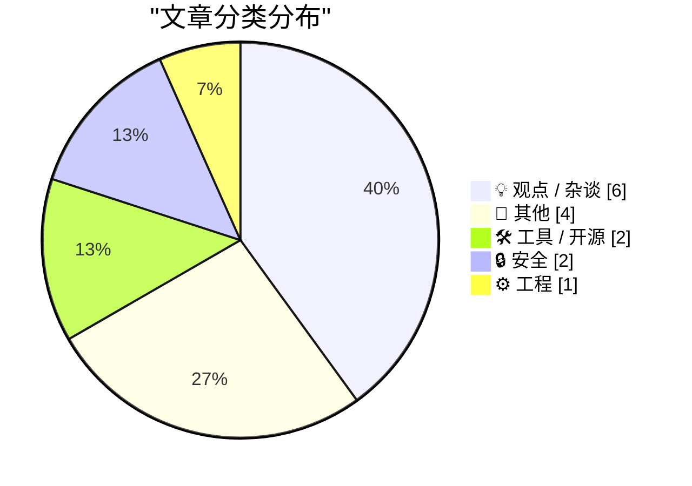
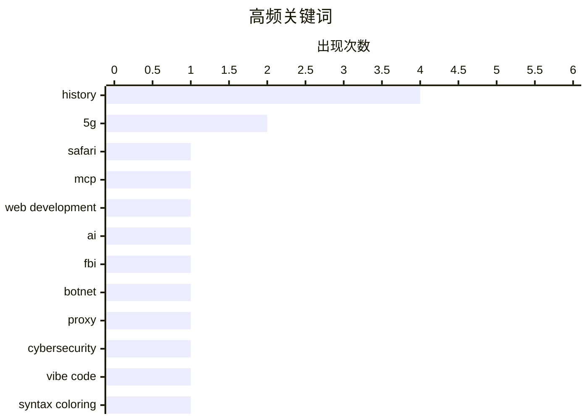

# 📰 AI 博客每日精选 — 2026-07-04

> 来自 Karpathy 推荐的 92 个顶级技术博客，AI 精选 Top 15

## 📝 今日看点

今日技术圈最受瞩目的是AI编码代理的全面爆发，从Safari引入MCP服务器到知名开发者推出全新开源工具，AI正深度重塑软件开发流程，并引发了对“氛围编程”时代开发者技能边界的反思。安全与隐私领域同样引发热议，一方面FBI重拳查封了大型恶意代理与僵尸网络，另一方面关于数据删除的探讨揭示了个人隐私一旦泄露便难以彻底根除的残酷现实。此外，从Windows系统级的底层调试到美国毫米波5G网络的复苏，底层基础设施的演进依然是支撑整个技术生态的关键基石。

---

## 🏆 今日必读

🥇 **面向 Web 开发者的 Safari MCP 服务器介绍**

[Introducing the Safari MCP Server for Web Developers](https://webkit.org/blog/18136/introducing-the-safari-mcp-server-for-web-developers/) — daringfireball.net · 21 小时前 · 🛠 工具 / 开源

> Safari Technology Preview 247 引入了全新的 Safari MCP（模型上下文协议）服务器，旨在提升 Web 开发与调试工作流的效率。该服务器允许 AI 编码代理直接连接到 Safari 浏览器窗口，获取代码在实际浏览器中的真实渲染状态。这种集成使得开发代理能够更精确地理解前端表现并辅助修复问题。这标志着 AI 代理在 Web 开发流程中正变得越来越不可或缺。

💡 **为什么值得读**: 如果你想让 AI 编码助手直接“看懂”Safari 中的前端渲染效果并加速调试，这篇文章提供了具体的官方实现方案。

🏷️ Safari, MCP, web development, AI

🥈 **FBI 查封 NetNut 代理平台及 Popa 僵尸网络**

[FBI Seizes NetNut Proxy Platform, Popa Botnet](https://krebsonsecurity.com/2026/07/fbi-seizes-netnut-proxy-platform-popa-botnet/) — krebsonsecurity.com · 23 小时前 · 🔒 安全

> FBI 与行业合作伙伴联合查封了数百个与 NetNut 住宅代理服务相关的域名。NetNut 由以色列上市公司 Alarum Technologies 运营，此前被安全研究机构确认与 Popa 僵尸网络存在直接关联。Popa 僵尸网络通过恶意软件感染并控制了至少 200 万台设备，将其作为非法代理节点。此次执法行动有效打击了庞大的黑产基础设施。

💡 **为什么值得读**: 揭示了大型住宅代理服务背后的庞大黑产规模，以及国际执法机构打击网络犯罪的最新进展。

🏷️ FBI, botnet, proxy, cybersecurity

🥉 **Pluralistic：CARDiac、语法高亮、查看源代码与氛围编程**

[Pluralistic: CARDiac, syntax coloring, view source and vibe code (03 Jul 2026)](https://pluralistic.net/2026/07/03/rod-logic/) — pluralistic.net · 10 小时前 · 💡 观点 / 杂谈

> 作者探讨了编程语言中不断升级的抽象层级对开发者权力、责任和代码保真度带来的复杂影响。文章将“语法高亮”和“查看源代码”等基础概念与当下流行的“氛围编程（Vibe Code）”进行对比，反思了现代编程工具的演变。此外，还简述了版权巨魔败诉、住房补贴政策等近期社会与时事热点。

💡 **为什么值得读**: 为思考现代编程范式（如 AI 辅助下的 Vibe Coding）与底层技术透明度之间的矛盾提供了深刻的文化与技术视角。

🏷️ vibe code, syntax coloring, abstraction

---

## 📊 数据概览

| 扫描源 | 抓取文章 | 时间范围 | 精选 |
|:---:|:---:|:---:|:---:|
| 81/92 | 2456 篇 → 16 篇 | 24h | **15 篇** |

### 分类分布



### 高频关键词



<details>
<summary>📈 纯文本关键词图（终端友好）</summary>

```
history         │ ████████████████████ 4
5g              │ ██████████░░░░░░░░░░ 2
safari          │ █████░░░░░░░░░░░░░░░ 1
mcp             │ █████░░░░░░░░░░░░░░░ 1
web development │ █████░░░░░░░░░░░░░░░ 1
ai              │ █████░░░░░░░░░░░░░░░ 1
fbi             │ █████░░░░░░░░░░░░░░░ 1
botnet          │ █████░░░░░░░░░░░░░░░ 1
proxy           │ █████░░░░░░░░░░░░░░░ 1
cybersecurity   │ █████░░░░░░░░░░░░░░░ 1
```

</details>

### 🏷️ 话题标签

**history**(4) · **5g**(2) · **safari**(1) · mcp(1) · web development(1) · ai(1) · fbi(1) · botnet(1) · proxy(1) · cybersecurity(1) · vibe code(1) · syntax coloring(1) · abstraction(1) · llm(1) · coding agent(1) · release(1) · privacy(1) · data deletion(1) · security(1) · windows(1)

---

## 💡 观点 / 杂谈

### 1. Pluralistic：CARDiac、语法高亮、查看源代码与氛围编程

[Pluralistic: CARDiac, syntax coloring, view source and vibe code (03 Jul 2026)](https://pluralistic.net/2026/07/03/rod-logic/) — **pluralistic.net** · 10 小时前 · ⭐ 24/30

> 作者探讨了编程语言中不断升级的抽象层级对开发者权力、责任和代码保真度带来的复杂影响。文章将“语法高亮”和“查看源代码”等基础概念与当下流行的“氛围编程（Vibe Code）”进行对比，反思了现代编程工具的演变。此外，还简述了版权巨魔败诉、住房补贴政策等近期社会与时事热点。

🏷️ vibe code, syntax coloring, abstraction

---

### 2. Maxis 的生命与时代：第一部分 - 模拟一切 (SimEverything)

[The Life and Times of Maxis, Part 1: SimEverything](https://www.filfre.net/2026/07/the-life-and-times-of-maxis-part-1-simeverything/) — **filfre.net** · 3 小时前 · ⭐ 15/30

> 回顾了著名游戏公司 Maxis Software 的早期发展史及其“模拟一切”的设计哲学。通过创始人 Will Wright 的视角，展现了游戏如何将“大陆漂移”等看似枯燥的科学概念转化为引人入胜的玩法。文章还强调了游戏玩家群体在保存和传承游戏文化遗产方面所发挥的巨大作用。

🏷️ Maxis, gaming, history

---

### 3. 2026 年 6 月通讯

[June 2026 newsletter](https://simonwillison.net/2026/Jul/3/june-newsletter/#atom-everything) — **simonwillison.net** · 4 小时前 · ⭐ 13/30

> Simon Willison 发布了面向赞助者的 6 月度通讯，汇总了当月 AI 与技术生态的关键动态。重点提及了 Claude Fable 5 和 GPT-5.6 的发布、美国出口限制的影响，以及 GLM-5.2 成为当前最佳开源权重模型的消息。此外，还探讨了“Tokenmaxxing”趋势的终结以及 Datasette Apps 等个人项目的最新进展。

🏷️ newsletter, sponsorship

---

### 4. 我再说一遍（5G 与 LTE 版本）

[I Repeat Myself (5G vs. LTE Edition)](https://daringfireball.net/linked/2022/03/23/5g-battery-life) — **daringfireball.net** · 22 小时前 · ⭐ 13/30

> 2022 年《华尔街日报》的测试表明，在多款 iPhone 和 iPad 机型上流媒体播放视频时，使用 LTE 网络比 5G 网络能显著节省电池续航。尽管该测试基于 iPhone 13 Pro 等旧机型，但作者认为这一结论在当前设备上大概率依然成立。5G 网络在提供更快网速的同时，确实给移动设备的电池带来了更大的消耗负担。作者借此重申了网络模式选择对设备续航的实际影响。

🏷️ 5G, LTE, battery life

---

### 5. Truth Social 依然只是特朗普的个人博客

[Truth Social Is Still Just Trump’s Blog](https://daringfireball.net/2025/06/truth_social_is_just_trumps_blog) — **daringfireball.net** · 23 小时前 · ⭐ 12/30

> 特朗普政府的高级官员（如商务部长 Howard Lutnick）在发布重大政策消息时，选择使用 X 平台而非特朗普自建的 Truth Social。除了特朗普本人，其政府团队几乎无人使用 Truth Social。这进一步印证了 Truth Social 缺乏广泛的社交生态，实质上已沦为特朗普个人的专属博客。作者借此观察揭示了该平台在政治与科技生态中的边缘化地位。

🏷️ Truth Social, Anthropic, Claude

---

### 6. EveryMac 迎来 30 周年

[EveryMac Turns 30](https://everymac.com/whatsnew/) — **daringfireball.net** · 21 小时前 · ⭐ 11/30

> 知名苹果设备信息数据库 EveryMac.com 迎来了上线 30 周年纪念。三十年来，该网站一直致力于提供从初代 128k Mac 到最新产品线的所有 Mac 机型详细信息。作为互联网早期的产物，EveryMac 至今仍是查询苹果历史设备规格的权威资源。作者借此感慨老牌科技网站的持久生命力，并提及自己的 Daring Fireball 博客也即将迈入第 24 个年头。

🏷️ EveryMac, Apple, history

---

## 📝 其他

### 7. Ookla 4 月报告：“重返 mmWave 5G”

[April Report From Ookla: ‘A Return to mmWave 5G’](https://www.ookla.com/articles/a-return-to-mmwave-5g) — **daringfireball.net** · 20 小时前 · ⭐ 17/30

> Ookla 的最新报告显示，尽管全球其他大多数国家专注于释放中频频谱，美国市场的 mmWave（毫米波）5G 网络正在迎来复苏与持续增长。结合 RootMetrics 的驾驶测试和 Speedtest Insights 的众包数据，证明了 mmWave 网络并未消失且覆盖范围在不断扩大。这反映了美国在 5G 部署策略上与其他国家的显著差异。

🏷️ 5G, mmWave, Ookla

---

### 8. 螺旋蝇的衰落与复苏

[The Fall and Rise of Screwworm](https://www.construction-physics.com/p/the-fall-and-rise-of-screwworm) — **construction-physics.com** · 7 小时前 · ⭐ 14/30

> 讲述了螺旋蝇这一极具破坏性害虫的生物学历史及其对畜牧业造成的周期性威胁。文章详细回顾了人类如何通过科学手段将其几乎根除，以及近年来它们再次从墨西哥等地向北迁徙复苏的严峻现实。这不仅是一个生物学故事，更是一场关于生态防治与农业基础设施建设的深刻反思。

🏷️ agriculture, biology, history

---

### 9. 《Compute!'s Gazette》杂志（1983-1995）

[Compute!’s Gazette magazine, 1983-1995](https://dfarq.homeip.net/computes-gazette-magazine-1983-1995/?utm_source=rss&#038;utm_medium=rss&#038;utm_campaign=computes-gazette-magazine-1983-1995) — **dfarq.homeip.net** · 8 小时前 · ⭐ 12/30

> 《Compute!'s Gazette》是一本创刊于 1983 年 7 月的经典 Commodore 计算机杂志。作为综合类计算机杂志《Compute!》的衍生刊物，它紧随当时 Commodore 计算机的发展趋势，迅速获得了巨大的成功。该杂志为用户提供了丰富的技术内容与编程指导，是一代计算机爱好者的美好回忆。它不仅记录了历史，也见证了 80 至 90 年代微型计算机的黄金发展期。

🏷️ Commodore, retro-computing, history

---

### 10. “特朗普华盛顿特区的完美缩影”

[‘A Perfect Reflection of Trump’s Washington’](https://politicalwire.com/2026/06/19/a-perfect-reflection-of-trumps-washington/) — **daringfireball.net** · 23 小时前 · ⭐ 10/30

> 林肯纪念堂倒影池的翻新工程成为了特朗普总统任期的一个“完美隐喻”。原本承诺的快速廉价修复，最终演变成耗资超 1400 万美元的无投标项目。这个刚被涂成“美国国旗蓝”的水池在短短几天内就因藻类滋生而变绿，新涂层也开始剥落。这种华而不实、质量堪忧的工程结果，被评论家视为特朗普主义政治风格的生动缩影。

🏷️ politics, Washington DC

---

## 🛠 工具 / 开源

### 11. 面向 Web 开发者的 Safari MCP 服务器介绍

[Introducing the Safari MCP Server for Web Developers](https://webkit.org/blog/18136/introducing-the-safari-mcp-server-for-web-developers/) — **daringfireball.net** · 21 小时前 · ⭐ 26/30

> Safari Technology Preview 247 引入了全新的 Safari MCP（模型上下文协议）服务器，旨在提升 Web 开发与调试工作流的效率。该服务器允许 AI 编码代理直接连接到 Safari 浏览器窗口，获取代码在实际浏览器中的真实渲染状态。这种集成使得开发代理能够更精确地理解前端表现并辅助修复问题。这标志着 AI 代理在 Web 开发流程中正变得越来越不可或缺。

🏷️ Safari, MCP, web development, AI

---

### 12. llm-coding-agent 0.1a0 发布

[llm-coding-agent 0.1a0](https://simonwillison.net/2026/Jul/2/llm-coding-agent/#atom-everything) — **simonwillison.net** · 23 小时前 · ⭐ 23/30

> 知名开发者 Simon Willison 发布了基于其 LLM 库构建的全新实验性编码代理工具 llm-coding-agent 0.1a0。随着其原有的 LLM 库逐渐演变为一个代理框架，该项目旨在探索如何构建一个简单但高效的编码助手。该工具作为一个全新的 Python 库实现，并集成了 MCP（模型上下文协议）以增强代理的执行能力。

🏷️ LLM, coding agent, release

---

## 🔒 安全

### 13. FBI 查封 NetNut 代理平台及 Popa 僵尸网络

[FBI Seizes NetNut Proxy Platform, Popa Botnet](https://krebsonsecurity.com/2026/07/fbi-seizes-netnut-proxy-platform-popa-botnet/) — **krebsonsecurity.com** · 23 小时前 · ⭐ 25/30

> FBI 与行业合作伙伴联合查封了数百个与 NetNut 住宅代理服务相关的域名。NetNut 由以色列上市公司 Alarum Technologies 运营，此前被安全研究机构确认与 Popa 僵尸网络存在直接关联。Popa 僵尸网络通过恶意软件感染并控制了至少 200 万台设备，将其作为非法代理节点。此次执法行动有效打击了庞大的黑产基础设施。

🏷️ FBI, botnet, proxy, cybersecurity

---

### 14. 游泳池、尿液与试图从互联网上删除你的数据

[Swimming Pools, Pee, and Trying to Delete Your Data From the Internet](https://www.troyhunt.com/swimming-pools-pee-and-trying-to-delete-your-data-from-the-internet/) — **troyhunt.com** · 12 小时前 · ⭐ 23/30

> 作者以“在游泳池里撒尿”为生动比喻，深刻阐述了从互联网上彻底删除个人数据的极端困难性。文章探讨了数据泄露后，个人隐私信息如何在不同平台和数据商之间迅速传播并永久留存。结论指出，面对已经扩散的数据，传统的删除手段往往收效甚微，预防泄露才是根本。

🏷️ privacy, data deletion, security

---

## ⚙️ 工程

### 15. 我们是如何断定 CcNamespace.dll 是一组过早卸载的 DLL 的“主谋”的？

[How did we conclude that CcNamespace.dll was the ringleader of a group of DLLs that unloaded prematurely?](https://devblogs.microsoft.com/oldnewthing/20260703-00/?p=112504) — **devblogs.microsoft.com/oldnewthing** · 5 小时前 · ⭐ 18/30

> 深入分析了一个复杂的 Windows 系统级问题：如何定位导致一组 DLL 过早卸载的“罪魁祸首”。作者通过梳理上下文线索和底层调试逻辑，详细演示了排查 CcNamespace.dll 异常行为的全过程。文章揭示了 Windows DLL 加载与卸载机制中的微妙交互，以及如何通过严密的推理解决难以复现的系统崩溃。

🏷️ Windows, DLL, debugging

---

*生成于 2026-07-04 03:03 (Asia/Shanghai) | 扫描 81 源 → 获取 2456 篇 → 精选 15 篇*
*基于 [Hacker News Popularity Contest 2025](https://refactoringenglish.com/tools/hn-popularity/) RSS 源列表，由 [Andrej Karpathy](https://x.com/karpathy) 推荐*
*由「懂点儿AI」制作，欢迎关注同名微信公众号获取更多 AI 实用技巧 💡*
