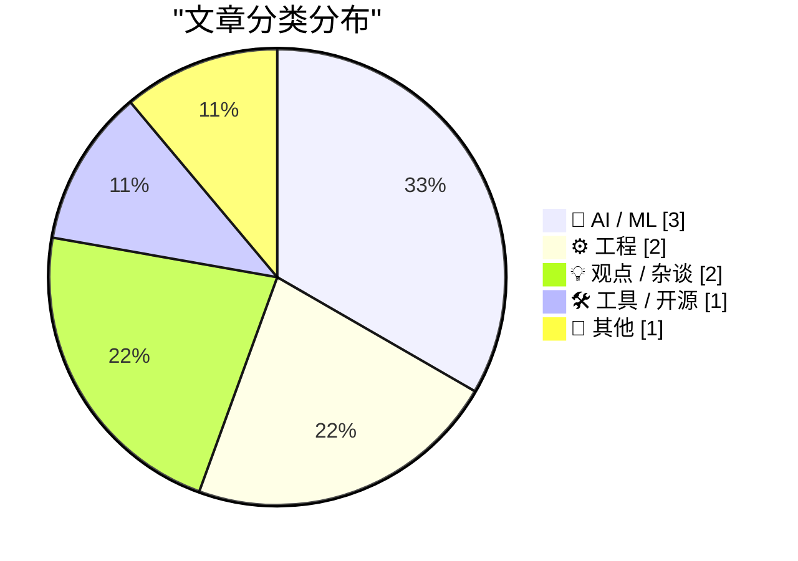
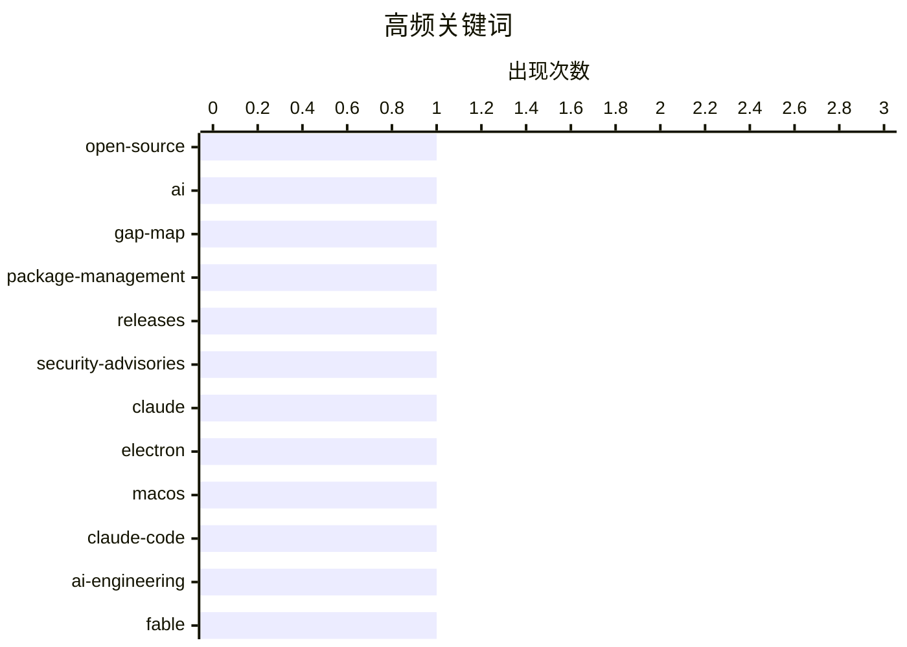

# 📰 AI 博客每日精选 — 2026-07-05

> 来自 Karpathy 推荐的 92 个顶级技术博客，AI 精选 Top 9

## 📝 今日看点

今日技术圈的焦点高度集中于人工智能的生态演进及其对行业的深远影响。业界不仅开始全面审视开源AI的发展缺口并探索赋予AI编程模型更多自主权，AI浪潮更直接冲击了传统的开发者教育市场，引发了关于职业前景的广泛讨论。与此同时，软件工程与基础工具生态正持续围绕安全、隐私与架构体验进行重塑，涵盖了依赖管理的安全追踪、本地隐私功能的强化，以及围绕桌面应用底层架构的技术争议。

---

## 🏆 今日必读

🥇 **开源 AI 差距地图**

[Open Source AI Gap Map](https://simonwillison.net/2026/Jul/3/open-source-ai-gap-map/#atom-everything) — simonwillison.net · 20 小时前 · 🤖 AI / ML

> Current AI 作为一个拥有 4 亿美元资金支持的非营利组织，近期发布了开源 AI 差距地图（Gap Map）。该地图旨在全面索引当前开源人工智能生态的发展现状与缺失环节。它揭示了开源社区在构建公共 AI 选项时所面临的关键空白。这为未来资源分配和技术攻坚提供了清晰的路线图。

💡 **为什么值得读**: 通过这张地图，可以快速了解开源 AI 生态目前的短板与未来亟待解决的痛点。

🏷️ open-source, AI, gap-map

🥈 **包管理周报：2026年7月4日**

[This Week in Package Management: 4 July 2026](https://nesbitt.io/2026/07/04/this-week-in-package-management.html) — nesbitt.io · 8 小时前 · ⚙️ 工程

> 本周包管理动态涵盖了各大主流包管理器的最新版本发布、安全公告及社区文章。内容汇总了近期依赖管理工具的更新日志与潜在的安全漏洞警告。开发者可以通过此简报快速追踪生态系统内的关键变更。这为维护项目依赖的安全性和时效性提供了重要参考。

💡 **为什么值得读**: 开发者追踪依赖更新和安全隐患的高效每周简报。

🏷️ package-management, releases, security-advisories

🥉 **Claude 糟糕透顶的 Electron Mac 应用是一场“内幕交易”**

[★ Claude’s Criminally Bad Electron Mac App Is an Inside Job](https://daringfireball.net/2026/07/claudes_criminally_bad_mac_app_is_an_inside_job) — daringfireball.net · 20 小时前 · 💡 观点 / 杂谈

> Anthropic 推出的 Claude Mac 应用因采用 Electron 架构而备受批评。其根本原因在于 Anthropic 的 Felix Rieseberg 正是 Electron 框架的核心创始人和维护者。这种技术选型类似于让锤子制造商来监督建筑螺丝的安装。作者借此讽刺了这种基于内部利益而非原生性能考量的技术决策。

💡 **为什么值得读**: 以幽默犀利的视角揭示了大型 AI 公司在桌面端应用开发中的技术选型偏见。

🏷️ Claude, Electron, macOS

---

## 📊 数据概览

| 扫描源 | 抓取文章 | 时间范围 | 精选 |
|:---:|:---:|:---:|:---:|
| 82/92 | 2484 篇 → 9 篇 | 24h | **9 篇** |

### 分类分布



### 高频关键词



<details>
<summary>📈 纯文本关键词图（终端友好）</summary>

```
open-source         │ ████████████████████ 1
ai                  │ ████████████████████ 1
gap-map             │ ████████████████████ 1
package-management  │ ████████████████████ 1
releases            │ ████████████████████ 1
security-advisories │ ████████████████████ 1
claude              │ ████████████████████ 1
electron            │ ████████████████████ 1
macos               │ ████████████████████ 1
claude-code         │ ████████████████████ 1
```

</details>

### 🏷️ 话题标签

**open-source**(1) · **ai**(1) · **gap-map**(1) · package-management(1) · releases(1) · security-advisories(1) · claude(1) · electron(1) · macos(1) · claude-code(1) · ai-engineering(1) · fable(1) · bayesian(1) · statistics(1) · variance(1) · fantastical(1) · calendar(1) · privacy(1) · reading-list(1) · ai-chips(1)

---

## 🤖 AI / ML

### 1. 开源 AI 差距地图

[Open Source AI Gap Map](https://simonwillison.net/2026/Jul/3/open-source-ai-gap-map/#atom-everything) — **simonwillison.net** · 20 小时前 · ⭐ 22/30

> Current AI 作为一个拥有 4 亿美元资金支持的非营利组织，近期发布了开源 AI 差距地图（Gap Map）。该地图旨在全面索引当前开源人工智能生态的发展现状与缺失环节。它揭示了开源社区在构建公共 AI 选项时所面临的关键空白。这为未来资源分配和技术攻坚提供了清晰的路线图。

🏷️ open-source, AI, gap-map

---

### 2. Fable 的判断力

[Fable's judgement](https://simonwillison.net/2026/Jul/3/judgement/#atom-everything) — **simonwillison.net** · 23 小时前 · ⭐ 19/30

> Claude Code 团队建议在 AI 辅助编程中，应允许 Fable 和 Opus 等模型自主发挥判断力，而非严格设定工作流程。以自动化测试为例，与其强制规定测试范围，不如让模型根据功能大小自行决定测试策略。这种方法能更好地利用大语言模型的推理能力来优化开发任务。给予 AI 更多自主权有助于提升实际开发中的代码质量与效率。

🏷️ Claude-Code, AI-engineering, Fable

---

### 3. 增加数据总能减少后验方差吗？

[Does additional data always reduce posterior variance?](https://www.johndcook.com/blog/2026/07/03/does-additional-data-always-reduce-posterior-variance/) — **johndcook.com** · 15 小时前 · ⭐ 19/30

> 贝叶斯统计中通常认为收集更多数据会使后验分布更加集中，从而减少不确定性。然而，新信息并不绝对保证能缩小置信区间或降低后验方差。在特定条件下，异常值或与先验冲突的数据反而可能增加模型估计的不确定性。理解这一反直觉的现象对于正确进行统计推断和数据分析至关重要。

🏷️ Bayesian, statistics, variance

---

## ⚙️ 工程

### 4. 包管理周报：2026年7月4日

[This Week in Package Management: 4 July 2026](https://nesbitt.io/2026/07/04/this-week-in-package-management.html) — **nesbitt.io** · 8 小时前 · ⭐ 22/30

> 本周包管理动态涵盖了各大主流包管理器的最新版本发布、安全公告及社区文章。内容汇总了近期依赖管理工具的更新日志与潜在的安全漏洞警告。开发者可以通过此简报快速追踪生态系统内的关键变更。这为维护项目依赖的安全性和时效性提供了重要参考。

🏷️ package-management, releases, security-advisories

---

### 5. 结合 1D 和 2D 的混合条形码

[Combined 1D and 2D Barcodes](https://shkspr.mobi/blog/2026/07/combined-1d-and-2d-barcodes/) — **shkspr.mobi** · 6 小时前 · ⭐ 16/30

> 随着 QR 码逐渐取代传统的 1D 条形码，作者探索了一种将两者物理结合的创新方案。通过特定的排版设计，将传统的 UPC 编码直接嵌入到 QR 码的图案中。当扫描设备靠近时读取 1D 条形码，距离较远时则由摄像头识别 2D QR 码。这种向后兼容的设计为零售和物流行业在条码系统过渡期提供了一种巧妙的解决思路。

🏷️ barcode, QR-code, UPC

---

## 💡 观点 / 杂谈

### 6. Claude 糟糕透顶的 Electron Mac 应用是一场“内幕交易”

[★ Claude’s Criminally Bad Electron Mac App Is an Inside Job](https://daringfireball.net/2026/07/claudes_criminally_bad_mac_app_is_an_inside_job) — **daringfireball.net** · 20 小时前 · ⭐ 21/30

> Anthropic 推出的 Claude Mac 应用因采用 Electron 架构而备受批评。其根本原因在于 Anthropic 的 Felix Rieseberg 正是 Electron 框架的核心创始人和维护者。这种技术选型类似于让锤子制造商来监督建筑螺丝的安装。作者借此讽刺了这种基于内部利益而非原生性能考量的技术决策。

🏷️ Claude, Electron, macOS

---

### 7. 引用 Josh W. Comeau

[Quoting Josh W. Comeau](https://simonwillison.net/2026/Jul/3/josh-w-comeau/#atom-everything) — **simonwillison.net** · 20 小时前 · ⭐ 16/30

> 知名讲师 Josh W. Comeau 发现其最新编程课程的销量仅为预期的三分之一，且历史课程销量也大幅下滑。他将此归咎于 AI 浪潮带来的双重打击：一方面，潜在学习者对开发者职业前景感到悲观；另一方面，AI 工具已经能够自动化生成部分基础教学内容。这反映出当前技术教育市场正面临生成式 AI 的严重冲击与重塑。

🏷️ tech-courses, sales, AI-impact

---

## 🛠 工具 / 开源

### 8. Fantastical 4.1.15 新增日历镜像功能

[Fantastical 4.1.15 Adds Calendar Mirroring](https://flexibits.com/blog/2026/06/double-booked-never-heard-of-it-meet-calendar-mirroring-in-fantastical/) — **daringfireball.net** · 1 小时前 · ⭐ 17/30

> 日历应用 Fantastical 在 4.1.15 版本中推出了本地的日历镜像功能。该功能允许用户将工作和个人等不同日历的事件进行单向或双向同步。为了保护隐私，所有事件信息仅在设备本地处理，不会上传至 Flexibits 服务器。用户还可以选择向外部日历隐藏细节，仅向同事展示为“忙碌”状态。

🏷️ Fantastical, calendar, privacy

---

## 📝 其他

### 9. 阅读清单：2026年7月4日

[Reading List 07/04/26](https://www.construction-physics.com/p/reading-list-070426) — **construction-physics.com** · 6 小时前 · ⭐ 17/30

> 本期阅读清单汇总了多领域的前沿深度文章，涵盖了宏观经济与硬核科技议题。内容包括美国缺乏房屋保险的家庭现状、针对 AI 芯片走私的打击行动，以及日本国内存在两种不同电网频率的历史遗留问题。此外，还探讨了 Meta 在 AI 计算业务上的布局与进展。这些精选文章为理解当前科技、经济与基础设施的交叉影响提供了广阔视角。

🏷️ reading-list, AI-chips, Meta

---

*生成于 2026-07-05 02:22 (Asia/Shanghai) | 扫描 82 源 → 获取 2484 篇 → 精选 9 篇*
*基于 [Hacker News Popularity Contest 2025](https://refactoringenglish.com/tools/hn-popularity/) RSS 源列表，由 [Andrej Karpathy](https://x.com/karpathy) 推荐*
*由「懂点儿AI」制作，欢迎关注同名微信公众号获取更多 AI 实用技巧 💡*
