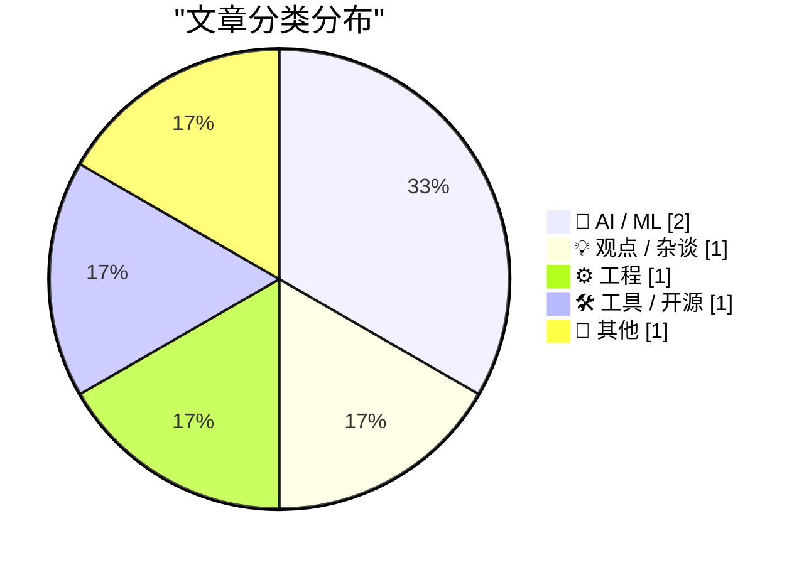
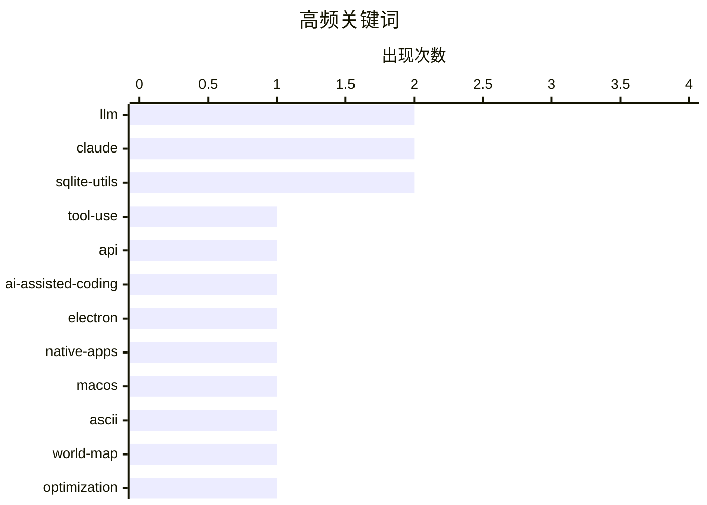

# 📰 AI 博客每日精选 — 2026-07-06

> 来自 Karpathy 推荐的 92 个顶级技术博客，AI 精选 Top 6

## 📝 今日看点

今日技术圈的焦点集中在人工智能重塑软件工程的双刃剑效应上。一方面，AI 正在深度接管实际的代码编写工作，不仅以极低的成本生成了完整的开源项目，还辅助开发者实现了极具挑战性的极限代码压缩。另一方面，高级大语言模型在调用外部工具时暴露出的幻觉与能力退化现象也敲响了警钟，提醒业界仍需警惕其底层的不稳定性。此外，关于应用底层架构的探讨再次升温，跨平台框架对原生应用的持续冲击及其生存空间，引发了开发者对平台体验与生态的重新审视。

---

## 🏆 今日必读

🥇 **更好的模型，更差的工具**

[Better Models: Worse Tools](https://simonwillison.net/2026/Jul/4/better-models-worse-tools/#atom-everything) — simonwillison.net · 19 小时前 · 🤖 AI / ML

> 高级大语言模型在调用外部工具时出现了奇怪的回归现象。开发者发现新版 Claude Opus 4.8 在调用编辑工具时，会凭空捏造嵌套数组中的额外字段。尽管模型执行的编辑操作本身通常正确，但这些参数不再匹配预定义的 Schema。这种现象表明，随着模型能力的提升，其在遵循严格结构化输出约束方面可能反而出现退化。

💡 **为什么值得读**: 揭示了顶尖大模型在 API 工具调用和结构化输出方面的一个反直觉缺陷，对 AI Agent 开发者具有极高的参考价值。

🏷️ LLM, Claude, tool-use, API

🥈 **sqlite-utils 4.0rc2 发布：主要由 Claude Fable 编写（花费约 149.25 美元）**

[sqlite-utils 4.0rc2, mostly written by Claude Fable (for about $149.25)](https://simonwillison.net/2026/Jul/5/sqlite-utils-fable/#atom-everything) — simonwillison.net · 17 小时前 · 🤖 AI / ML

> 开发者分享了利用 AI 模型 Claude Fable 辅助完成 sqlite-utils 4.0rc2 版本开发的实践经验。为了在订阅到期前充分利用该模型，作者测试了其能否帮助平稳推进 4.0 稳定版的发布。整个过程中严格遵循语义化版本控制原则，以最大程度减少不兼容的主版本更新。这展示了大语言模型在实际开源项目工程化迭代与版本管理中的具体应用。

💡 **为什么值得读**: 展示了如何利用昂贵的 AI 订阅模型来完成开源项目的版本迭代和代码重构，为 AI 辅助开发提供了真实的成本与效果参考。

🏷️ sqlite-utils, Claude, LLM, AI-assisted-coding

🥉 **来自 DF 档案：“Electron 与原生应用的衰落”**

[From the DF Archive: ‘Electron and the Decline of Native Apps’](https://daringfireball.net/2018/12/electron_and_the_decline_of_native_apps) — daringfireball.net · 22 小时前 · 💡 观点 / 杂谈

> 原生应用正面临来自跨平台框架 Electron 的严重冲击，作者将其称为一场灾难。尽管 Mac 平台凭借其吸引“真正在乎平台”的用户群体，可能会比 Windows 表现出更强的韧性。然而，Mac 在过去十年中用户激增导致开发者注意力分散，使得这种原生体验的维护面临挑战。这反映了平台普及度与原生应用生态质量之间存在的潜在矛盾。

💡 **为什么值得读**: 提供了一个跨越时间的视角，深刻剖析了跨平台框架（如 Electron）对原生应用生态的长期破坏力。

🏷️ Electron, native-apps, macOS

---

## 📊 数据概览

| 扫描源 | 抓取文章 | 时间范围 | 精选 |
|:---:|:---:|:---:|:---:|
| 83/92 | 2496 篇 → 6 篇 | 24h | **6 篇** |

### 分类分布



### 高频关键词



<details>
<summary>📈 纯文本关键词图（终端友好）</summary>

```
llm                │ ████████████████████ 2
claude             │ ████████████████████ 2
sqlite-utils       │ ████████████████████ 2
tool-use           │ ██████████░░░░░░░░░░ 1
api                │ ██████████░░░░░░░░░░ 1
ai-assisted-coding │ ██████████░░░░░░░░░░ 1
electron           │ ██████████░░░░░░░░░░ 1
native-apps        │ ██████████░░░░░░░░░░ 1
macos              │ ██████████░░░░░░░░░░ 1
ascii              │ ██████████░░░░░░░░░░ 1
```

</details>

### 🏷️ 话题标签

**llm**(2) · **claude**(2) · **sqlite-utils**(2) · tool-use(1) · api(1) · ai-assisted-coding(1) · electron(1) · native-apps(1) · macos(1) · ascii(1) · world-map(1) · optimization(1) · release(1) · cli(1) · journaling(1) · app(1) · sponsorship(1)

---

## 🤖 AI / ML

### 1. 更好的模型，更差的工具

[Better Models: Worse Tools](https://simonwillison.net/2026/Jul/4/better-models-worse-tools/#atom-everything) — **simonwillison.net** · 19 小时前 · ⭐ 24/30

> 高级大语言模型在调用外部工具时出现了奇怪的回归现象。开发者发现新版 Claude Opus 4.8 在调用编辑工具时，会凭空捏造嵌套数组中的额外字段。尽管模型执行的编辑操作本身通常正确，但这些参数不再匹配预定义的 Schema。这种现象表明，随着模型能力的提升，其在遵循严格结构化输出约束方面可能反而出现退化。

🏷️ LLM, Claude, tool-use, API

---

### 2. sqlite-utils 4.0rc2 发布：主要由 Claude Fable 编写（花费约 149.25 美元）

[sqlite-utils 4.0rc2, mostly written by Claude Fable (for about $149.25)](https://simonwillison.net/2026/Jul/5/sqlite-utils-fable/#atom-everything) — **simonwillison.net** · 17 小时前 · ⭐ 23/30

> 开发者分享了利用 AI 模型 Claude Fable 辅助完成 sqlite-utils 4.0rc2 版本开发的实践经验。为了在订阅到期前充分利用该模型，作者测试了其能否帮助平稳推进 4.0 稳定版的发布。整个过程中严格遵循语义化版本控制原则，以最大程度减少不兼容的主版本更新。这展示了大语言模型在实际开源项目工程化迭代与版本管理中的具体应用。

🏷️ sqlite-utils, Claude, LLM, AI-assisted-coding

---

## 💡 观点 / 杂谈

### 3. 来自 DF 档案：“Electron 与原生应用的衰落”

[From the DF Archive: ‘Electron and the Decline of Native Apps’](https://daringfireball.net/2018/12/electron_and_the_decline_of_native_apps) — **daringfireball.net** · 22 小时前 · ⭐ 18/30

> 原生应用正面临来自跨平台框架 Electron 的严重冲击，作者将其称为一场灾难。尽管 Mac 平台凭借其吸引“真正在乎平台”的用户群体，可能会比 Windows 表现出更强的韧性。然而，Mac 在过去十年中用户激增导致开发者注意力分散，使得这种原生体验的维护面临挑战。这反映了平台普及度与原生应用生态质量之间存在的潜在矛盾。

🏷️ Electron, native-apps, macOS

---

## ⚙️ 工程

### 4. 仅用 500 字节构建世界地图

[Building a World Map with only 500 bytes](https://simonwillison.net/2026/Jul/4/building-a-world-map-with-only-500-bytes/#atom-everything) — **simonwillison.net** · 19 小时前 · ⭐ 16/30

> 开发者 Iwo Kadziela 在 AI 辅助工具 Codex 的帮助下，成功仅用 445 字节的数据生成了一张逼真的 ASCII 字符世界地图。实现这一极限压缩的核心技巧在于巧妙运用 deflate 压缩算法处理底层数据。该方案打破了常规的地图渲染思路，展示了极致的代码与数据体积优化能力。这种极简主义编程实践为在资源极度受限的环境下呈现复杂视觉信息提供了全新思路。

🏷️ ASCII, world-map, optimization

---

## 🛠 工具 / 开源

### 5. sqlite-utils 4.0rc2

[sqlite-utils 4.0rc2](https://simonwillison.net/2026/Jul/5/sqlite-utils/#atom-everything) — **simonwillison.net** · 17 小时前 · ⭐ 14/30

> 命令行工具 sqlite-utils 正式发布 4.0rc2 版本。该版本的代码主要由 AI 模型 Claude Fable 编写，开发成本约为 149.25 美元。此次更新旨在为后续的 4.0 稳定版奠定基础，并严格遵循了语义化版本控制规范。作者通过这次实践验证了 AI 在处理复杂开源项目工程化迭代时的可靠性。

🏷️ sqlite-utils, release, CLI

---

## 📝 其他

### 6. Day One Journal

[Day One Journal](https://dayoneapp.com/blog/introducing-daily-chat/) — **daringfireball.net** · 21 小时前 · ⭐ 6/30

> 日记应用 Day One 自 2011 年首次发布以来，一直是 Mac 和 iOS 平台上的行业标杆。该应用不仅在技术和设计上追求卓越，更深刻理解并融入了记日记这一行为的私人化属性。其 Mac 版本提供了纯正的原生体验，同时支持创建多个独立日记本。Day One 凭借其对平台特性的尊重和用户体验的深度打磨，展现了顶级应用应有的品质。

🏷️ journaling, app, sponsorship

---

*生成于 2026-07-06 02:23 (Asia/Shanghai) | 扫描 83 源 → 获取 2496 篇 → 精选 6 篇*
*基于 [Hacker News Popularity Contest 2025](https://refactoringenglish.com/tools/hn-popularity/) RSS 源列表，由 [Andrej Karpathy](https://x.com/karpathy) 推荐*
*由「懂点儿AI」制作，欢迎关注同名微信公众号获取更多 AI 实用技巧 💡*
