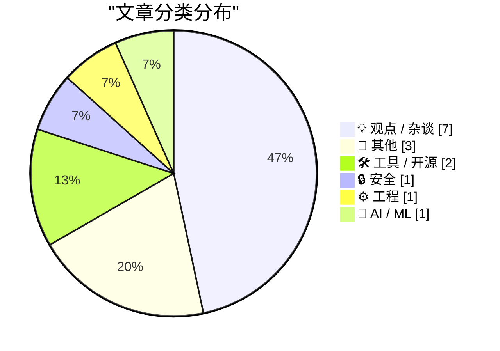
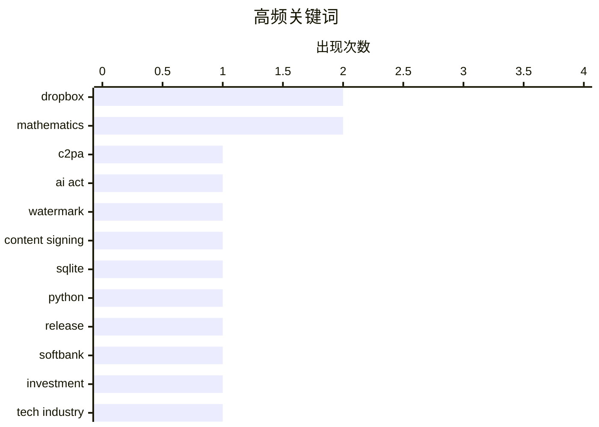

# 📰 AI 博客每日精选 — 2026-07-07

> 来自 Karpathy 推荐的 92 个顶级技术博客，AI 精选 Top 15

## 📝 今日看点

今日技术圈焦点集中在AI浪潮的冷热交替与开源生态的生存困境上。随着AI深度介入开发工具与桌面应用，业界对AI狂热的厌倦情绪日益蔓延，同时欧盟AI法案引发的内容溯源挑战也凸显了技术落地的复杂性。另一方面，云存储服务策略的收缩与知名开源客户端因资源匮乏而停止维护，暴露出独立开发者在商业现实下面临的严峻挑战。在喧嚣之外，开发者社区依然保持着对底层系统编程与数理逻辑的硬核探索。

---

## 🏆 今日必读

🥇 **C2PA 只有在所有内容都被签名时才有效**

[C2PA only works if everything is signed](https://seangoedecke.com/c2pa-only-works-if-everything-is-signed/) — seangoedecke.com · 19 小时前 · 🔒 安全

> 欧盟AI法案要求AI生成的内容必须可识别，主要通过水印或数字签名的元数据（如C2PA标准）来实现。C2PA的设计初衷是验证媒体内容的来源，但其核心缺陷在于信任链的完整性。如果整个发布流程中的任何一个环节（如相机、编辑软件、社交媒体平台）没有进行数字签名，整个验证体系就会失效。作者认为，除非整个数字生态系统中的所有内容都被强制签名，否则C2PA根本无法有效防范伪造。

💡 **为什么值得读**: 深入剖析了C2PA内容来源验证标准在实际应用中的致命缺陷，为理解AI内容监管提供了批判性视角。

🏷️ C2PA, AI Act, watermark, content signing

🥈 **sqlite-utils 4.0rc3 版本发布**

[sqlite-utils 4.0rc3](https://simonwillison.net/2026/Jul/6/sqlite-utils/#atom-everything) — simonwillison.net · 13 小时前 · 🛠 工具 / 开源

> sqlite-utils 4.0rc3 版本正式发布，作者在 Claude Fable 5 和 GPT-5.5 的协助下处理了大量积压的 issue 和 PR。该版本最重要的新功能是支持数据库内省，能够更深入地解析数据库结构。由于在开发过程中不断增加新功能和修复，导致原定的稳定版发布计划推迟。开发者可以通过官方更新日志查看 rc3 版本带来的所有详细改进。

💡 **为什么值得读**: 展示了如何利用最新的AI大模型（如Claude和GPT）高效推进开源CLI工具的开发与迭代。

🏷️ sqlite, python, release

🥉 **高级文章：黑粉视角的软银指南**

[Premium: The Hater's Guide To SoftBank](https://www.wheresyoured.at/premium-the-haters-guide-to-softbank/) — wheresyoured.at · 4 小时前 · 💡 观点 / 杂谈

> 软银第46届年度股东大会引发了广泛关注与嘲笑，尤其是孙正义在演讲中展示的令人费解的幻灯片。尽管外界对软银的投资策略和孙正义的表现充满质疑，但这篇深度文章试图透过表面现象进行剖析。作者指出，仅仅嘲笑软银的激进愿景是不够的，需要理解其背后的逻辑与宏观金融背景。文章为读者提供了一个跳出主流嘲讽、重新审视软银激进商业模式的独特视角。

💡 **为什么值得读**: 提供了不同于主流嘲笑声音的深度金融分析，帮助读者客观理解软银及孙正义激进策略背后的真实逻辑。

🏷️ SoftBank, investment, tech industry

---

## 📊 数据概览

| 扫描源 | 抓取文章 | 时间范围 | 精选 |
|:---:|:---:|:---:|:---:|
| 83/92 | 2502 篇 → 16 篇 | 24h | **15 篇** |

### 分类分布



### 高频关键词



<details>
<summary>📈 纯文本关键词图（终端友好）</summary>

```
dropbox         │ ████████████████████ 2
mathematics     │ ████████████████████ 2
c2pa            │ ██████████░░░░░░░░░░ 1
ai act          │ ██████████░░░░░░░░░░ 1
watermark       │ ██████████░░░░░░░░░░ 1
content signing │ ██████████░░░░░░░░░░ 1
sqlite          │ ██████████░░░░░░░░░░ 1
python          │ ██████████░░░░░░░░░░ 1
release         │ ██████████░░░░░░░░░░ 1
softbank        │ ██████████░░░░░░░░░░ 1
```

</details>

### 🏷️ 话题标签

**dropbox**(2) · **mathematics**(2) · **c2pa**(1) · ai act(1) · watermark(1) · content signing(1) · sqlite(1) · python(1) · release(1) · softbank(1) · investment(1) · tech industry(1) · maestral(1) · open source(1) · ai(1) · hype(1) · tech fatigue(1) · windows api(1) · file system(1) · c++(1)

---

## 💡 观点 / 杂谈

### 1. 高级文章：黑粉视角的软银指南

[Premium: The Hater's Guide To SoftBank](https://www.wheresyoured.at/premium-the-haters-guide-to-softbank/) — **wheresyoured.at** · 4 小时前 · ⭐ 22/30

> 软银第46届年度股东大会引发了广泛关注与嘲笑，尤其是孙正义在演讲中展示的令人费解的幻灯片。尽管外界对软银的投资策略和孙正义的表现充满质疑，但这篇深度文章试图透过表面现象进行剖析。作者指出，仅仅嘲笑软银的激进愿景是不够的，需要理解其背后的逻辑与宏观金融背景。文章为读者提供了一个跳出主流嘲讽、重新审视软银激进商业模式的独特视角。

🏷️ SoftBank, investment, tech industry

---

### 2. 我只是对 AI 感到太厌烦了

[I'm just so bored of AI](https://shkspr.mobi/blog/2026/07/im-just-so-bored-of-ai/) — **shkspr.mobi** · 7 小时前 · ⭐ 19/30

> 作者对当前社会无处不在的 AI 讨论表达了强烈的厌倦感，将其比作初尝毒品的大学生或推销电子烟的人。许多人沉迷于炫耀 AI 完成的简单自动化任务，这种狂热在短暂的有趣之后迅速变得令人疲惫。文章指出，当前的 AI 狂热已经演变成一种缺乏实质技术突破的跟风炒作。作者呼吁人们跳出这种盲目追捧的怪圈，重新审视这项技术的实际价值。

🏷️ AI, hype, tech fatigue

---

### 3. Backblaze 对决 Dropbox

[Backblaze Versus Dropbox](https://mjtsai.com/blog/2025/12/19/backblaze-no-longer-backs-up-dropbox/) — **daringfireball.net** · 44 分钟前 · ⭐ 15/30

> 在线备份服务 Backblaze 宣布不再备份 iCloud Drive、Dropbox、Google Drive 和 Microsoft OneDrive 等在线文件存储服务的内容，引发了用户的广泛担忧。Backblaze 的核心卖点原本是能够无缝备份整个电脑及外接硬盘上的所有数据，但这一政策变动打破了其“全盘备份”的简单承诺。Michael Tsai 汇总了大量相关讨论，揭示了云存储服务与本地备份工具之间日益加深的冲突。这一变化迫使依赖 Backblaze 的用户必须重新评估自己的混合云备份策略。

🏷️ backup, cloud storage, Dropbox, Backblaze

---

### 4. ATP 会员特辑：纯正的 Mac 应用

[ATP Member Special: Mac-Assed Mac Apps](https://atp.fm/atp-dev-mac-assed-mac-apps) — **daringfireball.net** · 2 小时前 · ⭐ 14/30

> 知名科技播客 ATP（Accidental Tech Podcast）发布了一期高质量的会员专属特辑，深入探讨了“纯正 Mac 应用（Mac-assed Mac app）”的核心特征。节目不仅详细解释了这类应用的设计规范，更着重分析了为何这种原生的软件生态对开发者和用户至关重要。纯正的 Mac 应用能够提供更极致的系统集成度、符合直觉的交互体验以及更高的性能表现。该播客会员订阅费为每月 8 美元或每年 88 美元，仅这些独家内容就物超所值。

🏷️ Mac apps, UI design, podcast

---

### 5. 亚马逊基础版，但这次是针对知识产权的

[Amazon Basics, but for intellectual property.](https://idiallo.com/blog/amazon-basics-but-intellectual-property) — **idiallo.com** · 12 小时前 · ⭐ 14/30

> 亚马逊屡次被指控利用其平台商家的数据来抄袭和自营产品，尽管官方始终否认任何不当行为。作为平台服务提供商，亚马逊掌握着所有产品的核心销售指标和用户数据，这使其在亲自下场销售产品时形成了巨大的利益冲突。凭借这种数据垄断优势，平台能够轻易识别爆款并推出类似“Amazon Basics”的自有品牌进行降维打击。这种既是裁判又是运动员的模式，严重威胁了第三方商家的知识产权和生存空间。

🏷️ Amazon, e-commerce, intellectual property

---

### 6. Jason Snell 结束了他在 Macworld 长达 28 年的专栏作家生涯

[Jason Snell Ends His Column, and 28-Year Run, at Macworld](https://www.macworld.com/article/3175482) — **daringfireball.net** · 4 小时前 · ⭐ 13/30

> 资深科技记者 Jason Snell 正式结束了他在科技媒体 Macworld 长达 28 年的专栏作家生涯。他回忆了自己 1997 年秋天入职时的场景，当时的苹果正处于破产边缘，史蒂夫·乔布斯刚刚回归并驱逐了时任 CEO。在那个还没有 iMac 和可见产品线复苏迹象的艰难时刻，苹果的生存命悬一线，乔布斯只能请求大众给予信任。这段跨越近三十年的专栏历史，见证了苹果从濒临倒闭到重塑科技辉煌的完整历程。

🏷️ Macworld, tech media, Apple

---

### 7. IBM 为什么收购 Lotus

[Why IBM bought Lotus](https://dfarq.homeip.net/why-ibm-bought-lotus/?utm_source=rss&#038;utm_medium=rss&#038;utm_campaign=why-ibm-bought-lotus) — **dfarq.homeip.net** · 8 小时前 · ⭐ 12/30

> 1995 年 7 月 6 日，IBM 以 35 亿美元的价格收购了 Lotus Development 公司。Lotus 曾是全球第二大软件发行商，其 IPO 时的估值高达 55 亿美元，核心王牌产品是 Lotus 1-2-3 电子表格软件。这桩世纪收购反映了当时个人电脑软件市场的激烈竞争，以及 IBM 试图在软件生态中建立企业级护城河的战略意图。随着微软 Office 的强势崛起，Lotus 的辉煌逐渐落幕，但此次收购深刻影响了现代企业级协同软件的发展格局。

🏷️ IBM, Lotus, history

---

## 📝 其他

### 8. 与风险比共存

[Life with hazard ratios](https://dynomight.net/hazard-ratios/) — **dynomight.net** · 19 小时前 · ⭐ 15/30

> 风险比是统计学和医学研究中用于衡量某一事件发生概率相对风险的核心指标，但公众对其往往存在误解。文章深入浅出地讲解了如何正确解读风险比，并强调了在面临各种预期时进行合理“打折”的必要性。作者指出，单纯的数据往往具有欺骗性，必须结合时间跨度和基准风险来综合评估实际影响。掌握风险比的计算与解读，能够帮助读者在看懂医学报告或研究数据时做出更理性的决策。

🏷️ statistics, risk, hazard ratios

---

### 9. 重现几何定理图表

[Reproducing a geometry theorem diagram](https://www.johndcook.com/blog/2026/07/06/arc-hypotenuse/) — **johndcook.com** · 4 小时前 · ⭐ 15/30

> 作者在探索一个有趣的几何定理时，发现使用代码重现该定理的图表比定理本身更具挑战性和趣味性。该图表包含一个单位外圆，其中线段 AB 为直径，线段 CD 垂直于该直径。通过猜测坐标点 C = (cos(1), sin(1))，作者逐步推演并尝试还原图表的几何构造过程。文章展示了从数学定理到编程可视化过程中的具体思考步骤和坐标计算技巧。

🏷️ geometry, mathematics, visualization

---

### 10. 自然常数 e 的分数近似值

[e approximation](https://www.johndcook.com/blog/2026/07/06/e-approximation/) — **johndcook.com** · 6 小时前 · ⭐ 12/30

> 数学常数 e 存在一个精度极高的有理数近似值：2721/1001。与直接截断小数位的简单做法（如 2718/1000 仅能提供四位有效数字精度）相比，2721/1001 在分母大小相近的情况下，能够将精度大幅提升至七位，甚至接近八位有效数字。这种相对于其分母规模而言异常出色的逼近能力，展示了有理数在数值计算中的奇妙特性。该发现为需要快速计算且对精度有要求的算法场景提供了一种极其高效的替代方案。

🏷️ mathematics, approximation, number theory

---

## 🛠 工具 / 开源

### 11. sqlite-utils 4.0rc3 版本发布

[sqlite-utils 4.0rc3](https://simonwillison.net/2026/Jul/6/sqlite-utils/#atom-everything) — **simonwillison.net** · 13 小时前 · ⭐ 22/30

> sqlite-utils 4.0rc3 版本正式发布，作者在 Claude Fable 5 和 GPT-5.5 的协助下处理了大量积压的 issue 和 PR。该版本最重要的新功能是支持数据库内省，能够更深入地解析数据库结构。由于在开发过程中不断增加新功能和修复，导致原定的稳定版发布计划推迟。开发者可以通过官方更新日志查看 rc3 版本带来的所有详细改进。

🏷️ sqlite, python, release

---

### 12. Maestral：开源的极简 Mac Dropbox 客户端已停止维护

[Maestral, the Open Source Splendidly Simple Mac Dropbox Client, Has Been Retired](https://maestral.app/) — **daringfireball.net** · 2 小时前 · ⭐ 19/30

> 开源 Mac Dropbox 客户端 Maestral 的开发者 Sam Schott 宣布，该项目自 2026 年 6 月起停止积极维护，并于 7 月底正式归档。导致该项目终止的主要原因是开发者缺乏时间投入，且个人已不再使用 Dropbox。不过，在相关证书过期之前，当前版本的 Maestral 仍可继续正常使用。这标志着 macOS 平台上少了一个轻量级、避开官方臃肿客户端的优质替代方案。

🏷️ Maestral, Dropbox, open source

---

## 🔒 安全

### 13. C2PA 只有在所有内容都被签名时才有效

[C2PA only works if everything is signed](https://seangoedecke.com/c2pa-only-works-if-everything-is-signed/) — **seangoedecke.com** · 19 小时前 · ⭐ 24/30

> 欧盟AI法案要求AI生成的内容必须可识别，主要通过水印或数字签名的元数据（如C2PA标准）来实现。C2PA的设计初衷是验证媒体内容的来源，但其核心缺陷在于信任链的完整性。如果整个发布流程中的任何一个环节（如相机、编辑软件、社交媒体平台）没有进行数字签名，整个验证体系就会失效。作者认为，除非整个数字生态系统中的所有内容都被强制签名，否则C2PA根本无法有效防范伪造。

🏷️ C2PA, AI Act, watermark, content signing

---

## ⚙️ 工程

### 14. 我用 FILE_FLAG_DELETE_ON_CLOSE 打开了文件，但现在我改变主意了

[I opened a file with FILE_FLAG_DELETE_ON_CLOSE, but now I changed my mind](https://devblogs.microsoft.com/oldnewthing/20260706-00/?p=112506) — **devblogs.microsoft.com/oldnewthing** · 5 小时前 · ⭐ 17/30

> 在 Windows 编程中，如果开发者使用 `FILE_FLAG_DELETE_ON_CLOSE` 标志打开文件，系统会在文件关闭时自动将其删除。然而，一旦设置了该标志，开发者无法直接“改变主意”撤销这一删除行为。微软官方博客指出，解决这个问题的唯一方法是采用不同的实现思路，而不是试图在运行时重置标志。文章探讨了这一 Windows API 机制背后的底层逻辑，并提供了在需要条件性删除文件时的正确替代方案。

🏷️ Windows API, file system, C++

---

## 🤖 AI / ML

### 15. Allen Pike 去年十一月发文：“为什么 ChatGPT for Mac 这么好用？”

[Allen Pike, Back in November: ‘Why Is ChatGPT for Mac So Good?’](https://allenpike.com/2025/why-is-chatgpt-so-good-claude/) — **daringfireball.net** · 1 小时前 · ⭐ 16/30

> Allen Pike 在先前的文章中探讨了 ChatGPT for Mac 在桌面端表现优异的原因，指出“虽然移动端称王，但桌面端依然是完成核心工作的地方”。OpenAI 收购 Sky 以强化其桌面应用体验，而 Google 长期依赖浏览器端，直到最近才推出了原生的 Gemini Mac 应用。这使 Anthropic 成为桌面端的有力挑战者，其最新发布的模型亟需搭配精心设计的原生应用来发挥最大潜力。文章反映了各大 AI 巨头在桌面端原生应用领域的战略布局与竞争态势。

🏷️ ChatGPT, desktop apps, OpenAI

---

*生成于 2026-07-07 03:19 (Asia/Shanghai) | 扫描 83 源 → 获取 2502 篇 → 精选 15 篇*
*基于 [Hacker News Popularity Contest 2025](https://refactoringenglish.com/tools/hn-popularity/) RSS 源列表，由 [Andrej Karpathy](https://x.com/karpathy) 推荐*
*由「懂点儿AI」制作，欢迎关注同名微信公众号获取更多 AI 实用技巧 💡*
