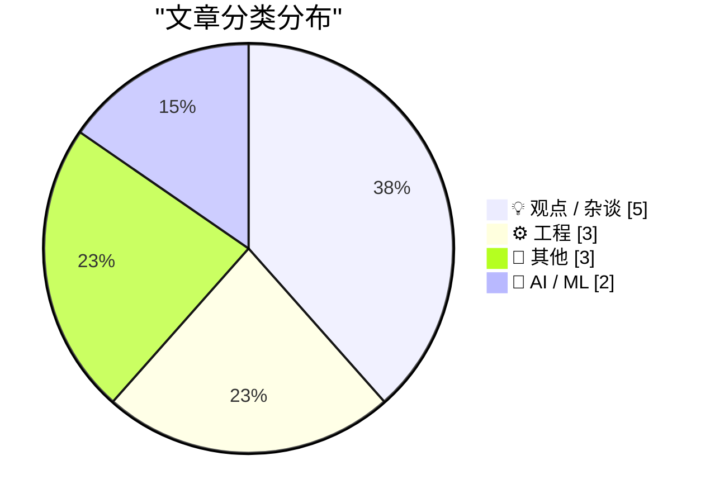
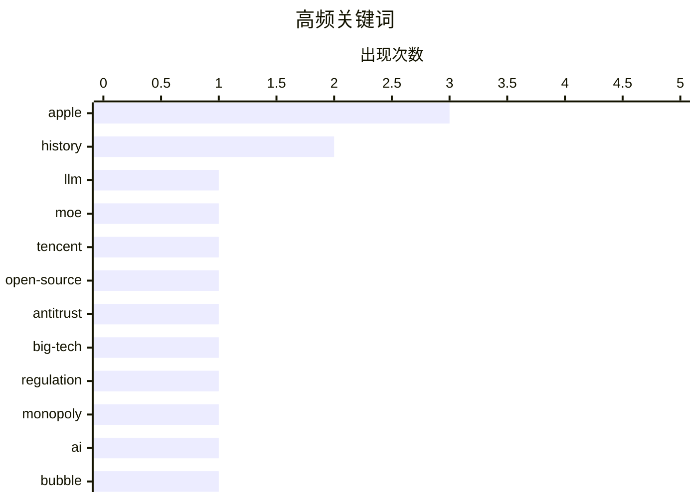

# 📰 AI 博客每日精选 — 2026-07-08

> 来自 Karpathy 推荐的 92 个顶级技术博客，AI 精选 Top 13

## 📝 今日看点

今日科技圈呈现出AI技术狂飙与监管反思并存的复杂态势。大模型领域不仅迎来了腾讯千亿参数开源混合专家模型的重磅发布，苹果也通过精细化的语速与情感控制让新版Siri更具拟人色彩；与此同时，针对AI行业过度炒作的尖锐批评与全球反垄断监管机构的联合施压正在同步发酵。此外，底层工程架构与操作系统生态体验依然是技术社区的关注焦点，从包管理器引入内容寻址机制以重塑软件分发安全，到苹果新系统原生支持Markdown及引发热议的UI设计规范探讨，开发者们正不断探索系统底层逻辑与交互体验的演进方向。

---

## 🏆 今日必读

🥇 **腾讯发布 Hy3 模型**

[tencent/Hy3](https://simonwillison.net/2026/Jul/6/hy3/#atom-everything) — simonwillison.net · 18 小时前 · 🤖 AI / ML

> 腾讯旗下 Hy 团队发布了采用 Apache 2.0 许可证的开源大语言模型 Hy3。该模型基于混合专家架构，总参数量达 2950 亿，包含 210 亿活跃参数和 38 亿 MTP 层参数。在四月预览版收集 50 多款产品的反馈后，团队使用更高质量的数据扩大了后训练规模。新版 Hy3 在各项性能指标上成功超越了同等规模的其他模型。

💡 **为什么值得读**: 详细介绍了腾讯最新开源的高性能 MoE 架构模型及其核心参数，对关注大模型开源生态的开发者极具参考价值。

🏷️ LLM, MoE, Tencent, open-source

🥈 **美国各州与国际反垄断监管机构如何击败大型科技公司**

[Pluralistic: How US states and international trustbusters can beat Big Tech (07 Jul 2026)](https://pluralistic.net/2026/07/07/going-global/) — pluralistic.net · 6 小时前 · 💡 观点 / 杂谈

> 大型科技公司正面临来自美国各州和国际反垄断监管机构的共同挑战。这些监管机构在对抗科技巨头时，发现彼此拥有共同的战略目标和利益契合点。通过跨国和跨州的协同反垄断行动，监管者能够更有效地遏制科技垄断行为。作者认为，这种联合趋势将重塑全球科技行业的政治与经济格局。

💡 **为什么值得读**: 深入剖析了全球反垄断力量对抗科技巨头的联合策略，为理解科技行业的监管与政治博弈提供了独特视角。

🏷️ antitrust, big-tech, regulation, monopoly

🥉 **让 AI 燃烧**

[Let AI Burn](https://www.wheresyoured.at/let-ai-burn/) — wheresyoured.at · 1 小时前 · 💡 观点 / 杂谈

> 作者针对当前人工智能行业的泡沫与炒作现象提出了尖锐的批评，并建议读者关注其付费订阅通讯以获取深度分析。该通讯每年收费 70 美元，提供长达 5000 到 18000 字的周刊，涵盖对 NVIDIA、Anthropic 等科技巨头的详尽剖析。文章延续了作者一贯的批判性风格，揭示了 AI 领域背后的商业逻辑与潜在风险。其核心观点是呼吁大众理性看待 AI 狂热，警惕资本市场的过度炒作。

💡 **为什么值得读**: 以犀利的视角批判了 AI 行业的过度炒作，适合想要了解科技巨头真实商业内幕与行业风险的读者。

🏷️ AI, bubble, NVIDIA, Anthropic

---

## 📊 数据概览

| 扫描源 | 抓取文章 | 时间范围 | 精选 |
|:---:|:---:|:---:|:---:|
| 82/92 | 2488 篇 → 13 篇 | 24h | **13 篇** |

### 分类分布



### 高频关键词



<details>
<summary>📈 纯文本关键词图（终端友好）</summary>

```
apple       │ ████████████████████ 3
history     │ █████████████░░░░░░░ 2
llm         │ ███████░░░░░░░░░░░░░ 1
moe         │ ███████░░░░░░░░░░░░░ 1
tencent     │ ███████░░░░░░░░░░░░░ 1
open-source │ ███████░░░░░░░░░░░░░ 1
antitrust   │ ███████░░░░░░░░░░░░░ 1
big-tech    │ ███████░░░░░░░░░░░░░ 1
regulation  │ ███████░░░░░░░░░░░░░ 1
monopoly    │ ███████░░░░░░░░░░░░░ 1
```

</details>

### 🏷️ 话题标签

**apple**(3) · **history**(2) · **llm**(1) · moe(1) · tencent(1) · open-source(1) · antitrust(1) · big-tech(1) · regulation(1) · monopoly(1) · ai(1) · bubble(1) · nvidia(1) · anthropic(1) · package-manager(1) · content-addressing(1) · hashing(1) · dependencies(1) · writing(1) · blogging(1)

---

## 💡 观点 / 杂谈

### 1. 美国各州与国际反垄断监管机构如何击败大型科技公司

[Pluralistic: How US states and international trustbusters can beat Big Tech (07 Jul 2026)](https://pluralistic.net/2026/07/07/going-global/) — **pluralistic.net** · 6 小时前 · ⭐ 24/30

> 大型科技公司正面临来自美国各州和国际反垄断监管机构的共同挑战。这些监管机构在对抗科技巨头时，发现彼此拥有共同的战略目标和利益契合点。通过跨国和跨州的协同反垄断行动，监管者能够更有效地遏制科技垄断行为。作者认为，这种联合趋势将重塑全球科技行业的政治与经济格局。

🏷️ antitrust, big-tech, regulation, monopoly

---

### 2. 让 AI 燃烧

[Let AI Burn](https://www.wheresyoured.at/let-ai-burn/) — **wheresyoured.at** · 1 小时前 · ⭐ 23/30

> 作者针对当前人工智能行业的泡沫与炒作现象提出了尖锐的批评，并建议读者关注其付费订阅通讯以获取深度分析。该通讯每年收费 70 美元，提供长达 5000 到 18000 字的周刊，涵盖对 NVIDIA、Anthropic 等科技巨头的详尽剖析。文章延续了作者一贯的批判性风格，揭示了 AI 领域背后的商业逻辑与潜在风险。其核心观点是呼吁大众理性看待 AI 狂热，警惕资本市场的过度炒作。

🏷️ AI, bubble, NVIDIA, Anthropic

---

### 3. 写关于你尚未了解之物的博客

[Blog about things you don't understand yet](https://seangoedecke.com/blog-about-things-you-dont-understand-yet/) — **seangoedecke.com** · 18 小时前 · ⭐ 20/30

> 技术博客创作的核心动力应当是对未知事物的探索与学习过程，而非单纯的知识输出。作者指出，每篇文章的诞生通常包含写作前发现的灵感和写作中深入研究的新知识。例如在测试 o3 模型的 Geoguesser 提示词时，他发现许多 AI 提示词实际上并不奏效。这种以学习为导向的创作方式，不仅提升了文章质量，也保持了作者与读者的持续成长。

🏷️ writing, blogging, learning

---

### 4. Backblaze 对决 Dropbox

[Backblaze Versus Dropbox](https://mjtsai.com/blog/2025/12/19/backblaze-no-longer-backs-up-dropbox/) — **daringfireball.net** · 23 小时前 · ⭐ 20/30

> 在线备份服务 Backblaze 决定停止备份 iCloud Drive、Dropbox、Google Drive 和 OneDrive 等在线文件存储服务的内容。这一政策变动引发了用户的广泛担忧，因为 Backblaze 此前的核心卖点是能够无缝备份整台电脑及外接硬盘的所有数据。文章详细梳理了该事件的发展脉络，并探讨了云存储服务之间由于数据所有权和去重机制产生的冲突。用户需要重新评估其混合云备份策略，以避免重要数据的遗漏。

🏷️ Backblaze, Dropbox, backup, cloud-storage

---

### 5. 苹果应打破应用图标的“圆角矩形监狱”

[★ Apple Should Eliminate the App Icon ‘Squircle Jail’](https://daringfireball.net/2026/07/eliminate_app_icon_squircle_jail) — **daringfireball.net** · 20 小时前 · ⭐ 16/30

> 苹果强制所有应用图标采用统一的“圆角矩形”设计，这一策略正在扼杀应用的品牌辨识度。过去图标的形状往往是其最核心的视觉标志，但在当前的 iOS 设计规范下，形状差异已不复存在。作者强烈建议苹果放宽限制，允许开发者使用异形图标或动态形状，以恢复应用市场的视觉多样性。打破“圆角矩形监狱”不仅能激发设计创新，还能大幅提升用户体验的丰富度。

🏷️ Apple, UI, app-icon, design

---

## ⚙️ 工程

### 6. 包管理器中的内容寻址

[Content addressing in package managers](https://nesbitt.io/2026/07/07/content-addressing-in-package-managers.html) — **nesbitt.io** · 8 小时前 · ⭐ 21/30

> 包管理器中的内容寻址机制正逐渐成为解决依赖与版本控制问题的关键方案。人类使用易读的名称来识别包，而系统底层则应完全依赖哈希值来确保内容的唯一性与不可篡改性。这种分离策略不仅提高了软件分发的安全性，还能有效避免因命名冲突或版本更新引发的缓存问题。将哈希作为内容的绝对标识是构建可靠包管理生态的核心。

🏷️ package-manager, content-addressing, hashing, dependencies

---

### 7. Windows 95 是如何判定安装程序已运行的？

[How did Windows 95 decide that a setup program ran?](https://devblogs.microsoft.com/oldnewthing/20260707-00/?p=112508) — **devblogs.microsoft.com/oldnewthing** · 4 小时前 · ⭐ 19/30

> 早期操作系统在管理程序安装与卸载时面临着缺乏统一标准的挑战，Windows 95 通过引入特定的启发式算法来解决这一问题。系统通过分析可执行文件的特征和运行行为，来自动识别并追踪安装程序的执行状态。这种基于启发式的检测机制，使得操作系统能够在安装完成后自动清理临时文件并更新系统注册表。作者通过历史代码的回顾，展示了早期 Windows 架构在设计上的精巧与妥协。

🏷️ Windows, OS, heuristics, history

---

### 8. Markdown 现已在苹果 27 版操作系统中获得原生 UTI 支持

[Markdown Now Has a UTI in Apple’s Version 27 OSes](https://developer.apple.com/documentation/uniformtypeidentifiers/uttype-swift.struct/markdown) — **daringfireball.net** · 21 小时前 · ⭐ 18/30

> 苹果在最新的 27 版操作系统开发者测试版中，正式为 Markdown 数据引入了内置的统一类型标识符（UTI）。该 UTI 被定义为 `net.daringfireball.markdown`，并符合 `public.utf8-plain-text` 规范。这一更新确立了 Markdown 作为系统级原生文本格式的地位，并明确了其 UTF-8 的编码要求。作者也据此更新了自己此前的建议，呼吁开发者采用 `public.utf8-plain-text` 以确保编码的一致性。

🏷️ Markdown, Apple, UTI, system

---

## 📝 其他

### 9. Solvinity 股东对荷兰政府提起的简易诉讼

[Kort geding aandeelhouders Solvinity](https://berthub.eu/articles/posts/kort-geding-aandeelhouder-solvinity/) — **berthub.eu** · 9 小时前 · ⭐ 16/30

> Solvinity（DigiD背后的技术公司）的股东就其业务问题对负责数字经济和主权的荷兰副国务卿提起了简易判决诉讼。作者在法庭旁听了庭审，并发现许多在随后的主流媒体报道中被遗漏或淡化的关键细节。尽管包括 AD 和 NRC 在内的媒体进行了大规模报道，但新闻往往只关注表面冲突（例如政府拒绝收购该公司）。作者的核心观点是，亲自参与法庭旁听能揭示出比经过过滤的新闻报道更深层、更真实的内幕。

🏷️ Solvinity, lawsuit, Netherlands, digital-sovereignty

---

### 10. 做一次全身 MRI 扫描的风险相当于抽了一年的烟

[A full body MRI earns you a year of smoking](https://entropicthoughts.com/full-body-mri-earns-you-a-base-jump) — **entropicthoughts.com** · 20 小时前 · ⭐ 12/30

> 全身 MRI 扫描虽然常被宣传为高级的预防性健康检查，但其带来的潜在健康风险极高。文章指出，进行一次全身 MRI 检查所承受的累积风险，实际上等同于连续吸烟一整年。为了具象化这种隐性危险，作者将其与一系列极限高危活动进行了等效对比，包括高危孕产、攀登马特洪峰、骑摩托车行驶一万公里、两次定点跳伞，甚至是乌克兰前线的一天。这表明对于无症状的健康人群而言，盲目进行全身 MRI 筛查的相对风险被严重低估了。

🏷️ MRI, health, risk, medical

---

### 11. 前雅达利 CEO：雷·卡萨尔

[Ray Kassar, former Atari CEO](https://dfarq.homeip.net/ray-kassar-former-atari-ceo/?utm_source=rss&#038;utm_medium=rss&#038;utm_campaign=ray-kassar-former-atari-ceo) — **dfarq.homeip.net** · 7 小时前 · ⭐ 12/30

> 雷·卡萨尔曾在 1978 年至 1983 年期间担任知名游戏公司雅达利的总裁及首席执行官。他于 1928 年出生，并于 2017 年在佛罗里达州离世，享年 89 岁。他最初是由雅达利的母公司华纳兄弟聘用来接管并管理公司业务的。作为雅达利历史上最具争议且最关键时期的领导者之一，他的商业决策和管理风格对早期电子游戏产业的兴衰产生了深远影响。

🏷️ Atari, history, CEO

---

## 🤖 AI / ML

### 12. 腾讯发布 Hy3 模型

[tencent/Hy3](https://simonwillison.net/2026/Jul/6/hy3/#atom-everything) — **simonwillison.net** · 18 小时前 · ⭐ 24/30

> 腾讯旗下 Hy 团队发布了采用 Apache 2.0 许可证的开源大语言模型 Hy3。该模型基于混合专家架构，总参数量达 2950 亿，包含 210 亿活跃参数和 38 亿 MTP 层参数。在四月预览版收集 50 多款产品的反馈后，团队使用更高质量的数据扩大了后训练规模。新版 Hy3 在各项性能指标上成功超越了同等规模的其他模型。

🏷️ LLM, MoE, Tencent, open-source

---

### 13. OS 27 开发者 Beta 3 为 Siri 新语音启用“语速”与“表现力”调节功能

[OS 27 Developer Beta 3 Enables New ‘Pace’ and ‘Expressivity’ Sliders for Siri’s New Voices](https://techcrunch.com/2026/07/06/you-can-now-customize-siris-pace-and-expressivity-in-the-latest-ios-27-beta/) — **daringfireball.net** · 3 小时前 · ⭐ 19/30

> 苹果在 iOS 27 开发者第三个测试版中，为 AI 驱动的新版 Siri 语音推出了精细化的控制功能。用户现在可以通过新增的“语速”和“表现力”滑块，自由调整 Siri 说话的速度和情感丰富度。这些选项在此前的测试版中被标记为“即将推出”，如今正式向开发者开放体验。这一更新标志着苹果正在致力于让 Siri 的语音交互变得更加自然和拟人化。

🏷️ Siri, iOS, voice, Apple

---

*生成于 2026-07-08 02:28 (Asia/Shanghai) | 扫描 82 源 → 获取 2488 篇 → 精选 13 篇*
*基于 [Hacker News Popularity Contest 2025](https://refactoringenglish.com/tools/hn-popularity/) RSS 源列表，由 [Andrej Karpathy](https://x.com/karpathy) 推荐*
*由「懂点儿AI」制作，欢迎关注同名微信公众号获取更多 AI 实用技巧 💡*
