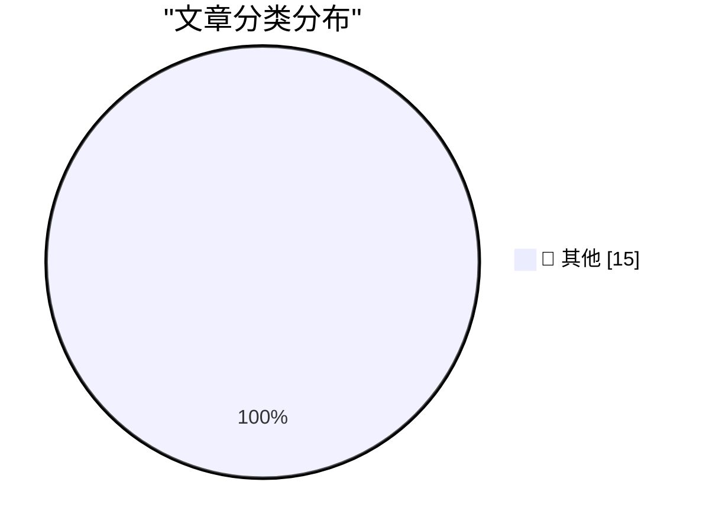

# 📰 AI 博客每日精选 — 2026-07-09

> 来自 Karpathy 推荐的 92 个顶级技术博客，AI 精选 Top 15

## 🏆 今日必读

🥇 **Rewriting Bun in Rust**

[Rewriting Bun in Rust](https://simonwillison.net/2026/Jul/8/rewriting-bun-in-rust/#atom-everything) — simonwillison.net · 1 小时前 · 📝 其他

> Rewriting Bun in Rust

🥈 **Introducing GPT‑Live**

[Introducing GPT‑Live](https://simonwillison.net/2026/Jul/8/introducing-gptlive/#atom-everything) — simonwillison.net · 1 小时前 · 📝 其他

> Introducing GPT‑Live

🥉 **Quoting Kenton Varda**

[Quoting Kenton Varda](https://simonwillison.net/2026/Jul/8/kenton-varda/#atom-everything) — simonwillison.net · 5 小时前 · 📝 其他

> Quoting Kenton Varda

---

## 📊 数据概览

| 扫描源 | 抓取文章 | 时间范围 | 精选 |
|:---:|:---:|:---:|:---:|
| 83/92 | 2496 篇 → 20 篇 | 24h | **15 篇** |

### 分类分布

---

## 📝 其他

### 1. Rewriting Bun in Rust

[Rewriting Bun in Rust](https://simonwillison.net/2026/Jul/8/rewriting-bun-in-rust/#atom-everything) — **simonwillison.net** · 1 小时前 · ⭐ 15/30

> Rewriting Bun in Rust

---

### 2. Introducing GPT‑Live

[Introducing GPT‑Live](https://simonwillison.net/2026/Jul/8/introducing-gptlive/#atom-everything) — **simonwillison.net** · 1 小时前 · ⭐ 15/30

> Introducing GPT‑Live

---

### 3. Quoting Kenton Varda

[Quoting Kenton Varda](https://simonwillison.net/2026/Jul/8/kenton-varda/#atom-everything) — **simonwillison.net** · 5 小时前 · ⭐ 15/30

> Quoting Kenton Varda

---

### 4. The Special Value Pi 4 was extremely short-lived

[The Special Value Pi 4 was extremely short-lived](https://www.jeffgeerling.com/blog/2026/special-value-pi-4-extremely-short-lived/) — **jeffgeerling.com** · 11 小时前 · ⭐ 15/30

> The Special Value Pi 4 was extremely short-lived

---

### 5. Felons, Fraudsters Flog Offensive Cybersecurity Startup

[Felons, Fraudsters Flog Offensive Cybersecurity Startup](https://krebsonsecurity.com/2026/07/felons-fraudsters-flog-offensive-cybersecurity-startup/) — **krebsonsecurity.com** · 12 小时前 · ⭐ 15/30

> Felons, Fraudsters Flog Offensive Cybersecurity Startup

---

### 6. ‘PARRY Encounters the DOCTOR’ — Chatbot on Chatbot Action Circa 1973

[‘PARRY Encounters the DOCTOR’ — Chatbot on Chatbot Action Circa 1973](https://www.rfc-editor.org/info/rfc439/) — **daringfireball.net** · 2 小时前 · ⭐ 15/30

> ‘PARRY Encounters the DOCTOR’ — Chatbot on Chatbot Action Circa 1973

---

### 7. Mac Apps Can Escape From Squircle Jail If They’re Not in the Mac App Store

[Mac Apps Can Escape From Squircle Jail If They’re Not in the Mac App Store](https://tyler.io/2026/07/05/escape-from-squircle-jail/) — **daringfireball.net** · 4 小时前 · ⭐ 15/30

> Mac Apps Can Escape From Squircle Jail If They’re Not in the Mac App Store

---

### 8. ‘Searching for SmarterChild’ Kickstarter

[‘Searching for SmarterChild’ Kickstarter](https://www.kickstarter.com/projects/smarterchild/searching-for-smarterchild-a-feature-documentary/creator) — **daringfireball.net** · 5 小时前 · ⭐ 15/30

> ‘Searching for SmarterChild’ Kickstarter

---

### 9. My Conversation With ELIZA

[My Conversation With ELIZA](https://sites.google.com/view/elizaarchaeology/try-eliza?authuser=0) — **daringfireball.net** · 7 小时前 · ⭐ 15/30

> My Conversation With ELIZA

---

### 10. The ELIZA Archaeology Project

[The ELIZA Archaeology Project](https://findingeliza.org/) — **daringfireball.net** · 7 小时前 · ⭐ 15/30

> The ELIZA Archaeology Project

---

### 11. App Icon Conventions From the Original Macintosh

[App Icon Conventions From the Original Macintosh](https://leancrew.com/all-this/2026/07/old-icons/) — **daringfireball.net** · 10 小时前 · ⭐ 15/30

> App Icon Conventions From the Original Macintosh

---

### 12. [Sponsor] WorkOS Pipes: More Context Makes for Smarter Products

[[Sponsor] WorkOS Pipes: More Context Makes for Smarter Products](https://workos.com/pipes?utm_source=daringfireball&amp;utm_medium=newsletter&amp;utm_campaign=q32026) — **daringfireball.net** · 11 小时前 · ⭐ 15/30

> [Sponsor] WorkOS Pipes: More Context Makes for Smarter Products

---

### 13. And Then the Billionaire Paid Off $550 Million of Our Debts

[And Then the Billionaire Paid Off $550 Million of Our Debts](https://idiallo.com/blog/billionaire-paid-off-550-million-dollars-of-our-debts) — **idiallo.com** · 17 小时前 · ⭐ 15/30

> And Then the Billionaire Paid Off $550 Million of Our Debts

---

### 14. The other kind of control flow guard check: The combined validate and call

[The other kind of control flow guard check: The combined validate and call](https://devblogs.microsoft.com/oldnewthing/20260708-00/?p=112510) — **devblogs.microsoft.com/oldnewthing** · 11 小时前 · ⭐ 15/30

> The other kind of control flow guard check: The combined validate and call

---

### 15. Writing an LLM from scratch, part 34b -- from bigrams to GPT-2, one component at a time (in JAX)

[Writing an LLM from scratch, part 34b -- from bigrams to GPT-2, one component at a time (in JAX)](https://www.gilesthomas.com/2026/07/llm-from-scratch-34b-building-and-training-gpt-2-small-in-jax) — **gilesthomas.com** · 6 小时前 · ⭐ 15/30

> Writing an LLM from scratch, part 34b -- from bigrams to GPT-2, one component at a time (in JAX)

---

*生成于 2026-07-09 09:16 (Asia/Shanghai) | 扫描 83 源 → 获取 2496 篇 → 精选 15 篇*
*基于 [Hacker News Popularity Contest 2025](https://refactoringenglish.com/tools/hn-popularity/) RSS 源列表，由 [Andrej Karpathy](https://x.com/karpathy) 推荐*
*由「懂点儿AI」制作，欢迎关注同名微信公众号获取更多 AI 实用技巧 💡*
