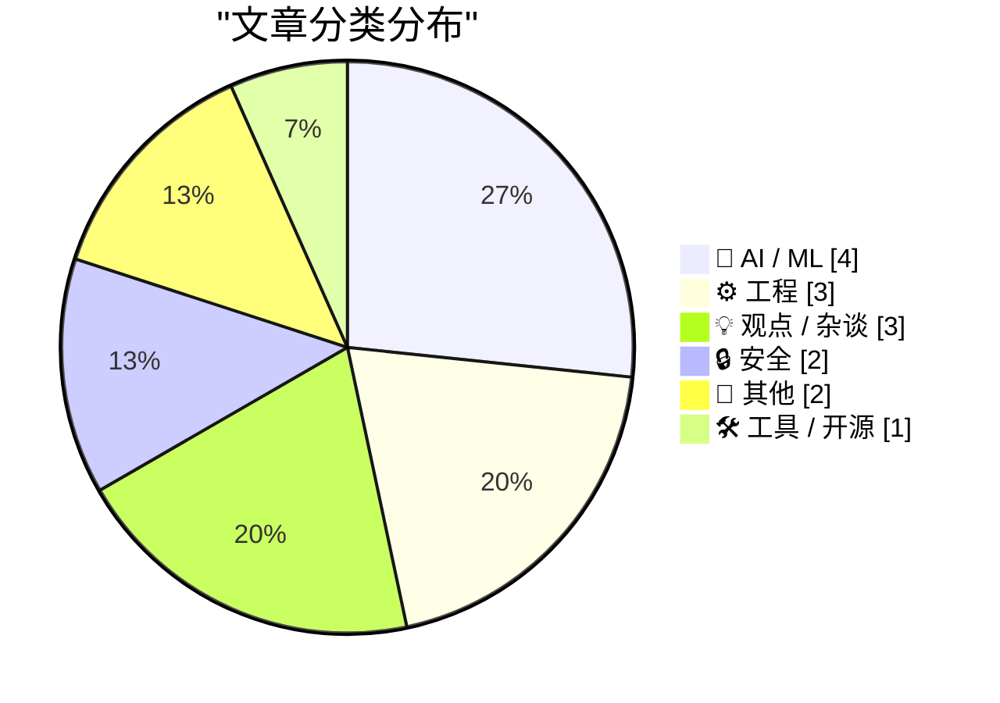
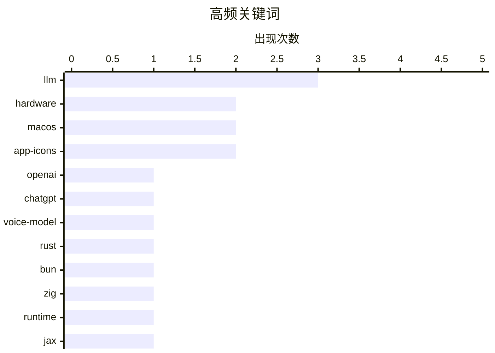

# 📰 AI 博客每日精选 — 2026-07-09

> 来自 Karpathy 推荐的 92 个顶级技术博客，AI 精选 Top 15

## 📝 今日看点

今日技术圈聚焦于大语言模型的深度实践与生态反思。开发者们正从底层构建、本地训练到智能体工程全方位探索LLM的潜力，同时也有声音开始警惕AI在代码描述等细节工作中的局限性。底层工程与系统生态的博弈持续升温，Bun向Rust的迁移、macOS图标限制的规避以及Windows控制流防护的优化，展现了开发者对性能与自由的极致追求。此外，网络安全领域暗流涌动，既有系统级防护机制的演进，也暴露出攻击性安全初创公司背后的犯罪阴影。

---

## 🏆 今日必读

🥇 **介绍 GPT-Live**

[Introducing GPT‑Live](https://simonwillison.net/2026/Jul/8/introducing-gptlive/#atom-everything) — simonwillison.net · 4 小时前 · 🤖 AI / ML

> OpenAI 终于升级了 ChatGPT 语音模式所使用的模型。新模型在 iPhone 应用中表现非常出色，能够将需要网络搜索、深度推理或复杂工作的任务委派给最新的前沿模型 GPT-5.5 处理。这种后台委派机制让语音交互在保持流畅的同时，也能应对高难度任务。作者认为这是语音助手体验的一次重大飞跃。

💡 **为什么值得读**: 了解 OpenAI 最新语音模型 GPT-Live 的委派机制及其对语音交互体验的提升。

🏷️ OpenAI, ChatGPT, voice-model, LLM

🥈 **用 Rust 重写 Bun**

[Rewriting Bun in Rust](https://simonwillison.net/2026/Jul/8/rewriting-bun-in-rust/#atom-everything) — simonwillison.net · 3 小时前 · ⚙️ 工程

> Bun 作者 Jarred Sumner 详细介绍了将 Bun 从 Zig 重写为 Rust 的过程。这次重写展示了极其复杂的智能体工程实践，包括动态工作流、试运行和自动化验证。文章深入探讨了如何利用 AI 智能体辅助完成大规模代码库的语言迁移。这是一份极具价值的大规模系统重构实战记录。

💡 **为什么值得读**: 深入了解如何利用 AI 智能体完成从 Zig 到 Rust 的大规模代码库重写工程。

🏷️ Rust, Bun, Zig, runtime

🥉 **从零开始编写 LLM，第 34b 部分：在 JAX 中从二元语法到 GPT-2 的逐组件构建**

[Writing an LLM from scratch, part 34b -- from bigrams to GPT-2, one component at a time (in JAX)](https://www.gilesthomas.com/2026/07/llm-from-scratch-34b-building-and-training-gpt-2-small-in-jax) — gilesthomas.com · 9 小时前 · 🤖 AI / ML

> 这是作者博客上连载时间最长的“从零构建 LLM”系列的高潮篇。作者基于 Sebastian Raschka 的著作，使用 JAX 框架逐步构建并训练了 GPT-2 small 模型。文章详细拆解了从二元语法到完整 GPT-2 架构的每个组件实现过程。这为希望深入理解大语言模型底层机制的开发者提供了完整的实践指南。

💡 **为什么值得读**: 获取使用 JAX 从零构建和训练 GPT-2 模型的完整组件级实践指南。

🏷️ LLM, JAX, GPT-2, from scratch

---

## 📊 数据概览

| 扫描源 | 抓取文章 | 时间范围 | 精选 |
|:---:|:---:|:---:|:---:|
| 81/92 | 2424 篇 → 23 篇 | 24h | **15 篇** |

### 分类分布



### 高频关键词



<details>
<summary>📈 纯文本关键词图（终端友好）</summary>

```
llm         │ ████████████████████ 3
hardware    │ █████████████░░░░░░░ 2
macos       │ █████████████░░░░░░░ 2
app-icons   │ █████████████░░░░░░░ 2
openai      │ ███████░░░░░░░░░░░░░ 1
chatgpt     │ ███████░░░░░░░░░░░░░ 1
voice-model │ ███████░░░░░░░░░░░░░ 1
rust        │ ███████░░░░░░░░░░░░░ 1
bun         │ ███████░░░░░░░░░░░░░ 1
zig         │ ███████░░░░░░░░░░░░░ 1
```

</details>

### 🏷️ 话题标签

**llm**(3) · **hardware**(2) · **macos**(2) · app-icons(2) · openai(1) · chatgpt(1) · voice-model(1) · rust(1) · bun(1) · zig(1) · runtime(1) · jax(1) · gpt-2(1) · from scratch(1) · ai(1) · commit-messages(1) · developer-workflow(1) · productivity(1) · cybersecurity(1) · zero-day(1)

---

## 🤖 AI / ML

### 1. 介绍 GPT-Live

[Introducing GPT‑Live](https://simonwillison.net/2026/Jul/8/introducing-gptlive/#atom-everything) — **simonwillison.net** · 4 小时前 · ⭐ 26/30

> OpenAI 终于升级了 ChatGPT 语音模式所使用的模型。新模型在 iPhone 应用中表现非常出色，能够将需要网络搜索、深度推理或复杂工作的任务委派给最新的前沿模型 GPT-5.5 处理。这种后台委派机制让语音交互在保持流畅的同时，也能应对高难度任务。作者认为这是语音助手体验的一次重大飞跃。

🏷️ OpenAI, ChatGPT, voice-model, LLM

---

### 2. 从零开始编写 LLM，第 34b 部分：在 JAX 中从二元语法到 GPT-2 的逐组件构建

[Writing an LLM from scratch, part 34b -- from bigrams to GPT-2, one component at a time (in JAX)](https://www.gilesthomas.com/2026/07/llm-from-scratch-34b-building-and-training-gpt-2-small-in-jax) — **gilesthomas.com** · 9 小时前 · ⭐ 24/30

> 这是作者博客上连载时间最长的“从零构建 LLM”系列的高潮篇。作者基于 Sebastian Raschka 的著作，使用 JAX 框架逐步构建并训练了 GPT-2 small 模型。文章详细拆解了从二元语法到完整 GPT-2 架构的每个组件实现过程。这为希望深入理解大语言模型底层机制的开发者提供了完整的实践指南。

🏷️ LLM, JAX, GPT-2, from scratch

---

### 3. poppy 训练盒，第 1 部分：起步

[poppy the training box, part 1: the beginnings](https://www.gilesthomas.com/2026/07/poppy-the-training-box-1-the-beginnings) — **gilesthomas.com** · 2 小时前 · ⭐ 21/30

> 作者计划组装一台专门用于本地 LLM 训练的独立机器，以取代目前使用的日常主机 perry。目前 perry 配备了 RTX 3090 显卡，能够完成如 163M 参数的 GPT-2 small 模型训练，但作为日常使用机器存在资源冲突问题。新机器的建立旨在将训练任务与日常开发环境隔离，提高效率。文章记录了这台名为 poppy 的训练工作站从零开始的构建过程。

🏷️ LLM, training, hardware, RTX

---

### 4. “PARRY 遭遇 DOCTOR”——1973 年的聊天机器人对决

[‘PARRY Encounters the DOCTOR’ — Chatbot on Chatbot Action Circa 1973](https://www.rfc-editor.org/info/rfc439/) — **daringfireball.net** · 5 小时前 · ⭐ 16/30

> 1973 年，精神病学家 Kenneth Colby 创建了模拟偏执型精神分裂症患者的 ELIZA 风格聊天机器人 PARRY。有人将 PARRY 与 ELIZA（即“DOCTOR”）连接起来进行对话，Vint Cerf 将这段对话记录作为 RFC 发布。这段早期 AI 之间的对话充满了荒诞与幽默，展示了早期聊天机器人的局限与趣味。它不仅是一份技术文档，更是 AI 发展史上极具娱乐性的里程碑。

🏷️ ELIZA, PARRY, chatbot, AI-history

---

## ⚙️ 工程

### 5. 用 Rust 重写 Bun

[Rewriting Bun in Rust](https://simonwillison.net/2026/Jul/8/rewriting-bun-in-rust/#atom-everything) — **simonwillison.net** · 3 小时前 · ⭐ 24/30

> Bun 作者 Jarred Sumner 详细介绍了将 Bun 从 Zig 重写为 Rust 的过程。这次重写展示了极其复杂的智能体工程实践，包括动态工作流、试运行和自动化验证。文章深入探讨了如何利用 AI 智能体辅助完成大规模代码库的语言迁移。这是一份极具价值的大规模系统重构实战记录。

🏷️ Rust, Bun, Zig, runtime

---

### 6. 不在 Mac App Store 分发的 Mac 应用可以逃离“圆角矩形监狱”

[Mac Apps Can Escape From Squircle Jail If They’re Not in the Mac App Store](https://tyler.io/2026/07/05/escape-from-squircle-jail/) — **daringfireball.net** · 6 小时前 · ⭐ 20/30

> macOS Tahoe 强制第三方开发者使用圆角矩形应用图标，引发了广泛不满。开发者 Tyler Hall 发现，如果在 Mac App Store 之外分发应用，可以利用 NSDockTilePlugIn API 逃离这种限制。虽然这并非该 API 的预期用途，且在 Mac App Store 中被禁止，但它能有效解决图标自定义问题。最新版的 Iris 应用已通过此方法添加了三个可选的应用图标。

🏷️ macOS, app-icons, NSDockTilePlugIn, development

---

### 7. 一个只影响左撇子用户的 Bug

[A bug which only affected left-handed users](https://shkspr.mobi/blog/2026/07/a-bug-which-only-affected-left-handed-users/) — **shkspr.mobi** · 16 小时前 · ⭐ 16/30

> 作者在优化博客时发现了一个只影响左撇子用户的罕见 Bug。由于左撇子用户使用左手拇指滑动屏幕，其交互方式与右撇子用户不同，从而触发了特定的页面渲染或交互问题。文章以幽默的口吻描述了这个边缘案例的发现与排查过程。这提醒开发者在优化移动端体验时，需要考虑不同用户群体的交互习惯差异。

🏷️ bug, testing, UX

---

## 💡 观点 / 杂谈

### 8. 引用 Kenton Varda

[Quoting Kenton Varda](https://simonwillison.net/2026/Jul/8/kenton-varda/#atom-everything) — **simonwillison.net** · 7 小时前 · ⭐ 22/30

> Cap'n Proto 作者 Kenton Varda 宣布禁止其团队使用 AI 编写变更描述（如 PR、提交信息和工单）。原因在于 AI 生成的描述往往只罗列代码中显而易见的细节，却忽略了理解代码整体意图所需的高层框架。这种低质量的描述在代码审查时不仅毫无用处，反而会干扰审查者。作者借此强调了在代码审查中人类上下文理解的重要性。

🏷️ AI, commit-messages, developer-workflow, productivity

---

### 9. 主机大战已经失败

[The console wars have been lost](https://xeiaso.net/notes/2026/console-wars-lost/) — **xeiaso.net** · 3 小时前 · ⭐ 19/30

> 作者认为传统的主机大战已经结束，而 Valve 凭借“什么都不做”的策略赢得了胜利。文章暗示 Steam Deck 及其生态系统在无需直接参与传统硬件竞赛的情况下，已经确立了主导地位。这种胜利反映了 PC 游戏生态对封闭式主机模式的降维打击。作者的观点为游戏行业的未来格局提供了独特的视角。

🏷️ Valve, Steam, console, gaming

---

### 10. 对 iOS 有益的往往对 MacOS 无益

[★ What’s Good for the iOS Goose Is Often Not Good for the MacOS Gander](https://daringfireball.net/2026/07/whats_good_for_the_ios_goose_is_often_not_good_for_the_macos_gander) — **daringfireball.net** · 2 小时前 · ⭐ 18/30

> macOS 的应用图标不仅仅是简单的按钮，它们支持拖拽、移动和放置文件等丰富交互。这些图标是功能丰富的对象，理应拥有比 iOS 图标更丰富的视觉词汇。作者认为，将 iOS 的设计理念直接套用到 macOS 上并不总是合适的。在跨平台设计时，必须考虑到桌面端与移动端在交互逻辑上的本质差异。

🏷️ macOS, iOS, app-icons, design

---

## 🔒 安全

### 11. 重罪犯与诈骗犯推销攻击性网络安全初创公司

[Felons, Fraudsters Flog Offensive Cybersecurity Startup](https://krebsonsecurity.com/2026/07/felons-fraudsters-flog-offensive-cybersecurity-startup/) — **krebsonsecurity.com** · 15 小时前 · ⭐ 22/30

> 一家悬赏数百万美元收购流行软件零日漏洞的网络安全初创公司，其实际控制者是一对极右翼阴谋论者和重罪犯。这两人最近的商业冒险包括虚假情报公司和一个现已倒闭的 AI 游说平台。他们一直使用化名进行操作以掩盖其犯罪背景。该报道揭露了网络安全漏洞交易市场背后的黑暗面。

🏷️ cybersecurity, zero-day, fraud, investigation

---

### 12. 另一种控制流防护检查：验证与调用的结合

[The other kind of control flow guard check: The combined validate and call](https://devblogs.microsoft.com/oldnewthing/20260708-00/?p=112510) — **devblogs.microsoft.com/oldnewthing** · 13 小时前 · ⭐ 21/30

> 微软 The Old New Thing 博客探讨了 Windows 控制流防护（CFG）中的另一种检查机制：验证与调用的结合。这种二合一的打包机制旨在优化控制流完整性检查的性能与效率。文章详细解释了该机制在底层系统中的工作原理及其应用场景。这对于理解 Windows 底层安全机制的开发者具有重要参考价值。

🏷️ CFG, control flow, Windows, security

---

## 📝 其他

### 13. 特供版树莓派 4 极其短命

[The Special Value Pi 4 was extremely short-lived](https://www.jeffgeerling.com/blog/2026/special-value-pi-4-extremely-short-lived/) — **jeffgeerling.com** · 13 小时前 · ⭐ 16/30

> Jeff Geerling 介绍了一款极其罕见的“特供版”树莓派 4（4GB），这甚至比他拥有的蓝色限量版还要稀有。这款特供版树莓派由某经销商短暂推出，生命周期极短。文章展示了这款稀有硬件的实物图片并探讨了其短暂存在的原因。对于树莓派硬件收藏者而言，这是一个极具历史意义的罕见版本。

🏷️ Raspberry-Pi, hardware, rare

---

### 14. 《大金刚》如何颠覆了雅达利

[How Donkey Kong toppled Atari](https://dfarq.homeip.net/how-donkey-kong-toppled-atari/?utm_source=rss&#038;utm_medium=rss&#038;utm_campaign=how-donkey-kong-toppled-atari) — **dfarq.homeip.net** · 16 小时前 · ⭐ 15/30

> 1981 年 7 月，在《吃豆人》狂热达到顶峰时，任天堂发布了第三款街机游戏《大金刚》。这款游戏迅速成为世界上最受欢迎的街机游戏，并对当时的行业霸主雅达利造成了不可逆转的打击。文章回顾了《大金刚》如何改变街机游戏市场格局的历史。这款游戏的成功标志着任天堂的崛起和雅达利霸主地位的终结。

---

## 🛠 工具 / 开源

### 15. [赞助] WorkOS Pipes：更多上下文造就更智能的产品

[[Sponsor] WorkOS Pipes: More Context Makes for Smarter Products](https://workos.com/pipes?utm_source=daringfireball&amp;utm_medium=newsletter&amp;utm_campaign=q32026) — **daringfireball.net** · 13 小时前 · ⭐ 20/30

> WorkOS 推出了 Pipes 服务，旨在帮助应用和 AI 智能体连接到用户已有的工具。传统上，每个集成都需要不同的 OAuth 流程和令牌生命周期管理，耗费大量基础设施开发时间。Pipes 通过单一 API 调用解决这一问题，提供针对 GitHub、Slack、Salesforce 等的预构建连接器，自动处理 OAuth、令牌刷新和凭证存储。开发者每次都可以使用新令牌直接调用真实的提供商 API。

🏷️ WorkOS, API, OAuth, integration

---

*生成于 2026-07-09 11:48 (Asia/Shanghai) | 扫描 81 源 → 获取 2424 篇 → 精选 15 篇*
*基于 [Hacker News Popularity Contest 2025](https://refactoringenglish.com/tools/hn-popularity/) RSS 源列表，由 [Andrej Karpathy](https://x.com/karpathy) 推荐*
*由「懂点儿AI」制作，欢迎关注同名微信公众号获取更多 AI 实用技巧 💡*
