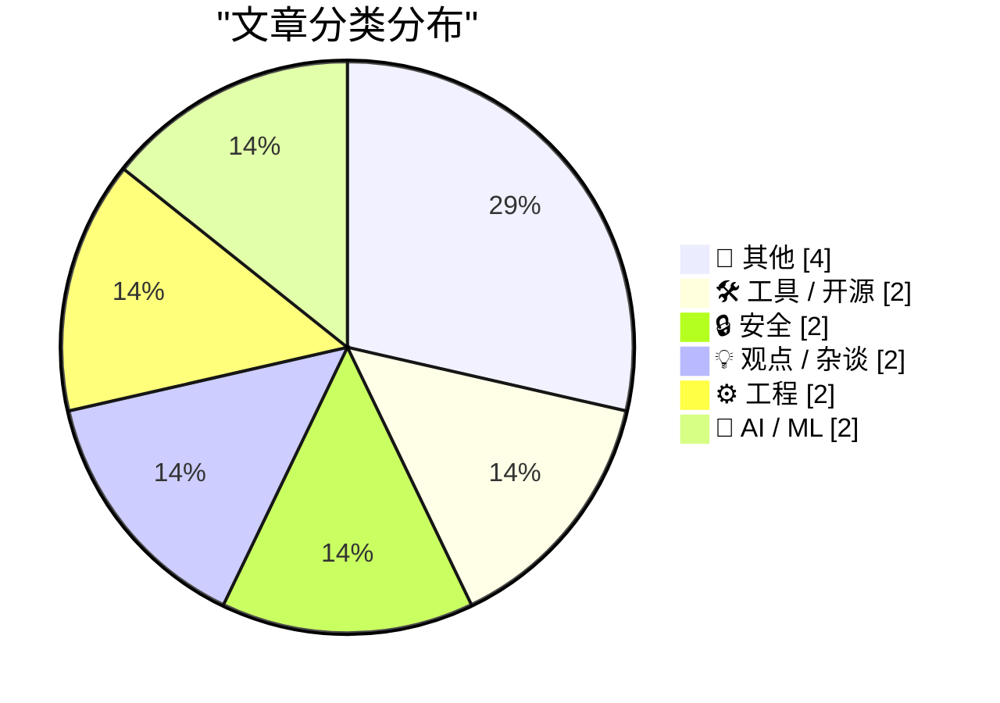
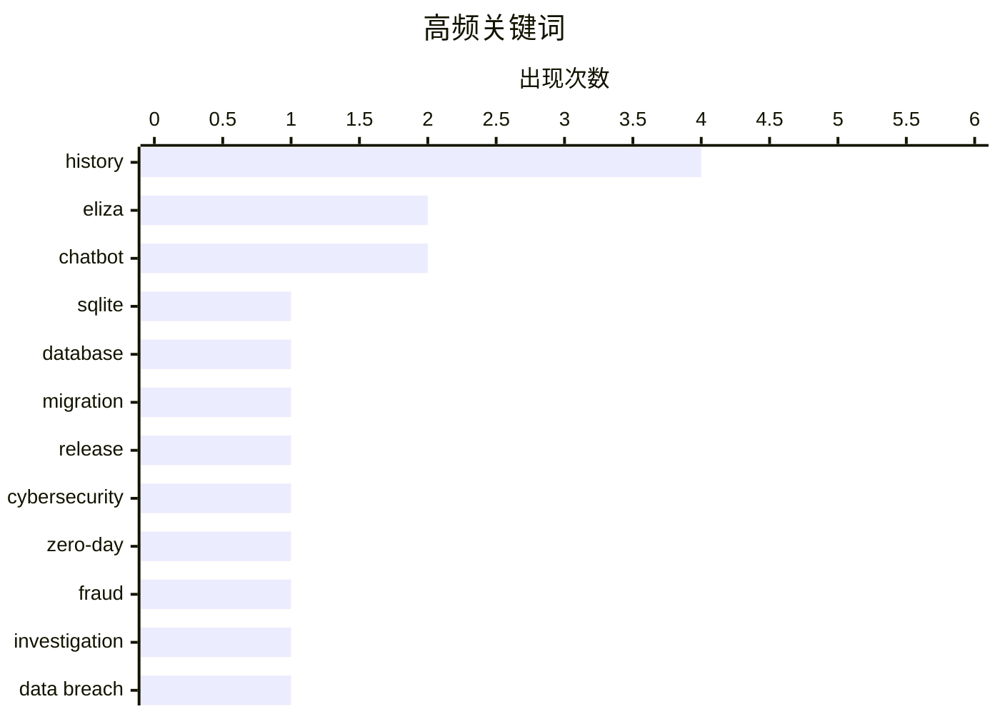

# 📰 AI 博客每日精选 — 2026-07-09

> 来自 Karpathy 推荐的 92 个顶级技术博客，AI 精选 Top 14

## 📝 今日看点

今日技术圈主要聚焦于人工智能的历史溯源、网络安全挑战以及系统边缘案例的反思。在AI领域，开发者重温了史上首个聊天机器人ELIZA，在智能体飞速发展的当下重新审视机器智能的本质与演进。安全方面，数据泄露的不可逆性与零日漏洞交易市场的乱象引发了高度警惕，凸显了底层防护与行业伦理的重要性。此外，技术社区探讨了系统高度标准化带来的隐患，呼吁在算法同质化时代兼顾对特殊边缘场景的工程包容性。

---

## 🏆 今日必读

🥇 **sqlite-utils 4.0 发布，现已支持数据库模式迁移**

[sqlite-utils 4.0, now with database schema migrations](https://simonwillison.net/2026/Jul/7/sqlite-utils-4/#atom-everything) — simonwillison.net · 22 小时前 · 🛠 工具 / 开源

> sqlite-utils 4.0 正式发布，这是该项目自 2020 年 11 月的 3.0 版本以来的首个大版本更新（总计第 124 个版本）。新版本引入了三大主要功能，其中最核心的是新增了数据库模式迁移支持。此次更新还包含了一些虽小但意义重大的破坏性变更，用户在升级时需参考官方提供的升级指南以避免兼容性问题。

💡 **为什么值得读**: 如果你正在使用 sqlite-utils 进行 SQLite 数据库管理，了解其破坏性变更和全新的模式迁移功能对决定是否升级至关重要。

🏷️ sqlite, database, migration, release

🥈 **重刑犯与诈骗犯推销攻击性网络安全初创公司**

[Felons, Fraudsters Flog Offensive Cybersecurity Startup](https://krebsonsecurity.com/2026/07/felons-fraudsters-flog-offensive-cybersecurity-startup/) — krebsonsecurity.com · 5 小时前 · 🔒 安全

> 一家宣称斥资数百万美元收购流行软件零日漏洞的网络安全初创公司，被发现由两名极右翼阴谋论者和重刑犯运营。这两人的近期商业履历劣迹斑斑，包括使用化名运营虚假情报公司以及一家现已倒闭的基于 AI 的游说平台。这揭示了网络安全漏洞交易市场中存在的严重信任与背景审查风险。

💡 **为什么值得读**: 揭露了网络安全漏洞收购市场背后的黑暗面，为打算出售高危漏洞的安全研究员敲响了尽职调查的警钟。

🏷️ cybersecurity, zero-day, fraud, investigation

🥉 **每周更新 511：在马拉喀什的传统庭院直播**

[Weekly Update 511: Live from my Riad in Marrakech](https://www.troyhunt.com/weekly-update-511/) — troyhunt.com · 4 小时前 · 🔒 安全

> Troy Hunt 在马拉喀什带来了每周更新第 511 期，重点讨论了近期发生的数据泄露事件。作者使用“试图从游泳池里把尿排干”的生动比喻，强调了数据一旦在暗网泄露后进行清理和撤回的极端困难与徒劳。这期内容从现实物理空间的视角探讨了数据泄露带来的不可逆影响。

💡 **为什么值得读**: 通过极其生动且令人印象深刻的比喻，深刻揭示了数据泄露后试图掩盖或删除数据的残酷现实。

🏷️ data breach, security, privacy

---

## 📊 数据概览

| 扫描源 | 抓取文章 | 时间范围 | 精选 |
|:---:|:---:|:---:|:---:|
| 84/92 | 2516 篇 → 14 篇 | 24h | **14 篇** |

### 分类分布



### 高频关键词



<details>
<summary>📈 纯文本关键词图（终端友好）</summary>

```
history       │ ████████████████████ 4
eliza         │ ██████████░░░░░░░░░░ 2
chatbot       │ ██████████░░░░░░░░░░ 2
sqlite        │ █████░░░░░░░░░░░░░░░ 1
database      │ █████░░░░░░░░░░░░░░░ 1
migration     │ █████░░░░░░░░░░░░░░░ 1
release       │ █████░░░░░░░░░░░░░░░ 1
cybersecurity │ █████░░░░░░░░░░░░░░░ 1
zero-day      │ █████░░░░░░░░░░░░░░░ 1
fraud         │ █████░░░░░░░░░░░░░░░ 1
```

</details>

### 🏷️ 话题标签

**history**(4) · **eliza**(2) · **chatbot**(2) · sqlite(1) · database(1) · migration(1) · release(1) · cybersecurity(1) · zero-day(1) · fraud(1) · investigation(1) · data breach(1) · security(1) · privacy(1) · culture(1) · internet(1) · society(1) · raspberry-pi(1) · hardware(1) · discontinued(1)

---

## 📝 其他

### 1. 特价版树莓派 4 的寿命极其短暂

[The Special Value Pi 4 was extremely short-lived](https://www.jeffgeerling.com/blog/2026/special-value-pi-4-extremely-short-lived/) — **jeffgeerling.com** · 4 小时前 · ⭐ 19/30

> 知名硬件评测者 Jeff Geerling 展示了一款极其罕见的“Special Value”（特价版）树莓派 4（4GB 内存版本）。这款主板由某树莓派经销商短暂推出，可能是为了清理特定库存或进行极短期的市场测试，但该产品在市场上存活的时间极短。这使其成为比蓝色限量版树莓派还要罕见的收藏品。

🏷️ raspberry-pi, hardware, discontinued

---

### 2. 初代 Macintosh 的应用图标设计惯例

[App Icon Conventions From the Original Macintosh](https://leancrew.com/all-this/2026/07/old-icons/) — **daringfireball.net** · 3 小时前 · ⭐ 14/30

> 初代 Macintosh 采用单色（1-bit）位图设计应用图标，并形成了独特的设计规范。Apple 倾向于使用倾斜矩形作为图标基底，并在内部填充代表应用功能的图像。这种倾斜设计是为了匹配人手握持时的自然朝向，并用“手”的元素暗示该应用用于执行操作。然而，这种基于右手习惯的设计对左撇子用户并不友好。

🏷️ UI, design, macintosh, history

---

### 3. 亿万富翁如何偿还了我们的 5.5 亿美元债务

[And Then the Billionaire Paid Off $550 Million of Our Debts](https://idiallo.com/blog/billionaire-paid-off-550-million-dollars-of-our-debts) — **idiallo.com** · 10 小时前 · ⭐ 12/30

> Snapchat CEO Evan Spiegel 及其妻子向慈善机构捐赠了 5.5 亿美元，占其 20 亿美元净资产的四分之一。这笔巨额资金捐给了名为 Undue Medical Debt 的组织，专门用于购买和免除加州居民的医疗债务。作者抛开对亿万富翁存在合理性的政治争论，将焦点放在这一善举带来的实际社会影响上。这种直接消除普通人医疗债务的慈善模式，展现了巨额财富回馈社会的有效路径。

🏷️ philanthropy, Snapchat, charity

---

### 4. 《大金刚》是如何推翻雅达利的

[How Donkey Kong toppled Atari](https://dfarq.homeip.net/how-donkey-kong-toppled-atari/?utm_source=rss&#038;utm_medium=rss&#038;utm_campaign=how-donkey-kong-toppled-atari) — **dfarq.homeip.net** · 7 小时前 · ⭐ 10/30

> 1981 年 7 月，正值《吃豆人》引发的街机狂热达到顶峰时，任天堂推出了其第三款街机游戏《大金刚》。这款游戏迅速风靡全球，取代了此前的街机霸主地位，并成为世界上最受欢迎的街机游戏。《大金刚》的成功不仅为任天堂在电子游戏行业站稳脚跟奠定了基础，更对当时的行业巨头雅达利（Atari）造成了不可逆转的致命打击。

🏷️ Nintendo, Atari, gaming, history

---

## 🛠 工具 / 开源

### 5. sqlite-utils 4.0 发布，现已支持数据库模式迁移

[sqlite-utils 4.0, now with database schema migrations](https://simonwillison.net/2026/Jul/7/sqlite-utils-4/#atom-everything) — **simonwillison.net** · 22 小时前 · ⭐ 24/30

> sqlite-utils 4.0 正式发布，这是该项目自 2020 年 11 月的 3.0 版本以来的首个大版本更新（总计第 124 个版本）。新版本引入了三大主要功能，其中最核心的是新增了数据库模式迁移支持。此次更新还包含了一些虽小但意义重大的破坏性变更，用户在升级时需参考官方提供的升级指南以避免兼容性问题。

🏷️ sqlite, database, migration, release

---

### 6. [赞助内容] WorkOS Pipes：更丰富的上下文造就更智能的产品

[[Sponsor] WorkOS Pipes: More Context Makes for Smarter Products](https://workos.com/pipes?utm_source=daringfireball&amp;utm_medium=newsletter&amp;utm_campaign=q32026) — **daringfireball.net** · 3 小时前 · ⭐ 17/30

> WorkOS 推出了 Pipes 功能，旨在帮助应用和 AI 智能体无缝集成用户已有的第三方工具（如 GitHub、Slack、Salesforce 等）。开发者只需一次 API 调用，即可对接 100 多个服务提供商，Pipes 会自动处理复杂的 OAuth 流程、令牌刷新和凭证存储。该方案大幅减少了构建集成基础设施的耗时，让产品能持续获取最新上下文以提供更智能的服务。

🏷️ API, OAuth, integration, WorkOS

---

## 🔒 安全

### 7. 重刑犯与诈骗犯推销攻击性网络安全初创公司

[Felons, Fraudsters Flog Offensive Cybersecurity Startup](https://krebsonsecurity.com/2026/07/felons-fraudsters-flog-offensive-cybersecurity-startup/) — **krebsonsecurity.com** · 5 小时前 · ⭐ 23/30

> 一家宣称斥资数百万美元收购流行软件零日漏洞的网络安全初创公司，被发现由两名极右翼阴谋论者和重刑犯运营。这两人的近期商业履历劣迹斑斑，包括使用化名运营虚假情报公司以及一家现已倒闭的基于 AI 的游说平台。这揭示了网络安全漏洞交易市场中存在的严重信任与背景审查风险。

🏷️ cybersecurity, zero-day, fraud, investigation

---

### 8. 每周更新 511：在马拉喀什的传统庭院直播

[Weekly Update 511: Live from my Riad in Marrakech](https://www.troyhunt.com/weekly-update-511/) — **troyhunt.com** · 4 小时前 · ⭐ 23/30

> Troy Hunt 在马拉喀什带来了每周更新第 511 期，重点讨论了近期发生的数据泄露事件。作者使用“试图从游泳池里把尿排干”的生动比喻，强调了数据一旦在暗网泄露后进行清理和撤回的极端困难与徒劳。这期内容从现实物理空间的视角探讨了数据泄露带来的不可逆影响。

🏷️ data breach, security, privacy

---

## 💡 观点 / 杂谈

### 9. 偏差的衰退 2

[The Decline of Deviance 2](https://www.experimental-history.com/p/the-decline-of-deviance-2) — **experimental-history.com** · 1 小时前 · ⭐ 20/30

> 文章探讨了现代社会与软件系统中“偏差”或异常行为的减少及其带来的深远影响。作者延续了前作的讨论，剖析了当系统、算法或社会规范变得越来越同质化和标准化时，那些不符合常规的边缘案例或创新性偏差是如何被抹杀的。这种对“偏差”的过度修正可能会阻碍创新并掩盖真实的系统漏洞。

🏷️ culture, internet, society

---

### 10. 家庭问答：纯正 Mac 应用程序版

[Family Feud: Mac-assed Mac App Edition](https://blog.jim-nielsen.com/2026/mac-assed-family-feud/) — **blog.jim-nielsen.com** · -55 分钟前 · ⭐ 11/30

> 作者借用电视游戏节目《Family Feud》的形式，探讨了当今科技巨头中谁最有能力开发出“纯正的 Mac 应用”。文章抛出问题：“地球上最适合制作世界级 Mac 应用的前三家公司是谁？”，并给出了排行榜第一名的答案：Apple。这一互动形式巧妙地讽刺了当前第三方开发者的处境，同时强调了苹果自身在打造原生 Mac 生态中的绝对主导地位。

🏷️ Apple, Mac, software

---

## ⚙️ 工程

### 11. 另一种控制流防护检查：验证与调用的结合

[The other kind of control flow guard check: The combined validate and call](https://devblogs.microsoft.com/oldnewthing/20260708-00/?p=112510) — **devblogs.microsoft.com/oldnewthing** · 4 小时前 · ⭐ 19/30

> 微软开发者博客深入探讨了 Windows 控制流防护（CFG）机制中的另一种检查方式：将验证与调用合二为一的机制。这种二合一的优化设计旨在提升系统安全性并减少间接分支带来的性能开销。文章剖析了该机制在底层架构中的工作原理及其如何有效防止恶意代码劫持程序的控制流。

🏷️ CFG, Windows, system-programming

---

### 12. 一个仅影响左撇子用户的 Bug

[A bug which only affected left-handed users](https://shkspr.mobi/blog/2026/07/a-bug-which-only-affected-left-handed-users/) — **shkspr.mobi** · 6 小时前 · ⭐ 16/30

> 开发者分享了一个极具特殊性的前端 Bug，该问题在排查后发现竟然仅影响左撇子用户。由于左撇子习惯使用左手拇指进行屏幕滚动或交互，这触发了特定 UI 组件或手势识别逻辑中的边缘案例。该案例生动展示了用户行为多样性如何暴露出开发者在设计时未曾预料的交互盲区。

🏷️ bug, UX, testing, accessibility

---

## 🤖 AI / ML

### 13. 我与 ELIZA 的对话

[My Conversation With ELIZA](https://sites.google.com/view/elizaarchaeology/try-eliza?authuser=0) — **daringfireball.net** · 31 分钟前 · ⭐ 16/30

> 作者重温了与历史上最早聊天机器人之一的 ELIZA 的对话体验，并对其实际智能水平表示高度怀疑。尽管 ELIZA 包含了一些有趣的自然语言语法解析功能，但作者认为它本质上只是比一堆简单的 if/then 语句稍微好一点，根本无法通过图灵测试。作者对早期文献中声称人们将其视为虚拟心理医生并深陷其中的说法提出了强烈质疑。

🏷️ ELIZA, chatbot, AI, history

---

### 14. ELIZA 考古项目

[The ELIZA Archaeology Project](https://findingeliza.org/) — **daringfireball.net** · 44 分钟前 · ⭐ 15/30

> “ELIZA 考古项目”致力于挖掘和还原诞生于 1960 年代 MIT MAC 计划的史上首个聊天机器人 ELIZA。该项目展示了 ELIZA 的设计者 Joseph Weizenbaum 如何开创基于文本的人机交互模式。作为 AI 发展史上的里程碑，ELIZA 不仅奠定了现代对话代理的基础，更深刻影响了人类将计算机概念化为具备特定能力实体的认知方式。

🏷️ ELIZA, history, chatbot

---

*生成于 2026-07-09 02:05 (Asia/Shanghai) | 扫描 84 源 → 获取 2516 篇 → 精选 14 篇*
*基于 [Hacker News Popularity Contest 2025](https://refactoringenglish.com/tools/hn-popularity/) RSS 源列表，由 [Andrej Karpathy](https://x.com/karpathy) 推荐*
*由「懂点儿AI」制作，欢迎关注同名微信公众号获取更多 AI 实用技巧 💡*
