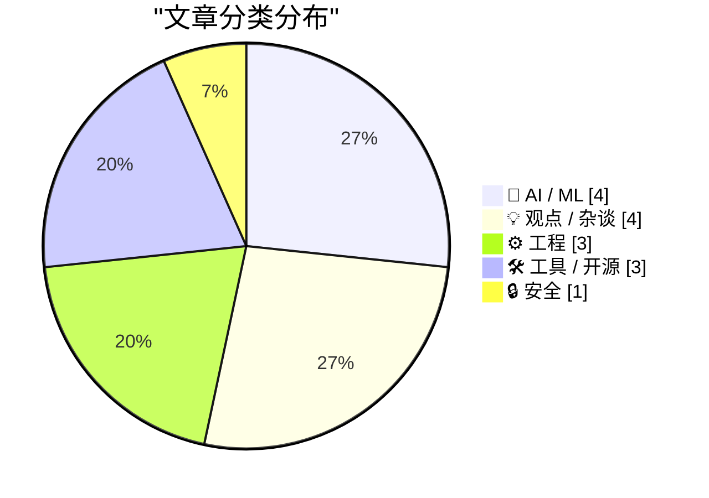
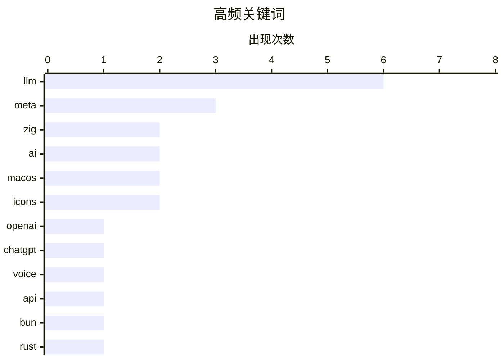

# 📰 AI 博客每日精选 — 2026-07-10

> 来自 Karpathy 推荐的 92 个顶级技术博客，AI 精选 Top 15

## 📝 今日看点

今日技术圈焦点集中在AI大模型的快速迭代与底层工程实践的深度融合。OpenAI与Meta相继推出升级版语音与Agentic模型，开发者对从零构建及本地训练LLM的热情持续高涨。同时，AI在复杂工程中的应用呈现双刃剑效应，Bun借助AI完成Rust重写展现强大工程力，而部分团队却开始抵制AI生成代码审查描述，质疑其实际价值。此外，随着Meta默认允许复用用户照片训练AI，数据隐私与版权边界问题再次引发行业热议。

---

## 🏆 今日必读

🥇 **介绍 GPT-Live**

[Introducing GPT‑Live](https://simonwillison.net/2026/Jul/8/introducing-gptlive/#atom-everything) — simonwillison.net · 18 小时前 · 🤖 AI / ML

> OpenAI 终于升级了 ChatGPT 语音模式所使用的模型，推出 GPT-Live。作者在 iPhone 应用中获得数周预览权限，新模型表现非常出色。对于需要网络搜索、深度推理或更复杂工作的任务，GPT-Live 会在后台委托给最新的前沿模型 GPT-5.5 处理。这一升级标志着 ChatGPT 语音交互能力的显著提升。

💡 **为什么值得读**: 了解 OpenAI 语音模式最新升级及 GPT-5.5 委托机制的第一手体验报告。

🏷️ OpenAI, ChatGPT, voice, LLM

🥈 **介绍 Muse Spark 1.1**

[Introducing Muse Spark 1.1](https://simonwillison.net/2026/Jul/9/muse-spark-1-1/#atom-everything) — simonwillison.net · 1 小时前 · 🤖 AI / ML

> Meta 继 4 月发布 Muse Spark 后推出 1.1 版本，这是首个提供 API 的 Spark 模型。Meta 声称在 agentic 工具调用和计算机使用方面有显著改进。更多细节可在 Muse Spark 1.1 评估报告中查阅。该版本标志着 Meta 在 AI 模型 API 化和智能体能力上的重要进展。

💡 **为什么值得读**: Meta 首个开放 API 的 Spark 模型，关注 agentic 工具调用能力提升的开发者必读。

🏷️ Meta, LLM, API

🥉 **用 Rust 重写 Bun**

[Rewriting Bun in Rust](https://simonwillison.net/2026/Jul/8/rewriting-bun-in-rust/#atom-everything) — simonwillison.net · 18 小时前 · ⚙️ 工程

> Bun 作者 Jarred Sumner 完成了从 Zig 到 Rust 的重写，并详细记录了整个过程。这是一次极其复杂的 agentic 工程实践，涉及动态工作流、试运行和迭代验证等高级技术。文章展示了如何利用 AI 代理完成大规模代码库语言迁移的工程方法论。重写过程本身比承诺博客文章的等待时间还要短。

💡 **为什么值得读**: 展示 AI 代理驱动大规模代码库语言迁移的实战案例，对 agentic 工程方法论感兴趣的读者不可错过。

🏷️ Bun, Rust, Zig, performance

---

## 📊 数据概览

| 扫描源 | 抓取文章 | 时间范围 | 精选 |
|:---:|:---:|:---:|:---:|
| 83/92 | 2498 篇 → 20 篇 | 24h | **15 篇** |

### 分类分布



### 高频关键词



<details>
<summary>📈 纯文本关键词图（终端友好）</summary>

```
llm     │ ████████████████████ 6
meta    │ ██████████░░░░░░░░░░ 3
zig     │ ███████░░░░░░░░░░░░░ 2
ai      │ ███████░░░░░░░░░░░░░ 2
macos   │ ███████░░░░░░░░░░░░░ 2
icons   │ ███████░░░░░░░░░░░░░ 2
openai  │ ███░░░░░░░░░░░░░░░░░ 1
chatgpt │ ███░░░░░░░░░░░░░░░░░ 1
voice   │ ███░░░░░░░░░░░░░░░░░ 1
api     │ ███░░░░░░░░░░░░░░░░░ 1
```

</details>

### 🏷️ 话题标签

**llm**(6) · **meta**(3) · **zig**(2) · ai(2) · macos(2) · icons(2) · openai(1) · chatgpt(1) · voice(1) · api(1) · bun(1) · rust(1) · performance(1) · jax(1) · gpt-2(1) · from-scratch(1) · package-manager(1) · security(1) · governance(1) · instagram(1)

---

## 🤖 AI / ML

### 1. 介绍 GPT-Live

[Introducing GPT‑Live](https://simonwillison.net/2026/Jul/8/introducing-gptlive/#atom-everything) — **simonwillison.net** · 18 小时前 · ⭐ 25/30

> OpenAI 终于升级了 ChatGPT 语音模式所使用的模型，推出 GPT-Live。作者在 iPhone 应用中获得数周预览权限，新模型表现非常出色。对于需要网络搜索、深度推理或更复杂工作的任务，GPT-Live 会在后台委托给最新的前沿模型 GPT-5.5 处理。这一升级标志着 ChatGPT 语音交互能力的显著提升。

🏷️ OpenAI, ChatGPT, voice, LLM

---

### 2. 介绍 Muse Spark 1.1

[Introducing Muse Spark 1.1](https://simonwillison.net/2026/Jul/9/muse-spark-1-1/#atom-everything) — **simonwillison.net** · 1 小时前 · ⭐ 24/30

> Meta 继 4 月发布 Muse Spark 后推出 1.1 版本，这是首个提供 API 的 Spark 模型。Meta 声称在 agentic 工具调用和计算机使用方面有显著改进。更多细节可在 Muse Spark 1.1 评估报告中查阅。该版本标志着 Meta 在 AI 模型 API 化和智能体能力上的重要进展。

🏷️ Meta, LLM, API

---

### 3. 从零编写 LLM，第 34b 部分——从 bigram 到 GPT-2，逐组件构建（使用 JAX）

[Writing an LLM from scratch, part 34b -- from bigrams to GPT-2, one component at a time (in JAX)](https://www.gilesthomas.com/2026/07/llm-from-scratch-34b-building-and-training-gpt-2-small-in-jax) — **gilesthomas.com** · 23 小时前 · ⭐ 24/30

> 这是作者博客上持续时间最长的系列文章的收官之作。作者从 2024 年 12 月开始研读 Sebastian Raschka 的《Build a Large Language Model (from Scratch)》一书，并在学习过程中深入探索了 JAX 实现。本篇详细记录了如何使用 JAX 逐步构建和训练 GPT-2 small 模型，从 bigram 模型出发，逐个组件搭建完整的 Transformer 架构。

🏷️ LLM, JAX, GPT-2, from-scratch

---

### 4. poppy 训练盒，第 1 部分：起步

[poppy the training box, part 1: the beginnings](https://www.gilesthomas.com/2026/07/poppy-the-training-box-1-the-beginnings) — **gilesthomas.com** · 17 小时前 · ⭐ 21/30

> 作者计划搭建一台专门用于本地 LLM 训练的独立机器，此前一直使用配备 RTX 3090 的台式机 perry 进行训练。perry 已能完成有用的训练任务（如最近训练了一个 163M 参数的 GPT-2 small 风格 JAX LLM），但存在两个问题：perry 是日常主力机器，训练运行时会占用资源影响正常使用。本篇记录了专用训练机器 poppy 的搭建起步过程。

🏷️ LLM, training, hardware, GPU

---

## 💡 观点 / 杂谈

### 5. 引用 Kenton Varda 的话

[Quoting Kenton Varda](https://simonwillison.net/2026/Jul/8/kenton-varda/#atom-everything) — **simonwillison.net** · 22 小时前 · ⭐ 21/30

> Kenton Varda 宣布对其团队实施禁令，禁止使用 AI 编写变更描述（如 PR 和 commit 消息、issue/ticket）。原因是 AI 生成的变更描述对代码审查毫无价值：它们描述了通过查看代码就能轻易发现的细节，却遗漏了理解代码整体意图所需的高层框架信息。这一观点反映了资深工程师对 AI 生成内容在特定工程场景下局限性的反思。

🏷️ AI, commit, workflow

---

### 6. 对 iOS 鹅有利的事往往对 MacOS 鹅不利

[★ What’s Good for the iOS Goose Is Often Not Good for the MacOS Gander](https://daringfireball.net/2026/07/whats_good_for_the_ios_goose_is_often_not_good_for_the_macos_gander) — **daringfireball.net** · 16 小时前 · ⭐ 17/30

> macOS 的应用图标不仅仅是简单的按钮，它们具有更丰富的交互功能。用户可以拖拽、移动图标，甚至将文件拖放到图标上，还可以单击选中或双击启动。这些丰富的交互特性意味着 Mac 图标理应拥有比 iOS 更丰富的视觉词汇，而不是被强制统一为单调的样式。

🏷️ macOS, iOS, design, icons

---

### 7. 主机大战已经结束

[The console wars have been lost](https://xeiaso.net/notes/2026/console-wars-lost/) — **xeiaso.net** · 18 小时前 · ⭐ 17/30

> 作者认为主机游戏市场的竞争已经尘埃落定。Valve 凭借“什么都不做”的策略赢得了这场战争。这暗示了 Steam 平台在 PC 游戏领域的统治地位已经无需通过主动干预或新硬件竞争来巩固。Valve 的被动策略反而证明了其生态系统的强大护城河。

🏷️ Valve, Steam, gaming, consoles

---

### 8. 家庭问答：纯正 Mac 应用版

[Family Feud: Mac-assed Mac App Edition](https://blog.jim-nielsen.com/2026/mac-assed-family-feud/) — **blog.jim-nielsen.com** · 23 小时前 · ⭐ 17/30

> 作者以《家庭问答》节目的形式提出了一个问题：地球上哪三家公司最适合开发“纯正的 Mac 应用”。揭晓的答案第一名是苹果公司。这反映了业界对苹果在 Mac 应用开发领域地位的认可，同时也暗含了对当前第三方 Mac 应用生态的某种讽刺或期待。

🏷️ Apple, Mac, UI, software

---

## ⚙️ 工程

### 9. 用 Rust 重写 Bun

[Rewriting Bun in Rust](https://simonwillison.net/2026/Jul/8/rewriting-bun-in-rust/#atom-everything) — **simonwillison.net** · 18 小时前 · ⭐ 24/30

> Bun 作者 Jarred Sumner 完成了从 Zig 到 Rust 的重写，并详细记录了整个过程。这是一次极其复杂的 agentic 工程实践，涉及动态工作流、试运行和迭代验证等高级技术。文章展示了如何利用 AI 代理完成大规模代码库语言迁移的工程方法论。重写过程本身比承诺博客文章的等待时间还要短。

🏷️ Bun, Rust, Zig, performance

---

### 10. 我已解码 #pragma detect_mismatch 错误并修复了不匹配，但仍然报错

[I’ve decoded a #pragma detect_mismatch error and fixed the mismatch, but I still get the error](https://devblogs.microsoft.com/oldnewthing/20260709-00/?p=112512) — **devblogs.microsoft.com/oldnewthing** · 4 小时前 · ⭐ 20/30

> 文章解答了一个 Windows 开发中的常见困惑：当开发者解码并修复了 #pragma detect_mismatch 错误后，如果仍然遇到该错误，原因是需要重新构建所有依赖于该变更的组件。仅修复不匹配代码本身不够，必须确保整个依赖链上的所有构建产物都同步更新。

🏷️ C++, pragma, build, Windows

---

### 11. Mac 应用如果不通过 Mac App Store 分发，就能逃出“圆角矩形监狱”

[Mac Apps Can Escape From Squircle Jail If They’re Not in the Mac App Store](https://tyler.io/2026/07/05/escape-from-squircle-jail/) — **daringfireball.net** · 21 小时前 · ⭐ 19/30

> macOS Tahoe 强制第三方应用使用统一的“圆角矩形”图标，引发了开发者的不满。通过非 Mac App Store 分发的应用可以利用 NSDockTilePlugIn API 绕过这一限制。虽然这并非该 API 的预期用途，且在 Mac App Store 中被禁止，但它确实能解决图标限制问题。Iris 应用的最新版本已经利用此方法添加了三个可选的新图标。

🏷️ macOS, App Store, icons

---

## 🛠 工具 / 开源

### 12. 拆箱：Zig

[Unboxed: Zig](https://nesbitt.io/2026/07/09/unboxed-zig.html) — **nesbitt.io** · 8 小时前 · ⭐ 23/30

> 文章深入分析了 Zig 的包管理器，涵盖四个核心维度：机制原理、分类方式、治理结构以及威胁模型。从包管理器的技术实现到安全治理，全面审视了 Zig 生态系统的包管理设计。

🏷️ Zig, package-manager, security, governance

---

### 13. llm-meta-ai 0.1

[llm-meta-ai 0.1](https://simonwillison.net/2026/Jul/9/llm-meta-ai/#atom-everything) — **simonwillison.net** · 1 小时前 · ⭐ 20/30

> Simon Willison 发布了 llm-meta-ai 0.1 版本，这是一个 LLM 插件，允许用户通过 llm 命令行工具向新发布的 muse-spark-1.1 模型发送提示。该工具为开发者提供了便捷的命令行接口来访问 Meta 最新的 Spark 模型 API。

🏷️ llm, plugin, Meta

---

### 14. llm 0.31.1

[llm 0.31.1](https://simonwillison.net/2026/Jul/9/llm/#atom-everything) — **simonwillison.net** · 2 小时前 · ⭐ 17/30

> Simon Willison 发布了 llm 0.31.1 版本。该版本修复了 OpenAI Chat Completion 端点的一个 Bug，该 Bug 会导致带有空参数的工具调用在某些提供商处引发 JSON 错误。这个 Bug 是在测试 llm-meta-ai 插件时发现的。此次更新提升了工具调用功能的稳定性和兼容性。

🏷️ llm, bugfix, release

---

## 🔒 安全

### 15. Meta 将 Instagram 账户默认设置为允许 AI 复用内容

[Meta Sets Default for Instagram Accounts to Permit Content Reuse by AI](https://www.nytimes.com/2026/07/08/technology/meta-instagram-ai.html?unlocked_article_code=1.wVA.Q5Do.Uvg5yPwCEB5H) — **daringfireball.net** · 3 小时前 · ⭐ 22/30

> Meta 推出名为 Muse Image 的 AI 图像生成器，附带一项允许用户基于他人 Instagram 照片创建 AI 图像的功能。所有拥有公开账户的成年 Instagram 用户被自动加入该计划（opt-in 默认开启）。用户可通过 Meta AI 独立聊天机器人应用来使用该功能。这一默认设置引发了关于用户内容被 AI 复用的隐私争议。

🏷️ Meta, Instagram, AI, privacy

---

*生成于 2026-07-10 02:07 (Asia/Shanghai) | 扫描 83 源 → 获取 2498 篇 → 精选 15 篇*
*基于 [Hacker News Popularity Contest 2025](https://refactoringenglish.com/tools/hn-popularity/) RSS 源列表，由 [Andrej Karpathy](https://x.com/karpathy) 推荐*
*由「懂点儿AI」制作，欢迎关注同名微信公众号获取更多 AI 实用技巧 💡*
