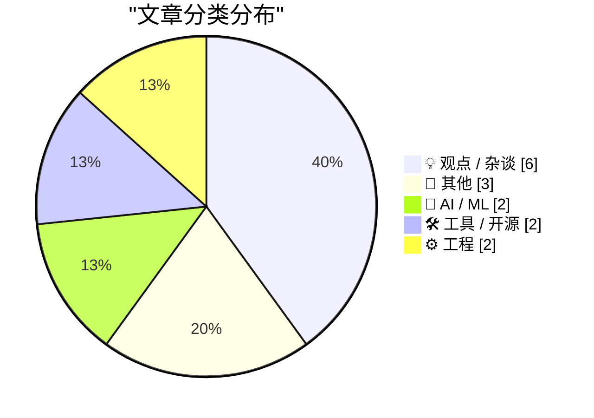
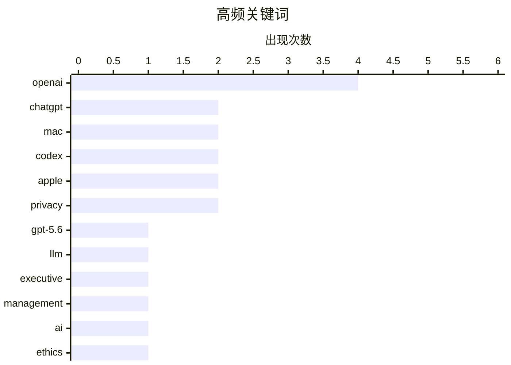

# 📰 AI 博客每日精选 — 2026-07-11

> 来自 Karpathy 推荐的 92 个顶级技术博客，AI 精选 Top 15

## 📝 今日看点

今日技术圈焦点集中在 OpenAI 生态的剧烈震荡，其不仅发布了包含多尺寸版本的 GPT-5.6 旗舰模型，还伴随着桌面端产品线重组与核心高管离职的阵痛。与此同时，底层硬件与工程架构引发热议，从基于树莓派的隔墙探测射频设备，到包管理系统映射团队组织架构的康威定律，展现了硬核技术的创新与反思。此外，科技巨头的商业伦理争议依然不断，苹果广告业务扩张引发的隐私信任危机与关于 AI 权利的哲学探讨，共同折射出技术狂飙背后的深层社会隐忧。

---

## 🏆 今日必读

🥇 **全新的 GPT-5.6 家族：Luna、Terra、Sol**

[The new GPT-5.6 family: Luna, Terra, Sol](https://simonwillison.net/2026/Jul/9/gpt-5-6/#atom-everything) — simonwillison.net · 22 小时前 · 🤖 AI / ML

> OpenAI 最新旗舰模型 GPT-5.6 已正式发布，包含 Luna、Terra 和 Sol 三个不同尺寸的版本。每百万输入/输出 token 的定价分别为 Luna 1/6 美元、Terra 2.5/15 美元、Sol 5/30 美元。作为对比，Claude Opus 系列定价为 5/25 美元，Claude Fable 5 为 10/50 美元。然而，由于不同模型间的推理 token 数量差异巨大，单纯比较每百万 token 的价格已无法准确反映实际使用成本。

💡 **为什么值得读**: 了解 OpenAI 最新 GPT-5.6 系列的定价策略与不同尺寸版本，有助于在复杂推理 token 时代重新评估大模型的实际使用成本。

🏷️ GPT-5.6, OpenAI, LLM

🥈 **OpenAI 搞砸 ChatGPT Mac 应用的一天**

[Today’s the Day OpenAI Fucked Up the ChatGPT Mac App](https://9to5mac.com/2026/07/09/openai-announcing-the-next-chapter-for-chatgpt-today-watch-here/) — daringfireball.net · 21 小时前 · 🛠 工具 / 开源

> OpenAI 对其桌面端应用进行了令人困惑的重组：原有的 ChatGPT 应用被更名为 ChatGPT Classic，而 Codex 则成为了全新的 ChatGPT 桌面应用。新的桌面版 ChatGPT 包含 ChatGPT Work 和 ChatGPT Codex 两种模式，两者共享插件。ChatGPT Codex 模式会向用户展示更多技术细节，而 ChatGPT Work 模式则将这些细节隐藏。

💡 **为什么值得读**: 如果你是 ChatGPT Mac 桌面端用户，这篇短文能帮你快速理清 OpenAI 混乱的应用更名与模式划分逻辑。

🏷️ OpenAI, ChatGPT, Mac, Codex

🥉 **毫无意外，OpenAI 的潜在篡位者 Fidji Simo 离职**

[Shocking No One, Fidji Simo, Would-Be Usurper, Is Out at OpenAI](https://www.wsj.com/tech/openai-top-executive-fidji-simo-to-step-down-c3daca47?st=NfBZTe) — daringfireball.net · 17 小时前 · 💡 观点 / 杂谈

> OpenAI 二号高管 Fidji Simo 在经历长期病假后宣布将辞去全职职务。她在给员工的内部信中表示，由于病情恶化且康复时间远超预期，她将转任公司的兼职顾问。与此同时，OpenAI 公司正突然将重心转向构建 AI 驱动的编程工具。

💡 **为什么值得读**: 了解 OpenAI 核心高管团队的变动以及公司战略向 AI 编程工具倾斜的最新内幕。

🏷️ OpenAI, executive, management

---

## 📊 数据概览

| 扫描源 | 抓取文章 | 时间范围 | 精选 |
|:---:|:---:|:---:|:---:|
| 81/92 | 2462 篇 → 16 篇 | 24h | **15 篇** |

### 分类分布



### 高频关键词



<details>
<summary>📈 纯文本关键词图（终端友好）</summary>

```
openai     │ ████████████████████ 4
chatgpt    │ ██████████░░░░░░░░░░ 2
mac        │ ██████████░░░░░░░░░░ 2
codex      │ ██████████░░░░░░░░░░ 2
apple      │ ██████████░░░░░░░░░░ 2
privacy    │ ██████████░░░░░░░░░░ 2
gpt-5.6    │ █████░░░░░░░░░░░░░░░ 1
llm        │ █████░░░░░░░░░░░░░░░ 1
executive  │ █████░░░░░░░░░░░░░░░ 1
management │ █████░░░░░░░░░░░░░░░ 1
```

</details>

### 🏷️ 话题标签

**openai**(4) · **chatgpt**(2) · **mac**(2) · codex(2) · apple(2) · privacy(2) · gpt-5.6(1) · llm(1) · executive(1) · management(1) · ai(1) · ethics(1) · rights(1) · quadrf(1) · drones(1) · wifi(1) · sdr(1) · advertising(1) · package management(1) · conway's law(1)

---

## 💡 观点 / 杂谈

### 1. 毫无意外，OpenAI 的潜在篡位者 Fidji Simo 离职

[Shocking No One, Fidji Simo, Would-Be Usurper, Is Out at OpenAI](https://www.wsj.com/tech/openai-top-executive-fidji-simo-to-step-down-c3daca47?st=NfBZTe) — **daringfireball.net** · 17 小时前 · ⭐ 24/30

> OpenAI 二号高管 Fidji Simo 在经历长期病假后宣布将辞去全职职务。她在给员工的内部信中表示，由于病情恶化且康复时间远超预期，她将转任公司的兼职顾问。与此同时，OpenAI 公司正突然将重心转向构建 AI 驱动的编程工具。

🏷️ OpenAI, executive, management

---

### 2. Pluralistic：“机器人的权利”与 AI 奴隶制幻想

[Pluralistic: "Rights for robots" and the AI slavery fantasy (10 Jul 2026)](https://pluralistic.net/2026/07/10/posthuman-as-in-no-humans/) — **pluralistic.net** · 8 小时前 · ⭐ 23/30

> 作者探讨了关于“赋予机器人权利”的讨论以及 AI 奴隶制幻想背后的深层逻辑。文章还涉及了娱乐产业面临的尴尬问题、ISP 与唱片公司的死刑之争、瑞士负收益率债券等多元话题。此外，作者还预告了即将在伦敦、爱丁堡、悉尼等地举行的公开活动。

🏷️ AI, ethics, rights

---

### 3. ★ John Ternus 应该扭转苹果在广告滑坡上的下滑趋势

[★ John Ternus Should Reverse Apple’s Slide Down the Advertising Slippery Slope](https://daringfireball.net/2026/07/ternus_apple_slippery_slope) — **daringfireball.net** · 22 小时前 · ⭐ 20/30

> 作者批评了苹果近年来在广告业务上的扩张，指出其在隐私保护方面的承诺正变得虚伪。文章回顾了 2014 年 Tim Cook 发表的隐私信，强调当时苹果不投放广告的事实赋予了该信件真正的分量。作者呼吁苹果高管 John Ternus 采取行动，扭转公司滑向广告深渊的趋势。

🏷️ Apple, privacy, advertising

---

### 4. 高级版：内存危机的“黑子”指南

[Premium: The Hater's Guide To The Memory Crisis](https://www.wheresyoured.at/premium-the-haters-guide-to-the-memory-crisis/) — **wheresyoured.at** · 11 分钟前 · ⭐ 20/30

> 作者预告将于 7 月 17 日休刊一周进行休息，这是自 2025 年 6 月创办该付费订阅以来仅有的第二次停更。文章主题为“内存危机的黑子指南”，旨在对当前的内存危机进行批判性探讨。

🏷️ memory, hardware, crisis

---

### 5. 引用 Nilay Patel 的话

[Quoting Nilay Patel](https://simonwillison.net/2026/Jul/10/nilay-patel/#atom-everything) — **simonwillison.net** · 57 分钟前 · ⭐ 16/30

> 增强现实（AR）眼镜的实现需要在眼睛旁放置一个持续记录并处理用户所见内容的摄像头。目前不存在既足够强大又足够省电的芯片能装在眼镜腿中实时完成这一处理。因此，必须将数据发送到云端进行处理，这揭示了当前AR眼镜技术面临的硬件瓶颈与云端依赖。

🏷️ AR, privacy, glasses

---

### 6. Gary Kildall 之死调查

[Gary Kildall’s death investigation](https://dfarq.homeip.net/gary-kildalls-death-investigation/?utm_source=rss&#038;utm_medium=rss&#038;utm_campaign=gary-kildalls-death-investigation) — **dfarq.homeip.net** · 7 小时前 · ⭐ 13/30

> Gary Kildall（操作系统先驱）之死调查及其似乎缺乏调查的状况，已经在科技界演变成了一个神话般的故事。正如他当年 allegedly 去飞行而没有与 IBM 会面的传说一样，Kildall 的生平和死亡总是容易引发人们的无限遐想与阴谋论。文章探讨了这些故事背后的真相与夸大成分。

🏷️ Gary Kildall, computer history, investigation

---

## 📝 其他

### 7. Adam Brown：爱因斯坦最快乐的思想——从零开始理解广义相对论

[Adam Brown – Einstein's happiest thought: General Relativity from scratch](https://www.dwarkesh.com/p/adam-brown-gr) — **dwarkesh.com** · 1 小时前 · ⭐ 15/30

> 物理学家 Adam Brown 深入探讨了爱因斯坦的广义相对论，从其基本原理出发进行推导。文章还解释了为什么黑洞可以被视为终极的发电厂。通过从零开始的推导，读者能够理解广义相对论的核心概念及其在极端天体物理现象中的应用。

🏷️ physics, general relativity, black holes

---

### 8. 苹果经典 Mac 时代对“应用作为平铺按钮”简化计算的探索：At Ease 和 Launcher

[Apple’s Classic Mac Era Forays Into ‘Apps as Tiled Buttons’ Simplified Computing: At Ease and Launcher](https://daringfireball.net/2026/07/whats_good_for_the_ios_goose_is_often_not_good_for_the_macos_gander) — **daringfireball.net** · 22 小时前 · ⭐ 13/30

> 苹果在 20 世纪 90 年代的 System 7 时代曾推出过名为 At Ease 的付费产品，随后在 Mac OS 8 中内置了名为 Launcher 的功能。这两者都采用了将应用作为统一方形平铺按钮的简化计算设计。回顾这段历史，可以看出苹果在简化用户界面方面的早期尝试，尽管这些功能在当时并未被广泛使用。

🏷️ Apple, Mac, history, UI

---

### 9. 游戏评测：《Lovers In A Dangerous Spacetime》★★★☆☆

[Game Review: Lovers In A Dangerous Spacetime ★★★☆☆](https://shkspr.mobi/blog/2026/07/game-review-lovers-in-a-dangerous-spacetime/) — **shkspr.mobi** · 6 小时前 · ⭐ 12/30

> 作者为了与妻子进行合作而非竞争的游戏体验，挑选了《Lovers In A Dangerous Spacetime》这款游戏。这是一款短小精悍的合作游戏，玩家需要在太空中协同操作飞船。作者给出了三星的评价，认为它刚好足够长，适合作为轻松的合作娱乐选择。

🏷️ game, review, co-op

---

## 🤖 AI / ML

### 10. 全新的 GPT-5.6 家族：Luna、Terra、Sol

[The new GPT-5.6 family: Luna, Terra, Sol](https://simonwillison.net/2026/Jul/9/gpt-5-6/#atom-everything) — **simonwillison.net** · 22 小时前 · ⭐ 26/30

> OpenAI 最新旗舰模型 GPT-5.6 已正式发布，包含 Luna、Terra 和 Sol 三个不同尺寸的版本。每百万输入/输出 token 的定价分别为 Luna 1/6 美元、Terra 2.5/15 美元、Sol 5/30 美元。作为对比，Claude Opus 系列定价为 5/25 美元，Claude Fable 5 为 10/50 美元。然而，由于不同模型间的推理 token 数量差异巨大，单纯比较每百万 token 的价格已无法准确反映实际使用成本。

🏷️ GPT-5.6, OpenAI, LLM

---

### 11. 引用 OpenAI

[Quoting OpenAI](https://simonwillison.net/2026/Jul/10/openai/#atom-everything) — **simonwillison.net** · 16 小时前 · ⭐ 21/30

> OpenAI 在其帮助文档中解释了 ChatGPT Work 和 Codex 在不同平台上的运行机制：网页端和移动端的 Work 在云端运行，而桌面端应用在获得许可后可使用本地文件和桌面应用。在发布初期，云端 Work 对话不会出现在桌面端 Work 中，且桌面端的 Work 线程和本地文件将保留在本地计算机上。

🏷️ OpenAI, ChatGPT, Codex

---

## 🛠 工具 / 开源

### 12. OpenAI 搞砸 ChatGPT Mac 应用的一天

[Today’s the Day OpenAI Fucked Up the ChatGPT Mac App](https://9to5mac.com/2026/07/09/openai-announcing-the-next-chapter-for-chatgpt-today-watch-here/) — **daringfireball.net** · 21 小时前 · ⭐ 25/30

> OpenAI 对其桌面端应用进行了令人困惑的重组：原有的 ChatGPT 应用被更名为 ChatGPT Classic，而 Codex 则成为了全新的 ChatGPT 桌面应用。新的桌面版 ChatGPT 包含 ChatGPT Work 和 ChatGPT Codex 两种模式，两者共享插件。ChatGPT Codex 模式会向用户展示更多技术细节，而 ChatGPT Work 模式则将这些细节隐藏。

🏷️ OpenAI, ChatGPT, Mac, Codex

---

### 13. QuadRF 能够发现无人机并隔墙探测 WiFi

[QuadRF can spot drones and see WiFi through my wall](https://www.jeffgeerling.com/blog/2026/quadrf-can-spot-drones-and-see-wifi-through-my-wall/) — **jeffgeerling.com** · 4 小时前 · ⭐ 22/30

> QuadRF 是一款基于树莓派 5 和 FPGA 板构建的相控阵无线电设备，具备皮秒级定时能力。它能够执行高级信号处理和波束成形操作，实现隔墙探测 WiFi 信号以及追踪无人机等高级功能。

🏷️ QuadRF, drones, WiFi, SDR

---

## ⚙️ 工程

### 14. 作为组织架构图的包管理

[Package Management as Org Chart](https://nesbitt.io/2026/07/10/package-management-as-org-chart.html) — **nesbitt.io** · 8 小时前 · ⭐ 20/30

> 文章将康威定律应用于依赖管理设计，探讨了软件包管理系统的架构如何反映开发团队的组织结构与沟通模式。作者认为，依赖管理的形态往往是团队组织架构的直接映射。

🏷️ package management, Conway's Law, dependencies, architecture

---

### 15. 本不该有代码生成影响却发生整数神秘变化的案例

[The case of the mysterious changes to integers when there shouldn’t have been any code generation effect](https://devblogs.microsoft.com/oldnewthing/20260710-00/?p=112514) — **devblogs.microsoft.com/oldnewthing** · 4 小时前 · ⭐ 18/30

> 微软《The Old New Thing》博客探讨了一个调试案例：在理论上不应产生代码生成影响的情况下，整数却发生了神秘变化。文章深入解码了这些异常整数的来源，揭示了底层编译器或代码生成过程中的隐藏机制。

🏷️ compiler, code generation, integers, debugging

---

*生成于 2026-07-11 02:02 (Asia/Shanghai) | 扫描 81 源 → 获取 2462 篇 → 精选 15 篇*
*基于 [Hacker News Popularity Contest 2025](https://refactoringenglish.com/tools/hn-popularity/) RSS 源列表，由 [Andrej Karpathy](https://x.com/karpathy) 推荐*
*由「懂点儿AI」制作，欢迎关注同名微信公众号获取更多 AI 实用技巧 💡*
