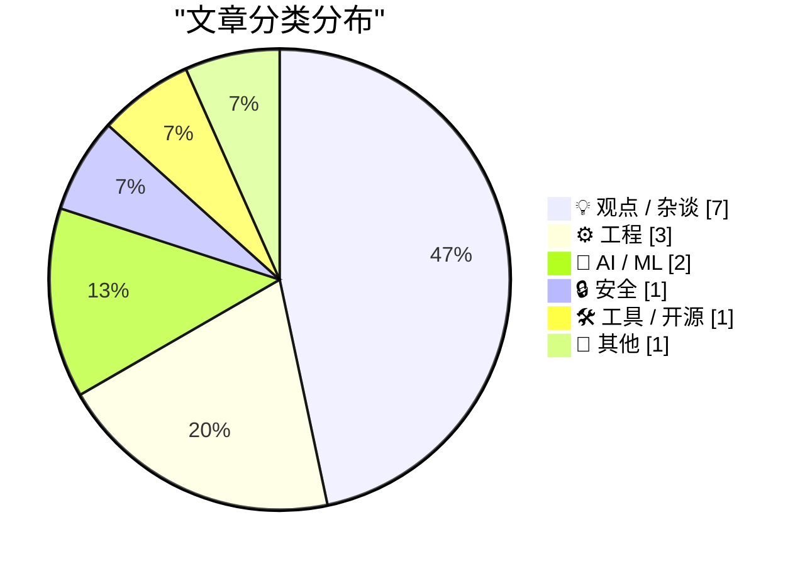
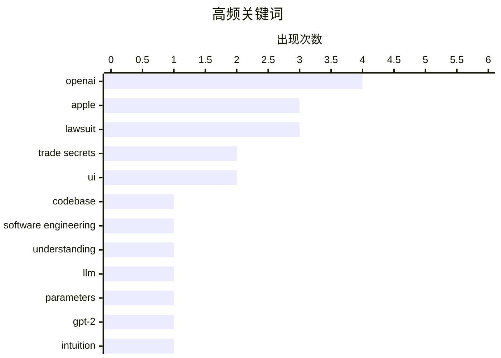

# 📰 AI 博客每日精选 — 2026-07-12

> 来自 Karpathy 推荐的 92 个顶级技术博客，AI 精选 Top 15

## 📝 今日看点

今天技术圈被科技巨头间的知识产权争夺战刷屏，苹果起诉OpenAI窃取商业机密凸显了AI赛道日益白热化的竞争与合规博弈。在工程实践方面，开发者们正重新审视基础认知与务实策略，从不完全理解代码库的辩护到SQLite STRICT表的应用，再到对LLM参数量的直觉拆解，展现出对底层逻辑的深度思考。此外，关于内存危机和Mac交互形态的讨论也引发了广泛关注，折射出行业对硬件瓶颈与产品体验的持续焦虑与探索。

---

## 🏆 今日必读

🥇 **Apple Sues OpenAI, io, and Former Employees, Alleging Theft of Trade Secrets**

[Apple Sues OpenAI, io, and Former Employees, Alleging Theft of Trade Secrets](https://9to5mac.com/2026/07/10/apple-sues-openai-trade-secret-theft/) — daringfireball.net · 20 小时前 · 🔒 安全

> Apple Sues OpenAI, io, and Former Employees, Alleging Theft of Trade Secrets

🏷️ Apple, OpenAI, trade secrets, lawsuit

🥈 **In defense of not understanding your codebase**

[In defense of not understanding your codebase](https://seangoedecke.com/in-defense-of-not-understanding-your-codebase/) — seangoedecke.com · 17 小时前 · ⚙️ 工程

> In defense of not understanding your codebase

🏷️ codebase, software engineering, understanding

🥉 **Building intuition about LLM parameter counts**

[Building intuition about LLM parameter counts](https://www.gilesthomas.com/2026/07/llm-parameter-counts) — gilesthomas.com · 19 小时前 · 🤖 AI / ML

> Building intuition about LLM parameter counts

🏷️ LLM, parameters, GPT-2, intuition

---

## 📊 数据概览

| 扫描源 | 抓取文章 | 时间范围 | 精选 |
|:---:|:---:|:---:|:---:|
| 83/92 | 2488 篇 → 17 篇 | 24h | **15 篇** |

### 分类分布



### 高频关键词



<details>
<summary>📈 纯文本关键词图（终端友好）</summary>

```
openai               │ ████████████████████ 4
apple                │ ███████████████░░░░░ 3
lawsuit              │ ███████████████░░░░░ 3
trade secrets        │ ██████████░░░░░░░░░░ 2
ui                   │ ██████████░░░░░░░░░░ 2
codebase             │ █████░░░░░░░░░░░░░░░ 1
software engineering │ █████░░░░░░░░░░░░░░░ 1
understanding        │ █████░░░░░░░░░░░░░░░ 1
llm                  │ █████░░░░░░░░░░░░░░░ 1
parameters           │ █████░░░░░░░░░░░░░░░ 1
```

</details>

### 🏷️ 话题标签

**openai**(4) · **apple**(3) · **lawsuit**(3) · trade secrets(2) · ui(2) · codebase(1) · software engineering(1) · understanding(1) · llm(1) · parameters(1) · gpt-2(1) · intuition(1) · partnership(1) · sqlite(1) · strict tables(1) · database(1) · package management(1) · releases(1) · advisories(1) · macos(1)

---

## 💡 观点 / 杂谈

### 1. ‘No Interest’

[‘No Interest’](https://x.com/drewpusateri/status/2075708238650089981) — **daringfireball.net** · 13 小时前 · ⭐ 20/30

> ‘No Interest’

🏷️ OpenAI, trade secrets, lawsuit

---

### 2. Ice Cold

[Ice Cold](https://www.threads.com/@alexheath/post/DaoI2jaEioX) — **daringfireball.net** · 14 小时前 · ⭐ 20/30

> Ice Cold

🏷️ Apple, OpenAI, partnership

---

### 3. Squircle Jail Isn’t (Or at Least Shouldn’t Be) About Upcoming Touchscreen Macs

[Squircle Jail Isn’t (Or at Least Shouldn’t Be) About Upcoming Touchscreen Macs](https://daringfireball.net/2026/07/whats_good_for_the_ios_goose_is_often_not_good_for_the_macos_gander) — **daringfireball.net** · 15 小时前 · ⭐ 18/30

> Squircle Jail Isn’t (Or at Least Shouldn’t Be) About Upcoming Touchscreen Macs

🏷️ macOS, UI, touchscreen

---

### 4. Premium: The Hater's Guide To The Memory Crisis

[Premium: The Hater's Guide To The Memory Crisis](https://www.wheresyoured.at/premium-the-haters-guide-to-the-memory-crisis/) — **wheresyoured.at** · 23 小时前 · ⭐ 18/30

> Premium: The Hater's Guide To The Memory Crisis

🏷️ memory crisis, hardware, opinion

---

### 5. 多元化：职场的“灵活性”并非如此（2026年7月11日）

[Pluralistic: Workplace "flexibility" isn't (11 Jul 2026)](https://pluralistic.net/2026/07/11/your-risk/) — **pluralistic.net** · 8 小时前 · ⭐ 17/30

> 零工经济所标榜的职场“灵活性”本质上只是将风险从雇主转移给劳动者。这种模式剥夺了传统雇佣关系中的保障，让员工独自承担经济波动和运营成本。作者认为，真正的灵活性应当赋予劳动者更多自主权，而非单纯的风险下放。文章还附带了一些近期阅读推荐和作者的活动安排。

🏷️ gig economy, workplace, flexibility

---

### 6. 约翰·特努斯致电山姆·奥特曼

[John Ternus Calls Sam Altman](https://www.youtube.com/watch?v=ClASuxd8jQY) — **daringfireball.net** · 13 小时前 · ⭐ 16/30

> 这是一段模仿电影《低俗小说》经典桥段的幽默对话脚本。对话中，约翰·特努斯致电山姆·奥特曼，询问派去送包裹的人为何没有回音。奥特曼最终表示“忘了钱的事吧”。这段虚构的互动以戏谑的方式调侃了科技界两位知名高管之间的关系。

🏷️ Apple, OpenAI, lawsuit

---

### 7. 关于数字自主权的积极信号

[Goede geluiden over digitale autonomie](https://berthub.eu/articles/posts/goede-geluiden-over-digitale-autonomie/) — **berthub.eu** · 7 小时前 · ⭐ 15/30

> 荷兰政府近期在数字主权议题上释放出明显的积极转向信号。在经历了长达十年的否认之后，各级政府机构开始密集发布强调数字自主权重要性的政策文件。这些文件不仅充满积极的愿景，还提出了具体的良好意图。这表明荷兰在数字政策层面正在经历一次深刻的战略调整。

🏷️ digital autonomy, government, policy

---

## ⚙️ 工程

### 8. In defense of not understanding your codebase

[In defense of not understanding your codebase](https://seangoedecke.com/in-defense-of-not-understanding-your-codebase/) — **seangoedecke.com** · 17 小时前 · ⭐ 22/30

> In defense of not understanding your codebase

🏷️ codebase, software engineering, understanding

---

### 9. Prefer STRICT tables in SQLite

[Prefer STRICT tables in SQLite](https://evanhahn.com/prefer-strict-tables-in-sqlite/) — **evanhahn.com** · 17 小时前 · ⭐ 20/30

> Prefer STRICT tables in SQLite

🏷️ SQLite, STRICT tables, database

---

### 10. Dot product: Component vs. Geometric definition

[Dot product: Component vs. Geometric definition](https://eli.thegreenplace.net/2026/dot-product-component-vs-geometric-definition/) — **eli.thegreenplace.net** · 15 小时前 · ⭐ 18/30

> Dot product: Component vs. Geometric definition

🏷️ dot product, vectors, mathematics

---

## 🤖 AI / ML

### 11. Building intuition about LLM parameter counts

[Building intuition about LLM parameter counts](https://www.gilesthomas.com/2026/07/llm-parameter-counts) — **gilesthomas.com** · 19 小时前 · ⭐ 22/30

> Building intuition about LLM parameter counts

🏷️ LLM, parameters, GPT-2, intuition

---

### 12. 棕榈滩新更名的特朗普机场使用了AI生成的劣质Logo

[Newly Renamed Trump Airport in Palm Beach Has an AI Slop Logo](https://futurism.com/artificial-intelligence/trump-airport-logo-ai) — **daringfireball.net** · 14 小时前 · ⭐ 15/30

> 棕榈滩新更名的特朗普机场发布的新Logo被指存在明显的AI生成缺陷。仔细观察细节可以发现，Logo中的鹰爪严重变形且形状不一，腿部呈现为奇怪的团块，整体缺乏对称性。此外，翅膀上的羽毛数量不均，橄榄枝等元素也存在明显的错误。这反映了当前AI生成图像在精细度上依然存在难以克服的硬伤。

🏷️ AI, logo, generative AI

---

## 🔒 安全

### 13. Apple Sues OpenAI, io, and Former Employees, Alleging Theft of Trade Secrets

[Apple Sues OpenAI, io, and Former Employees, Alleging Theft of Trade Secrets](https://9to5mac.com/2026/07/10/apple-sues-openai-trade-secret-theft/) — **daringfireball.net** · 20 小时前 · ⭐ 25/30

> Apple Sues OpenAI, io, and Former Employees, Alleging Theft of Trade Secrets

🏷️ Apple, OpenAI, trade secrets, lawsuit

---

## 🛠 工具 / 开源

### 14. This Week in Package Management: 11 July 2026

[This Week in Package Management: 11 July 2026](https://nesbitt.io/2026/07/11/this-week-in-package-management.html) — **nesbitt.io** · 7 小时前 · ⭐ 19/30

> This Week in Package Management: 11 July 2026

🏷️ package management, releases, advisories

---

## 📝 其他

### 15. Mac OS 9 的 Finder 曾拥有“以按钮形式查看”模式

[Mac OS 9’s Finder Had a ‘View as Buttons’ Mode](https://www.cryan.com/blog/20240502.jsp) — **daringfireball.net** · 15 小时前 · ⭐ 13/30

> Mac OS 9 的 Finder 曾包含一个独特的“以按钮形式查看”选项，允许用户将文件和应用程序显示为平铺的可点击按钮。这种视图模式特别适合快速访问常用的程序和文档。然而，尽管在 Mac OS 9 时代使用了多年，许多用户（包括作者）却完全忘记了它的存在，因为从未实际启用过。它不仅仅是改变了背景，而是彻底改变了交互方式。

🏷️ Mac OS 9, Finder, UI

---

*生成于 2026-07-12 01:15 (Asia/Shanghai) | 扫描 83 源 → 获取 2488 篇 → 精选 15 篇*
*基于 [Hacker News Popularity Contest 2025](https://refactoringenglish.com/tools/hn-popularity/) RSS 源列表，由 [Andrej Karpathy](https://x.com/karpathy) 推荐*
*由「懂点儿AI」制作，欢迎关注同名微信公众号获取更多 AI 实用技巧 💡*
