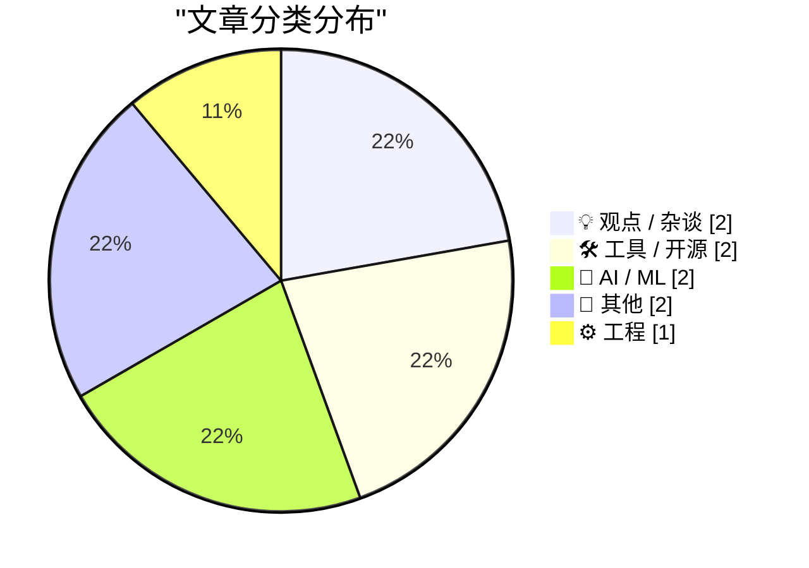
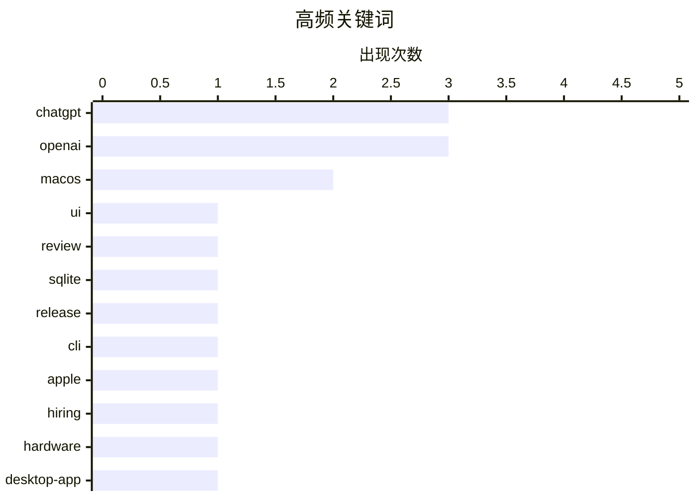

# 📰 AI 博客每日精选 — 2026-07-13

> 来自 Karpathy 推荐的 92 个顶级技术博客，AI 精选 Top 9

## 📝 今日看点

今日技术圈焦点集中在 OpenAI 的产品迭代与巨头博弈上，新版 ChatGPT 超级应用因界面混乱引发用户体验争议，促使官方紧急澄清功能边界与升级机制。同时，OpenAI 与苹果之间的人才争夺战愈演愈烈，苹果对前者激进挖角其硬件与设计高管的行为表达了强烈不满。在开发者生态与复古计算领域，sqlite-utils 迎来小版本更新，而原生支持现代 macOS 的 HyperCard 播放器则唤起了技术圈的怀旧情怀。此外，素数猜想的数学进展与科技记者的纪念文章，也为硬核技术之外增添了人文与科学的多元色彩。

---

## 🏆 今日必读

🥇 **Benedict Evans 评全新 ChatGPT“超级应用”**

[Benedict Evans on the New ‘Super App’ ChatGPT](https://www.threads.com/@benedictevans/post/Dano_uvDr8F) — daringfireball.net · 18 小时前 · 💡 观点 / 杂谈

> 新版 ChatGPT“超级应用”的用户体验遭到知名分析师 Benedict Evans 的严厉批评。他指出该应用界面混乱，项目、任务和聊天之间的界限模糊不清。此外，聊天窗口采用糟糕的浮动设计，而插件选项却显示为模板，且强制要求绑定 Slack 或 Google Drive 才能完成设置。这反映了在主导型公司中，产品功能堆砌往往导致交互逻辑的割裂。

💡 **为什么值得读**: 了解行业顶尖分析师对 OpenAI 新版 ChatGPT 应用设计缺陷的直击痛点的批评。

🏷️ chatgpt, openai, ui, review

🥈 **sqlite-utils 4.1 发布**

[sqlite-utils 4.1](https://simonwillison.net/2026/Jul/11/sqlite-utils/#atom-everything) — simonwillison.net · 17 小时前 · 🛠 工具 / 开源

> sqlite-utils 发布了 4.0 版本后的首个小版本更新 4.1，引入了多项次要新功能。其中，`sqlite-utils insert` 和 `sqlite-utils upsert` 命令现在支持 `--code` 选项，允许在插入或更新数据时执行 Python 代码进行转换。该版本进一步完善了命令行工具的数据处理能力，为开发者提供了更灵活的数据库操作方式。

💡 **为什么值得读**: 快速了解 sqlite-utils 4.1 版本中新增的 `--code` 选项等实用功能。

🏷️ sqlite, release, cli

🥉 **Gurman 谈 Tang Tan 与 Paul Meade 的人才争夺战**

[Gurman on Tang Tan and Paul Meade](https://www.bloomberg.com/news/articles/2026-07-11/openai-engineer-s-lol-moment-set-stage-for-legal-fight-with-apple) — daringfireball.net · 23 小时前 · 💡 观点 / 杂谈

> 彭博社记者 Mark Gurman 报道了苹果对 OpenAI 激进挖角行为的警惕与不满。OpenAI 近期持续挖走苹果的硬件和设计高管，甚至在今年 6 月挖走了苹果智能眼镜项目负责人 Paul Meade。苹果对此反应强烈，直接让 Meade 离职且未提供过渡期。这标志着两家科技巨头在硬件人才争夺上的冲突正在升级。

💡 **为什么值得读**: 洞察 OpenAI 与苹果之间围绕硬件核心人才日益激烈的争夺内幕。

🏷️ apple, openai, hiring, hardware

---

## 📊 数据概览

| 扫描源 | 抓取文章 | 时间范围 | 精选 |
|:---:|:---:|:---:|:---:|
| 82/92 | 2490 篇 → 9 篇 | 24h | **9 篇** |

### 分类分布



### 高频关键词



<details>
<summary>📈 纯文本关键词图（终端友好）</summary>

```
chatgpt │ ████████████████████ 3
openai  │ ████████████████████ 3
macos   │ █████████████░░░░░░░ 2
ui      │ ███████░░░░░░░░░░░░░ 1
review  │ ███████░░░░░░░░░░░░░ 1
sqlite  │ ███████░░░░░░░░░░░░░ 1
release │ ███████░░░░░░░░░░░░░ 1
cli     │ ███████░░░░░░░░░░░░░ 1
apple   │ ███████░░░░░░░░░░░░░ 1
hiring  │ ███████░░░░░░░░░░░░░ 1
```

</details>

### 🏷️ 话题标签

**chatgpt**(3) · **openai**(3) · **macos**(2) · ui(1) · review(1) · sqlite(1) · release(1) · cli(1) · apple(1) · hiring(1) · hardware(1) · desktop-app(1) · app(1) · hypercard(1) · retro(1) · math(1) · prime-numbers(1) · conjecture(1) · tribute(1) · blogging(1)

---

## 💡 观点 / 杂谈

### 1. Benedict Evans 评全新 ChatGPT“超级应用”

[Benedict Evans on the New ‘Super App’ ChatGPT](https://www.threads.com/@benedictevans/post/Dano_uvDr8F) — **daringfireball.net** · 18 小时前 · ⭐ 22/30

> 新版 ChatGPT“超级应用”的用户体验遭到知名分析师 Benedict Evans 的严厉批评。他指出该应用界面混乱，项目、任务和聊天之间的界限模糊不清。此外，聊天窗口采用糟糕的浮动设计，而插件选项却显示为模板，且强制要求绑定 Slack 或 Google Drive 才能完成设置。这反映了在主导型公司中，产品功能堆砌往往导致交互逻辑的割裂。

🏷️ chatgpt, openai, ui, review

---

### 2. Gurman 谈 Tang Tan 与 Paul Meade 的人才争夺战

[Gurman on Tang Tan and Paul Meade](https://www.bloomberg.com/news/articles/2026-07-11/openai-engineer-s-lol-moment-set-stage-for-legal-fight-with-apple) — **daringfireball.net** · 23 小时前 · ⭐ 21/30

> 彭博社记者 Mark Gurman 报道了苹果对 OpenAI 激进挖角行为的警惕与不满。OpenAI 近期持续挖走苹果的硬件和设计高管，甚至在今年 6 月挖走了苹果智能眼镜项目负责人 Paul Meade。苹果对此反应强烈，直接让 Meade 离职且未提供过渡期。这标志着两家科技巨头在硬件人才争夺上的冲突正在升级。

🏷️ apple, openai, hiring, hardware

---

## 🛠 工具 / 开源

### 3. sqlite-utils 4.1 发布

[sqlite-utils 4.1](https://simonwillison.net/2026/Jul/11/sqlite-utils/#atom-everything) — **simonwillison.net** · 17 小时前 · ⭐ 21/30

> sqlite-utils 发布了 4.0 版本后的首个小版本更新 4.1，引入了多项次要新功能。其中，`sqlite-utils insert` 和 `sqlite-utils upsert` 命令现在支持 `--code` 选项，允许在插入或更新数据时执行 Python 代码进行转换。该版本进一步完善了命令行工具的数据处理能力，为开发者提供了更灵活的数据库操作方式。

🏷️ sqlite, release, cli

---

### 4. Stacks — 现代 MacOS 上的 HyperCard 播放器

[Stacks — HyperCard Player for Modern MacOS](https://morphing.cloud/hypercard/) — **daringfireball.net** · 1 小时前 · ⭐ 14/30

> Stacks 是一款专为现代 macOS 打造的原生应用，允许用户无需模拟器即可直接运行经典的 HyperCard 堆栈。该应用支持一键浏览并运行互联网档案馆中的 HyperCard 收藏，完美还原了那个时代的排版、音效和 MacinTalk 语音合成功能。它不仅具备跨堆栈导航能力，还在视觉和体验上精准复刻了 1987 年的 Mac 风格，同时保持了现代 Mac 应用的精致感。

🏷️ macos, hypercard, retro

---

## 🤖 AI / ML

### 5. OpenAI 帮助中心解释新版 ChatGPT 的问题

[OpenAI Help Center Describes What Is Wrong With the New ChatGPT](https://help.openai.com/en/articles/20001275-chatgpt-work-and-codex) — **daringfireball.net** · 18 小时前 · ⭐ 18/30

> OpenAI 帮助中心发文澄清了新版 ChatGPT 中 Work 和 Codex 功能的可用范围与运行机制。Work 功能面向符合条件的付费用户，支持在网页端、移动端和桌面应用中使用。网页和移动端的 Work 在云端运行，而桌面端 Work 可以在授权后访问本地文件和应用，但云端与桌面端的对话数据目前并不互通。Codex 功能也在此文中明确了其使用场景。

🏷️ chatgpt, openai, desktop-app

---

### 6. 谁能解释一下如何获取“ChatGPT Classic”？

[Can Someone Explain to Me How to Get ‘ChatGPT Classic’?](https://help.openai.com/en/articles/20001276-moving-to-the-new-chatgpt-desktop-app) — **daringfireball.net** · 18 小时前 · ⭐ 16/30

> OpenAI 帮助中心说明了从旧版 Mac 应用升级到全新“超级应用”版本的具体步骤。用户下载新应用并登录同一账号后，新版应用可能会与旧版并存安装。新版 ChatGPT 集成了 Chat、Work 和 Codex 功能，而旧版则被重命名为“ChatGPT Classic”。用户无需强制迁移，可继续使用旧版应用。

🏷️ chatgpt, macos, app

---

## 📝 其他

### 7. 宛如 Om Malik 本人

[★ Exactly Like Om Malik](https://daringfireball.net/2026/07/exactly_like_om_malik) — **daringfireball.net** · 21 小时前 · ⭐ 11/30

> 本文是一篇针对知名科技记者 Om Malik 的纪念文章合集，汇集了各界对他的追忆、致敬与相关故事。文章通过多视角的回忆，展现了 Om Malik 在科技新闻界的深远影响及其个人魅力。这些文字不仅是对他职业生涯的总结，也反映了他在同行和读者心中留下的独特印记。

🏷️ tribute, blogging

---

### 8. 又一次疯狂的欧洲火车之旅——7 周跨越 13 国、行驶 6379 公里

[Another Ridiculous Interrail Holiday - 6,379Km and 13 Countries over 7 weeks](https://shkspr.mobi/blog/2026/07/another-ridiculous-interrail-holiday-6379km-and-13-countries-over-7-weeks/) — **shkspr.mobi** · 5 小时前 · ⭐ 10/30

> 作者分享了与妻子利用欧洲 Interrail 通票进行的第二次长途火车旅行经历。相比去年 30 天游历 10 国的紧凑行程，今年他们选择了“2 个月内 15 个旅行日”的套票，并提前购买了头等舱。整个旅程历时 7 周，跨越 13 个国家，总里程达 6379 公里，期间还包含了两次轮渡体验。这为计划欧洲跨国火车游的旅行者提供了极具参考价值的行程规划与实操经验。

🏷️ travel, interrail

---

## ⚙️ 工程

### 9. Gilbreath 猜想的进展

[Progress on Gilbreath’s conjecture](https://www.johndcook.com/blog/2026/07/11/progress-on-gilbreaths-conjecture/) — **johndcook.com** · 19 小时前 · ⭐ 13/30

> Gilbreath 猜想是一个关于素数的简单却奇特的数学猜想，普通人也能理解其基本逻辑。著名数学家保罗·埃尔德什曾推测该猜想是正确的，但至今仍未得到严格证明。文章回顾了该猜想的历史背景，并探讨了近期在相关领域取得的研究进展。这展示了即使是看似简单的数论问题，也可能蕴含着极深的数学难度。

🏷️ math, prime-numbers, conjecture

---

*生成于 2026-07-13 01:12 (Asia/Shanghai) | 扫描 82 源 → 获取 2490 篇 → 精选 9 篇*
*基于 [Hacker News Popularity Contest 2025](https://refactoringenglish.com/tools/hn-popularity/) RSS 源列表，由 [Andrej Karpathy](https://x.com/karpathy) 推荐*
*由「懂点儿AI」制作，欢迎关注同名微信公众号获取更多 AI 实用技巧 💡*
