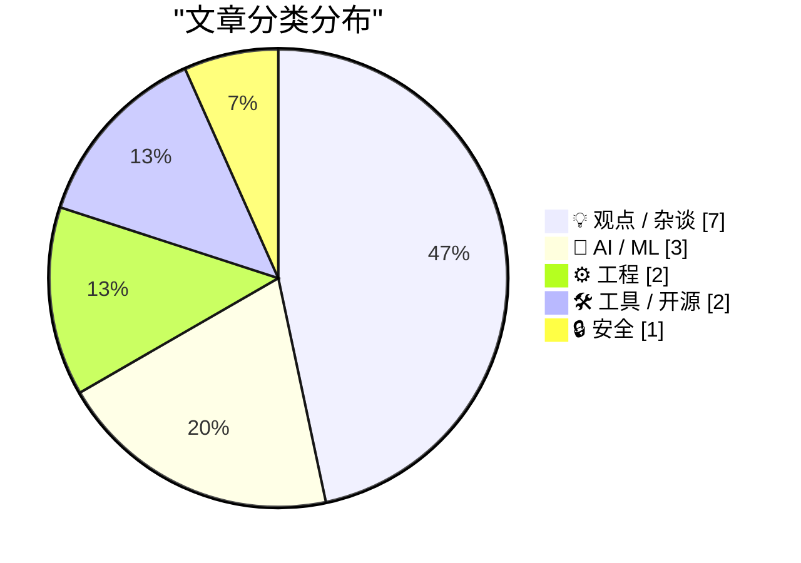
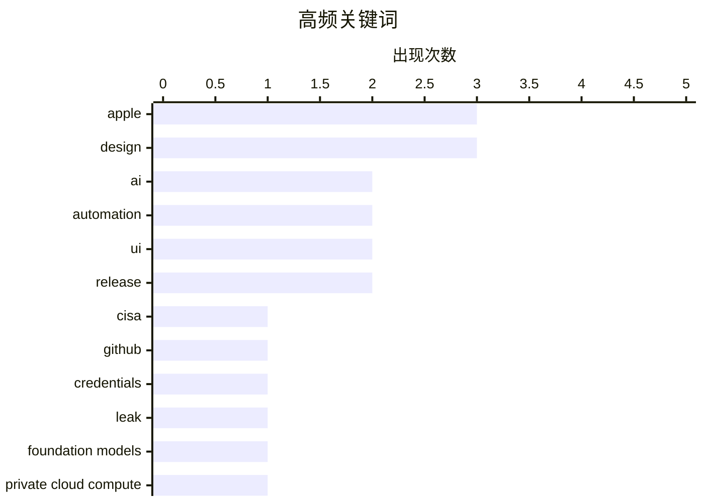

# 📰 AI 博客每日精选 — 2026-07-14

> 来自 Karpathy 推荐的 92 个顶级技术博客，AI 精选 Top 15

## 📝 今日看点

今日技术圈焦点集中在AI技术的深度渗透与商业模式反思上，业界不仅关注操作系统级AI集成与模型迭代，更开始深入探讨AI时代的编程哲学及科技巨头的竞争逻辑。同时，从CISA凭证泄露事件到系统堆栈保护页的探讨，凸显了安全团队在底层架构中平衡安全与性能的持续挑战。此外，苹果生态的开发演进与UI设计哲学引发热议，开发者对SwiftUI更新及“每一帧完美”的界面呈现提出了更高要求。

---

## 🏆 今日必读

🥇 **从CISA最近的GitHub泄露事件中汲取的教训**

[Lessons Learned from CISA’s Recent GitHub Leak](https://krebsonsecurity.com/2026/07/lessons-learned-from-cisas-recent-github-leak/) — krebsonsecurity.com · 3 小时前 · 🔒 安全

> CISA针对承包商在公共GitHub仓库中泄露数十个内部凭证（包括AWS Govcloud密钥）长达六个月的事件发布了事后分析报告。专家指出，该机构在初步响应中暴露出的漏洞为所有安全团队提供了重要教训。该事件凸显了第三方承包商管理和凭证监控的薄弱环节。

💡 **为什么值得读**: 通过真实的政府机构安全事件复盘，为安全团队提供了关于第三方风险和凭证管理的实战教训。

🏷️ CISA, GitHub, credentials, leak

🥈 **TwoMillionKit：在MacOS 27基础模型中无需授权即可使用私有云计算**

[TwoMillionKit: Use Private Cloud Compute in MacOS 27 Foundation Models Without an Entitlement](https://github.com/insidegui/TwoMillionKit) — daringfireball.net · 1 天前 · 🤖 AI / ML

> macOS 27 附带了 `fm` 命令行工具，允许在终端或脚本中运行本地系统模型或私有云计算推理。作者利用 GPT 5.6 Sol 创建了一个 Swift 包，它提供了一个基于 `fm` 命令行工具的 LanguageModel 实现。这使得任何 Mac 应用都能在无需授权的情况下调用私有云计算。

💡 **为什么值得读**: 提供了一种巧妙绕过授权限制的方法，让开发者能在Mac应用中直接调用苹果的私有云计算能力。

🏷️ Apple, Foundation Models, Private Cloud Compute

🥉 **控制思想，而不是代码**

[Control the ideas, not the code](http://antirez.com/news/169) — antirez.com · 6 小时前 · 💡 观点 / 杂谈

> 作者回顾了自己关于AI编程的博客历史，提到自己重新加入了Redis，并正在开发一款受欢迎的本地LLM推理开源软件。他探讨了为何在AI时代依然坚持编程，强调在编程过程中控制核心思想和逻辑比单纯编写代码更为重要。

💡 **为什么值得读**: 资深程序员对AI时代编程本质的深刻反思，探讨了人类开发者在AI辅助下的核心价值所在。

🏷️ AI, programming, automation

---

## 📊 数据概览

| 扫描源 | 抓取文章 | 时间范围 | 精选 |
|:---:|:---:|:---:|:---:|
| 83/92 | 2501 篇 → 19 篇 | 24h | **15 篇** |

### 分类分布



### 高频关键词



<details>
<summary>📈 纯文本关键词图（终端友好）</summary>

```
apple       │ ████████████████████ 3
design      │ ████████████████████ 3
ai          │ █████████████░░░░░░░ 2
automation  │ █████████████░░░░░░░ 2
ui          │ █████████████░░░░░░░ 2
release     │ █████████████░░░░░░░ 2
cisa        │ ███████░░░░░░░░░░░░░ 1
github      │ ███████░░░░░░░░░░░░░ 1
credentials │ ███████░░░░░░░░░░░░░ 1
leak        │ ███████░░░░░░░░░░░░░ 1
```

</details>

### 🏷️ 话题标签

**apple**(3) · **design**(3) · **ai**(2) · automation(2) · ui(2) · release(2) · cisa(1) · github(1) · credentials(1) · leak(1) · foundation models(1) · private cloud compute(1) · programming(1) · business(1) · competition(1) · anthropic(1) · claude(1) · llm(1) · musk(1) · openai(1)

---

## 💡 观点 / 杂谈

### 1. 控制思想，而不是代码

[Control the ideas, not the code](http://antirez.com/news/169) — **antirez.com** · 6 小时前 · ⭐ 23/30

> 作者回顾了自己关于AI编程的博客历史，提到自己重新加入了Redis，并正在开发一款受欢迎的本地LLM推理开源软件。他探讨了为何在AI时代依然坚持编程，强调在编程过程中控制核心思想和逻辑比单纯编写代码更为重要。

🏷️ AI, programming, automation

---

### 2. Pluralistic：为什么AI公司不直接与他们的客户竞争？

[Pluralistic: Why aren't AI companies competing directly with their customers? (13 Jul 2026)](https://pluralistic.net/2026/07/13/go-meta-meta/) — **pluralistic.net** · 9 小时前 · ⭐ 23/30

> 文章探讨了为什么AI公司选择出售“镐和铲子”而不是直接与客户竞争去“挖金子”。作者质疑了AI公司的商业模式，提出如果AI技术真的具有颠覆性，为什么这些公司不直接利用它来取代下游客户的市场份额。

🏷️ AI, business, competition

---

### 3. 还记得马斯克指控苹果与OpenAI共谋的诉讼吗？

[Remember Musk’s Suit Alleging a Conspiracy Between Apple and OpenAI?](https://arstechnica.com/tech-policy/2025/08/elon-musk-sues-apple-openai-to-block-exclusive-iphone-chatgpt-integration/) — **daringfireball.net** · 2 小时前 · ⭐ 18/30

> 回顾了马斯克在2025年8月起诉苹果和OpenAI以阻止iPhone独家集成ChatGPT的事件。马斯克声称苹果偏袒合作伙伴OpenAI，因为ChatGPT一直位居苹果“必备”应用榜首，而Grok从未上榜。诉讼表明马斯克不仅是为了推广Grok，更是试图打破这种独家合作。

🏷️ Musk, Apple, OpenAI, lawsuit

---

### 4. “每一帧都完美”

[‘Every Frame Perfect’](https://tonsky.me/blog/every-frame-perfect/) — **daringfireball.net** · 22 小时前 · ⭐ 18/30

> 文章提出了一个经验法则：如果在任何时刻截取应用的屏幕截图，开发者都应该能够解释屏幕上显示的内容。关注每一帧的完美可以建立用户信任，因为用户无法看到代码，UI是他们判断应用质量的唯一标准。如果UI看起来精致，说明开发者有足够的时间打磨代码。

🏷️ UI, quality, design

---

### 5. 2026年的图标是什么？

[What’s an Icon in 2026?](https://blog.jim-nielsen.com/2026/icons-as-software/) — **blog.jim-nielsen.com** · 23 小时前 · ⭐ 18/30

> 随着苹果平台上的图标不断变化，作者从长期用户和数字/物理图标收藏家的双重角度分享了自己的看法。文章试图阐述对苹果推荐图标设计的思考，探讨了图标在软件生态中不断演变的定义和意义。

🏷️ icons, Apple, design

---

### 6. 直接负责人 (DRI)

[Directly Responsible Individuals (DRI)](https://simonwillison.net/2026/Jul/12/directly-responsible-individuals/#atom-everything) — **simonwillison.net** · 18 小时前 · ⭐ 17/30

> “直接负责人”（DRI）一词起源于苹果公司，用于描述对特定项目或活动的成败负有最终责任的人。GitLab手册中提供了该术语的最佳定义。作者正在思考这一概念在项目管理中的应用。

🏷️ DRI, management, GitLab

---

### 7. UI 如何随时间退化

[How UIs Degrade Over Time](https://grumpy.website/1723) — **daringfireball.net** · 22 小时前 · ⭐ 17/30

> 现代操作系统（如 Windows 和 macOS）的系统 UI 正在经历清晰度的退化。过去系统 UI 在清晰度上不断进步，但如今却普遍出现退步现象，这种趋势令人费解。

🏷️ UI, design, degradation

---

## 🤖 AI / ML

### 8. TwoMillionKit：在MacOS 27基础模型中无需授权即可使用私有云计算

[TwoMillionKit: Use Private Cloud Compute in MacOS 27 Foundation Models Without an Entitlement](https://github.com/insidegui/TwoMillionKit) — **daringfireball.net** · 1 天前 · ⭐ 24/30

> macOS 27 附带了 `fm` 命令行工具，允许在终端或脚本中运行本地系统模型或私有云计算推理。作者利用 GPT 5.6 Sol 创建了一个 Swift 包，它提供了一个基于 `fm` 命令行工具的 LanguageModel 实现。这使得任何 Mac 应用都能在无需授权的情况下调用私有云计算。

🏷️ Apple, Foundation Models, Private Cloud Compute

---

### 9. Fable 再次获得延期

[Fable gets another bump](https://simonwillison.net/2026/Jul/12/bump/#atom-everything) — **simonwillison.net** · 20 小时前 · ⭐ 22/30

> 由于 GPT-5.6 Sol 显然属于 Fable/Mythos 类模型，Anthropic 再次延长了 Fable 在 Claude Max 计划中的可用日期。所有付费计划的用户可以继续访问 Claude Fable 5，同时 Claude Code 的每周速率限制提高了 50%，该政策持续到 7 月 19 日。

🏷️ Anthropic, Claude, LLM

---

### 10. 后验方差

[Posterior variance](https://www.johndcook.com/blog/2026/07/12/posterior-variance/) — **johndcook.com** · 22 小时前 · ⭐ 17/30

> 额外数据并不总是能减少后验方差。通过对三个贝叶斯模型的后验均值和方差进行分析，揭示了后验均值是先验均值和数据均值的加权平均，但后验方差的减少并非绝对，取决于具体模型和数据情况。

🏷️ Bayesian, posterior variance, statistics

---

## ⚙️ 工程

### 11. Paulo Andrade：“关于使用SwiftUI构建Mac-Assed应用的WWDC 27更新”

[Paulo Andrade: ‘A WWDC 27 Update on Building a Mac-Assed App With SwiftUI’](https://pfandrade.me/blog/swiftui-mac-assed-wwdc27-update/) — **daringfireball.net** · 20 小时前 · ⭐ 18/30

> 作者更新了关于使用 SwiftUI 构建 Mac-assed 应用的文章。由于该文章在Mastodon和Daring Fireball等平台上受到广泛关注，苹果工程师主动联系了作者并提供了一些反馈。作者随后提交了相关反馈并进行了更新。

🏷️ SwiftUI, macOS, WWDC

---

### 12. 为什么我们不把整个堆栈都做成保护页？

[Why don’t we just make the entire stack out of guard pages?](https://devblogs.microsoft.com/oldnewthing/20260713-00/?p=112528) — **devblogs.microsoft.com/oldnewthing** · 4 小时前 · ⭐ 18/30

> 文章探讨了为什么在系统设计中不将整个堆栈都设置为保护页。通过分析保护页的作用和限制，解释了全面使用保护页可能带来的性能问题和系统开销，从而说明了在堆栈管理中需要平衡安全与效率。

🏷️ guard pages, stack, memory management

---

## 🛠 工具 / 开源

### 13. shot-scraper 1.11 发布

[shot-scraper 1.11](https://simonwillison.net/2026/Jul/12/shot-scraper/#atom-everything) — **simonwillison.net** · 18 小时前 · ⭐ 17/30

> shot-scraper 1.11 版本发布，主要包含一些细微改进。更新重点在于命令选项的一致性，并修复了 `shot-scraper video` 和 `shot-scraper multi` 使用的 `server:` 机制在服务器启动时间超过一秒时无法工作的问题。

🏷️ shot-scraper, release, automation

---

### 14. sqlite-utils 4.1.1 发布

[sqlite-utils 4.1.1](https://simonwillison.net/2026/Jul/12/sqlite-utils/#atom-everything) — **simonwillison.net** · 21 小时前 · ⭐ 17/30

> sqlite-utils 4.1.1 版本发布，主要修复了在测试 4.1 版本时发现的边缘情况。具体而言，如果在打开事务时调用 `table.transform()`，现在会引发 `TransactionError`，从而避免了潜在的数据库操作冲突。

🏷️ sqlite-utils, release, database

---

## 🔒 安全

### 15. 从CISA最近的GitHub泄露事件中汲取的教训

[Lessons Learned from CISA’s Recent GitHub Leak](https://krebsonsecurity.com/2026/07/lessons-learned-from-cisas-recent-github-leak/) — **krebsonsecurity.com** · 3 小时前 · ⭐ 24/30

> CISA针对承包商在公共GitHub仓库中泄露数十个内部凭证（包括AWS Govcloud密钥）长达六个月的事件发布了事后分析报告。专家指出，该机构在初步响应中暴露出的漏洞为所有安全团队提供了重要教训。该事件凸显了第三方承包商管理和凭证监控的薄弱环节。

🏷️ CISA, GitHub, credentials, leak

---

*生成于 2026-07-14 02:08 (Asia/Shanghai) | 扫描 83 源 → 获取 2501 篇 → 精选 15 篇*
*基于 [Hacker News Popularity Contest 2025](https://refactoringenglish.com/tools/hn-popularity/) RSS 源列表，由 [Andrej Karpathy](https://x.com/karpathy) 推荐*
*由「懂点儿AI」制作，欢迎关注同名微信公众号获取更多 AI 实用技巧 💡*
