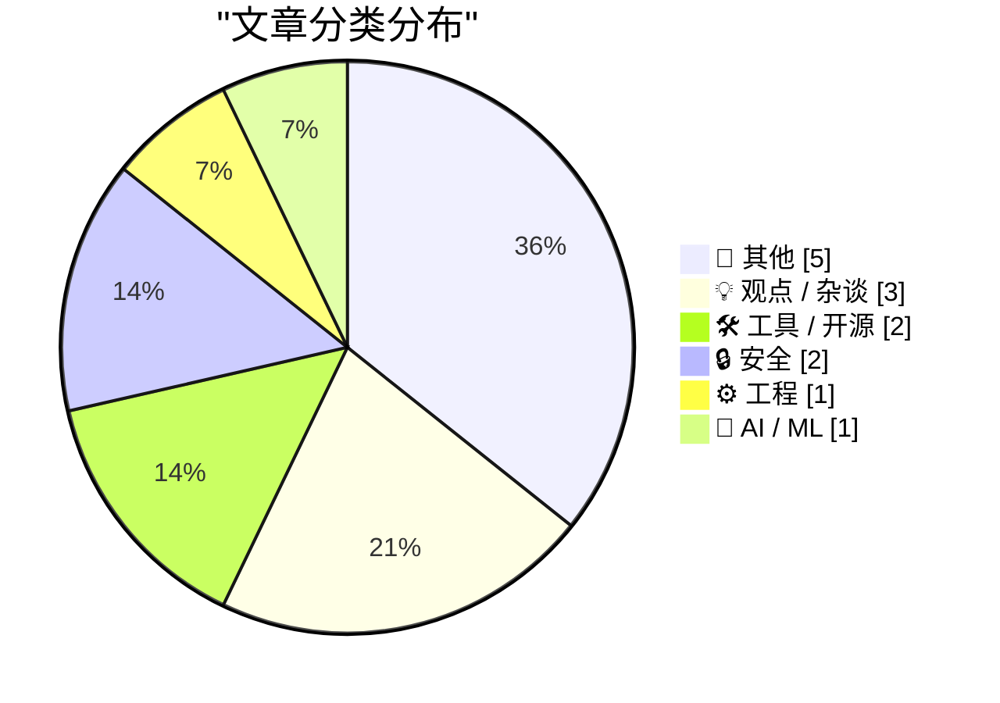
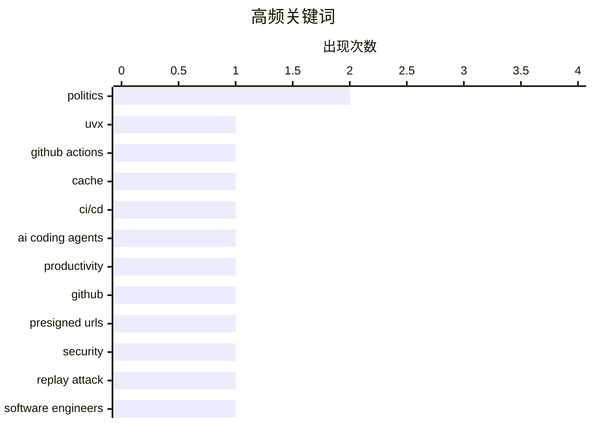

# 📰 AI 博客每日精选 — 2026-07-15

> 来自 Karpathy 推荐的 92 个顶级技术博客，AI 精选 Top 14

## 📝 今日看点

今日技术圈聚焦于AI对开发与安全的双重重塑。一方面，AI编码代理正显著提升开源项目产出，大模型甚至被用于构建基于SQLite的复杂游戏系统；另一方面，AI文本分析能力的提升让跨平台匿名身份面临隐私暴露的威胁。同时，开发者文化与底层工程实践依然是关注焦点，从重新审视职场政治的本质与解读企业行话，到优化CI/CD缓存策略及反思预签名URL的安全隐患，折射出技术人在追求效率与安全间的持续探索。

---

## 🏆 今日必读

🥇 **在 GitHub Actions 中以缓存友好的方式使用 uvx**

[Using uvx in GitHub Actions in a cache-friendly way](https://simonwillison.net/2026/Jul/14/uvx-github-actions-cache/#atom-everything) — simonwillison.net · 16 小时前 · 🛠 工具 / 开源

> 在 GitHub Actions 中使用 `uvx tool-name` 运行工具时，缓存失效是一个常见痛点。通过在工作流开始时设置 `UV_EXCLUDE_NEWER` 环境变量并将其作为 GitHub Actions 缓存键的一部分，可以实现高效的缓存复用。这种方法确保了工具版本在特定日期前保持稳定，避免了每次运行都重新下载依赖。作者认为这是一个理想且实用的缓存友好型解决方案。

💡 **为什么值得读**: 提供了一个简单且实用的 GitHub Actions 缓存优化技巧，适合经常使用 uvx 的开发者。

🏷️ uvx, GitHub Actions, cache, CI/CD

🥈 **GitHub 上的 Datasette 代码频率图表**

[datasette code-frequency chart on GitHub](https://simonwillison.net/2026/Jul/13/datasette-code-frequency/#atom-everything) — simonwillison.net · 19 小时前 · 💡 观点 / 杂谈

> 作者试图量化编码代理和 Opus 4.5 级别模型对其开源项目产出的影响。通过观察 Datasette 项目在 GitHub 上的代码频率图表，发现了明显的产出变化趋势。该图表直观地展示了代码增加和删除的频率，成为评估 AI 辅助编程影响力的有效依据。这表明高级 AI 模型正在显著改变开发者的代码贡献模式。

💡 **为什么值得读**: 以真实开源项目的数据图表，直观展示了 AI 编码工具对开发者生产力的实际影响。

🏷️ AI coding agents, productivity, GitHub

🥉 **预签名 URL 在技术上是一种安全漏洞**

[Presigned URLs are technically a security vuln](https://www.tigrisdata.com/blog/presigned-urls-security-vuln/) — xeiaso.net · 17 小时前 · 🔒 安全

> 预签名 URL 本质上是一种故意的重放攻击，而可重放的身份验证令牌是制造脆弱系统的教科书式方法。尽管 Tigris 和几乎所有其他对象存储系统都将其作为一等功能提供，但这并非疏忽。预签名 URL 将重放攻击这一弱点转化为一种特性，解决了传统身份验证修复方案的痛苦。作者认为，在特定场景下，这种权衡是合理且必要的。

💡 **为什么值得读**: 深入剖析了预签名 URL 背后的安全本质，为理解对象存储系统的设计权衡提供了独特视角。

🏷️ presigned URLs, security, replay attack

---

## 📊 数据概览

| 扫描源 | 抓取文章 | 时间范围 | 精选 |
|:---:|:---:|:---:|:---:|
| 83/92 | 2502 篇 → 14 篇 | 24h | **14 篇** |

### 分类分布



### 高频关键词



<details>
<summary>📈 纯文本关键词图（终端友好）</summary>

```
politics         │ ████████████████████ 2
uvx              │ ██████████░░░░░░░░░░ 1
github actions   │ ██████████░░░░░░░░░░ 1
cache            │ ██████████░░░░░░░░░░ 1
ci/cd            │ ██████████░░░░░░░░░░ 1
ai coding agents │ ██████████░░░░░░░░░░ 1
productivity     │ ██████████░░░░░░░░░░ 1
github           │ ██████████░░░░░░░░░░ 1
presigned urls   │ ██████████░░░░░░░░░░ 1
security         │ ██████████░░░░░░░░░░ 1
```

</details>

### 🏷️ 话题标签

**politics**(2) · **uvx**(1) · **github actions**(1) · cache(1) · ci/cd(1) · ai coding agents(1) · productivity(1) · github(1) · presigned urls(1) · security(1) · replay attack(1) · software engineers(1) · career(1) · pseudonymity(1) · text analysis(1) · anonymity(1) · sqlite(1) · doom(1) · game engine(1) · design tool(1)

---

## 📝 其他

### 1. 多元化：老人政治的失败模式 (2026年7月14日)

[Pluralistic: Gerontocracy's failure mode (14 Jul 2026)](https://pluralistic.net/2026/07/14/designated-survivor/) — **pluralistic.net** · 6 小时前 · ⭐ 16/30

> 探讨了“老人政治”（Gerontocracy）的失败模式，并提出了“指定的幸存者在哪里？”的疑问。文章汇总了当天的多个科技与文化热点，包括微软与 MP3 的版权争议、英国工业界与学童的冲突、计划性 LED 报废问题等。作者还预告了即将在爱丁堡、悉尼等地举行的公开活动。核心观点聚焦于老龄化领导层在面对快速变化的社会和技术问题时的无力感。

🏷️ gerontocracy, politics, society

---

### 2. 微软行话：双击与深入钻取

[Microspeak: Double-click and drill down](https://devblogs.microsoft.com/oldnewthing/20260714-00/?p=112532) — **devblogs.microsoft.com/oldnewthing** · 3 小时前 · ⭐ 15/30

> 解析了微软内部常用的两个职场行话：“Double-click”（双击）和“Drill down”（深入钻取）。这些术语在微软的企业文化中常用于指代对某个问题或主题进行更深入的探讨和分析。文章以幽默的口吻揭示了这些技术词汇在商业沟通中的演变和实际含义。作者展示了大公司内部独特的语言生态如何影响日常交流。

🏷️ Microspeak, terminology, Microsoft

---

### 3. 我是一个 USB-C 极致推崇者

[I'm a USB-C Maximalist](https://shkspr.mobi/blog/2026/07/im-a-usb-c-maximalist/) — **shkspr.mobi** · 6 小时前 · ⭐ 14/30

> 作者分享了在欧洲7周旅行中仅靠一个多口 USB-C 充电器实现轻装出行的经验。该充电器配备一个高功率 USB-C PD 接口用于手机和笔记本快充，以及另外两个 USB-C 接口为其他设备供电。这种全 USB-C 方案证明了单一通用电源足以应对多种电子设备的充电需求。作者由此倡导全面拥抱 USB-C 接口以简化旅行装备。

🏷️ USB-C, travel, charging

---

### 4. ICD-10 章节与代码字母

[ICD-10 chapters and code letters](https://www.johndcook.com/blog/2026/07/14/icd-10-chapters-letters/) — **johndcook.com** · 3 小时前 · ⭐ 13/30

> ICD-10-CM 标准被划分为21个章节，其代码的首字母通常与所属章节相对应。然而，章节与首字母的映射并非绝对，单个章节可能包含以多个字母开头的代码块。此外，以特定字母（如 D）开头的代码甚至可能跨越多个不同的章节。这揭示了 ICD-10 编码体系在分类结构上的复杂性与非直观性。

🏷️ ICD-10, medical-coding, healthcare

---

### 5. 任天堂 Famicom 与任天堂成功的秘诀

[Nintendo Famicom and the secret of Nintendo’s success](https://dfarq.homeip.net/nintendo-famicom-and-the-secret-of-nintendos-success/?utm_source=rss&#038;utm_medium=rss&#038;utm_campaign=nintendo-famicom-and-the-secret-of-nintendos-success) — **dfarq.homeip.net** · 6 小时前 · ⭐ 10/30

> 1983年7月15日，任天堂在日本推出了名为 Famicom（Family Computer）的游戏主机。这款主机不仅是一台家庭电脑，更在随后打破了 Atari 2600 保持的全球最高销量纪录。Famicom 的成功奠定了任天堂在游戏行业的霸主地位，其背后的战略与产品定位成为了任天堂持续成功的关键秘诀。

🏷️ nintendo, famicom, gaming-history

---

## 💡 观点 / 杂谈

### 6. GitHub 上的 Datasette 代码频率图表

[datasette code-frequency chart on GitHub](https://simonwillison.net/2026/Jul/13/datasette-code-frequency/#atom-everything) — **simonwillison.net** · 19 小时前 · ⭐ 23/30

> 作者试图量化编码代理和 Opus 4.5 级别模型对其开源项目产出的影响。通过观察 Datasette 项目在 GitHub 上的代码频率图表，发现了明显的产出变化趋势。该图表直观地展示了代码增加和删除的频率，成为评估 AI 辅助编程影响力的有效依据。这表明高级 AI 模型正在显著改变开发者的代码贡献模式。

🏷️ AI coding agents, productivity, GitHub

---

### 7. 对软件工程师来说，“玩弄政治”意味着什么？

[What does "playing politics" mean for software engineers?](https://seangoedecke.com/playing-politics/) — **seangoedecke.com** · 17 小时前 · ⭐ 22/30

> 软件工程师常被建议“开始玩弄政治”，但多数人对此缺乏理解，常将其误解为《权力的游戏》般的阴谋斗争。实际上，职场政治更多关乎建立信任、理解团队动态和有效沟通，而非恶意算计。工程师需要学会在不破坏职业道德的前提下，通过非技术手段推动项目和技术决策。作者指出，掌握这些软技能对于职业发展至关重要。

🏷️ software engineers, politics, career

---

### 8. 我还活着

[I'm still alive](https://buttondown.com/hillelwayne/archive/im-still-alive/) — **buttondown.com/hillelwayne** · 1 小时前 · ⭐ 8/30

> 作者因旅行安排和闭关赶稿而暂停了通讯更新与社交媒体互动。好消息是其著作《Logic for Programmers》有望在未来几周内完成并推出纸质版。作者还展示了目前已制作的多个打印样书。这标志着这本面向程序员的逻辑学书籍即将正式面世。

🏷️ logic, book, update

---

## 🛠 工具 / 开源

### 9. 在 GitHub Actions 中以缓存友好的方式使用 uvx

[Using uvx in GitHub Actions in a cache-friendly way](https://simonwillison.net/2026/Jul/14/uvx-github-actions-cache/#atom-everything) — **simonwillison.net** · 16 小时前 · ⭐ 23/30

> 在 GitHub Actions 中使用 `uvx tool-name` 运行工具时，缓存失效是一个常见痛点。通过在工作流开始时设置 `UV_EXCLUDE_NEWER` 环境变量并将其作为 GitHub Actions 缓存键的一部分，可以实现高效的缓存复用。这种方法确保了工具版本在特定日期前保持稳定，避免了每次运行都重新下载依赖。作者认为这是一个理想且实用的缓存友好型解决方案。

🏷️ uvx, GitHub Actions, cache, CI/CD

---

### 10. [赞助] Paper

[[Sponsor] Paper](https://paper.design/?utm_source=df) — **daringfireball.net** · 12 小时前 · ⭐ 19/30

> Paper 是一款专业设计工具，其每一层都是真实的 HTML 和 CSS，设计即代码，减少了设计与交付之间的转换损耗。它支持双向工作流：从代码到设计，以及从设计到代码。用户可以通过 MCP 连接任何代理来读取和编辑设计，或使用 Paper Snapshot 将实时网站捕获为可编辑图层进行迭代。代理负责处理繁琐工作，让设计师专注于工艺和决策。

🏷️ design tool, HTML, CSS, MCP

---

## 🔒 安全

### 11. 预签名 URL 在技术上是一种安全漏洞

[Presigned URLs are technically a security vuln](https://www.tigrisdata.com/blog/presigned-urls-security-vuln/) — **xeiaso.net** · 17 小时前 · ⭐ 23/30

> 预签名 URL 本质上是一种故意的重放攻击，而可重放的身份验证令牌是制造脆弱系统的教科书式方法。尽管 Tigris 和几乎所有其他对象存储系统都将其作为一等功能提供，但这并非疏忽。预签名 URL 将重放攻击这一弱点转化为一种特性，解决了传统身份验证修复方案的痛苦。作者认为，在特定场景下，这种权衡是合理且必要的。

🏷️ presigned URLs, security, replay attack

---

### 12. 伪名末日

[Pseudpocalypse](https://dynomight.net/pseudpocalypse/) — **dynomight.net** · 17 小时前 · ⭐ 22/30

> 提出一个猜想：如果在互联网上使用不同名字发布大量文本，仅通过文本本身就能将这些身份关联起来。这意味着匿名和化名在自然语言处理和文本分析技术面前可能变得脆弱。随着 AI 文本分析能力的提升，跨平台的身份去匿名化将成为一个严峻的隐私挑战。作者暗示，纯粹的文本伪装已不足以保护数字身份。

🏷️ pseudonymity, text analysis, anonymity

---

## ⚙️ 工程

### 13. DOOMQL

[DOOMQL](https://simonwillison.net/2026/Jul/13/doomql/#atom-everything) — **simonwillison.net** · 19 小时前 · ⭐ 20/30

> Peter Gostev 使用 GPT-5.6 Sol 构建了 DOOMQL，这是一个基于 SQLite 作为游戏引擎的 Doom 风格游戏。游戏中的移动、碰撞、敌人、战斗、进度和屏幕上的每个 RGB 像素都由 SQL 逻辑控制。这个项目源于一个故意不切实际的问题：如果 SQLite 不仅仅是存储数据的地方，而是游戏引擎本身会怎样。结果证明，用 SQL 实现完整游戏逻辑是可行且极具趣味性的。

🏷️ SQLite, DOOM, game engine

---

## 🤖 AI / ML

### 14. 分布式差异的直觉

[Intuition for distribution differences](https://entropicthoughts.com/distribution-differences) — **entropicthoughts.com** · 19 小时前 · ⭐ 18/30

> 探讨了如何建立对人口分数分布差异的直觉理解。文章以一个国家中每个人被分配某种分数（分数越高越好）的场景为例，分析了政府机构收集的总体分数分布情况。通过可视化展示，帮助读者直观理解不同群体或时间点之间的分布差异。作者旨在提供一种超越简单平均值、深入理解数据分布形态的方法。

🏷️ statistics, distribution, data-analysis

---

*生成于 2026-07-15 01:36 (Asia/Shanghai) | 扫描 83 源 → 获取 2502 篇 → 精选 14 篇*
*基于 [Hacker News Popularity Contest 2025](https://refactoringenglish.com/tools/hn-popularity/) RSS 源列表，由 [Andrej Karpathy](https://x.com/karpathy) 推荐*
*由「懂点儿AI」制作，欢迎关注同名微信公众号获取更多 AI 实用技巧 💡*
