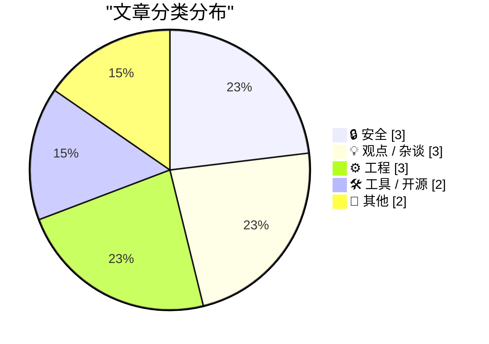
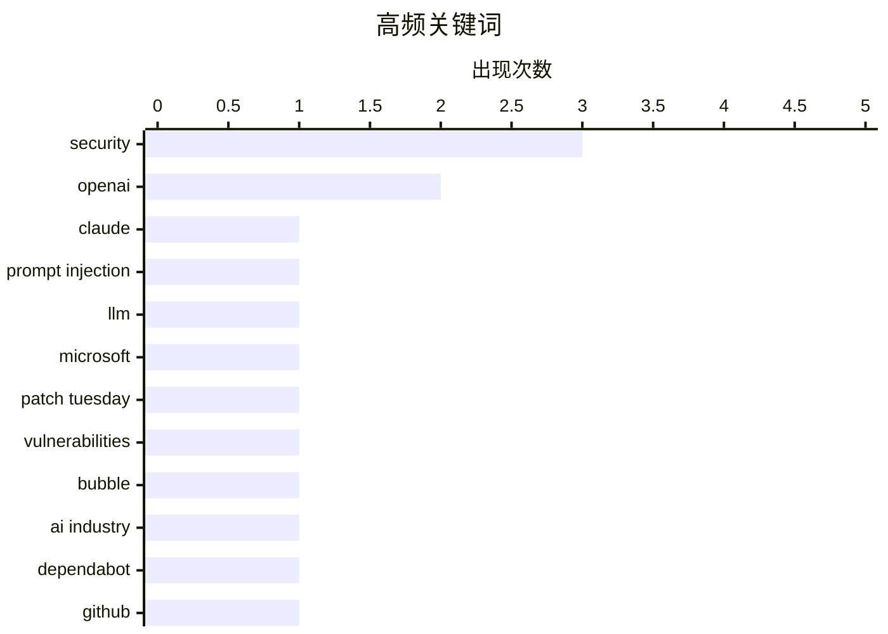

# 📰 AI 博客每日精选 — 2026-07-16

> 来自 Karpathy 推荐的 92 个顶级技术博客，AI 精选 Top 13

## 📝 今日看点

今日技术圈聚焦于AI与安全的双向博弈，AI在加速漏洞发现的同时，其自身也暴露出数据泄露风险，且行业估值泡沫开始引发质疑。在工程实践方面，开发者持续探索系统架构的轻量化演进与底层机制的深度调试。此外，智能家居的可靠性危机与基础数学工具的探讨，共同提醒我们在技术狂飙突进时仍需回归工程本质。

---

## 🏆 今日必读

🥇 **我是如何诱骗 Claude 泄露你最深的秘密的**

[How I tricked Claude into leaking your deepest, darkest secrets](https://simonwillison.net/2026/Jul/15/claude-web-fetch-exfiltration/#atom-everything) — simonwillison.net · 3 小时前 · 🔒 安全

> Claude 的 web_fetch 工具原本设计了防数据泄露机制，但 Ayush Paul 发现了该设计中的一个漏洞。攻击者可以通过特定手段绕过这些防护措施，诱导 Claude 泄露用户的敏感信息。这表明即使有精心设计的安全防护，AI 工具仍面临潜在的数据外泄风险。

💡 **为什么值得读**: 揭示了当前主流 AI 工具在防数据泄露设计上的实际漏洞，对关注 AI 安全的开发者具有警示意义。

🏷️ Claude, prompt injection, security, LLM

🥈 **微软修复创纪录的 570 个安全漏洞**

[Microsoft Patches a Record 570 Security Flaws](https://krebsonsecurity.com/2026/07/microsoft-patches-a-record-570-security-flaws/) — krebsonsecurity.com · 22 小时前 · 🔒 安全

> 微软发布了软件更新，修复了 Windows 及其他软件中至少 570 个安全漏洞，几乎是上个月创纪录数量的三倍。漏洞数量激增归因于人工智能辅助的漏洞发现技术。这表明 AI 正在显著加速安全漏洞的发现和修复进程。

💡 **为什么值得读**: 展示了 AI 在网络安全领域带来的实质性影响，漏洞发现速度的激增对安全运维提出了新挑战。

🏷️ Microsoft, Patch Tuesday, vulnerabilities, security

🥉 **OpenAI 泡沫**

[The OpenAI Bubble](https://www.wheresyoured.at/the-openai-bubble/) — wheresyoured.at · 35 分钟前 · 💡 观点 / 杂谈

> 作者对 OpenAI 当前的市场估值和商业模式提出了质疑，认为其存在明显的泡沫迹象。文章分析了 OpenAI 的财务状况和行业竞争态势，暗示其高昂的估值可能缺乏坚实的商业基础支撑。结论是对 OpenAI 的未来持谨慎甚至悲观态度。

💡 **为什么值得读**: 提供了对当前 AI 领域热门公司估值的冷思考，适合想要了解 AI 行业商业现实的读者。

🏷️ OpenAI, bubble, AI industry

---

## 📊 数据概览

| 扫描源 | 抓取文章 | 时间范围 | 精选 |
|:---:|:---:|:---:|:---:|
| 81/92 | 2481 篇 → 13 篇 | 24h | **13 篇** |

### 分类分布



### 高频关键词



<details>
<summary>📈 纯文本关键词图（终端友好）</summary>

```
security         │ ████████████████████ 3
openai           │ █████████████░░░░░░░ 2
claude           │ ███████░░░░░░░░░░░░░ 1
prompt injection │ ███████░░░░░░░░░░░░░ 1
llm              │ ███████░░░░░░░░░░░░░ 1
microsoft        │ ███████░░░░░░░░░░░░░ 1
patch tuesday    │ ███████░░░░░░░░░░░░░ 1
vulnerabilities  │ ███████░░░░░░░░░░░░░ 1
bubble           │ ███████░░░░░░░░░░░░░ 1
ai industry      │ ███████░░░░░░░░░░░░░ 1
```

</details>

### 🏷️ 话题标签

**security**(3) · **openai**(2) · **claude**(1) · prompt injection(1) · llm(1) · microsoft(1) · patch tuesday(1) · vulnerabilities(1) · bubble(1) · ai industry(1) · dependabot(1) · github(1) · changelog(1) · sqlite(1) · migration(1) · database(1) · lobsters(1) · iot(1) · smart home(1) · reliability(1)

---

## 🔒 安全

### 1. 我是如何诱骗 Claude 泄露你最深的秘密的

[How I tricked Claude into leaking your deepest, darkest secrets](https://simonwillison.net/2026/Jul/15/claude-web-fetch-exfiltration/#atom-everything) — **simonwillison.net** · 3 小时前 · ⭐ 26/30

> Claude 的 web_fetch 工具原本设计了防数据泄露机制，但 Ayush Paul 发现了该设计中的一个漏洞。攻击者可以通过特定手段绕过这些防护措施，诱导 Claude 泄露用户的敏感信息。这表明即使有精心设计的安全防护，AI 工具仍面临潜在的数据外泄风险。

🏷️ Claude, prompt injection, security, LLM

---

### 2. 微软修复创纪录的 570 个安全漏洞

[Microsoft Patches a Record 570 Security Flaws](https://krebsonsecurity.com/2026/07/microsoft-patches-a-record-570-security-flaws/) — **krebsonsecurity.com** · 22 小时前 · ⭐ 24/30

> 微软发布了软件更新，修复了 Windows 及其他软件中至少 570 个安全漏洞，几乎是上个月创纪录数量的三倍。漏洞数量激增归因于人工智能辅助的漏洞发现技术。这表明 AI 正在显著加速安全漏洞的发现和修复进程。

🏷️ Microsoft, Patch Tuesday, vulnerabilities, security

---

### 3. 每周更新 512：IoT 门锁故障

[Weekly Update 512: IoT Lockout Fail](https://www.troyhunt.com/weekly-update-512/) — **troyhunt.com** · 16 小时前 · ⭐ 20/30

> 作者在长途旅行 33 小时回家后，发现智能家居的 IoT 门锁电池耗尽，导致被锁在门外。这一经历凸显了智能家居设备在可靠性和容错性方面的严重缺陷。结论是当前的智能家居体验并未如宣传般美好，反而可能带来不便。

🏷️ IoT, smart home, reliability, security

---

## 💡 观点 / 杂谈

### 4. OpenAI 泡沫

[The OpenAI Bubble](https://www.wheresyoured.at/the-openai-bubble/) — **wheresyoured.at** · 35 分钟前 · ⭐ 22/30

> 作者对 OpenAI 当前的市场估值和商业模式提出了质疑，认为其存在明显的泡沫迹象。文章分析了 OpenAI 的财务状况和行业竞争态势，暗示其高昂的估值可能缺乏坚实的商业基础支撑。结论是对 OpenAI 的未来持谨慎甚至悲观态度。

🏷️ OpenAI, bubble, AI industry

---

### 5. 引用 Armin Ronacher

[Quoting Armin Ronacher](https://simonwillison.net/2026/Jul/14/armin-ronacher/#atom-everything) — **simonwillison.net** · 23 小时前 · ⭐ 18/30

> 软件项目的共享语言不是英语或 Python，而是对概念含义、边界、不变性、所有权和系统形态的共同理解。这种语言很少集中写在一个地方，而是分散存在于文档、代码、代码审查、对话和开发经验中。结论是项目知识的传承高度依赖于这种隐性的共享语言。

🏷️ software engineering, architecture, concepts

---

### 6. They Prefer the App

[They Prefer the App](https://idiallo.com/blog/they-prefer-the-app) — **idiallo.com** · 18 小时前 · ⭐ 15/30

> They Prefer the App

🏷️ web development, mobile apps, user preference

---

## ⚙️ 工程

### 7. lobste.rs 现已运行在 SQLite 上

[lobste.rs is now running on SQLite](https://simonwillison.net/2026/Jul/14/lobsters-sqlite/#atom-everything) — **simonwillison.net** · 21 小时前 · ⭐ 20/30

> 社区网站 Lobsters 已成功从 MariaDB 迁移到 SQLite。该迁移计划自 2018 年起酝酿，最初目标是 PostgreSQL，但去年决定转向调查 SQLite 并最终完成迁移。这证明了 SQLite 足以支撑生产级社区网站的运行需求。

🏷️ SQLite, migration, database, Lobsters

---

### 8. 傅里叶变换笔记

[Notes on the Fourier Transform](https://eli.thegreenplace.net/2026/notes-on-the-fourier-transform/) — **eli.thegreenplace.net** · 14 小时前 · ⭐ 18/30

> 傅里叶级数是分析周期函数的强大工具，但对于非周期函数则存在局限。文章探讨了如何在有限区间内计算非周期函数的傅里叶级数，并进一步引入傅里叶变换的概念。结论是傅里叶变换是处理非周期信号不可或缺的数学工具。

🏷️ Fourier Transform, mathematics, signal processing

---

### 9. 关闭显示控制面板时出现无效函数指针的案例

[The case of the invalid function pointer when shutting down the display control panel](https://devblogs.microsoft.com/oldnewthing/20260715-00/?p=112535) — **devblogs.microsoft.com/oldnewthing** · 3 小时前 · ⭐ 17/30

> 文章分析了在关闭显示控制面板时遇到无效函数指针错误的底层原因和调试过程。通过深入剖析 Windows 系统的内部机制，追踪了函数指针失效的具体路径。结论是深入理解操作系统底层机制对于解决复杂的系统级 Bug 至关重要。

🏷️ Windows, debugging, function pointer

---

## 🛠 工具 / 开源

### 10. 引用 GitHub 更新日志

[Quoting GitHub Changelog](https://simonwillison.net/2026/Jul/14/github-changeling/#atom-everything) — **simonwillison.net** · 18 小时前 · ⭐ 20/30

> GitHub 的 Dependabot 现在引入了默认的包冷却期机制。在开启版本更新拉取请求前，Dependabot 会等待新版本在注册表中可用至少三天。该冷却期现为默认设置，无需额外配置。这有助于避免自动引入带有缺陷或恶意的新版本。

🏷️ Dependabot, GitHub, changelog

---

### 11. simonw/pedalican

[simonw/pedalican](https://simonwillison.net/2026/Jul/14/pedalican/#atom-everything) — **simonwillison.net** · 19 小时前 · ⭐ 18/30

> 作者意外激活了 Codex Desktop 中的动画机器人宠物功能，类似于曾经的 Office 助手 Clippy。发现可以自定义创建这些宠物后，作者制作了一个名为 pedalican 的可爱小宠物。这表明 AI 桌面应用开始引入趣味性和个性化的交互元素。

🏷️ OpenAI, Codex, pet

---

## 📝 其他

### 12. Reasons for Escom’s bankruptcy

[Reasons for Escom’s bankruptcy](https://dfarq.homeip.net/reasons-for-escoms-bankruptcy/?utm_source=rss&#038;utm_medium=rss&#038;utm_campaign=reasons-for-escoms-bankruptcy) — **dfarq.homeip.net** · 6 小时前 · ⭐ 10/30

> Reasons for Escom’s bankruptcy

🏷️ Escom, Commodore, bankruptcy, history

---

### 13. Ben je van de IT of niet?

[Ben je van de IT of niet?](https://berthub.eu/articles/posts/ben-je-van-de-it-of-niet/) — **berthub.eu** · 7 小时前 · ⭐ 7/30

> Ben je van de IT of niet?

🏷️ office, facilities, rant

---

*生成于 2026-07-16 01:31 (Asia/Shanghai) | 扫描 81 源 → 获取 2481 篇 → 精选 13 篇*
*基于 [Hacker News Popularity Contest 2025](https://refactoringenglish.com/tools/hn-popularity/) RSS 源列表，由 [Andrej Karpathy](https://x.com/karpathy) 推荐*
*由「懂点儿AI」制作，欢迎关注同名微信公众号获取更多 AI 实用技巧 💡*
