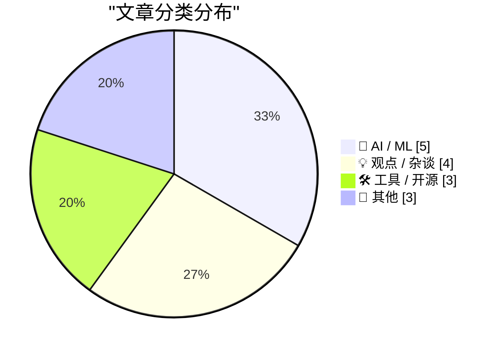
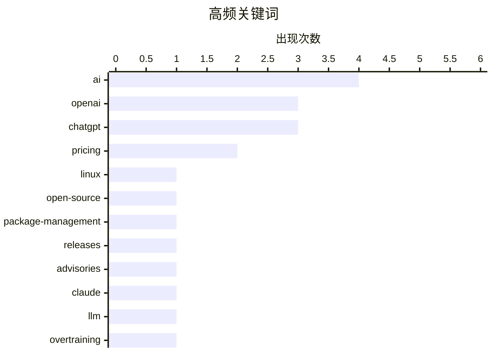

# 📰 AI 博客每日精选 — 2026-07-19

> 来自 Karpathy 推荐的 92 个顶级技术博客，AI 精选 Top 15

## 📝 今日看点

今日技术圈焦点高度集中于人工智能的产业整合与实际应用。OpenAI 进行产品重组并紧急修复新版 ChatGPT 的体验问题，同时 Anthropic 扩大 Claude 功能，显示出大厂在 AI 产品线优化上的激烈角力。在应用层面，Linus Torvalds 明确表态拥抱 AI 工具，Roblox 借 AI 降低游戏创作门槛，但 AI 生成内容泛滥导致的山寨书籍问题也敲响了行业警钟。此外，关于如何通过过度训练实现类人 AI 的深度理论探讨，为技术发展提供了长远视角的思考。

---

## 🏆 今日必读

🥇 **Linus Torvalds：“AI 是一种工具，就像我们使用的其他工具一样。而且它显然是有用的。”**

[Linus Torvalds: ‘AI Is a Tool, Just Like Other Tools We Use. And It’s Clearly a Useful One.’](https://lore.kernel.org/linux-media/CAHk-=wi4zC+Ze8e+p3tMv8TtG_80KzsZ1syL9anBtmEh5Z40vg@mail.gmail.com/) — daringfireball.net · 22 小时前 · 💡 观点 / 杂谈

> Linus Torvalds 作为 Linux 顶级维护者明确表态，Linux 不会成为反 AI 项目。他认为 AI 是一种像其他工具一样有用的工具，且在当今已不再受到质疑。如果有开发者对此有异议，可以选择 fork 项目或离开。

💡 **为什么值得读**: 了解 Linux 创始人对 AI 在开源项目中应用的强硬立场与态度。

🏷️ Linux, AI, open-source

🥈 **包管理本周资讯：2026年7月18日**

[This Week in Package Management: 18 July 2026](https://nesbitt.io/2026/07/18/this-week-in-package-management.html) — nesbitt.io · 7 小时前 · 🛠 工具 / 开源

> 汇总了2026年7月18日当周包管理领域的最新动态，包括各类包管理器的版本发布、安全公告以及相关技术文章。

💡 **为什么值得读**: 快速跟进包管理生态的最新发布与安全公告。

🏷️ package-management, releases, advisories

🥉 **Claude 将 Fable 5 设为永久功能**

[Claude make Fable 5 permanent](https://simonwillison.net/2026/Jul/18/claude-make-fable-5-permanent/#atom-everything) — simonwillison.net · 11 小时前 · 🤖 AI / ML

> Anthropic 宣布自7月20日起，Claude Fable 5 将包含在所有 Max 和 Team Premium 计划中，限额为50%。Pro 和 Team Standard 用户将继续通过使用额度访问 Fable，并获得一次性100美元的额度。

💡 **为什么值得读**: 了解 Claude Fable 5 模型在不同订阅层级中的可用性与定价调整。

🏷️ Claude, AI, pricing

---

## 📊 数据概览

| 扫描源 | 抓取文章 | 时间范围 | 精选 |
|:---:|:---:|:---:|:---:|
| 82/92 | 2493 篇 → 16 篇 | 24h | **15 篇** |

### 分类分布



### 高频关键词



<details>
<summary>📈 纯文本关键词图（终端友好）</summary>

```
ai                 │ ████████████████████ 4
openai             │ ███████████████░░░░░ 3
chatgpt            │ ███████████████░░░░░ 3
pricing            │ ██████████░░░░░░░░░░ 2
linux              │ █████░░░░░░░░░░░░░░░ 1
open-source        │ █████░░░░░░░░░░░░░░░ 1
package-management │ █████░░░░░░░░░░░░░░░ 1
releases           │ █████░░░░░░░░░░░░░░░ 1
advisories         │ █████░░░░░░░░░░░░░░░ 1
claude             │ █████░░░░░░░░░░░░░░░ 1
```

</details>

### 🏷️ 话题标签

**ai**(4) · **openai**(3) · **chatgpt**(3) · pricing(2) · linux(1) · open-source(1) · package-management(1) · releases(1) · advisories(1) · claude(1) · llm(1) · overtraining(1) · codex(1) · product(1) · desktop-app(1) · roblox(1) · game-development(1) · bbedit(1) · macos(1) · text-editor(1)

---

## 🤖 AI / ML

### 1. Claude 将 Fable 5 设为永久功能

[Claude make Fable 5 permanent](https://simonwillison.net/2026/Jul/18/claude-make-fable-5-permanent/#atom-everything) — **simonwillison.net** · 11 小时前 · ⭐ 22/30

> Anthropic 宣布自7月20日起，Claude Fable 5 将包含在所有 Max 和 Team Premium 计划中，限额为50%。Pro 和 Team Standard 用户将继续通过使用额度访问 Fable，并获得一次性100美元的额度。

🏷️ Claude, AI, pricing

---

### 2. 过度训练：通向类人 AI 的路径

[Overtraining as the path to human-like AI](https://seangoedecke.com/overtraining-as-the-path-to-human-like-ai/) — **seangoedecke.com** · 17 小时前 · ⭐ 22/30

> 匿名博主 Gwern 发表了一篇万字长文，提出 LLM 缺乏真正灵活的类人智能的理论，并探讨了如何通过训练实现这一目标。作者认为 Gwern 的观点在众多 AI 理论中尤为值得关注，其理论深度超越了普通的互联网研究者。

🏷️ LLM, overtraining, AI

---

### 3. OpenAI 产品重组让复杂化者掌权

[OpenAI’s Product Shake-Up Put the Complexifiers in Charge](https://www.wired.com/story/openai-reorg-greg-brockman-product/) — **daringfireball.net** · 20 小时前 · ⭐ 22/30

> OpenAI 将 ChatGPT、AI 编码代理 Codex 和开发者 API 合并为一个核心产品团队。Codex 负责人 Thibault Sottiaux 被任命领导该团队，反映出 Codex 正日益成为其消费级和企业级产品的基础，并增强了自主执行数字任务的能力。

🏷️ OpenAI, ChatGPT, Codex

---

### 4. OpenAI 开始清理 ChatGPT 造成的烂摊子

[OpenAI Starts Cleaning Up the Utter Mess It Made of ChatGPT](https://x.com/thsottiaux/status/2077928427936710901) — **daringfireball.net** · 21 小时前 · ⭐ 22/30

> OpenAI 工程主管 Thibault Sottiaux 承认新版 ChatGPT 桌面应用首次尝试未能完全做对，并基于反馈进行了修改。更新包括在侧边栏显示对话历史和项目，以及跨网页、移动端和桌面端同步聊天和工作历史。

🏷️ OpenAI, ChatGPT, desktop-app

---

### 5. Roblox 将推出 AI 游戏构建功能，包括 iOS 平台

[Roblox Set to Introduce AI Game-Building Feature, Including on iOS](https://about.roblox.com/newsroom/2026/07/build-without-limits-on-roblox) — **daringfireball.net** · 19 小时前 · ⭐ 21/30

> Roblox 宣布将引入 AI 游戏构建功能，旨在让其1.32亿日活用户中的任何人都能成为创作者。这一举措延续了 Roblox 二十年前“你来制作游戏”的核心理念，期望通过 AI 降低创作门槛，催生下一个爆款游戏。

🏷️ Roblox, AI, game-development

---

## 💡 观点 / 杂谈

### 6. Linus Torvalds：“AI 是一种工具，就像我们使用的其他工具一样。而且它显然是有用的。”

[Linus Torvalds: ‘AI Is a Tool, Just Like Other Tools We Use. And It’s Clearly a Useful One.’](https://lore.kernel.org/linux-media/CAHk-=wi4zC+Ze8e+p3tMv8TtG_80KzsZ1syL9anBtmEh5Z40vg@mail.gmail.com/) — **daringfireball.net** · 22 小时前 · ⭐ 25/30

> Linus Torvalds 作为 Linux 顶级维护者明确表态，Linux 不会成为反 AI 项目。他认为 AI 是一种像其他工具一样有用的工具，且在当今已不再受到质疑。如果有开发者对此有异议，可以选择 fork 项目或离开。

🏷️ Linux, AI, open-source

---

### 7. MG Siegler：“OpenAI 让 ChatGPT 重新变回 ChatGPT”

[MG Siegler: ‘OpenAI Makes ChatGPT ChatGPT Again’](https://spyglass.org/chatgpt-brings-back-chatgpt/) — **daringfireball.net** · 21 小时前 · ⭐ 22/30

> MG Siegler 指出 OpenAI 在 ChatGPT 新版发布时存在严重的执行问题，尽管他们快速修复了反馈的问题，但发布方式依然糟糕。他认为这暴露了 OpenAI 可能并不真正理解其用户群体的令人不安的趋势。

🏷️ OpenAI, ChatGPT, product

---

### 8. Apple Books 和 Amazon 充斥着抄袭合法作者的 AI 生成书籍

[Apple Books and Amazon Are Lousy With AI-Generated Books Ripping Off Legitimate Authors](https://thenewthings.com/p/apple-big-ai-book-slop-problem) — **daringfireball.net** · 16 小时前 · ⭐ 18/30

> Joanna Stern 发现她的新书发售仅几天后，Apple Books 上就涌现了大量 AI 生成的山寨电子书。这些书籍模仿了原书的封面风格和书名，甚至故意拼错作者名字，凸显了平台对 AI 生成劣质内容的监管缺失。

🏷️ AI-generated, copyright, Apple-Books

---

### 9. 谷歌上诉失败，必须支付创纪录的47亿美元欧盟反垄断罚款

[Google Runs Out of Appeals, Must Pay Record $4.7 Billion EU Antitrust Fine](https://www.cnbc.com/2026/07/02/alphabet-google-android-eu-antitrust-fine-4-1-billion-euro-appeal.html) — **daringfireball.net** · 17 小时前 · ⭐ 17/30

> 欧洲最高法院维持了对谷歌约41亿欧元（46.7亿美元）的创纪录反垄断罚款。该罚款源于2018年欧盟委员会的指控，认定谷歌滥用Android在移动市场的主导地位，通过与手机制造商的预装协议为自己的应用提供不公平优势。谷歌在欧盟法院系统内多次上诉后最终败诉。这一裁决标志着欧盟在科技反垄断监管方面取得了重大胜利。

🏷️ Google, antitrust, EU

---

## 🛠 工具 / 开源

### 10. 包管理本周资讯：2026年7月18日

[This Week in Package Management: 18 July 2026](https://nesbitt.io/2026/07/18/this-week-in-package-management.html) — **nesbitt.io** · 7 小时前 · ⭐ 23/30

> 汇总了2026年7月18日当周包管理领域的最新动态，包括各类包管理器的版本发布、安全公告以及相关技术文章。

🏷️ package-management, releases, advisories

---

### 11. BBEdit 16

[BBEdit 16](https://www.barebones.com/products/bbedit/bbedit16.html) — **daringfireball.net** · 23 小时前 · ⭐ 21/30

> BBEdit 16 在 WWDC 前发布，带来了大量改进，重点是大幅扩展了对 Shortcuts 的支持。新版本还支持在图像中搜索文本、使用 W3C HTML 语法检查器以及 vi 键盘模拟。新许可证售价60美元，v15升级30美元，旧版升级40美元。

🏷️ BBEdit, macOS, text-editor

---

### 12. nascheme/quixote：拥有21年历史的Python Web框架

[nascheme/quixote](https://simonwillison.net/2026/Jul/18/quixote/#atom-everything) — **simonwillison.net** · 11 小时前 · ⭐ 13/30

> Python Web框架Quixote在沉寂后迎来了6小时前的最新代码提交，而该仓库最早的提交记录可追溯到21年前。对于老派Python Web开发者而言，这个经典框架的重新活跃令人惊喜。Quixote以其独特的设计哲学在早期Python Web开发中占有一席之地。此次更新表明该框架仍在进行维护或演进。

🏷️ Python, Quixote, web-framework

---

## 📝 其他

### 13. 阅读清单 07/18/26

[Reading List 07/18/26](https://www.construction-physics.com/p/reading-list-071826) — **construction-physics.com** · 5 小时前 · ⭐ 18/30

> 本期阅读清单汇总了多个工程与制造领域的现实问题。加州大型开发项目California Forever遭遇挫折，一家耗资5亿美元的炮弹厂目前未能生产出任何炮弹。此外，文章还探讨了回收电动汽车电池的困难以及线束制造过程中的挑战。这些内容揭示了宏大工程目标与实际落地之间的巨大鸿沟。

🏷️ manufacturing, construction, reading-list

---

### 14. 苹果上调 Apple Music 和 Apple One 订阅价格

[Apple Raises Prices for Apple Music and Apple One Subscriptions](https://9to5mac.com/2026/07/17/apple-raises-prices-for-apple-music-and-apple-one-subscriptions/) — **daringfireball.net** · 20 小时前 · ⭐ 15/30

> 苹果宣布上调Apple Music和Apple One部分订阅套餐的月费。Apple Music个人版从10.99美元涨至11.99美元，家庭版从16.99美元涨至19.99美元，学生版从5.99美元涨至6.99美元。Apple One个人版价格保持19.95美元不变，但家庭版从25.95美元涨至27.95美元，高级版从37.95美元涨至39.95美元。这是苹果服务生态在通胀压力下的又一次价格调整。

🏷️ Apple, subscription, pricing

---

### 15. 书评：《火星上的城市》——作者：Kelly Weinersmith博士与Zach Weinersmith

[Book Review: A City on Mars - by Dr. Kelly Weinersmith and Zach Weinersmith ★★★★⯪](https://shkspr.mobi/blog/2026/07/book-review-a-city-on-mars-by-dr-kelly-weinersmith-and-zach-weinersmith/) — **shkspr.mobi** · 5 小时前 · ⭐ 13/30

> 《火星上的城市》一书对人类太空殖民的可行性提出了严厉且逻辑严密的质疑。作者Weinersmith夫妇在书中论证了当前太空定居计划面临的巨大科学与法律障碍。书评人虽然认为该书似乎旨在打击太空探索梦想家的积极性，但承认无法反驳其核心逻辑。该书为盲目乐观的太空殖民热潮提供了必要的现实冷思考。

🏷️ book-review, space, mars

---

*生成于 2026-07-19 01:09 (Asia/Shanghai) | 扫描 82 源 → 获取 2493 篇 → 精选 15 篇*
*基于 [Hacker News Popularity Contest 2025](https://refactoringenglish.com/tools/hn-popularity/) RSS 源列表，由 [Andrej Karpathy](https://x.com/karpathy) 推荐*
*由「懂点儿AI」制作，欢迎关注同名微信公众号获取更多 AI 实用技巧 💡*
