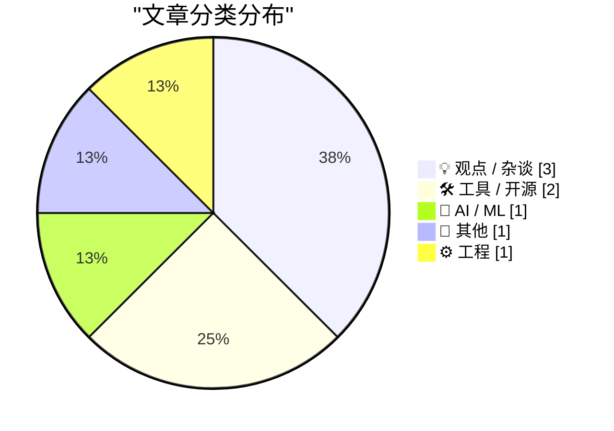
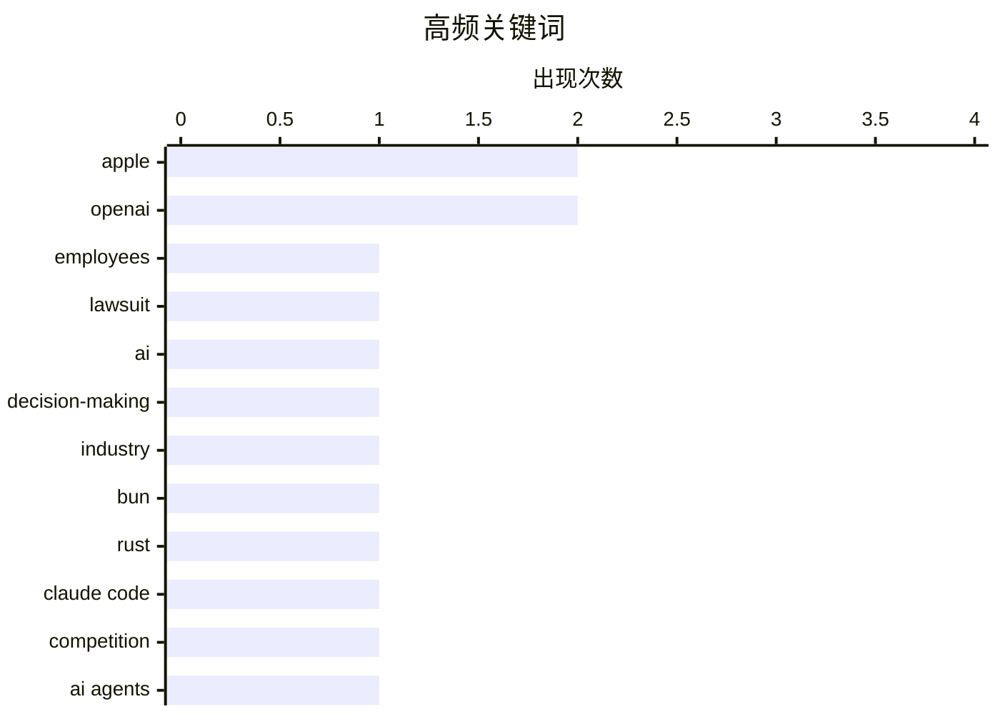

# 📰 AI 博客每日精选 — 2026-07-20

> 来自 Karpathy 推荐的 92 个顶级技术博客，AI 精选 Top 8

## 📝 今日看点

今日技术圈焦点集中在科技巨头间日益白热化的AI博弈与反思。苹果对OpenAI发起激进法律攻势，凸显出巨头在AI领域的竞争已从技术延伸至法庭，同时业界开始警惕AI狂热对企业决策的潜在破坏。在工具生态方面，开发者工具正加速向高性能与易用性演进，如Claude Code采用Rust重写运行时以提升性能，以及新型交互式SQLite查询解释器的推出进一步降低了开发门槛。

---

## 🏆 今日必读

🥇 **苹果向数十名现就职于 OpenAI 的前员工发送律师函**

[Apple Sends Letters to Dozens of Former Employees Now at OpenAI](https://www.ft.com/content/1b8c9d52-88a9-426b-ba47-f1811f859166?syn-25a6b1a6=1) — daringfireball.net · 18 小时前 · 💡 观点 / 杂谈

> 苹果近期向约 40 名目前就职于 OpenAI 的前员工发送了个人律师函，要求他们保留相关文件和通讯记录，并强制要求与苹果律师会面。这一举动凸显了苹果在近期对 OpenAI 发起重大诉讼后的激进法律策略。苹果和 OpenAI 均拒绝对此事发表评论。这表明苹果正试图通过针对个人员工的施压来收集证据，以支持其对 OpenAI 的诉讼。

💡 **为什么值得读**: 了解科技巨头之间法律战的最新进展，以及苹果如何通过针对个人员工来强化其诉讼策略。

🏷️ Apple, OpenAI, employees, lawsuit

🥈 **AI 狂热正在摧毁全球决策**

[AI Mania Is Eviscerating Global Decision-Making](https://simonwillison.net/2026/Jul/19/ai-mania/#atom-everything) — simonwillison.net · 12 小时前 · 💡 观点 / 杂谈

> Nik Suresh 指出当前大型企业正被 AI 狂热所淹没，导致全球决策能力受到严重破坏。文章引用了多位匿名消息来源的辛辣轶事，例如有高管承认自己从未使用过 ChatGPT 或任何 AI 工具，却依然盲目推动相关决策。作者认为这种缺乏实际了解的盲目跟风正在对企业战略产生负面影响。这反映了当前企业界在 AI 转型中存在的认知脱节与管理盲区。

💡 **为什么值得读**: 揭示了企业高管在 AI 浪潮中盲目决策的荒诞现实，对反思当前 AI 泡沫具有警示意义。

🏷️ AI, decision-making, industry

🥉 **Claude Code 现在使用用 Rust 编写的 Bun**

[Claude Code uses Bun written in Rust now](https://simonwillison.net/2026/Jul/19/claude-code-in-bun-in-rust/#atom-everything) — simonwillison.net · 13 小时前 · 🛠 工具 / 开源

> Jarred Sumner 宣布 Claude Code v2.1.181 及更高版本已开始使用 Rust 重写的 Bun 运行时。这一改动使 Linux 上的启动速度提升了 10%，且对大多数用户来说几乎无感。Simon Willison 通过检查自己的 Claude Code 安装环境，找到了其使用 Rust 版 Bun 的确凿证据。这表明底层运行时的优化正在悄然提升开发工具的性能。

💡 **为什么值得读**: 展示了底层运行时技术（Rust 重写 Bun）如何在实际开发工具中落地并带来性能提升，适合关注开发者工具链优化的读者。

🏷️ Bun, Rust, Claude Code

---

## 📊 数据概览

| 扫描源 | 抓取文章 | 时间范围 | 精选 |
|:---:|:---:|:---:|:---:|
| 78/92 | 2408 篇 → 8 篇 | 24h | **8 篇** |

### 分类分布



### 高频关键词



<details>
<summary>📈 纯文本关键词图（终端友好）</summary>

```
apple           │ ████████████████████ 2
openai          │ ████████████████████ 2
employees       │ ██████████░░░░░░░░░░ 1
lawsuit         │ ██████████░░░░░░░░░░ 1
ai              │ ██████████░░░░░░░░░░ 1
decision-making │ ██████████░░░░░░░░░░ 1
industry        │ ██████████░░░░░░░░░░ 1
bun             │ ██████████░░░░░░░░░░ 1
rust            │ ██████████░░░░░░░░░░ 1
claude code     │ ██████████░░░░░░░░░░ 1
```

</details>

### 🏷️ 话题标签

**apple**(2) · **openai**(2) · **employees**(1) · lawsuit(1) · ai(1) · decision-making(1) · industry(1) · bun(1) · rust(1) · claude code(1) · competition(1) · ai agents(1) · quota(1) · api(1) · sqlite(1) · query(1) · explainer(1) · impro(1) · cult(1) · book(1)

---

## 💡 观点 / 杂谈

### 1. 苹果向数十名现就职于 OpenAI 的前员工发送律师函

[Apple Sends Letters to Dozens of Former Employees Now at OpenAI](https://www.ft.com/content/1b8c9d52-88a9-426b-ba47-f1811f859166?syn-25a6b1a6=1) — **daringfireball.net** · 18 小时前 · ⭐ 24/30

> 苹果近期向约 40 名目前就职于 OpenAI 的前员工发送了个人律师函，要求他们保留相关文件和通讯记录，并强制要求与苹果律师会面。这一举动凸显了苹果在近期对 OpenAI 发起重大诉讼后的激进法律策略。苹果和 OpenAI 均拒绝对此事发表评论。这表明苹果正试图通过针对个人员工的施压来收集证据，以支持其对 OpenAI 的诉讼。

🏷️ Apple, OpenAI, employees, lawsuit

---

### 2. AI 狂热正在摧毁全球决策

[AI Mania Is Eviscerating Global Decision-Making](https://simonwillison.net/2026/Jul/19/ai-mania/#atom-everything) — **simonwillison.net** · 12 小时前 · ⭐ 23/30

> Nik Suresh 指出当前大型企业正被 AI 狂热所淹没，导致全球决策能力受到严重破坏。文章引用了多位匿名消息来源的辛辣轶事，例如有高管承认自己从未使用过 ChatGPT 或任何 AI 工具，却依然盲目推动相关决策。作者认为这种缺乏实际了解的盲目跟风正在对企业战略产生负面影响。这反映了当前企业界在 AI 转型中存在的认知脱节与管理盲区。

🏷️ AI, decision-making, industry

---

### 3. 库比蒂诺的早晨再次弥漫着凝固汽油弹的气味

[★ Mornings in Cupertino Have the Aroma of Napalm Once Again](https://daringfireball.net/2026/07/mornings_in_cupertino_have_the_aroma_of_napalm_once_again) — **daringfireball.net** · 16 小时前 · ⭐ 23/30

> 作者以乔布斯的行事风格为参照，探讨了苹果当前应对 OpenAI 局势的态度。文章暗示硬件工程高级副总裁 John Ternus 可能会思考“如果是史蒂夫会怎么做？”，而结论是乔布斯会选择开战。这反映了苹果内部可能存在一种强硬应对竞争对手的文化倾向。作者借此隐喻苹果与 OpenAI 之间的法律战将是一场不留情面的硬仗。

🏷️ Apple, OpenAI, competition

---

## 🛠 工具 / 开源

### 4. Claude Code 现在使用用 Rust 编写的 Bun

[Claude Code uses Bun written in Rust now](https://simonwillison.net/2026/Jul/19/claude-code-in-bun-in-rust/#atom-everything) — **simonwillison.net** · 13 小时前 · ⭐ 23/30

> Jarred Sumner 宣布 Claude Code v2.1.181 及更高版本已开始使用 Rust 重写的 Bun 运行时。这一改动使 Linux 上的启动速度提升了 10%，且对大多数用户来说几乎无感。Simon Willison 通过检查自己的 Claude Code 安装环境，找到了其使用 Rust 版 Bun 的确凿证据。这表明底层运行时的优化正在悄然提升开发工具的性能。

🏷️ Bun, Rust, Claude Code

---

### 5. SQLite 查询解释器

[SQLite Query Explainer](https://simonwillison.net/2026/Jul/18/sqlite-query-explainer/#atom-everything) — **simonwillison.net** · 23 小时前 · ⭐ 19/30

> Simon Willison 受 Julia Evans 关于学习运行 SQLite 的文章启发，开发了一款交互式的 SQLite Query Explainer 工具。该工具旨在帮助开发者更好地理解 SQLite 查询计划，解决“读懂查询计划”这一常见痛点。它通过 Fable 构建并提供交互式解释功能，降低了数据库性能调优的门槛。这为需要优化 SQLite 查询但缺乏底层执行计划分析经验的开发者提供了实用帮助。

🏷️ SQLite, query, explainer

---

## 🤖 AI / ML

### 6. 最近所有这些随机的 Agent 每周配额重置是怎么回事？

[What's the deal with all the random weekly quota resets for agents lately?](https://minimaxir.com/2026/07/agent-quota-reset/) — **minimaxir.com** · 22 小时前 · ⭐ 21/30

> 作者以一种略带戏谑的口吻抱怨了近期 AI Agent 工具频繁出现的每周配额重置现象。尽管这些配额往往是免费提供的，但随机且不稳定的重置机制依然给用户带来了困扰。文章指出，即使是“免费的东西”，如果体验管理不当，也会引发用户的不满。这反映了当前 AI 工具在免费层配额管理上存在的随意性与不一致性。

🏷️ AI agents, quota, API

---

## 📝 其他

### 7. 《即兴》是一本运营邪教的指南

[Impro is a handbook for running a cult](https://seangoedecke.com/impro/) — **seangoedecke.com** · 17 小时前 · ⭐ 14/30

> Sean Goedecke 解读了 Keith Johnstone 的著作《Impro》，提出该书的核心观点：儿童天生具有创造力，但被西方文化和教育暴力地塑造成压抑的成年人。他认为，变得更富有创造力和表现力的过程，很大程度上是解除这些压抑习惯的过程。因此，即兴喜剧不仅是学习表演的万能钥匙，更是解除心理压抑的有效途径。文章将即兴表演的理念延伸到了更广泛的人际互动与组织管理层面。

🏷️ impro, cult, book

---

## ⚙️ 工程

### 8. 低平方和

[Sum of low squares](https://www.johndcook.com/blog/2026/07/19/sum-of-low-squares/) — **johndcook.com** · 30 分钟前 · ⭐ 14/30

> 文章探讨了数论中的一个具体问题：对于奇素数 p，在 1 到 p-1 的范围内，有一半的数是模 p 的二次剩余（平方数），另一半则不是。作者详细解释了这些被称为“低平方”的数的传统命名与数学性质。文章通过具体的数学推导，展示了如何计算和理解这些模运算下的平方数分布规律。这为对数论和模运算感兴趣的读者提供了一个清晰的技术解析。

🏷️ math, prime, squares

---

*生成于 2026-07-20 01:12 (Asia/Shanghai) | 扫描 78 源 → 获取 2408 篇 → 精选 8 篇*
*基于 [Hacker News Popularity Contest 2025](https://refactoringenglish.com/tools/hn-popularity/) RSS 源列表，由 [Andrej Karpathy](https://x.com/karpathy) 推荐*
*由「懂点儿AI」制作，欢迎关注同名微信公众号获取更多 AI 实用技巧 💡*
