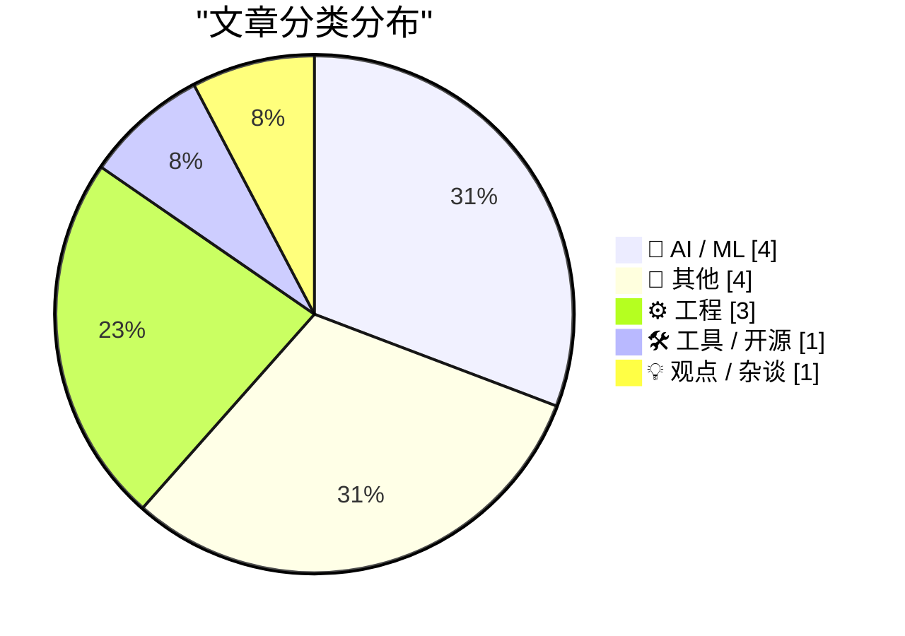
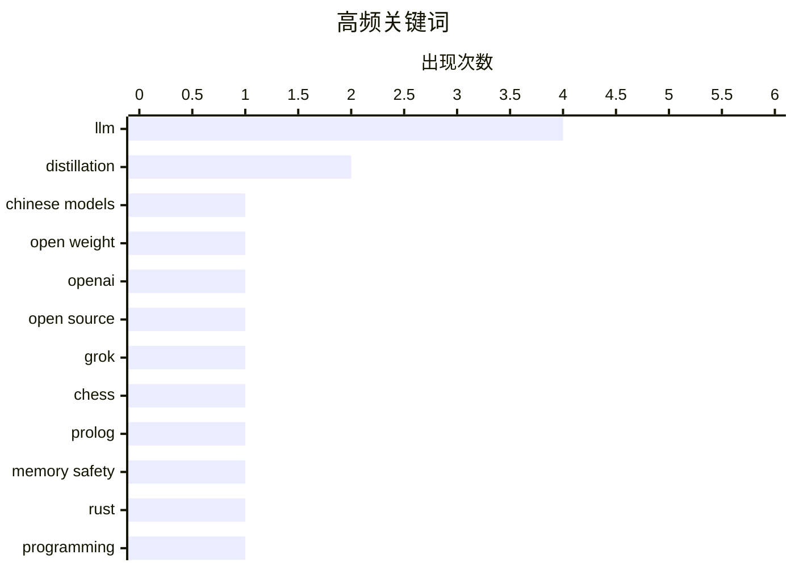

# 📰 AI 博客每日精选 — 2026-07-21

> 来自 Karpathy 推荐的 92 个顶级技术博客，AI 精选 Top 13

## 📝 今日看点

今日技术圈焦点集中在AI开源生态的博弈与底层工程探索上。在AI领域，中美开源模型竞争加剧，OpenAI计划推出本地运行的开源模型以应对挑战，同时业界呼吁完善法律以解决数据训练的版权限制问题。在工程与工具方面，开发者持续关注内存安全等底层系统难题，并迎来设计即代码等融合AI代理的新型开发工具。此外，公共交通的用户体验设计与数学几何的趣味探讨也为技术社区提供了跨界思考。

---

## 🏆 今日必读

🥇 **谁害怕中国模型？**

[Who’s Afraid of Chinese Models?](https://simonwillison.net/2026/Jul/20/afraid-of-chinese-models/#atom-everything) — simonwillison.net · 1 小时前 · 🤖 AI / ML

> Ben Thompson 提出了一项旨在解决前沿实验室禁止模型蒸馏却使用未授权数据训练这一虚伪现象的提案。该提案建议美国通过法律明确将收集数据用于模型训练视为合理使用。此举有望帮助美国开源模型更有效地与中国模型竞争。

💡 **为什么值得读**: 深入探讨了中美AI模型竞争中的开源策略与版权争议，提出了具有颠覆性的政策建议。

🏷️ LLM, distillation, Chinese models

🥈 **“谁害怕中国模型？”**

[‘Who’s Afraid of Chinese Models?’](https://stratechery.com/2026/whos-afraid-of-chinese-models/) — daringfireball.net · 1 小时前 · 🤖 AI / ML

> Ben Thompson 针对 Kimi K3 的热度指出，美国开源权重模型制作者受制于前沿实验室的服务条款，导致其模型劣于中国替代品，且最终只能通过中国实验室间接进行“蒸馏的蒸馏”。文章进一步质问：为什么蒸馏本质上被认为是坏事？呼吁西方开源模型制作者应能直接获取源头数据。

💡 **为什么值得读**: 犀利剖析了当前开源模型在合规与性能之间的两难困境，揭示了中美AI竞争背后的底层逻辑。

🏷️ LLM, open weight, distillation

🥉 **引用 Sam Altman**

[Quoting Sam Altman](https://simonwillison.net/2026/Jul/20/sam-altman/#atom-everything) — simonwillison.net · 14 小时前 · 🤖 AI / ML

> Sam Altman 在内部讨论中透露了 OpenAI 的开源策略，计划尽快发布一个能力近似 GPT-3 且能在消费级硬件上本地运行的语言模型。此举旨在抢在 Stability 等竞争对手之前发布，以阻止其他公司发布类似模型，从而巩固其市场地位。

💡 **为什么值得读**: 展示了 OpenAI 早期在开源策略上的防御性思考，对理解大厂开源动机极具参考价值。

🏷️ OpenAI, open source, LLM

---

## 📊 数据概览

| 扫描源 | 抓取文章 | 时间范围 | 精选 |
|:---:|:---:|:---:|:---:|
| 82/92 | 2495 篇 → 13 篇 | 24h | **13 篇** |

### 分类分布



### 高频关键词



<details>
<summary>📈 纯文本关键词图（终端友好）</summary>

```
llm            │ ████████████████████ 4
distillation   │ ██████████░░░░░░░░░░ 2
chinese models │ █████░░░░░░░░░░░░░░░ 1
open weight    │ █████░░░░░░░░░░░░░░░ 1
openai         │ █████░░░░░░░░░░░░░░░ 1
open source    │ █████░░░░░░░░░░░░░░░ 1
grok           │ █████░░░░░░░░░░░░░░░ 1
chess          │ █████░░░░░░░░░░░░░░░ 1
prolog         │ █████░░░░░░░░░░░░░░░ 1
memory safety  │ █████░░░░░░░░░░░░░░░ 1
```

</details>

### 🏷️ 话题标签

**llm**(4) · **distillation**(2) · **chinese models**(1) · open weight(1) · openai(1) · open source(1) · grok(1) · chess(1) · prolog(1) · memory safety(1) · rust(1) · programming(1) · c++(1) · winrt(1) · windows(1) · html(1) · css(1) · design tool(1) · regex(1) · grep(1)

---

## 🤖 AI / ML

### 1. 谁害怕中国模型？

[Who’s Afraid of Chinese Models?](https://simonwillison.net/2026/Jul/20/afraid-of-chinese-models/#atom-everything) — **simonwillison.net** · 1 小时前 · ⭐ 24/30

> Ben Thompson 提出了一项旨在解决前沿实验室禁止模型蒸馏却使用未授权数据训练这一虚伪现象的提案。该提案建议美国通过法律明确将收集数据用于模型训练视为合理使用。此举有望帮助美国开源模型更有效地与中国模型竞争。

🏷️ LLM, distillation, Chinese models

---

### 2. “谁害怕中国模型？”

[‘Who’s Afraid of Chinese Models?’](https://stratechery.com/2026/whos-afraid-of-chinese-models/) — **daringfireball.net** · 1 小时前 · ⭐ 24/30

> Ben Thompson 针对 Kimi K3 的热度指出，美国开源权重模型制作者受制于前沿实验室的服务条款，导致其模型劣于中国替代品，且最终只能通过中国实验室间接进行“蒸馏的蒸馏”。文章进一步质问：为什么蒸馏本质上被认为是坏事？呼吁西方开源模型制作者应能直接获取源头数据。

🏷️ LLM, open weight, distillation

---

### 3. 引用 Sam Altman

[Quoting Sam Altman](https://simonwillison.net/2026/Jul/20/sam-altman/#atom-everything) — **simonwillison.net** · 14 小时前 · ⭐ 21/30

> Sam Altman 在内部讨论中透露了 OpenAI 的开源策略，计划尽快发布一个能力近似 GPT-3 且能在消费级硬件上本地运行的语言模型。此举旨在抢在 Stability 等竞争对手之前发布，以阻止其他公司发布类似模型，从而巩固其市场地位。

🏷️ OpenAI, open source, LLM

---

### 4. 用 Grok 4.5 解决国际象棋难题

[Solving a chess puzzle with Grok 4.5](https://www.johndcook.com/blog/2026/07/20/grok-chess/) — **johndcook.com** · 3 小时前 · ⭐ 19/30

> 作者此前曾使用 Claude 或 ChatGPT 生成 Prolog 或 Lean 代码来解决国际象棋难题，但未对 Grok 抱有期望。在尝试 Grok 4.5 后，发现其表现出色，成功完成了代码生成与难题求解任务。

🏷️ Grok, chess, Prolog, LLM

---

## 📝 其他

### 5. 公共交通：别让我思考！

[Public Transport - Don't Make Me Think!](https://shkspr.mobi/blog/2026/07/public-transport-dont-make-me-think/) — **shkspr.mobi** · 6 小时前 · ⭐ 11/30

> 作者在过去一年中体验了十几个城市的公共交通系统，发现购票流程的复杂程度令人咋舌。部分城市采用以用户为中心的购票设计，而另一些则热衷于构建包含复杂区域、应用和限制的官僚迷宫。文章借用计算机系统设计中的经典理念，呼吁公共交通票务系统应遵循“别让我思考”的可用性原则。

🏷️ UX, public transport, ticketing

---

### 6. 正多面体的体积与表面积之比

[Volume to Area ratio for Regular Solids](https://www.johndcook.com/blog/2026/07/20/volume-area-regular-solids/) — **johndcook.com** · 3 小时前 · ⭐ 11/30

> 球体的体积 V = 4πr³ / 3，表面积 A = 4πr²，其体积与表面积之比 V / A = r / 3。令人惊讶的是，如果 r 代表最大内切球的半径，所有正多面体（如正方体、正四面体等）的体积与表面积之比都遵循这一相同的数学规律。

🏷️ math, geometry, regular solids

---

### 7. OpenTK：现在也支持互联网咨询和通知

[OpenTK: nu ook met Internetconsultaties & notificaties](https://berthub.eu/articles/posts/opentk-internetconsultaties/) — **berthub.eu** · 6 小时前 · ⭐ 11/30

> OpenTK 是一个自 2024 年起运营的平台，旨在透明化展示荷兰众议院的立法动态并提供邮件通知服务。其创建动机源于作者曾意外发现一项涉及 DNS 的法律即将在几天内投票，而互联网行业对此却毫不知情。为避免此类“信息盲区”再次发生，作者开发了该系统以追踪议会动向。该平台的核心价值在于让互联网从业者能及时掌握并应对可能影响其领域的立法活动。

🏷️ OpenTK, politics, notifications

---

### 8. MCI 与 Worldcom 的合并、破产与丑闻

[The MCI Worldcom merger, bankruptcy, and scandal](https://dfarq.homeip.net/the-mci-worldcom-merger-bankruptcy-and-scandal/?utm_source=rss&#038;utm_medium=rss&#038;utm_campaign=the-mci-worldcom-merger-bankruptcy-and-scandal) — **dfarq.homeip.net** · 7 小时前 · ⭐ 7/30

> 1997 年 11 月 4 日，MCI 与 Worldcom 完成了价值 370 亿美元的合并案。两家大型电信公司试图通过联合来与当时的行业巨头 AT&T 竞争。然而，这场备受瞩目的并购最终演变成了美国历史上最大的企业丑闻和破产案之一。文章回顾了这场从雄心勃勃的合并走向灾难性结局的始末。

🏷️ MCI, Worldcom, scandal, history

---

## ⚙️ 工程

### 9. 内存安全最难的问题

[Memory Safety's Hardest Problem](https://matklad.github.io/2026/07/20/memory-safety-hardest-problem.html) — **matklad.github.io** · 18 小时前 · ⭐ 19/30

> 文章将一个来自 Lobsters 社区的评论提取出来作为独立参考，探讨了内存安全领域中最具挑战性的问题。该内容聚焦于系统编程中内存安全机制难以覆盖的边缘情况或设计盲区。

🏷️ memory safety, Rust, programming

---

### 10. 在 C++/WinRT 中制作 Windows 运行时委托的敏捷版本（第 1 部分）

[Making an agile version of a Windows Runtime delegate in C++/WinRT, part 1](https://devblogs.microsoft.com/oldnewthing/20260720-00/?p=112545) — **devblogs.microsoft.com/oldnewthing** · 4 小时前 · ⭐ 17/30

> 本系列文章的第一部分介绍了如何在 C++/WinRT 中创建 Windows 运行时委托的敏捷版本。文章从最简单的情况入手，演示了基础场景下的实现方法，为后续更复杂的异步和线程模型处理奠定基础。

🏷️ C++, WinRT, Windows

---

### 11. 为单词列表拟合正则表达式

[Fitting a regular expression to a list of words](https://www.johndcook.com/blog/2026/07/19/fitting-a-regex/) — **johndcook.com** · 22 小时前 · ⭐ 15/30

> 当需要搜索一个单词列表时，可以使用 grep 工具的 -f 标志提供包含正则表达式的文件，并结合 -F 标志明确这些内容只是普通单词而非复杂的正则模式。文章通过实际搜索案例展示了如何高效处理批量字符串匹配需求。

🏷️ regex, grep, search

---

## 🛠 工具 / 开源

### 12. Paper：设计与代码合一的新工具

[Paper](https://paper.design/?utm_source=df) — **daringfireball.net** · 19 小时前 · ⭐ 15/30

> Paper 是一款全新的专业设计工具，其核心特点是每一层都是真实的 HTML 和 CSS，实现了设计即代码的理念。它支持代码与设计的双向转换，可通过 MCP 连接 AI 代理进行读写，还能使用 Paper Snapshot 将实时网站捕获为可编辑图层，大幅减少了设计与开发之间的交接成本。

🏷️ HTML, CSS, design tool

---

## 💡 观点 / 杂谈

### 13. 我添加了一个博客链接列表

[I added a blogroll](https://matduggan.com/i-added-a-blogroll/) — **matduggan.com** · 6 小时前 · ⭐ 9/30

> 作者在个人网站上添加了一个“blogroll”（博客链接列表）功能，用于向偶然访问的读者推荐其他可能感兴趣的网站。尽管“blogroll”是一个由来已久的互联网概念，但作者直到今天才首次接触并决定采用它。这一举措旨在通过简单的链接分享，提升访客的浏览体验并促进独立博客间的相互发现。

🏷️ blogroll, blogging, web

---

*生成于 2026-07-21 02:16 (Asia/Shanghai) | 扫描 82 源 → 获取 2495 篇 → 精选 13 篇*
*基于 [Hacker News Popularity Contest 2025](https://refactoringenglish.com/tools/hn-popularity/) RSS 源列表，由 [Andrej Karpathy](https://x.com/karpathy) 推荐*
*由「懂点儿AI」制作，欢迎关注同名微信公众号获取更多 AI 实用技巧 💡*
