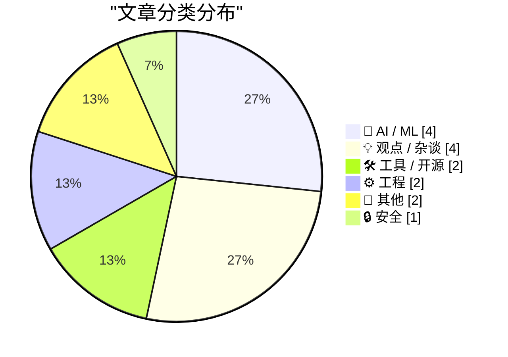
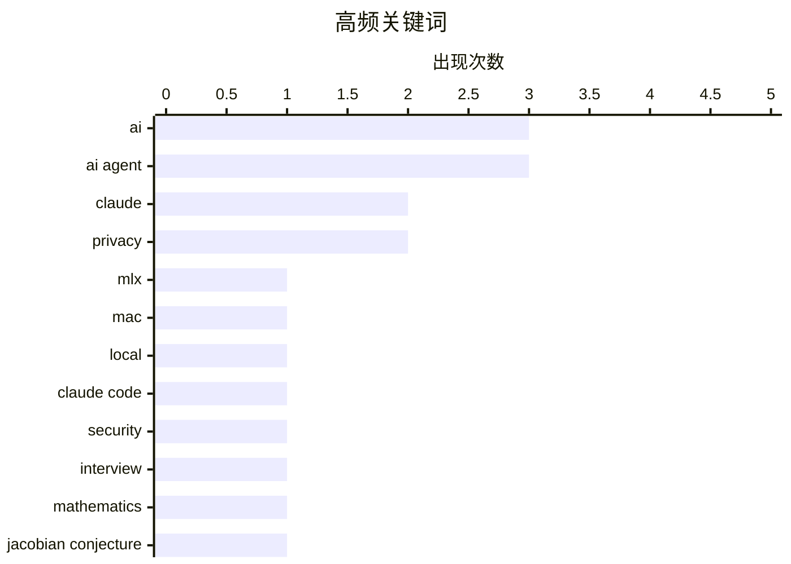

# 📰 AI 博客每日精选 — 2026-07-22

> 来自 Karpathy 推荐的 92 个顶级技术博客，AI 精选 Top 15

## 📝 今日看点

今日技术圈的核心焦点是AI代理与本地大模型在自动化领域的深度落地。从管理认证平台的MCP服务器到逆向工程家庭设备，AI正从单纯的对话工具转变为主动执行任务的智能助手，并在数学猜想等复杂科学领域展现出惊人的发现能力。与此同时，开放网络与数据隐私的博弈依然激烈，加密技术能否抵御政府数据索取、Web开放平台如何应对DRM挑战，成为业界持续关注的安全与伦理议题。

---

## 🏆 今日必读

🥇 **Nativ：在 Mac 上本地运行 AI 模型**

[Nativ: Run AI models locally on your Mac](https://simonwillison.net/2026/Jul/21/nativ/#atom-everything) — simonwillison.net · 3 小时前 · 🤖 AI / ML

> Nativ 是 Prince Canuma（MLX-VLM 库作者）推出的全新 macOS 桌面应用，将 MLX 封装为完整的图形界面工具。功能形态类似 LM Studio，同时提供聊天界面和 localhost API 服务器来访问本地模型。该应用让 Mac 用户无需命令行即可运行基于 MLX 的 AI 模型，降低了本地推理的使用门槛。

💡 **为什么值得读**: 如果你想在 Mac 上用图形界面跑本地模型，Nativ 是 LM Studio 之外值得关注的新选择。

🏷️ AI, MLX, Mac, local

🥈 **与 Claude Code 团队的 Cat 和 Thariq 炉边对谈**

[A Fireside Chat with Cat and Thariq from the Claude Code team](https://simonwillison.net/2026/Jul/21/cat-and-thariq/#atom-everything) — simonwillison.net · 4 小时前 · 🤖 AI / ML

> Simon Willison 在 AI Engineer World's Fair 上与 Anthropic Claude Code 团队的 Cat Wu 和 Thariq Shihipar 进行了一场炉边对谈。话题涵盖 Claude Code、Claude Tag、Fable、编码代理安全、evals、工具设计，以及 Anthropic 内部如何使用这些工具。完整视频已在 YouTube 发布，并附有编辑后的文字稿。

💡 **为什么值得读**: 直接来自 Claude Code 核心团队的一手洞察，涵盖安全、evals 和工具设计等实战话题。

🏷️ Claude Code, AI agent, security, interview

🥉 **局部处处成立并不意味着处处成立**

[Locally everywhere does not imply everywhere](https://www.johndcook.com/blog/2026/07/21/jacobian-conjecture/) — johndcook.com · 5 小时前 · 🤖 AI / ML

> Anthropic 的数学家 Levent Alpöge 使用 Claude Fable 5 发现了 Jacobian 猜想的一个反例。作者 John D. Cook 随后向 Claude 询问数学界此前对该猜想的普遍态度。文章围绕这一发现展开讨论，探讨局部性质不能推广到全局的数学思想。

💡 **为什么值得读**: AI 辅助发现数学猜想反例的真实案例，展示了大模型在纯数学研究中的新角色。

🏷️ mathematics, AI, Jacobian conjecture, Claude

---

## 📊 数据概览

| 扫描源 | 抓取文章 | 时间范围 | 精选 |
|:---:|:---:|:---:|:---:|
| 82/92 | 2494 篇 → 16 篇 | 24h | **15 篇** |

### 分类分布



### 高频关键词



<details>
<summary>📈 纯文本关键词图（终端友好）</summary>

```
ai          │ ████████████████████ 3
ai agent    │ ████████████████████ 3
claude      │ █████████████░░░░░░░ 2
privacy     │ █████████████░░░░░░░ 2
mlx         │ ███████░░░░░░░░░░░░░ 1
mac         │ ███████░░░░░░░░░░░░░ 1
local       │ ███████░░░░░░░░░░░░░ 1
claude code │ ███████░░░░░░░░░░░░░ 1
security    │ ███████░░░░░░░░░░░░░ 1
interview   │ ███████░░░░░░░░░░░░░ 1
```

</details>

### 🏷️ 话题标签

**ai**(3) · **ai agent**(3) · **claude**(2) · privacy(2) · mlx(1) · mac(1) · local(1) · claude code(1) · security(1) · interview(1) · mathematics(1) · jacobian conjecture(1) · home automation(1) · reverse-engineering(1) · automation(1) · mcp(1) · authentication(1) · workos(1) · encryption(1) · data access(1)

---

## 🤖 AI / ML

### 1. Nativ：在 Mac 上本地运行 AI 模型

[Nativ: Run AI models locally on your Mac](https://simonwillison.net/2026/Jul/21/nativ/#atom-everything) — **simonwillison.net** · 3 小时前 · ⭐ 24/30

> Nativ 是 Prince Canuma（MLX-VLM 库作者）推出的全新 macOS 桌面应用，将 MLX 封装为完整的图形界面工具。功能形态类似 LM Studio，同时提供聊天界面和 localhost API 服务器来访问本地模型。该应用让 Mac 用户无需命令行即可运行基于 MLX 的 AI 模型，降低了本地推理的使用门槛。

🏷️ AI, MLX, Mac, local

---

### 2. 与 Claude Code 团队的 Cat 和 Thariq 炉边对谈

[A Fireside Chat with Cat and Thariq from the Claude Code team](https://simonwillison.net/2026/Jul/21/cat-and-thariq/#atom-everything) — **simonwillison.net** · 4 小时前 · ⭐ 24/30

> Simon Willison 在 AI Engineer World's Fair 上与 Anthropic Claude Code 团队的 Cat Wu 和 Thariq Shihipar 进行了一场炉边对谈。话题涵盖 Claude Code、Claude Tag、Fable、编码代理安全、evals、工具设计，以及 Anthropic 内部如何使用这些工具。完整视频已在 YouTube 发布，并附有编辑后的文字稿。

🏷️ Claude Code, AI agent, security, interview

---

### 3. 局部处处成立并不意味着处处成立

[Locally everywhere does not imply everywhere](https://www.johndcook.com/blog/2026/07/21/jacobian-conjecture/) — **johndcook.com** · 5 小时前 · ⭐ 23/30

> Anthropic 的数学家 Levent Alpöge 使用 Claude Fable 5 发现了 Jacobian 猜想的一个反例。作者 John D. Cook 随后向 Claude 询问数学界此前对该猜想的普遍态度。文章围绕这一发现展开讨论，探讨局部性质不能推广到全局的数学思想。

🏷️ mathematics, AI, Jacobian conjecture, Claude

---

### 4. 每周更新 513：用 Claude 整合家庭网络

[Weekly Update 513: Clauding The Home Network](https://www.troyhunt.com/weekly-update-513/) — **troyhunt.com** · 10 小时前 · ⭐ 22/30

> Troy Hunt 本周视频展示了 Claude 如何将 UniFi、Home Assistant 和 Pi-Hole 的信息整合在一起。核心价值在于 AI 能从大量噪音数据中提取有用信息并建立关联。这代表了 AI 在智能家居管理场景中的实际应用方向。

🏷️ Claude, home automation, AI

---

## 💡 观点 / 杂谈

### 5. 逆向工程现在很便宜了

[Reverse-engineering is cheap now](https://simonwillison.net/2026/Jul/20/cheap-reverse-engineering/#atom-everything) — **simonwillison.net** · 22 小时前 · ⭐ 21/30

> 越来越多的人使用编码代理来逆向工程和自动化家中的设备。作者认为这是代码编写成本下降的一个有趣体现——以前逆向工程家庭设备完全可行，但 ROI 太低不值得做。更重要的是，有经验的程序员都知道这类未文档化、不稳定的 API 未来可能会变更或失效。

🏷️ reverse-engineering, AI agent, automation

---

### 6. Pluralistic：应对 dickovers（2026年7月21日）

[Pluralistic: Dealing with dickovers (21 Jul 2026) dickovers](https://pluralistic.net/2026/07/21/dickovers/) — **pluralistic.net** · 8 小时前 · ⭐ 19/30

> Cory Doctorow 本期文章主题是 Web 作为开放平台的重要性。链接集合涵盖 Broadcast 的糟糕一周、国会与 WiFi 的博弈、EFF 对 DRM 法律的挑战、Snowden 与 bunnie 的智能手机智能壳项目等。文章强调开放网络平台的核心价值及其面临的威胁。

🏷️ open web, DRM, privacy

---

### 7. 对于企业来说，赚取（额外）利润应该是附带的结果吗？

[For a Business, Should Making (Extra) Money Be Incidental?](https://simone.org/business-money-incidental/) — **simone.org** · 4 小时前 · ⭐ 13/30

> 商业的核心目的并非单纯追求利润最大化，而是通过满足人类欲望来创造价值。作者认为，人类是欲望驱动的机器，优秀的商业模式应当帮助消散这些欲望，而非利用或剥削消费者。赚取额外利润应当是提供优质服务和产品后的自然附带结果。这种理念将企业的关注点从短期变现转移到了长期用户价值的构建上。

🏷️ business, money, philosophy

---

### 8. 昂贵现在只是一种品牌效应

[Expensive Is Just a Brand Now](https://idiallo.com/blog/expensive-is-just-branding) — **idiallo.com** · 18 小时前 · ⭐ 12/30

> 传统观念认为“买便宜反而更贵”，因为廉价商品易损坏需频繁更换，不如一次性投资高质量商品划算。然而，作者指出在当今市场中，“昂贵”已经演变成一种纯粹的品牌效应，而非质量或耐用度的保证。许多高价商品并不比平价替代品拥有更好的实际使用寿命或性能。消费者需要打破“贵即好”的迷思，理性评估产品的真实价值。

🏷️ brand, consumerism, economics

---

## 🛠 工具 / 开源

### 9. [赞助] WorkOS MCP：从任意 AI 代理管理你的认证平台

[[Sponsor] WorkOS MCP: Manage Your Auth Platform From Any AI Agent](https://workos.com/blog/management-mcp-server?utm_source=daringfireball&amp;utm_medium=newsletter&amp;utm_campaign=q32026) — **daringfireball.net** · 18 小时前 · ⭐ 21/30

> WorkOS 推出了 MCP 服务器，让 AI 代理获得与仪表盘登录相同的访问权限，涵盖数百种操作。调试 SSO、管理用户、调整认证策略、配置品牌等配置任务此前只能通过人工驱动的 UI 完成。该服务器通过 OAuth 一条命令连接，使用 scoped token 而非 master API key，还支持传入营销网站截图让代理匹配登录页面风格。

🏷️ MCP, authentication, AI agent, WorkOS

---

### 10. –end-of-options

[–end-of-options](https://nesbitt.io/2026/07/21/end-of-options.html) — **nesbitt.io** · 7 小时前 · ⭐ 16/30

> 作者发现了一个 git flag，起初以为是 LLM 产生的幻觉。文章围绕这个看似不存在的 git 选项展开，验证其真实性并探讨其用途。

🏷️ git, CLI, options

---

## ⚙️ 工程

### 11. 在 C++/WinRT 中创建敏捷版 Windows Runtime 委托（第二部分）

[Making an agile version of a Windows Runtime delegate in C++/WinRT, part 2](https://devblogs.microsoft.com/oldnewthing/20260721-00/?p=112550) — **devblogs.microsoft.com/oldnewthing** · 3 小时前 · ⭐ 15/30

> 本文是 Raymond Chen 关于在 C++/WinRT 中创建敏捷版 Windows Runtime 委托系列文章的第二部分。重点介绍如何短路处理最简单的情况，以优化委托的敏捷性实现。

🏷️ C++, WinRT, Windows

---

### 12. Python中的法务会计

[Forensic accounting in Python](https://www.johndcook.com/blog/2026/07/21/forensic-accounting-in-python/) — **johndcook.com** · 2 小时前 · ⭐ 15/30

> 逆向工程数据分析时，常面临变量取值不确定但总和已知的情况。作者通过类似法务会计的案例，展示了如何利用Python推断出这些不确定变量的真实取值。该方法能够有效消除数据分析过程中的歧义，还原原始计算逻辑。掌握这种逆向推断技巧，有助于在数据审计和复盘中快速定位问题根源。

🏷️ Python, data analysis, reverse engineering

---

## 📝 其他

### 13. Kuiper Q-Q图：这些数据相同吗？

[Kuiper Q-Q plot: are these the same?](https://entropicthoughts.com/kuiper-q-q-plot) — **entropicthoughts.com** · 19 小时前 · ⭐ 14/30

> 在比较两组数据的分布差异时，传统的统计方法可能难以直观展现变化。文章介绍了Kuiper Q-Q图作为一种可视化工具，用于判断两组数据是否来自同一分布。通过一个儿童治疗评分的案例，展示了该图表如何揭示实验组比参考组具有更大的分数波动。Kuiper Q-Q图提供了一种比标准Q-Q图更敏感的分布尾部差异检测手段。

🏷️ statistics, Q-Q plot, distribution

---

### 14. 微软的第一款产品

[The First Microsoft Product](https://dfarq.homeip.net/the-first-microsoft-product/?utm_source=rss&#038;utm_medium=rss&#038;utm_campaign=the-first-microsoft-product) — **dfarq.homeip.net** · 6 小时前 · ⭐ 11/30

> 1975年1月2日，微软发布了其历史上的第一款产品Altair Basic。这是一款专为MITS Altair 8800计算机设计的编程语言，允许用户为这款新型计算机编写自己的软件。该产品的发布不仅标志着微软商业旅程的起点，也开启了个人电脑软件生态的先河。Altair Basic的成功为微软后续在软件行业的统治地位奠定了基础。

🏷️ Microsoft, history, Altair

---

## 🔒 安全

### 15. 一家美国加密公司能否将美国政府拒之门外？

[Kan een Amerikaans bedrijf met encryptie de Amerikaanse overheid buiten de deur houden?](https://berthub.eu/articles/posts/kan-een-amerikaans-bedrijf-zo-versleutelen-dat-amerikanen-er-niet-bijkunnen/) — **berthub.eu** · 4 小时前 · ⭐ 20/30

> 即使是部分美国背景的公司也可能被各种手段强制向美国政府交出数据，且白宫一纸通知即可停止服务而无需司法审查。任何纸质协议都无法解决这一问题，荷兰政府律师也持同样观点。文章探讨了加密技术是否能为非美国用户提供一条抵御美国政府数据索取的出路。

🏷️ encryption, privacy, data access

---

*生成于 2026-07-22 01:48 (Asia/Shanghai) | 扫描 82 源 → 获取 2494 篇 → 精选 15 篇*
*基于 [Hacker News Popularity Contest 2025](https://refactoringenglish.com/tools/hn-popularity/) RSS 源列表，由 [Andrej Karpathy](https://x.com/karpathy) 推荐*
*由「懂点儿AI」制作，欢迎关注同名微信公众号获取更多 AI 实用技巧 💡*
