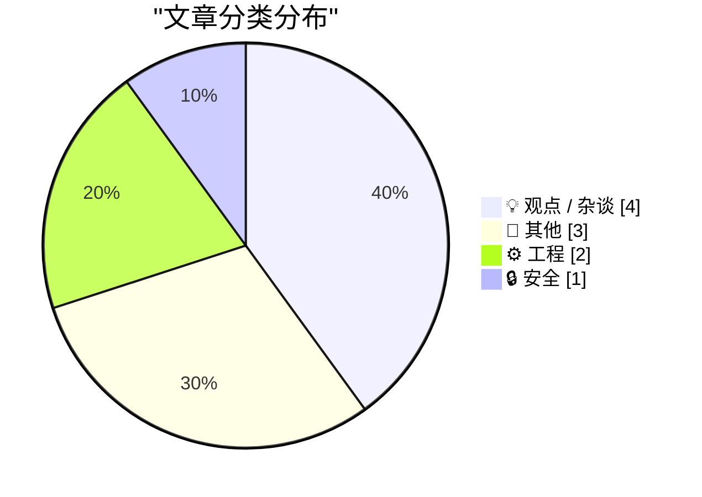
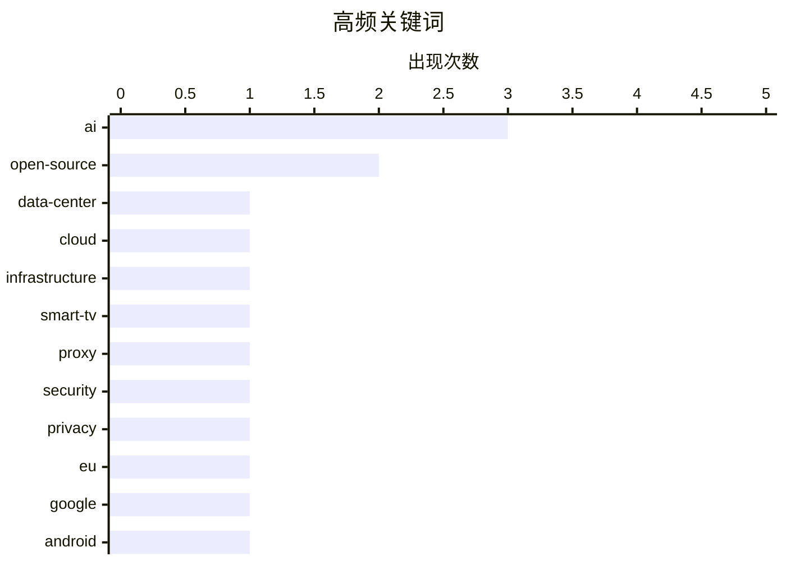

# 📰 AI 博客每日精选 — 2026-07-23

> 来自 Karpathy 推荐的 92 个顶级技术博客，AI 精选 Top 10

## 📝 今日看点

今日技术圈焦点集中在AI狂热背后的基础设施与监管挑战。一方面，数据中心潜在的次贷危机引发对算力扩张风险的担忧，欧盟则针对谷歌在安卓生态中的AI互操作性下达指导意见，加码反垄断监管。另一方面，随着软件分发模式的演变与智能电视对住宅代理的封杀，行业对隐私安全与生态开放的关注度持续升温。此外，从业者在AI疲劳中开始回溯计算历史，从复古的Amiga 1000到开源精神，寻找技术发展的纯粹初心。

---

## 🏆 今日必读

🥇 **The Subprime Data Center Crisis**

[The Subprime Data Center Crisis](https://www.wheresyoured.at/the-subprime-data-center-crisis/) — wheresyoured.at · 1 小时前 · 💡 观点 / 杂谈

> The Subprime Data Center Crisis

🏷️ data-center, cloud, infrastructure, AI

🥈 **LG to Ban Residential Proxies from Smart TV Apps**

[LG to Ban Residential Proxies from Smart TV Apps](https://krebsonsecurity.com/2026/07/lg-to-ban-residential-proxies-from-smart-tv-apps/) — krebsonsecurity.com · 16 小时前 · 🔒 安全

> LG to Ban Residential Proxies from Smart TV Apps

🏷️ smart-tv, proxy, security, privacy

🥉 **★ European Commission: ‘Guidance to Google for AI Interoperability on Android & Sharing of Google Search’**

[★ European Commission: ‘Guidance to Google for AI Interoperability on Android & Sharing of Google Search’](https://daringfireball.net/2026/07/ec_google_guidance_android_ai_and_search_sharing) — daringfireball.net · 18 小时前 · 💡 观点 / 杂谈

> ★ European Commission: ‘Guidance to Google for AI Interoperability on Android & Sharing of Google Search’

🏷️ EU, Google, Android, AI

---

## 📊 数据概览

| 扫描源 | 抓取文章 | 时间范围 | 精选 |
|:---:|:---:|:---:|:---:|
| 83/92 | 2507 篇 → 10 篇 | 24h | **10 篇** |

### 分类分布



### 高频关键词



<details>
<summary>📈 纯文本关键词图（终端友好）</summary>

```
ai             │ ████████████████████ 3
open-source    │ █████████████░░░░░░░ 2
data-center    │ ███████░░░░░░░░░░░░░ 1
cloud          │ ███████░░░░░░░░░░░░░ 1
infrastructure │ ███████░░░░░░░░░░░░░ 1
smart-tv       │ ███████░░░░░░░░░░░░░ 1
proxy          │ ███████░░░░░░░░░░░░░ 1
security       │ ███████░░░░░░░░░░░░░ 1
privacy        │ ███████░░░░░░░░░░░░░ 1
eu             │ ███████░░░░░░░░░░░░░ 1
```

</details>

### 🏷️ 话题标签

**ai**(3) · **open-source**(2) · **data-center**(1) · cloud(1) · infrastructure(1) · smart-tv(1) · proxy(1) · security(1) · privacy(1) · eu(1) · google(1) · android(1) · software-distribution(1) · semver(1) · community(1) · vibe-coding(1) · social-media(1) · geolocation(1) · activitypub(1) · at-protocol(1)

---

## 💡 观点 / 杂谈

### 1. The Subprime Data Center Crisis

[The Subprime Data Center Crisis](https://www.wheresyoured.at/the-subprime-data-center-crisis/) — **wheresyoured.at** · 1 小时前 · ⭐ 25/30

> The Subprime Data Center Crisis

🏷️ data-center, cloud, infrastructure, AI

---

### 2. ★ European Commission: ‘Guidance to Google for AI Interoperability on Android & Sharing of Google Search’

[★ European Commission: ‘Guidance to Google for AI Interoperability on Android & Sharing of Google Search’](https://daringfireball.net/2026/07/ec_google_guidance_android_ai_and_search_sharing) — **daringfireball.net** · 18 小时前 · ⭐ 23/30

> ★ European Commission: ‘Guidance to Google for AI Interoperability on Android & Sharing of Google Search’

🏷️ EU, Google, Android, AI

---

### 3. Open Sauce and GPS time were my summer AI Antiseptics

[Open Sauce and GPS time were my summer AI Antiseptics](https://www.jeffgeerling.com/blog/2026/open-sauce-gps-time-badge/) — **jeffgeerling.com** · 3 小时前 · ⭐ 22/30

> Open Sauce and GPS time were my summer AI Antiseptics

🏷️ AI, open-source, community, vibe-coding

---

### 4. Amiga 1000: Ten years ahead of its time

[Amiga 1000: Ten years ahead of its time](https://dfarq.homeip.net/amiga-1000-ten-years-ahead-of-its-time/?utm_source=rss&#038;utm_medium=rss&#038;utm_campaign=amiga-1000-ten-years-ahead-of-its-time) — **dfarq.homeip.net** · 6 小时前 · ⭐ 15/30

> Amiga 1000: Ten years ahead of its time

🏷️ Amiga, computer-history, retro-computing

---

## 📝 其他

### 5. When sine of x degrees equals sine of x radians

[When sine of x degrees equals sine of x radians](https://www.johndcook.com/blog/2026/07/22/degrees-radians/) — **johndcook.com** · 5 小时前 · ⭐ 15/30

> When sine of x degrees equals sine of x radians

🏷️ math, sine, radians, degrees

---

### 6. Does creatine make you smarter?

[Does creatine make you smarter?](https://dynomight.net/creatine/) — **dynomight.net** · 17 小时前 · ⭐ 14/30

> Does creatine make you smarter?

🏷️ creatine, brain, health

---

### 7. Pluralistic: Trump's America can't even win a rigged game (22 Jul 2026)

[Pluralistic: Trump's America can't even win a rigged game (22 Jul 2026)](https://pluralistic.net/2026/07/22/table-flipper/) — **pluralistic.net** · 8 小时前 · ⭐ 13/30

> Pluralistic: Trump's America can't even win a rigged game (22 Jul 2026)

🏷️ politics, society

---

## ⚙️ 工程

### 8. Not just development, distribution of software may change as well

[Not just development, distribution of software may change as well](http://antirez.com/news/170) — **antirez.com** · 2 小时前 · ⭐ 23/30

> Not just development, distribution of software may change as well

🏷️ open-source, software-distribution, semver

---

### 9. Scattered thoughts on social geolocation

[Scattered thoughts on social geolocation](https://shkspr.mobi/blog/2026/07/scattered-thoughts-on-social-geolocation/) — **shkspr.mobi** · 6 小时前 · ⭐ 17/30

> Scattered thoughts on social geolocation

🏷️ social-media, geolocation, ActivityPub, AT-Protocol

---

## 🔒 安全

### 10. LG to Ban Residential Proxies from Smart TV Apps

[LG to Ban Residential Proxies from Smart TV Apps](https://krebsonsecurity.com/2026/07/lg-to-ban-residential-proxies-from-smart-tv-apps/) — **krebsonsecurity.com** · 16 小时前 · ⭐ 23/30

> LG to Ban Residential Proxies from Smart TV Apps

🏷️ smart-tv, proxy, security, privacy

---

*生成于 2026-07-23 01:36 (Asia/Shanghai) | 扫描 83 源 → 获取 2507 篇 → 精选 10 篇*
*基于 [Hacker News Popularity Contest 2025](https://refactoringenglish.com/tools/hn-popularity/) RSS 源列表，由 [Andrej Karpathy](https://x.com/karpathy) 推荐*
*由「懂点儿AI」制作，欢迎关注同名微信公众号获取更多 AI 实用技巧 💡*
