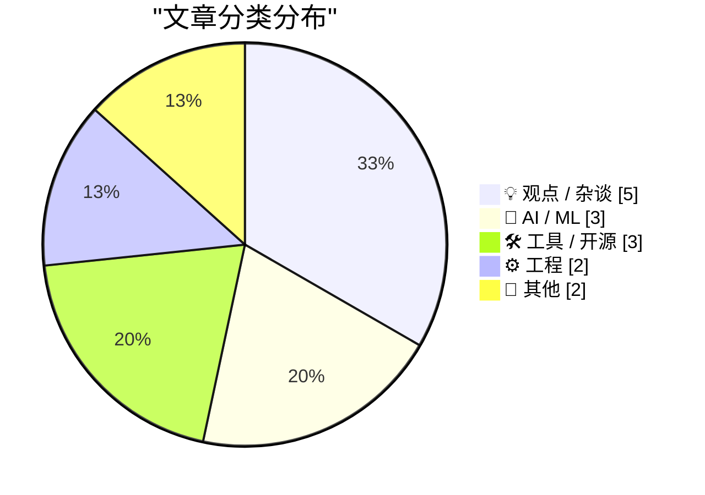
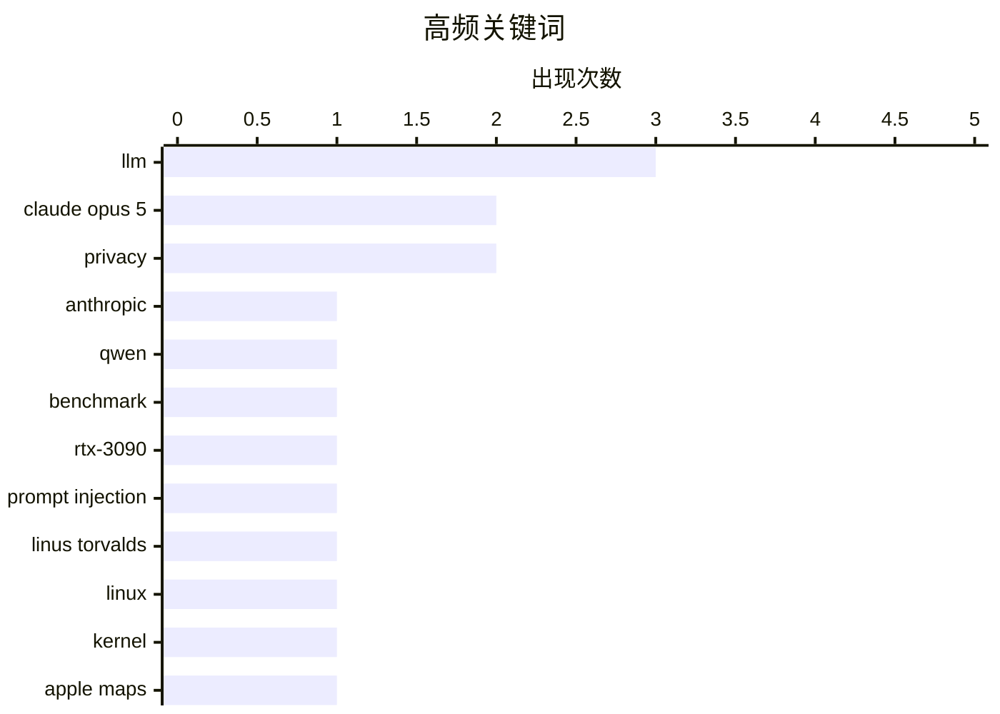

# 📰 AI 博客每日精选 — 2026-07-26

> 来自 Karpathy 推荐的 92 个顶级技术博客，AI 精选 Top 15

## 📝 今日看点

今日技术圈焦点集中在AI大模型的迭代与本地化部署上，Anthropic发布兼具高性价比与强抗提示注入能力的Claude Opus 5，同时开发者也在积极探索消费级显卡运行大型MoE模型的极限。在科技伦理领域，知名作家Cory Doctorow对企业将风险私有化、成本社会化的行为提出尖锐批评，引发了对数字隐私与平台垄断的深度反思。此外，开发者工具与跨界生态持续演进，苹果与福特在车载导航领域的合作、包管理器的常规更新以及原生IRC客户端的复兴，共同展现了软硬件生态的多元化发展。

---

## 🏆 今日必读

🥇 **介绍 Claude Opus 5**

[Introducing Claude Opus 5](https://simonwillison.net/2026/Jul/24/introducing-claude-opus-5/#atom-everything) — simonwillison.net · 17 小时前 · 🤖 AI / ML

> Anthropic 发布了新模型 Claude Opus 5，官方称其为“深思熟虑且主动的模型”，在智能水平上接近 Claude Fable 5，但价格仅为其一半。目前业界对该模型的初步反馈非常积极。作者因外出活动尚未进行深入测试，但对其高性价比的定位表示关注。

💡 **为什么值得读**: 了解 Anthropic 最新旗舰级大模型的定价策略与市场初步反馈。

🏷️ Claude Opus 5, Anthropic, LLM

🥈 **在 RTX 3090 上对 Qwen 3.6 35B MoE (3B active) 进行基准测试**

[Benchmarking Qwen 3.6 35B MoE (3B active) on an RTX 3090](https://www.gilesthomas.com/2026/07/benchmarking-qwen-3-6-35b-moe-rtx-3090) — gilesthomas.com · 17 小时前 · 🤖 AI / ML

> 作者在配备 24GB VRAM 的 RTX 3090 显卡上测试了 Qwen 3.6 35B MoE 模型。由于显存限制，必须使用 4-bit 量化版本，这导致上下文窗口受限。尽管如此，该模型在单卡上的运行表现依然令人满意，展示了 MoE 架构在消费级硬件上的潜力。

💡 **为什么值得读**: 了解如何在消费级显卡上运行大型 MoE 模型及其量化后的性能表现。

🏷️ Qwen, LLM, benchmark, RTX-3090

🥉 **引用 Boris Cherny 的话**

[Quoting Boris Cherny](https://simonwillison.net/2026/Jul/25/boris-cherny/#atom-everything) — simonwillison.net · 16 小时前 · 🤖 AI / ML

> Anthropic 的 Boris Cherny 指出，Claude Opus 5 是迄今为止最难被提示注入的模型。在系统卡片的 PI 评估和红队测试中，Opus 5 成功抵御了绝大多数提示注入攻击。这一安全性的提升比单纯的基准测试分数更令人兴奋。

💡 **为什么值得读**: 了解 Claude Opus 5 在提示注入防御方面的重大安全突破。

🏷️ Claude Opus 5, prompt injection, LLM

---

## 📊 数据概览

| 扫描源 | 抓取文章 | 时间范围 | 精选 |
|:---:|:---:|:---:|:---:|
| 82/92 | 2483 篇 → 15 篇 | 24h | **15 篇** |

### 分类分布



### 高频关键词



<details>
<summary>📈 纯文本关键词图（终端友好）</summary>

```
llm              │ ████████████████████ 3
claude opus 5    │ █████████████░░░░░░░ 2
privacy          │ █████████████░░░░░░░ 2
anthropic        │ ███████░░░░░░░░░░░░░ 1
qwen             │ ███████░░░░░░░░░░░░░ 1
benchmark        │ ███████░░░░░░░░░░░░░ 1
rtx-3090         │ ███████░░░░░░░░░░░░░ 1
prompt injection │ ███████░░░░░░░░░░░░░ 1
linus torvalds   │ ███████░░░░░░░░░░░░░ 1
linux            │ ███████░░░░░░░░░░░░░ 1
```

</details>

### 🏷️ 话题标签

**llm**(3) · **claude opus 5**(2) · **privacy**(2) · anthropic(1) · qwen(1) · benchmark(1) · rtx-3090(1) · prompt injection(1) · linus torvalds(1) · linux(1) · kernel(1) · apple maps(1) · ford(1) · mapkit(1) · package-management(1) · releases(1) · advisories(1) · apple(1) · repo(1) · irc(1)

---

## 💡 观点 / 杂谈

### 1. Pluralistic：苹果的机器人仓库 (2026年7月25日)

[Pluralistic: Apple's robo-repo (25 Jul 2026)](https://pluralistic.net/2026/07/25/cruel-cruelty-oh-cruelty/) — **pluralistic.net** · 6 小时前 · ⭐ 18/30

> Cory Doctorow 在文中探讨了苹果的“机器人仓库”概念，批评了企业将风险溢价私有化而将成本社会化的行为。文章还涵盖了印刷电池、垄断信用卡、机场电源插座地图、碳补偿与森林火灾等多个科技与社会交叉领域的热点话题。

🏷️ Apple, repo, privacy

---

### 2. “Enshittification”的提出者支持“Dickover”概念

[Coiner of ‘Enshittification’ Endorses ‘Dickover’](https://pluralistic.net/2026/07/21/dickovers/) — **daringfireball.net** · 22 小时前 · ⭐ 17/30

> Cory Doctorow 在文中支持“Dickover”这一概念，认为夺取计算手段不是盗窃，而是一种讨价还价的方式。他批评商业监控公司声称用隐私换取在线服务是一种市场交换，但实际上这是一种不公平的市场模式，商家在用户浏览时就已经伸手掏用户的口袋。

🏷️ enshittification, surveillance, privacy

---

### 3. 关于 EMF Camp 2026 的一些快速想法

[Some Quick Thoughts on EMF Camp 2026](https://shkspr.mobi/blog/2026/07/some-quick-thoughts-on-emf-camp-2026/) — **shkspr.mobi** · 5 小时前 · ⭐ 17/30

> 作者分享了参加 EMF Camp 2026 的体验，这次他选择纯粹作为游客参加，而不是像过去三届那样进行演讲。没有了设备故障的焦虑、拉拢观众的社交压力和演讲前后的肾上腺素波动，这种纯粹的参与体验让他感到无比轻松和愉悦。

🏷️ EMF Camp, hacker camp, conference

---

### 4. 关于广告拦截器与 Daring Fireball

[★ Regarding Ad Blockers and Daring Fireball](https://daringfireball.net/2026/07/regarding_ad_blockers_and_daring_fireball) — **daringfireball.net** · 20 小时前 · ⭐ 15/30

> 安装内容拦截扩展程序后，用户需对其过度拦截的内容承担最终责任。作者针对 Daring Fireball 网站被广告拦截器误伤的情况进行了说明。核心观点是拦截器的行为由使用者负责，而非网站本身。

🏷️ ad blockers, content blocker, web

---

### 5. 播客笔记：Ed Catmull 接受 David Senra 采访

[Podcast Notes: Ed Catmull on David Senra](https://blog.jim-nielsen.com/2026/podcast-notes-ed-catmull/) — **blog.jim-nielsen.com** · 22 小时前 · ⭐ 13/30

> 皮克斯联合创始人兼前迪士尼动画总裁 Ed Catmull 在 David Senra 播客中分享了他的管理理念。他强调自己的核心工作是“为团队群体建立正确的互动动态”。这篇笔记提炼了采访中的关键观点，并推荐了其著作《创新公司》。

🏷️ Pixar, podcast, creativity, leadership

---

## 🤖 AI / ML

### 6. 介绍 Claude Opus 5

[Introducing Claude Opus 5](https://simonwillison.net/2026/Jul/24/introducing-claude-opus-5/#atom-everything) — **simonwillison.net** · 17 小时前 · ⭐ 26/30

> Anthropic 发布了新模型 Claude Opus 5，官方称其为“深思熟虑且主动的模型”，在智能水平上接近 Claude Fable 5，但价格仅为其一半。目前业界对该模型的初步反馈非常积极。作者因外出活动尚未进行深入测试，但对其高性价比的定位表示关注。

🏷️ Claude Opus 5, Anthropic, LLM

---

### 7. 在 RTX 3090 上对 Qwen 3.6 35B MoE (3B active) 进行基准测试

[Benchmarking Qwen 3.6 35B MoE (3B active) on an RTX 3090](https://www.gilesthomas.com/2026/07/benchmarking-qwen-3-6-35b-moe-rtx-3090) — **gilesthomas.com** · 17 小时前 · ⭐ 23/30

> 作者在配备 24GB VRAM 的 RTX 3090 显卡上测试了 Qwen 3.6 35B MoE 模型。由于显存限制，必须使用 4-bit 量化版本，这导致上下文窗口受限。尽管如此，该模型在单卡上的运行表现依然令人满意，展示了 MoE 架构在消费级硬件上的潜力。

🏷️ Qwen, LLM, benchmark, RTX-3090

---

### 8. 引用 Boris Cherny 的话

[Quoting Boris Cherny](https://simonwillison.net/2026/Jul/25/boris-cherny/#atom-everything) — **simonwillison.net** · 16 小时前 · ⭐ 22/30

> Anthropic 的 Boris Cherny 指出，Claude Opus 5 是迄今为止最难被提示注入的模型。在系统卡片的 PI 评估和红队测试中，Opus 5 成功抵御了绝大多数提示注入攻击。这一安全性的提升比单纯的基准测试分数更令人兴奋。

🏷️ Claude Opus 5, prompt injection, LLM

---

## 🛠 工具 / 开源

### 9. Apple Maps 将为福特新款电动汽车提供导航体验

[Apple Maps to Power Navigation Experience for Ford’s New EVs](https://www.apple.com/newsroom/2026/07/apple-maps-to-power-navigation-experience-for-ford-uev-platform/) — **daringfireball.net** · 52 分钟前 · ⭐ 19/30

> 苹果与福特宣布合作，Apple Maps 将通过全新的 MapKit for Automotive SDK 直接集成到福特的 Universal Electric Vehicle (UEV) 平台中。该功能预计于 2027 年推出，将为车载显示屏提供导航服务，并支持福特的 Latitude AI 团队构建无缝的免提驾驶体验。

🏷️ Apple Maps, Ford, MapKit

---

### 10. 本周包管理动态：2026年7月25日

[This Week in Package Management: 25 July 2026](https://nesbitt.io/2026/07/25/this-week-in-package-management.html) — **nesbitt.io** · 7 小时前 · ⭐ 19/30

> 本文汇总了本周包管理领域的最新动态，包括各类包管理器的版本发布、安全公告以及相关技术文章。内容覆盖了多个生态系统的更新情况，为开发者提供了一周内的重要变更追踪。

🏷️ package-management, releases, advisories

---

### 11. bIRC — 一款全新的 Mac 原生 IRC 客户端

[bIRC — A New Native IRC Client for Mac](https://birc.app/) — **daringfireball.net** · 1 小时前 · ⭐ 17/30

> 随着 Mac 平台上曾经最好的原生 IRC 客户端 Textual 停止维护，开发者 Fredrik Blank 推出了全新的 bIRC。该客户端使用 Swift 编写，遵循 RFC 2812 规范。作者表示，在 2026 年开发 IRC 客户端纯粹是为了编程的乐趣，而非商业盈利。

🏷️ IRC, Mac, client

---

## ⚙️ 工程

### 12. 成为 Linus Torvalds

[Being Linux Torvalds](http://antirez.com/news/171) — **antirez.com** · 5 小时前 · ⭐ 20/30

> 文章回顾了 Linus Torvalds 开发初代 Linux 内核的历史。当时他通过研究 Minix 源码和计算机架构掌握了必要的基础知识，并为 386 处理器编写了一个最小但可用的 Unix 内核。作者探讨了这种从零开始编写内核的壮举在当时技术环境下的意义。

🏷️ Linus Torvalds, Linux, kernel

---

### 13. Excel 的列编号机制

[Excel column numbering](https://www.johndcook.com/blog/2026/07/25/excel-column-numbering/) — **johndcook.com** · 3 小时前 · ⭐ 14/30

> Excel 的列标签并非简单的 26 进制系统，因为它缺少代表 0 的字符。作者在处理客户宽表格时，需要将 Excel 列标签与列号进行转换，从而发现了这一长期被忽视的数学细节。这一发现揭示了 Excel 列名转换背后的实际算法逻辑。

🏷️ Excel, base-26, numbering, algorithm

---

## 📝 其他

### 14. 美国麻疹病例创历史新高，反疫苗者拒绝接种

[Measles Cases Hit New Record in U.S., as Stupid-Americans Reject Vaccines](https://www.nytimes.com/2026/07/24/well/measles-record-united-states-numbers.html?unlocked_article_code=1.0VA.4jBf.vqAYN4Bwu807) — **daringfireball.net** · 1 小时前 · ⭐ 10/30

> 美国疾病控制与预防中心（CDC）宣布今年已确诊 2318 例麻疹病例，打破了去年的记录。过去两年美国报告的麻疹病例数超过了 2000 年至 2024 年的总和，并导致两名未接种疫苗的儿童死亡。文章指出反疫苗运动是导致疫情卷土重来的主要原因。

🏷️ measles, vaccines, public health

---

### 15. 阅读清单 07/25/26

[Reading List 07/25/26](https://www.construction-physics.com/p/reading-list-072526) — **construction-physics.com** · 3 小时前 · ⭐ 10/30

> 本期阅读清单汇总了多篇关于能源与基础设施领域的深度文章。涵盖的主题包括中国电动汽车补贴政策、航改型燃气轮机的未来发展趋势、美沙核协议，以及存在缺陷的道路护栏问题。这些内容为关注全球工业、能源政策与基础设施安全的读者提供了丰富的阅读资源。

🏷️ reading-list, EV, energy

---

*生成于 2026-07-26 01:13 (Asia/Shanghai) | 扫描 82 源 → 获取 2483 篇 → 精选 15 篇*
*基于 [Hacker News Popularity Contest 2025](https://refactoringenglish.com/tools/hn-popularity/) RSS 源列表，由 [Andrej Karpathy](https://x.com/karpathy) 推荐*
*由「懂点儿AI」制作，欢迎关注同名微信公众号获取更多 AI 实用技巧 💡*
