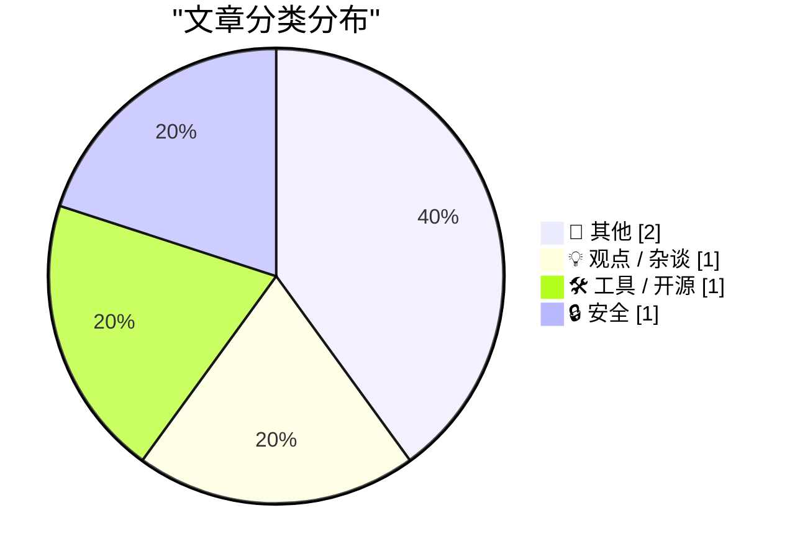
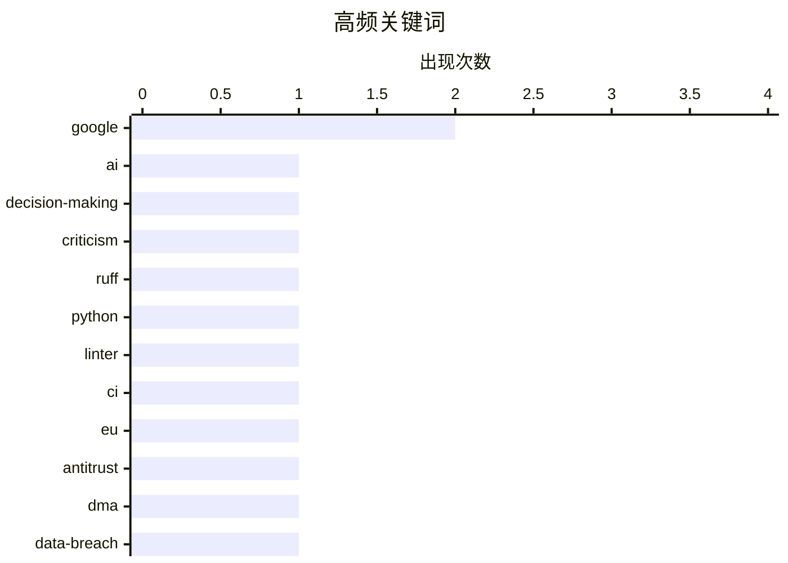

# 📰 AI 博客每日精选 — 2026-07-27

> 来自 Karpathy 推荐的 92 个顶级技术博客，AI 精选 Top 5

## 📝 今日看点

今日技术圈焦点集中在科技巨头监管与AI狂热反思两大核心议题。一方面，欧盟重罚谷歌10亿美元以维护市场竞争，美国法院也驳回谷歌对开放互联网的诉讼限制，彰显全球对科技垄断的持续打击。另一方面，业界开始警惕AI炒作对企业理性决策的侵蚀，呼吁回归商业本质。此外，Python工具Ruff迎来重大更新，同时数据泄露事件频发，提醒开发者与企业在提升效率的同时不可忽视安全底线。

---

## 🏆 今日必读

🥇 **“AI狂热正在摧毁全球决策”**

[‘AI Mania Is Eviscerating Global Decision-Making’](https://ludic.mataroa.blog/blog/ai-mania-is-eviscerating-global-decision-making/) — daringfireball.net · 23 小时前 · 💡 观点 / 杂谈

> AI狂热正导致企业高管在决策时盲目跟风，甚至做出夸大其词的创新承诺。财富500强企业的高管虽然技术能力出众，但在公司层面却屈服于对AI的过度炒作。这种现象正在侵蚀全球范围内的理性商业决策。作者认为，这种盲目的AI狂热对实际业务价值构成了严重威胁。

💡 **为什么值得读**: 深刻揭示了当前AI炒作对企业高层决策的负面影响，适合反思技术狂热背后的商业现实。

🏷️ AI, decision-making, criticism

🥈 **Ruff v0.16.0 发布**

[Ruff v0.16.0](https://simonwillison.net/2026/Jul/25/ruff/#atom-everything) — simonwillison.net · 18 小时前 · 🛠 工具 / 开源

> Astral 发布了 Python 代码检查工具 Ruff 的重大新版本 v0.16.0。该版本将默认启用的规则数量从之前的 59 个大幅增加至 413 个。这一变更导致许多未固定依赖版本的 CI 任务因新增的默认检查而失败。Ruff 正在通过更严格的默认规则来提升 Python 代码质量标准。

💡 **为什么值得读**: 了解 Ruff 新版本默认规则的重大变更，有助于 Python 开发者及时更新 CI 配置并避免构建失败。

🏷️ Ruff, Python, linter, CI

🥉 **欧盟因违反 DMA 竞争规则对谷歌罚款 10 亿美元**

[EU Fines Google $1 Billion for DMA Competition Violations, Including Making Search Results More Useful](https://digital-markets-act.ec.europa.eu/commission-fines-google-eur890-million-breaches-digital-markets-act-2026-07-23_en) — daringfireball.net · 23 小时前 · 📝 其他

> 欧盟委员会因谷歌违反《数字市场法案》（DMA）对其处以 8.9 亿欧元（约 10 亿美元）的罚款。调查发现谷歌在搜索结果中偏袒自身的购物、酒店、交通和体育等服务，给予其更突出的展示位置和增强的视觉效果。这种自我优待行为使第三方服务处于不公平的竞争劣势。此举彰显了欧盟维护数字市场公平竞争的决心。

💡 **为什么值得读**: 详细解读了欧盟对谷歌自我优待行为的巨额处罚，是了解数字市场反垄断监管的重要案例。

🏷️ Google, EU, antitrust, DMA

---

## 📊 数据概览

| 扫描源 | 抓取文章 | 时间范围 | 精选 |
|:---:|:---:|:---:|:---:|
| 81/92 | 2481 篇 → 5 篇 | 24h | **5 篇** |

### 分类分布



### 高频关键词



<details>
<summary>📈 纯文本关键词图（终端友好）</summary>

```
google          │ ████████████████████ 2
ai              │ ██████████░░░░░░░░░░ 1
decision-making │ ██████████░░░░░░░░░░ 1
criticism       │ ██████████░░░░░░░░░░ 1
ruff            │ ██████████░░░░░░░░░░ 1
python          │ ██████████░░░░░░░░░░ 1
linter          │ ██████████░░░░░░░░░░ 1
ci              │ ██████████░░░░░░░░░░ 1
eu              │ ██████████░░░░░░░░░░ 1
antitrust       │ ██████████░░░░░░░░░░ 1
```

</details>

### 🏷️ 话题标签

**google**(2) · **ai**(1) · **decision-making**(1) · criticism(1) · ruff(1) · python(1) · linter(1) · ci(1) · eu(1) · antitrust(1) · dma(1) · data-breach(1) · security(1) · privacy(1) · serpapi(1) · lawsuit(1) · open-internet(1)

---

## 📝 其他

### 1. 欧盟因违反 DMA 竞争规则对谷歌罚款 10 亿美元

[EU Fines Google $1 Billion for DMA Competition Violations, Including Making Search Results More Useful](https://digital-markets-act.ec.europa.eu/commission-fines-google-eur890-million-breaches-digital-markets-act-2026-07-23_en) — **daringfireball.net** · 23 小时前 · ⭐ 22/30

> 欧盟委员会因谷歌违反《数字市场法案》（DMA）对其处以 8.9 亿欧元（约 10 亿美元）的罚款。调查发现谷歌在搜索结果中偏袒自身的购物、酒店、交通和体育等服务，给予其更突出的展示位置和增强的视觉效果。这种自我优待行为使第三方服务处于不公平的竞争劣势。此举彰显了欧盟维护数字市场公平竞争的决心。

🏷️ Google, EU, antitrust, DMA

---

### 2. 法院批准 SerpApi 驳回谷歌诉讼的动议

[Court Grants SerpApi’s Motion to Dismiss Google Lawsuit](https://serpapi.com/blog/google-v-serpapi-the-court-granted-our-motion-to-dismiss/) — **daringfireball.net** · 23 小时前 · ⭐ 20/30

> 美国加州北区地方法院批准了 SerpApi 驳回谷歌诉讼的动议，标志着开放互联网的胜利。法院拒绝了谷歌试图扩大《数字千年版权法》（DMCA）以控制公共页面访问的企图。这一裁决维护了互联网开放获取可用信息的创始原则。SerpApi 的胜诉为所有依赖公共数据访问的创新者提供了法律保障。

🏷️ Google, SerpApi, lawsuit, open-internet

---

## 💡 观点 / 杂谈

### 3. “AI狂热正在摧毁全球决策”

[‘AI Mania Is Eviscerating Global Decision-Making’](https://ludic.mataroa.blog/blog/ai-mania-is-eviscerating-global-decision-making/) — **daringfireball.net** · 23 小时前 · ⭐ 24/30

> AI狂热正导致企业高管在决策时盲目跟风，甚至做出夸大其词的创新承诺。财富500强企业的高管虽然技术能力出众，但在公司层面却屈服于对AI的过度炒作。这种现象正在侵蚀全球范围内的理性商业决策。作者认为，这种盲目的AI狂热对实际业务价值构成了严重威胁。

🏷️ AI, decision-making, criticism

---

## 🛠 工具 / 开源

### 4. Ruff v0.16.0 发布

[Ruff v0.16.0](https://simonwillison.net/2026/Jul/25/ruff/#atom-everything) — **simonwillison.net** · 18 小时前 · ⭐ 23/30

> Astral 发布了 Python 代码检查工具 Ruff 的重大新版本 v0.16.0。该版本将默认启用的规则数量从之前的 59 个大幅增加至 413 个。这一变更导致许多未固定依赖版本的 CI 任务因新增的默认检查而失败。Ruff 正在通过更严格的默认规则来提升 Python 代码质量标准。

🏷️ Ruff, Python, linter, CI

---

## 🔒 安全

### 5. 每周更新 514：本周数据泄露事件

[Weekly Update 514: This Week in Data Breaches](https://www.troyhunt.com/weekly-update-514/) — **troyhunt.com** · 8 小时前 · ⭐ 22/30

> 本周澳大利亚能源巨头 Origin Energy 遭遇数据泄露事件，引发广泛关注。事件呈现多面性：公司声称用户信用卡数据安全，而黑客则对此提出反驳。此类事件再次凸显了企业在数据泄露公关与实际安全状况之间的信息不对称。数据泄露的复杂性使得用户难以评估真实风险。

🏷️ data-breach, security, privacy

---

*生成于 2026-07-27 01:15 (Asia/Shanghai) | 扫描 81 源 → 获取 2481 篇 → 精选 5 篇*
*基于 [Hacker News Popularity Contest 2025](https://refactoringenglish.com/tools/hn-popularity/) RSS 源列表，由 [Andrej Karpathy](https://x.com/karpathy) 推荐*
*由「懂点儿AI」制作，欢迎关注同名微信公众号获取更多 AI 实用技巧 💡*
