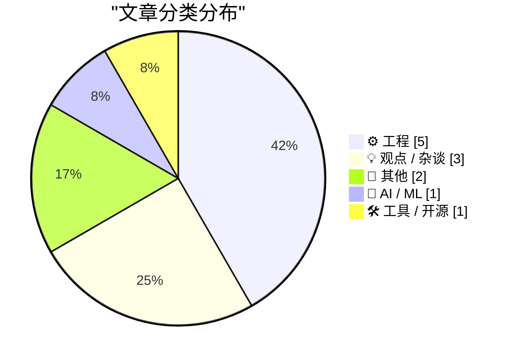
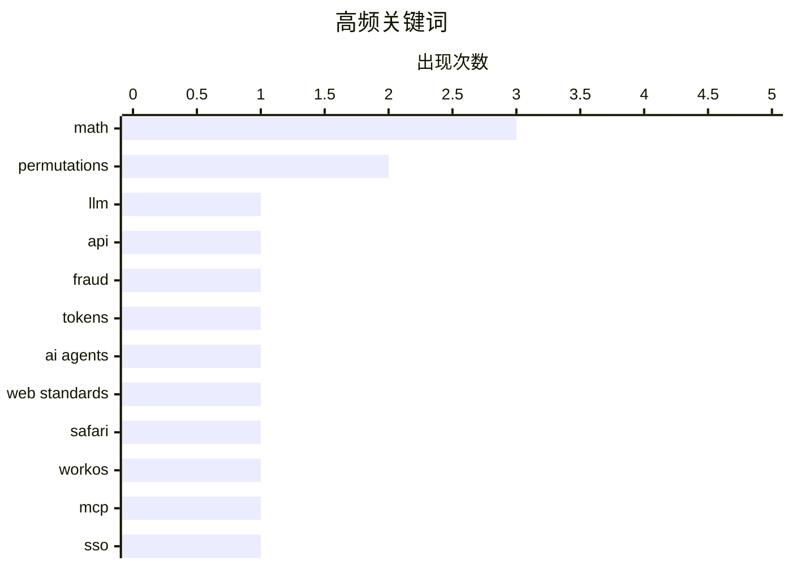

# 📰 AI 博客每日精选 — 2026-07-28

> 来自 Karpathy 推荐的 92 个顶级技术博客，AI 精选 Top 12

## 📝 今日看点

今日技术圈呈现出AI代理加速落地与平台监管博弈并行的态势。一方面，AI代理正深度接管Web平台与系统管理任务，不仅推动了无障碍技术的演进，也暴露出LLM token倒卖等灰产问题；另一方面，欧盟持续加码对谷歌等科技巨头的反垄断制裁，而苹果应用商店广告泛滥则引发了关于平台生态与用户体验的广泛争议。此外，技术社区在底层计算机科学与数学算法领域保持硬核探索，从Haskell电路模拟到浮点数转换及排列根计算，彰显了基础理论的持久魅力。

---

## 🏆 今日必读

🥇 **深入探究为代币倒卖者和欺诈行为提供动力的中继市场**

[An Inside Look at the Relay Market Powering Token Resellers and Fraud](https://simonwillison.net/2026/Jul/26/relay-market/#atom-everything) — simonwillison.net · 22 小时前 · 🤖 AI / ML

> Matt Lenhard 调查了一个通过汇集各种来源的 API 密钥来打折转售 LLM token 的市场。这种现象主要存在于中国，转售商通过滥用免费试用等方式提供远低于正常 API 价格的 LLM 代理访问权限。这种灰色市场不仅涉及折扣 token 的分销，还滋生了欺诈行为。该调查揭示了 LLM API 生态中存在的安全漏洞和滥用模式。

💡 **为什么值得读**: 揭示了 LLM API 密钥滥用和折扣转售背后的灰色产业链，对了解 AI 服务的安全风险具有警示意义。

🏷️ LLM, API, fraud, tokens

🥈 **AI 投资的浪潮能否托起 Web 上的所有船只？**

[Can the Tide of AI Investment Life All Boats on the Web?](https://blog.jim-nielsen.com/2026/tide-lifts-all-boats/) — blog.jim-nielsen.com · -65 分钟前 · 💡 观点 / 杂谈

> Jason Grigsby 探讨了 Web 平台为 AI 所做的改进是否也能惠及所有用户。Safari 团队提出，代表用户操作的 AI 代理实际上是一种辅助技术，它应该像普通用户一样操作网站，网站不应对其进行特殊对待。文章综合了不同观点，思考 AI 的发展是否会推动 Web 技术的整体进步。作者认为，为 AI 优化 Web 体验的举措应当同时提升人类用户的体验。

💡 **为什么值得读**: 从辅助技术的独特视角审视 AI 代理与 Web 平台的关系，为 Web 开发者提供了兼顾人类与 AI 用户的思考方向。

🏷️ AI agents, web standards, Safari

🥉 **WorkOS MCP**

[WorkOS MCP](https://workos.com/blog/management-mcp-server?utm_source=daringfireball&amp;utm_medium=newsletter&amp;utm_campaign=q32026) — daringfireball.net · 1 小时前 · 🛠 工具 / 开源

> WorkOS 推出了其 MCP (Model Context Protocol) 服务器，允许 AI 代理执行以往只能由人类在 UI 上操作的管理任务。该服务器赋予代理与仪表盘登录相同的访问权限，支持数百种可在运行时发现的操作。用户可通过 OAuth 进行单命令连接，使用受限令牌而非主 API 密钥，甚至可以传递营销网站的截图让代理进行配置。这大大简化了 SSO 调试、用户管理、身份验证策略调整等配置工作。

💡 **为什么值得读**: 展示了 MCP 协议在身份与访问管理自动化方面的实际应用，是 AI 代理接管传统运维配置任务的优秀范例。

🏷️ WorkOS, MCP, SSO, agents

---

## 📊 数据概览

| 扫描源 | 抓取文章 | 时间范围 | 精选 |
|:---:|:---:|:---:|:---:|
| 82/92 | 2483 篇 → 12 篇 | 24h | **12 篇** |

### 分类分布



### 高频关键词



<details>
<summary>📈 纯文本关键词图（终端友好）</summary>

```
math          │ ████████████████████ 3
permutations  │ █████████████░░░░░░░ 2
llm           │ ███████░░░░░░░░░░░░░ 1
api           │ ███████░░░░░░░░░░░░░ 1
fraud         │ ███████░░░░░░░░░░░░░ 1
tokens        │ ███████░░░░░░░░░░░░░ 1
ai agents     │ ███████░░░░░░░░░░░░░ 1
web standards │ ███████░░░░░░░░░░░░░ 1
safari        │ ███████░░░░░░░░░░░░░ 1
workos        │ ███████░░░░░░░░░░░░░ 1
```

</details>

### 🏷️ 话题标签

**math**(3) · **permutations**(2) · **llm**(1) · api(1) · fraud(1) · tokens(1) · ai agents(1) · web standards(1) · safari(1) · workos(1) · mcp(1) · sso(1) · agents(1) · eu(1) · google(1) · antitrust(1) · apple(1) · app store(1) · ads(1) · haskell(1)

---

## ⚙️ 工程

### 1. 用 Haskell 实现数字电路模拟器 (SICP 3.3)

[Digital circuit simulator in Haskell (SICP 3.3)](https://entropicthoughts.com/sicp-3-3-digital-circuit-simulator-in-haskell) — **entropicthoughts.com** · 19 小时前 · ⭐ 17/30

> 作者分享了使用 Haskell 实现《计算机程序的构造和解释》(SICP) 3.3 节中数字电路模拟器的过程。文章回顾了系列前两部分关于泛型函数的实现方法，包括通过标记值进行调度和填充可变的操作-标记对表。通过 Haskell 的函数式特性，作者展示了如何构建和处理数字电路中的信号与逻辑门。这为理解函数式编程在复杂系统模拟中的应用提供了实践参考。

🏷️ Haskell, SICP, circuit simulator

---

### 2. 以二进制打印浮点数

[Printing floating point numbers in binary](https://www.johndcook.com/blog/2026/07/27/float-binary/) — **johndcook.com** · 2 小时前 · ⭐ 16/30

> 文章介绍了如何将浮点数的十六进制表示直接转换为二进制表示。众所周知，整数的十六进制可以通过逐位转换得到二进制，而作者指出这一方法同样适用于浮点数。通过保留小数点位置并分别转换整数和小数部分，可以轻松实现浮点数的进制转换。这一技巧简化了在底层编程或数值计算中处理浮点数表示的过程。

🏷️ floating point, binary, hex

---

### 3. 计算具有根的排列

[Counting permutations with roots](https://www.johndcook.com/blog/2026/07/27/counting-permutations-with-roots/) — **johndcook.com** · 1 小时前 · ⭐ 15/30

> 文章探讨了如何计算 n 个元素的排列具有 k 次根的概率。作者在之前关于排列根的讨论基础上，提供了使用 Mathematica 查找生成函数中系数的代码。为了进一步说明，文章还展示了如何使用 SymPy 实现相同的计算逻辑。这为组合数学中排列性质的研究提供了具体的计算工具和实现方法。

🏷️ permutations, math, Mathematica

---

### 4. 排列的根

[Permutation roots](https://www.johndcook.com/blog/2026/07/26/permutation-roots/) — **johndcook.com** · 21 小时前 · ⭐ 15/30

> 文章定义并探讨了排列的根的概念。如果存在一个排列 τ，使得对其应用两次的效果等同于对元素列表应用排列 σ 一次，则称 σ = τ²，τ 是 σ 的平方根。作者以整数 0 到 n-1 为元素，深入解释了排列根的数学定义和性质。这为理解抽象代数和组合数学中的排列结构奠定了理论基础。

🏷️ permutations, math, roots

---

### 5. exp_q 函数

[exp_q](https://www.johndcook.com/blog/2026/07/26/exp-q/) — **johndcook.com** · 23 小时前 · ⭐ 15/30

> 文章介绍了 exp_q(x) 函数的定义及其性质。该函数通过保留指数幂级数中索引为 q 的倍数的项来定义。例如，exp_2(x) 仅保留指数幂级数中的偶数项，因此等于双曲余弦函数 cosh(x)。作者利用 Iverson 括号表示法等数学工具，展示了如何构造和分析这类截断级数函数。这为特殊函数和级数研究提供了有趣的视角。

🏷️ math, power series, exp

---

## 💡 观点 / 杂谈

### 6. AI 投资的浪潮能否托起 Web 上的所有船只？

[Can the Tide of AI Investment Life All Boats on the Web?](https://blog.jim-nielsen.com/2026/tide-lifts-all-boats/) — **blog.jim-nielsen.com** · -65 分钟前 · ⭐ 23/30

> Jason Grigsby 探讨了 Web 平台为 AI 所做的改进是否也能惠及所有用户。Safari 团队提出，代表用户操作的 AI 代理实际上是一种辅助技术，它应该像普通用户一样操作网站，网站不应对其进行特殊对待。文章综合了不同观点，思考 AI 的发展是否会推动 Web 技术的整体进步。作者认为，为 AI 优化 Web 体验的举措应当同时提升人类用户的体验。

🏷️ AI agents, web standards, Safari

---

### 7. Pluralistic：欧盟如何惩罚谷歌（尽管有特朗普）(2026年7月27日)

[Pluralistic: How the EU can punish Google (despite Trump) (27 Jul 2026)](https://pluralistic.net/2026/07/27/eucd-6/) — **pluralistic.net** · 7 小时前 · ⭐ 21/30

> 文章探讨了欧盟如何在特朗普的政治压力下继续对谷歌实施反垄断惩罚。作者讨论了欧盟版权指令（EUCD）等法律工具在制约科技巨头方面的作用。文章还汇集了多个科技与文化领域的热点话题，包括版权勒索、物联网安全灾难以及高管薪酬与业绩倒挂等现象。核心观点是欧盟拥有足够的法律和政策手段来独立维护市场竞争秩序。

🏷️ EU, Google, antitrust

---

### 8. ★ 软件中的广告就像笔记本电脑上的贴纸

[★ Ads in Software Are Like Stickers on Laptops](https://daringfireball.net/2026/07/ads_in_software_are_like_stickers_on_laptops) — **daringfireball.net** · 1 小时前 · ⭐ 19/30

> 作者将软件中的广告比作笔记本电脑上的贴纸，质疑苹果高管在 App Store 搜索应用时希望看到多少广告。这一比喻直指当前应用商店中广告泛滥的问题，暗示过多的广告会破坏用户体验和软件的纯粹性。文章以苹果为切入点，批评了科技公司在追求广告收入时对用户感受的忽视。作者认为，软件界面应保持整洁，不应被商业广告过度侵蚀。

🏷️ Apple, App Store, ads

---

## 📝 其他

### 9. 为什么5.5亿美元的医疗债务只花了550万美元

[Why $550 Million Medical Debt only Cost $5.5 Million](https://idiallo.com/byte-size/550-million-only-cost-5-million) — **idiallo.com** · 22 小时前 · ⭐ 14/30

> Snap CEO 夫妇近期因大额医疗债务捐赠登上新闻头条，但媒体报道中刻意模糊了实际捐赠金额，却反复强调 5.5 亿美元这一数字。经过计算发现，他们实际捐赠的金额仅为该数字的百分之一，即 550 万美元。这种夸大金额的做法本质上是一场公关噱头，利用了医疗债务打折交易的机制来制造轰动效应。作者借此揭示了媒体和公关操作如何通过数字游戏误导公众认知。

🏷️ medical debt, finance, Snap

---

### 10. Windows NT 3.1 的优缺点

[Advantages and disadvantages of Windows NT 3.1](https://dfarq.homeip.net/advantages-and-disadvantages-of-windows-nt-3-1/?utm_source=rss&#038;utm_medium=rss&#038;utm_campaign=advantages-and-disadvantages-of-windows-nt-3-1) — **dfarq.homeip.net** · 6 小时前 · ⭐ 8/30

> Windows NT 3.1 于 1993 年 7 月 27 日首次发布，作为操作系统发展史上的重要里程碑，其设计具有独特的时代特征。文章详细评估了该系统在当时的优势，如引入了全新的 NT 内核架构和更高的系统稳定性。同时也指出了其显著的缺点，包括对硬件要求过高以及软件兼容性方面的局限。通过回顾这一经典系统，梳理了微软企业级操作系统发展的早期脉络与技术取舍。

🏷️ Windows NT, operating system, history

---

## 🤖 AI / ML

### 11. 深入探究为代币倒卖者和欺诈行为提供动力的中继市场

[An Inside Look at the Relay Market Powering Token Resellers and Fraud](https://simonwillison.net/2026/Jul/26/relay-market/#atom-everything) — **simonwillison.net** · 22 小时前 · ⭐ 23/30

> Matt Lenhard 调查了一个通过汇集各种来源的 API 密钥来打折转售 LLM token 的市场。这种现象主要存在于中国，转售商通过滥用免费试用等方式提供远低于正常 API 价格的 LLM 代理访问权限。这种灰色市场不仅涉及折扣 token 的分销，还滋生了欺诈行为。该调查揭示了 LLM API 生态中存在的安全漏洞和滥用模式。

🏷️ LLM, API, fraud, tokens

---

## 🛠 工具 / 开源

### 12. WorkOS MCP

[WorkOS MCP](https://workos.com/blog/management-mcp-server?utm_source=daringfireball&amp;utm_medium=newsletter&amp;utm_campaign=q32026) — **daringfireball.net** · 1 小时前 · ⭐ 22/30

> WorkOS 推出了其 MCP (Model Context Protocol) 服务器，允许 AI 代理执行以往只能由人类在 UI 上操作的管理任务。该服务器赋予代理与仪表盘登录相同的访问权限，支持数百种可在运行时发现的操作。用户可通过 OAuth 进行单命令连接，使用受限令牌而非主 API 密钥，甚至可以传递营销网站的截图让代理进行配置。这大大简化了 SSO 调试、用户管理、身份验证策略调整等配置工作。

🏷️ WorkOS, MCP, SSO, agents

---

*生成于 2026-07-28 01:55 (Asia/Shanghai) | 扫描 82 源 → 获取 2483 篇 → 精选 12 篇*
*基于 [Hacker News Popularity Contest 2025](https://refactoringenglish.com/tools/hn-popularity/) RSS 源列表，由 [Andrej Karpathy](https://x.com/karpathy) 推荐*
*由「懂点儿AI」制作，欢迎关注同名微信公众号获取更多 AI 实用技巧 💡*
