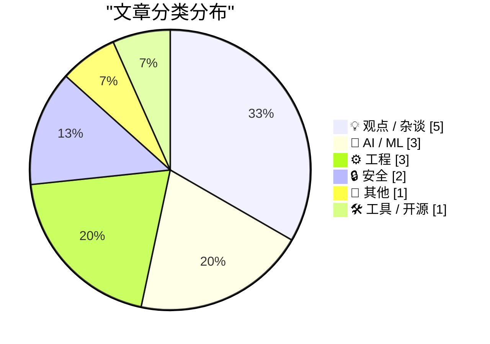
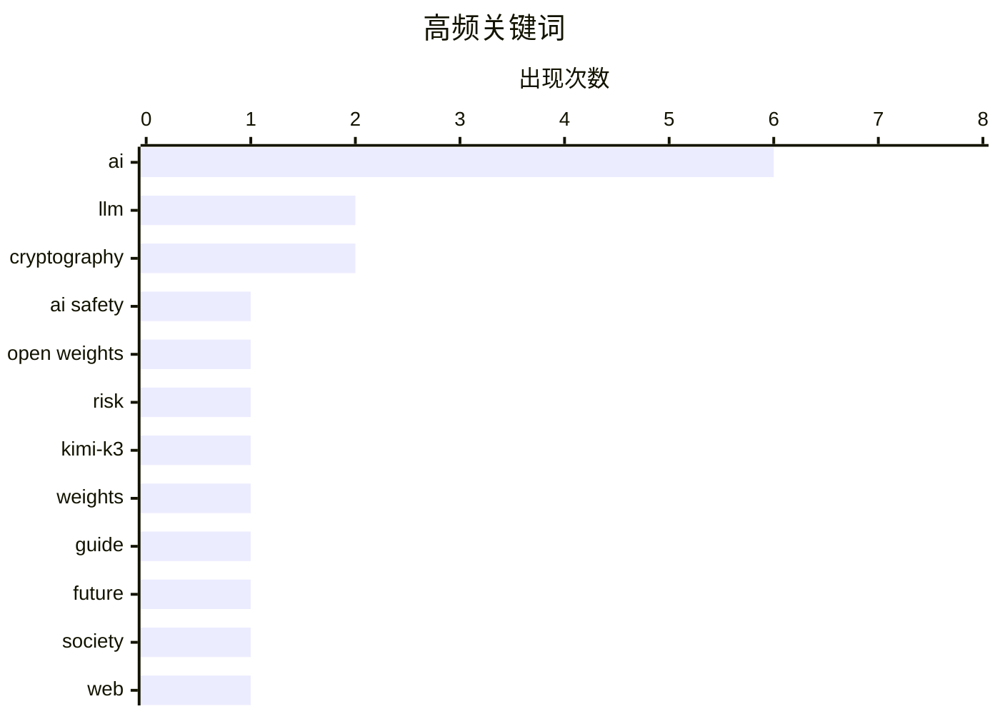

# 📰 AI 博客每日精选 — 2026-07-29

> 来自 Karpathy 推荐的 92 个顶级技术博客，AI 精选 Top 15

## 📝 今日看点

今日技术圈焦点高度集中于人工智能的深层反思与商业博弈，业界开始警惕盲目增加算力带来的巨大财务风险，并指出AI的真正隐患在于实验室内部管理而非开源模型。同时，随着AI能力全面跃升，关于人类在高度自动化社会中的生存意义以及如何保持事实核查辨别力的探讨日益增多。在产品与生态层面，超大规模模型Kimi K3的发布引发关注，而AI代理作为辅助技术重塑Web体验及端侧应用生成的趋势也愈发明显。此外，底层工程优化依然是开发者关注的基础话题，Ruby ZJIT编译器的内联收益与npm依赖树体积膨胀的机制分析为技术实践提供了重要参考。

---

## 🏆 今日必读

🥇 **真正的 AI 风险在实验室内部**

[The real AI risk is inside the labs](http://antirez.com/news/172) — antirez.com · 8 小时前 · 🤖 AI / ML

> AI 的真正风险并非开源权重模型，而是存在于实验室内部。开源模型在所有风险中属于最轻微的一类。类似 OpenAI/HF 的事件表明，严重的 AI 事故往往源于内部管理或操作失误。作者认为，尽管 AI 在不久的将来可能非常危险，但将焦点放在开源模型上是错误的风险归因。

💡 **为什么值得读**: 提供了反直觉的视角，重新审视 AI 安全风险的核心来源，对开源与闭源模型的安全争议有启发意义。

🏷️ AI safety, open weights, risk

🥈 **moonshotai/Kimi-K3**

[moonshotai/Kimi-K3](https://simonwillison.net/2026/Jul/27/kimi-k3/#atom-everything) — simonwillison.net · 18 小时前 · 🤖 AI / ML

> Moonshot 发布了拥有 2.8 万亿参数的 Kimi K3 模型权重，文件大小达 1.56TB。该模型在 Hugging Face 上可用，但附带了一个经过修改的 MIT 许可证。这种修改版许可证最早在 7 月份的 K2 模型中引入，引发了关于其开源合规性的讨论。

💡 **为什么值得读**: 介绍了当前顶级开源大模型的最新发布动态及其特殊的许可证争议，对关注大模型开源生态的开发者极具参考价值。

🏷️ Kimi-K3, LLM, weights

🥉 **关于如何选择 AI 工具的主观指南**

[An opinionated guide to which AI to use to do stuff](https://simonwillison.net/2026/Jul/27/an-opinionated-guide-to-which-ai-to-use-to-do-stuff/#atom-everything) — simonwillison.net · 20 小时前 · 🤖 AI / ML

> Ethan Mollick 的 AI 使用指南随着时间推移发生了显著演变。一年前，该指南主要聚焦于对话式 AI，如 ChatGPT、Claude 和 Gemini，推荐使用 o3、Claude 4 Opus 和 Gemini 2.5 Pro 等模型。如今，指南的演进反映了 AI 工具在实际应用场景中的多样化发展趋势。

💡 **为什么值得读**: 梳理了主流 AI 工具的选择策略演变，帮助读者快速了解当前最适合特定任务的 AI 模型。

🏷️ AI, guide, LLM

---

## 📊 数据概览

| 扫描源 | 抓取文章 | 时间范围 | 精选 |
|:---:|:---:|:---:|:---:|
| 82/92 | 2489 篇 → 20 篇 | 24h | **15 篇** |

### 分类分布



### 高频关键词



<details>
<summary>📈 纯文本关键词图（终端友好）</summary>

```
ai           │ ████████████████████ 6
llm          │ ███████░░░░░░░░░░░░░ 2
cryptography │ ███████░░░░░░░░░░░░░ 2
ai safety    │ ███░░░░░░░░░░░░░░░░░ 1
open weights │ ███░░░░░░░░░░░░░░░░░ 1
risk         │ ███░░░░░░░░░░░░░░░░░ 1
kimi-k3      │ ███░░░░░░░░░░░░░░░░░ 1
weights      │ ███░░░░░░░░░░░░░░░░░ 1
guide        │ ███░░░░░░░░░░░░░░░░░ 1
future       │ ███░░░░░░░░░░░░░░░░░ 1
```

</details>

### 🏷️ 话题标签

**ai**(6) · **llm**(2) · **cryptography**(2) · ai safety(1) · open weights(1) · risk(1) · kimi-k3(1) · weights(1) · guide(1) · future(1) · society(1) · web(1) · user agents(1) · investment(1) · nvidia(1) · compiler(1) · inliner(1) · zjit(1) · ruby(1) · npm(1)

---

## 💡 观点 / 杂谈

### 1. 当未来不再需要我们

[When The Future Doesn’t Need Us](https://borretti.me/article/when-the-future-doesnt-need-us) — **borretti.me** · 17 小时前 · ⭐ 21/30

> 探讨了当 AI 在各个领域全面超越人类时，世界将会呈现何种面貌。文章聚焦于人类在高度自动化和智能化社会中的角色与价值。核心观点是反思技术进步对人类生存意义的潜在冲击。

🏷️ AI, future, society

---

### 2. AI 投资的浪潮能否托起 Web 上的所有船只？

[Can the Tide of AI Investment Lift All Boats on the Web?](https://blog.jim-nielsen.com/2026/tide-lifts-all-boats/) — **blog.jim-nielsen.com** · 22 小时前 · ⭐ 21/30

> Safari 团队提出 AI 代理本质上属于辅助技术，网站不应给予其特殊待遇或区别对待。Jason Grigsby 认为，针对 AI 代理的 Web 改进应当惠及所有用户，而不仅仅是 AI。文章探讨了如何确保 AI 技术的发展能够提升整体 Web 体验，而不是造成新的数字鸿沟。

🏷️ AI, web, user agents

---

### 3. 买得越多，亏得越多

[The More You Buy, The More You Lose](https://www.wheresyoured.at/the-more-you-buy-the-more-you-lose/) — **wheresyoured.at** · 1 小时前 · ⭐ 20/30

> 深入分析了当前 AI 行业的投资逻辑与潜在亏损风险。文章指出，盲目增加算力和硬件采购并不必然带来商业回报，反而可能导致巨大的财务损失。作者通过详细剖析 NVIDIA 和 Anthropic 等公司的情况，揭示了 AI 热潮背后的经济泡沫。

🏷️ AI, investment, NVIDIA

---

### 4. Pluralistic：辨别力（2026年7月28日）

[Pluralistic: Discernment (28 Jul 2026)](https://pluralistic.net/2026/07/28/hitl-ers/) — **pluralistic.net** · 7 小时前 · ⭐ 15/30

> 探讨了当人们依赖 AI 学习自己不理解的知识时，如何对 AI 的输出进行事实核查。文章指出，在缺乏领域知识的情况下，人类很难辨别 AI 生成内容的真伪。作者结合多个科技与社会议题，呼吁在 AI 时代保持人类的批判性思维与辨别力。

🏷️ AI, fact-checking, links

---

### 5. 史蒂夫·乔布斯 2011 年：“我们也为自己打造想要的产品，而我们就是不想要广告”

[Steve Jobs in 2011: ‘We Build Products That We Want for Ourselves, Too, and We Just Don’t Want Ads’](https://www.businessinsider.com/apple-snubs-the-iad-2011-6) — **daringfireball.net** · 1 小时前 · ⭐ 13/30

> 2011 年 WWDC 上，史蒂夫·乔布斯在介绍免费的 iCloud 邮件服务时明确表示“没有广告”。他借此暗讽了 Gmail 和 Yahoo Mail 等在免费邮件服务中植入广告的做法。乔布斯强调，苹果打造的是他们自己也想用的产品，而他们不希望产品中出现广告。这一表态反映了苹果在产品商业化与用户体验之间的核心立场。

🏷️ Apple, Steve Jobs, ads

---

## 🤖 AI / ML

### 6. 真正的 AI 风险在实验室内部

[The real AI risk is inside the labs](http://antirez.com/news/172) — **antirez.com** · 8 小时前 · ⭐ 23/30

> AI 的真正风险并非开源权重模型，而是存在于实验室内部。开源模型在所有风险中属于最轻微的一类。类似 OpenAI/HF 的事件表明，严重的 AI 事故往往源于内部管理或操作失误。作者认为，尽管 AI 在不久的将来可能非常危险，但将焦点放在开源模型上是错误的风险归因。

🏷️ AI safety, open weights, risk

---

### 7. moonshotai/Kimi-K3

[moonshotai/Kimi-K3](https://simonwillison.net/2026/Jul/27/kimi-k3/#atom-everything) — **simonwillison.net** · 18 小时前 · ⭐ 22/30

> Moonshot 发布了拥有 2.8 万亿参数的 Kimi K3 模型权重，文件大小达 1.56TB。该模型在 Hugging Face 上可用，但附带了一个经过修改的 MIT 许可证。这种修改版许可证最早在 7 月份的 K2 模型中引入，引发了关于其开源合规性的讨论。

🏷️ Kimi-K3, LLM, weights

---

### 8. 关于如何选择 AI 工具的主观指南

[An opinionated guide to which AI to use to do stuff](https://simonwillison.net/2026/Jul/27/an-opinionated-guide-to-which-ai-to-use-to-do-stuff/#atom-everything) — **simonwillison.net** · 20 小时前 · ⭐ 22/30

> Ethan Mollick 的 AI 使用指南随着时间推移发生了显著演变。一年前，该指南主要聚焦于对话式 AI，如 ChatGPT、Claude 和 Gemini，推荐使用 o3、Claude 4 Opus 和 Gemini 2.5 Pro 等模型。如今，指南的演进反映了 AI 工具在实际应用场景中的多样化发展趋势。

🏷️ AI, guide, LLM

---

## ⚙️ 工程

### 9. 内联器为 ZJIT 带来收益

[The inliner is yielding benefits for ZJIT](https://bernsteinbear.com/blog/zjit-inliner-invokeblock/?utm_source=rss) — **bernsteinbear.com** · 17 小时前 · ⭐ 20/30

> ZJIT 编译器最近启用了一项类似真实编译器的内联功能。该功能在优化 Ruby 程序中的块方面表现出显著的具体收益。文章详细介绍了 Ruby 中块的工作原理以及内联器如何提升程序的执行效率。

🏷️ compiler, inliner, ZJIT, Ruby

---

### 10. 为什么 npm 依赖树如此庞大

[Why npm Dependency Trees Are So Big](https://nesbitt.io/2026/07/28/why-npm-dependency-trees-are-so-big.html) — **nesbitt.io** · 7 小时前 · ⭐ 17/30

> 分析了 npm 依赖树体积庞大的根本原因。通过引入两个版本的 lodash 进入依赖树的例子，揭示了包管理器在处理版本冲突时的机制。文章解释了这种设计如何导致 node_modules 目录迅速膨胀，以及其对项目存储和构建性能的影响。

🏷️ npm, dependencies, node.js

---

### 11. 阶乘逆运算的改进

[Inverse factorial improved](https://www.johndcook.com/blog/2026/07/28/inverse-factorial-improved/) — **johndcook.com** · 3 小时前 · ⭐ 14/30

> 计算阶乘的逆运算需要求解方程 ⌊log2(n!)⌋ = b，即在给定比特数 b 的情况下寻找满足 n! > 2^b 的最小 n 值。作者对几年前编写的阶乘逆运算代码进行了更新与优化。改进后的算法能够更高效地处理与排列组合容量相关的数学计算。这为基于排列的数据存储方案提供了底层算法支持。

🏷️ factorial, algorithm, math

---

## 🔒 安全

### 12. 加密密钥与扑克牌

[Cryptographic Keys and Decks of Cards](https://www.johndcook.com/blog/2026/07/28/keys-and-cards/) — **johndcook.com** · 5 小时前 · ⭐ 15/30

> 一副 52 张的扑克牌可以通过其排列顺序存储 225 位数据，因为 ⌊log2(52!)⌋ 等于 225。这种特性使其能够用于存储加密密钥。如果需要存储更大的密钥，则需要寻找包含更多元素的排列组合或替代方案。文章探讨了利用排列组合进行数据存储的数学基础与容量限制。

🏷️ cryptography, encryption, playing cards

---

### 13. 在排列中隐藏数据

[Hiding data in permutations](https://www.johndcook.com/blog/2026/07/27/hiding-data-in-permutations/) — **johndcook.com** · 18 小时前 · ⭐ 15/30

> Stephen Hewitt 提出了一种使用 52 张扑克牌离线备份 128 位加密密钥的方案。该方案通过特定的算法将密钥数据嵌入到扑克牌的排列顺序中。要擦除密钥，只需洗乱这副牌即可。文章详细介绍了这种基于排列的数据隐藏技术及其在物理离线备份中的应用。

🏷️ cryptography, permutations, data hiding

---

## 📝 其他

### 14. [赞助] 推出 Agent Fone

[[Sponsor] Introducing Agent Fone](https://fail.xyz/phone/) — **daringfireball.net** · 16 小时前 · ⭐ 15/30

> 介绍了一款名为 Agent Fone 的新型手机，其核心卖点不是内置助手，而是能够直接编写软件。用户只需描述应用想法并回答几个问题，手机就能生成可运行的应用并放在主屏幕上，甚至可以发送给朋友。该设备旨在消除应用商店的阻碍，让创意直接转化为可用产品。

🏷️ AI, phone, sponsor

---

## 🛠 工具 / 开源

### 15. Google 日历“无法启动活动”——由缺少 DTSTAMP 引起

[Google Calendar "Unable to launch event" - caused by missing DTSTAMP](https://shkspr.mobi/blog/2026/07/google-calendar-unable-to-launch-event-caused-by-missing-dtstamp/) — **shkspr.mobi** · 6 小时前 · ⭐ 15/30

> 从电子邮件下载 .ics 活动并添加到 Google 日历时，部分用户会遇到“Unable to launch event”错误。该问题并非出现在所有 iCal 附件上，而是仅限于特定的损坏邀请文件。通过 iCal 验证器检查发现，这些出错的文件都缺少了 DTSTAMP 属性。修复方法是在 .ics 文件中补充缺失的 DTSTAMP 字段即可成功导入。

🏷️ Google Calendar, iCal, bug

---

*生成于 2026-07-29 01:56 (Asia/Shanghai) | 扫描 82 源 → 获取 2489 篇 → 精选 15 篇*
*基于 [Hacker News Popularity Contest 2025](https://refactoringenglish.com/tools/hn-popularity/) RSS 源列表，由 [Andrej Karpathy](https://x.com/karpathy) 推荐*
*由「懂点儿AI」制作，欢迎关注同名微信公众号获取更多 AI 实用技巧 💡*
